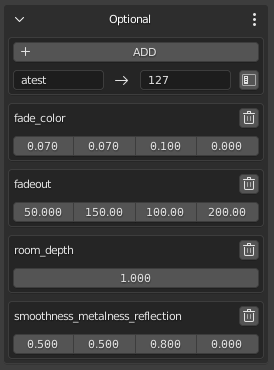
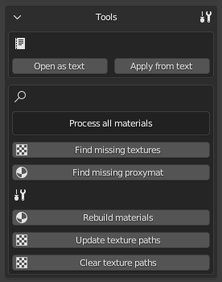
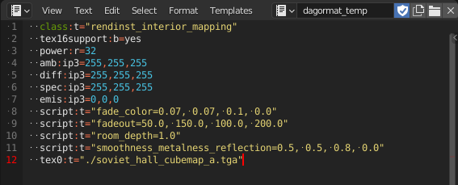
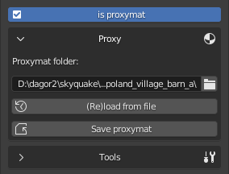
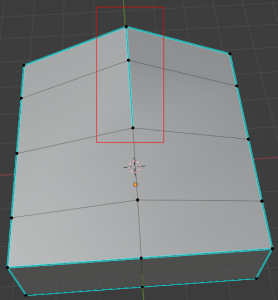
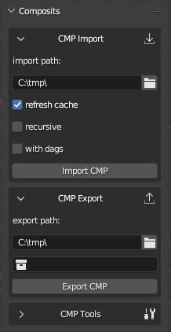

# dag4blend Add-on Installation

## Table of Contents

- [dag4blend Add-on Installation](#dag4blend-add-on-installation)
  - [Table of Contents](#table-of-contents)
  - [Installation](#installation)
  - [Log and Text Editors](#log-and-text-editors)
  - [Material Setting](#material-setting)
    - [Main](#main)
    - [Textures](#textures)
    - [Optional](#optional)
    - [Tools](#tools)
    - [Proxy](#proxy)
  - [Object Properties](#object-properties)
    - [Properties](#properties)
    - [Presets](#presets)
    - [Tools](#tools-1)
  - [Export](#export)
    - [Batch Export](#batch-export)
  - [Collection Properties](#collection-properties)
    - [Override Name](#override-name)
      - [Type](#type)
    - [Geometry Nodes](#geometry-nodes)
  - [Smoothing Groups](#smoothing-groups)
    - [When to apply?](#when-to-apply)
  - [Import](#import)
    - [Import and Textures](#import-and-textures)
    - [File▸Import](#fileimport)
    - [Batch Import](#batch-import)
      - [Additional Features](#additional-features)
  - [Tools](#tools-2)
  - [Experimental Features](#experimental-features)
    - [Bake](#bake)
    - [Composites Editor](#composites-editor)
    - [General Limitations of the Add-on Tools in Blender](#general-limitations-of-the-add-on-tools-in-blender)

## Installation

The installation process is standard for add-ons in Blender.

Open `Edit`&#9656;`Preferences`&#9656;`Add-ons`, click the **Install...** button and specify the path to the `.zip` file of the add-on.

After installation, enable the add-on by checking the box to the right of it in the list.

Before you start using the add-on, you need to complete the configuration in `Preferences`:

<p align="center">
  
</p>

The path to **ObjProps presets:** and to the shader list **dagorShaders.cfg:** can be set manually. This allows to save custom changes when installing a new version of the add-on.

It is recommended to store presets outside of the add-on folder.

The presets menu is not displayed unless the path to an existing directory is specified.

For each new project it is necessary to specify the path to the directory `\assets`.

In order to add a new project to the available list, you need to set the name of the directory (it can be any, understandable to the user) and the path, then click **+ ADD Project**.

> **Note!**
>
> Many interface elements have a tooltip when hovering the cursor.

Starting with **dag4blend2.0**, projects have additional parameters available here in the **Projects** panel:

<p align="center">
  
</p>

- **path:** – the path can be edited after adding a project. In case of moving resources to another disk, you will no longer need to delete the project and add a new one with a new path.

- **Shading mode:** – shaders between projects have slightly different behavior, addon is trained to adjust to two main groups: *Enlisted-like* and *Warthunder-like* shaders.

- **Palettes** – global and local palettes by default.

- **Experimental Features** – includes new tools that are already available, but have some limitations. Currently, the *composites editor* and *texture baking tools* are located there:

<p align="center">
  
</p>

The active project is set via the menu bar in the scene properties. You can also change palettes there, so you don't have to go to `User Preferences` every time:

<p align="center">
  
</p>

> **Note!**
>
> Add-on applies settings when changing these parameters, but only if there is something to apply to. To lock the **Shading mode**, the project must be reselected after creating at least one dagormat in the scene, and to lock the **Palettes** – after creating a dagormat with painting.
>
> By default, the global and local palettes will just be red and green fill, and the shaders will be in *Warthunder-like* mode. To fix this, just re-select the project in the dropdown list after the first import or asset creation.

## Log and Text Editors

Text objects play an important role in this toolkit, so it is recommended to add a text field to the layout, or add a new panel with only a text field if working with multiple monitors.

<p align="center">
  
</p>

The import/export functions (and others in the future) write execution text information into **log**.

The **log** is not automatically cleaned, so remember to clean it manually from time to time, making sure there are no unchecked errors and warnings. To clear it, you can simply **Delete** the text object. The next time you need it, the **Tools** will create a new one. This approach may be faster than selecting all lines and deleting them with backspace/Delete.

A special text object is also created for editing object properties/dagormats/proximates as text, the name of which is specified in the tooltip.

## Material Setting

A separate **dagormat** tab is used to customize materials for the Dagor engine. It has several tabs that can be minimized if necessary:

<p align="center">
  
</p>

### Main

Here you can choose whether the material is double-sided, and what type it is.

<p align="center">
  
</p>

- **single_sided** – one-sided material. The underside is ignored.

- **two_sided** – each triangle is drawn on both sides. The shader becomes a bit heavier, but the geometry is easier. It is used mainly for heavy geometry, i.e. for tree crowns.

- **real_two_sided** – each triangle with this material (technically still one-sided) will be duplicated and twisted to be visible from the opposite side. The shader will become easier, but it doubles the weight of the mesh, so it is better to use it on a simple meshes.

Below is a list of **legacy** properties: *ambient*, *specular*, *diffuse*, *emissive* and *power*. The purpose of each is described in a tooltip above the cursor.

This tab also allows you to select a shader from those available, or enter a value manually if new ones have been added to the game but the toolkit has not yet been updated.

<p align="center">
  
</p>

The list of shaders and their possible parameters are taken from the `dagorShaders.cfg` file, located by default in:
`C:\Users\<username>\AppData\Roaming\Blender Foundation\Blender\<version number>\scripts\addons\dag4blend`

### Textures

Here is a list of textures used. Indexes identical to those stored in `.dag` files are also put in tooltips. You can copy it from your OS File manager (e.g. Windows Explorer) as a path, and the quotes will be removed automatically.

<p align="center">
  
</p>

### Optional

You can edit shader parameters: select them from the list or enter them manually.

<p align="center">
  
</p>

### Tools

Here you can edit the active material in text format.

<p align="center">
  
</p>

<p align="center">
  
</p>

If there is no text editing zone, one will be added to the left of the viewport. Otherwise, the text will be opened in the first found text zone.

The search is available in two modes: only for the active material or for all materials in the scene. The mode is switched by clicking on the text indicating the current mode. When you use the search, you must specify the project correctly, i.e. when working on an assert for Enlisted you must specify *Enlisted*.

- **Find missing...** – by clicking this button you can find all textures and all proximates (if they exist in this project). Texture search only works for viewport display and has no effect on the path in the material.

- **Rebuild materials** – rebuilds materials for the viewport.

- **Update texture paths** – makes sense to use after texture search – it replaces nonexistent paths with actual ones.

- **Clear texture paths** – removes directory information and leaves only texture names.

### Proxy

The add-on now supports proxies.

<p align="center">
  
</p>

Information about proximates parameters is taken from `.blk` file, so all settings for them are hidden. A new tab is added that allows you to specify the path to the proxymat folder. It can still be edited as text, or by temporarily unchecking the **is proxymat** checkbox.

Changes can be rolled back by re-uploading the information from the file, or vice versa, by saving it to proxymat. You can also convert any regular material into a proxy by toggling the checkbox and saving it to the desired folder.

> **Note!**
>
> Proximates in Blender use a file name, not a user-defined one. Importing will auto-rename the shader if the name was different.

## Object Properties

Object Properties is located in the N-panel, in the `Dagor` tab. It shows parameters of the active object. If there are no active objects, the panel is hidden.

<p align="center">
  
</p>

### Properties

Visual editing allows you to add and remove parameters one by one, as well as change their value.

The format of the UI is determined by the value string. If the wrong UI is displayed (for example, `prop:r=0` gives an integer value, while the variable should have a fractional part for further customization), enter in the **name** field the name of this parameter and its value in the correct format (`0.0` instead of `0` for float slider).

Specifying the type in the name with `:` is mandatory.

### Presets

Once you have set the properties one time, you can save them as a preset and apply them to other objects in a couple of clicks.

To save the properties of the active object, specify the name of the future preset and then click **Save preset as:**. To apply one of the existing presets, select the desired one from the drop-down list and click **Apply preset:**.

Presets are simple text files and you can edit them in a text editor. The **open presets folder** button opens a folder with all presets in `.txt` format, where you can also add, delete or edit them. The changes you make will be applied immediately.

### Tools

Editing as text within Blender, requires opening a text editor for the file in the tooltip by clicking the **Open as text** button.

The **Apply...** button applies from text, while the **Write example** button writes the example to text, but does not apply it, as the example will not be needed until modified for a specific situation anyway.

The **Transfer Attr** button takes the list of properties of the active object and applies it to all selected objects.

Since `version 2.1.0`, the text object **props_temp** is opened automatically if the internal text editor is open.

> **Note!**
>
> Incorrect values in Object Properties are written to a new field **broken properties**. They are separated by `;`, which allows you to restore them manually. Similarly, incorrect values are written when using the **Apply from text** button.

## Export

Like any other import-export addon, the DAG exporter is available via `File`&#9656;`Export`. To save you time with multiple re-exports in the process, the exporter is also available in the N-panel. The functionality is identical and you can choose the option that is comfortable for you.

### Batch Export

General parameters:

- **vNormals** – saves custom normals if they have been added to the object. Without custom normals, even if the checkbox is active, it will be exported with smoothing groups.

- **applyMods** – exports geometry with the effect of visible modifiers.

- **Optimize Materials** – leaves on each object only those materials that were applied on at least one polygon.

- **Path** – the path where saving will be performed.

- **Cleanup Names** – ignore indexes (.000+) when exporting.

> **Note!**
>
> Due to the possibility of bugs, use **Cleanup...** only for exporting composites under 3D Max! In a `.dag` file for the game engine there should not contain several objects with the same name.

- **Name** field  – is context-sensitive and exists only when exporting to a single `.dag` file, in other export modes this field is hidden.

- **Collection** field – is also context sensitive. You don't have to select a collection from the drop-down list by clicking on this field, you can just drag the desired collection with the mouse from the Outliner.

- **Limit by** – allows you to select the export mode.

| Export Mode (Limit by) | What exports? | Example input data | Example result |
| :--- | :----: | :----: | :----: |
| Visible | export all scene contents to `Path\<Name>.dag` | <p align="center"></p> | `C:\tmp\asset.dag` – contains all scene objects with custom normals |
| Sel.Joined | export selected objects to `Path\<Name>.dag` | <p align="center"></p> | `C:\tmp\asset.dag` – contains only selected scene objects |
| Sel.Separated | export selected objects to separate `.dag` files, where the names of selected objects are used as file names | <p align="center"></p> | `C:\tmp\cube.lod00.dag`, `C:\tmp\cube.lod01.dag` |
| Col.Separated | export collections from the hierarchy starting from the selected one, if there are no sub-collections inside. The **exportOrphans** checkbox allows exporting objects that lie next to sub-collections | <p align="center"></p> | `C:\tmp\cube.lod00.dag` – contains visible geometry and occluder inside, `C:\tmp\cube.lod01.dag` – contains visible geometry and collider inside and `C:\tmp\cube.lod02.dag`. `C:\tmp\cube_temp.dag` – will not be exported, because the **exportOrphans** checkbox is not active. If you don't specify the collection at all, then in this case the result will be identical, because the check will start with **SceneCollection**, and it contains only the **cube** collection. |
| Col.Joined | export all contents of the selected collection to a file with the name of this collection. Created mainly for AV viewer of assets created from several `.dag` files | <p align="center"></p> | `C:\tmp\soviet_town_building_5_floors_a_joined.lod00.dag`, containing all null lods related to this building. The collections have been linked (transfer with `Ctrl` in Outliner), i.e. they are not copies, but the same collections. The rest of the temporary lods can be prepared in the same way. It's much faster than selecting objects and typing the name manually. **Note:** since they are the same collections and not copies, do not delete them with `DEL`, but remove them with `RMB`&#9656;`Unlink`, so that you don't overwrite them. |

## Collection Properties

The Collection Properties are also in the N-panel, just like Object Properties. Shows the properties of the active collection. Unlike Object Properties, these properties exist only inside Blender and are used for inner purposes.

<p align="center">
  
</p>

### Override Name

Override name allows you to override the name with which the collection will be exported in **Col.Separated** mode. Override name is disabled by default.

When importing `.dag` files with a name longer than 63 characters (blender limit), the name will be written to this field to avoid losing characters that are not included. You can also reassign the name manually – check the checkbox and enter a new name:

<p align="center">
  
</p>

In the example above, the contents of the collection will be exported to `C:\tmp\cube.lod00.dag` instead of `C:\tmp\Collection.dag`.

However, this is not the most efficient use. More useful is the following trick: if you need to save several `.dag` files to different subfolders, you can specify a subpath that will be added after the main export path. If there is no need to replace the collection name, you can simply end the subpath with an `*`, which will be replaced by the collection name when exported:

<p align="center">
  
</p>

In that case, the export will be performed to `C:\tmp\subfolder\yet_another_subfolder\cube.lod00.dag`, which is convenient when working with complex assemblies. For example, buildings with windows in `composit_parts\windows\*`, doors in `composit_parts\doors\*`, etc.

But that's not all. If you want, you can completely redefine the path – just start it with a drive letter:

<p align="center">
  
</p>

In this example, the **Path** field will be completely ignored for this collection and the file will be exported to `D:\EnlistedCDK\develop\assets\rendinst_1lod\`.

#### Type

The type is used by the composites editor. When importing, the node type is written there, and when exporting, it is taken from there to unambiguously define the type to avoid double interpretation in case of having the same-named assets, which are common among composites and rendInsts. In the manually created one, if you plan to export to a compositor, you should specify it manually.

<p align="center">
  
</p>

Since it is applied now for composites, Dynmodel, although it is in the list, is not actually applied – you can't arrange them through composites. For the same reason, the composite importer assumes that all assets that have `.lod**.dag` in their name are RendInst, not Dynmodel.

### Geometry Nodes

> **Note!**
>
> Geometry Nodes cannot be combined with custom normals yet, because applying the modifier will erase them. If you arrange object instances with geometry nodes, don't forget to add the **Realize instances** node, otherwise this geometry will be lost when exporting. Technically, before this node, they are as “empty” as composite nodes that have no geometry of their own.

## Smoothing Groups

During development a bug was discovered in the blender function that calculates smoothing groups for exporting to formats that use them. As a solution, an smoothing group editor has been added. It is available in Edit Mode when selection mode is set to Faces.

When importing, the smoothing groups from the source file are preserved in the objects. But newly created objects don't have smoothing groups, so you need to create them using the **Init** button:

<p align="center">
  
</p>

When smoothing groups are therein place, the interface works in a similar way to 3D Max, but without real-time display. A partial preview is available via the **Convert to Sharp Edges** button, but it doesn't show the problem points – only the hard edges from the smoothing groups.

<p align="center">
  
</p>

Starting with `version 2.1.0` also added **Live Update** feature: when it is active, the hard edges are recalculated by themselves when editing smoothing groups. It can be significantly slow on heavy geometry, so this option is disabled by default. Since the same version, the ability to select polygons by smoothing group has been added. Just click on the button of the corresponding group in the **Select by SG** sub-panel.

> **Note!**
>
> Selecting by smoothing group adds to, not overwrites, an existing selection. So if you want to select only, for example, smoothing group 3, you should remember to deselect the previous selection before doing that.

### When to apply?

If there is an area on the model where the hard edges do not completely divide the surface into closed zones, then the calculation of smoothing groups is incorrect and they need to be corrected manually. Also, smoothing groups may need to be corrected after making changes to existing `.dag` files after import, if the groups were saved to an attribute.

<p align="center">
  
</p>

## Import

Similar to export, there are two ways – standard via `File`&#9656;`Import` and batch import via N-panel.

### Import and Textures

A `.dag` file stores not only the name of the texture, but also the path to it. However, paths are often no longer relevant when files are transferred. If the texture at the specified path does not exist, or if the `.dag` file contains only the name, it is replaced by UV-checker. If the texture is used in several materials, it is enough to update the path to the correct one in one of them, and the texture will be loaded for the other materials as well.

Texture slots are still used as in `rendinst_simple`, regardless of the actual shader selected, but the nodes do not overlap each other, and are laid out in a meaningful pattern. Images from all slots are now added to the Shader Editor, so with Node Wrangler enabled they can be viewed by pressing `Shift`+`Ctrl`+`LMB`.

### File&#9656;Import

Parameters:

- **Optimize material slots** – removes unused slots, and merges slots with the same material.

- **Import LODs** – imports all lods, not just the selected `.dag` file.

- **Import dps** – import all damage_parts (_dp).

- **Import dmgs** – import all damage models.

- **Replace existing** – if a collection with the name of an asset exists in the scene, replaces its contents with the one imported from the `.dag` file, instead of creating a duplicate with `.001+` in the name. Used to quickly roll back multiple changes.

<p align="center">
  
</p>

If you need to import many `.dag` files at one time, use batch import.

### Batch Import

This panel allows you to import .dag files from a specified folder.

<p align="center">
  
</p>

Options:

- **Search in subfolders** – allows you to check not only the specified directory, but all its subfolders for matching files. Use with caution, because without masks or with too many matches, Blender may freeze trying to import everything at once.

- **Optimize material slots** – just like in an ordinary import.

- **Preserve Smoothing Groups** – save smoothing groups to attribute, so that they will not be changed during export. It is not recommended to use it if you plan to make changes to the imported geometry – if the attribute is present, they will not be recalculated automatically.

- **Preserve paths** – saves the full path to the `.dag` file (including the file name) in the Collection Property. This is useful when you need to import files from several folders, make changes, and then export each file to its own location in one pass of batch export.

- **Masks** – allows you to specify masks for import, similar to the `.folder.blk` search. To simplify input, any set of characters is specified as `*` rather than `.*`, and a dot is just a dot rather than `\.`. Masks are separated with `;`. Spaces are ignored.

- **Excludes** – has the same syntax, but to exclude from import.

Example:

Masks: `“asset_a.lod0[0,2]*; asset_b_dp*”; Excludes=“*_dmg*”` imports `asset_a.lod00.dag`, `asset_a.lod02.dag`, and all lods of all `asset_b_dp`, except their `_dmg` versions.

- **Path** – the path to search for.

Until the import is complete, Blender will “not respond”. It is recommended to monitor the import process through the console `Window`&#9656;`Toggle system console`.

#### Additional Features

It is often necessary to import an asset that is open in Asset Viewer or Explorer. To avoid searching for it in `File`&#9656;`Import`, you can copy the path from AV or windows explorer (`RMB`&#9656;`Copy as path`) and paste it into **Path** of the batch import panel. This way the file name will be automatically transferred to **Masks**, and clicking on **IMPORT** will only pull in the desired asset.

If you have only the name of the asset, you can specify it in **Masks** and then apply it as a search path with subfolders to the whole project directory using the **Apply as search path** button. When the path is unknown, the import will be a couple of seconds slower (search time), but it is often faster than finding the full path yourself.

<p align="center">
  
</p>

## Tools

The panel is still improving. Tools are divided into blocks that can be collapsed when not in use so as not to clutter the interface.

<p align="center">
  
</p>

- **Optimize material slots** – merges slots with identical materials and removes unused ones.

- **Merge Duplicates** – on selected objects, merges identical materials that have a different index (`Material` and `Material.001`, for example). Such materials inevitably appear when copying on `ctrl+c`/`ctrl+v`, because this operation saves the selected to an external `.blend` file and then adds it to the active scene via `append` with all materials.

- **Find missing textures** – searches the selected project folder for textures of all dagormats that do not have a valid file path.

- **Find missing proxymats** – similarly for proxymats.

- **Save textures** – collects all textures from selected objects that have a valid path and saves them to the dag export folder, subfolder `/textures/`.

- **Preserve Sharp Edges** – marks the hard edges based on Autosmooth Angle, and reassigns the angle to 180&deg; to match the model in the scene and in the `.dag` file. It is not necessary to apply it before exporting, because it will be automatically applied to the exported geometry (not to the one in the scene – it will remain unaffected).

- **Apply Modifiers** – also duplicates the exporter option. As the name implies, it applies modifiers. It is not necessary to apply it before exporting, because the exporter allows you to keep modifiers in the original scene unaffected.

- **Clear normals** – removes custom normals from all selected objects.

- **sort collections** – recursively joins scene collections by the longest match at the beginning of the name. An example of its work can be seen in the screenshot for the [“Col.Joined” export](#batch-export).

- **pack orphans** – searches for objects not at the bottom of the hierarchy (already mentioned in the export topic) and creates its own collections for them.

- **Setup Destruction** – assigns a list of typical object properties for destruction to all selected objects:

```
  animated_node:b=yes
  physObj:b=yes
  collidable:b=no
  massType:t=none
```

It also creates bboxes with `gi_black` material for them, makes them child objects and prescribes collider parameters:

```
  materialName:t=[value from the material field]
  density:r=[value from the density field]
  massType:t=box
  collType:t=box
```

The bboxes still need to be moved and scaled to better match the silhouette, and in some cases copied, but even then it takes less time.

## Experimental Features

### Bake

This panel allows you to re-bake textures from heavy shaders to rendinst_simple. Usually used for last lods or porting assets to mobile projects.

<p align="center">
  
</p>

The topic is extensive, so it will be covered later in a separate article.

### Composites Editor

<p align="center">
  
</p>

The topic is extensive, so it will be covered later in a separate article.

### General Limitations of the Add-on Tools in Blender

- Limitation on the number of characters in the name – names longer than 63 characters are cut off, and when trying to import objects with the same name, the index `.001` is assigned, which shrinks the maximum length of the name by 4 more characters. Since version `1.2.6`, too long name is saved in Collection Property.

- Animations are not supported yet.