# Installation dag4blend Add-on

## Installation

The installation process is standard for addons in Blender.

Open **Edit/Preferences/Add-ons**, click **Install...** button and specify the path to the **.zip** file of the add-on.

For employees it is located here: **D:\dagor2\tools\dagor3_cdk\pluginBlender**.

After installation, enable the add-on by checking the box to the right of it in the list.

Before you start using the add-on, you need to complete the configuration in Preferences:

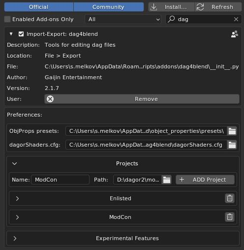

The path to **ObjProps presets:** and to the shader list **dagorShaders.cfg:** can be set manually. This allows to save custom changes when installing a new version of the add-on.

It is recommended to store presets outside of the add-on folder.

The presets menu is not displayed unless the path to an existing directory is specified.

For employees it makes sense to specify the path **dagorShaders.cfg:** to the configuration in the folder with plugins for 3D Max, since it is updated more often there. For outsourcing there is no difference, you can leave the default path pointing to the file in the root folder of the add-on unchanged.

For each new project it is necessary to specify the path to the directory **\assets**.

In order to add a new project to the available list, you need to set the name of the directory (it can be any, understandable to the user) and the path, then click **ADD Project**.

___
> **Note**: *many interface elements have a tooltip when hovering the cursor.*
___

Starting with **dag4blend2.0**, projects have additional parameters available here in the **Projects** panel:

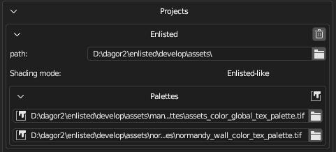

**path:** the path can be edited after adding a project. In case of moving resources to another disk, you will no longer need to delete the project and add a new one with a new path.

**Shading mode:** shaders between projects have slightly different behavior, addon is trained to adjust to two main groups: *Enlisted-like* and *Warthunder-like* shaders.

**Palettes**: global and local palettes by default.

The **Experimental Features** field includes new tools that are already available, but have some limitations. Currently, the *composites editor* and *texture baking tools* are located there:

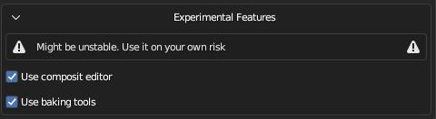

The active project is set via the menu bar in the scene properties. You can also change palettes there, so you don't have to go to **User Preferences** every time:

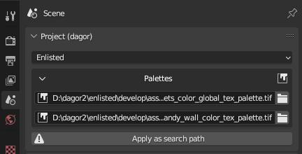

___
> **NOTE**: *add-on applies settings when changing these parameters, but only if there is something to apply to. To lock the **Shading mode**, the project must be reselected after creating at least one dagormat in the Scene, and to lock the **Palettes** - after creating a dagormat with painting.*

> *By default, the global and local palettes will just be red and green fill, and the shaders will be in Warthunder-like mode. To fix this, just re-select the project in the dropdown list after the first import or asset creation.*
___

## Log and text editors

Text objects play an important role in this toolkit, so it is recommended to add a text field to the layout, or add a new panel with only a text field if working with multiple monitors.

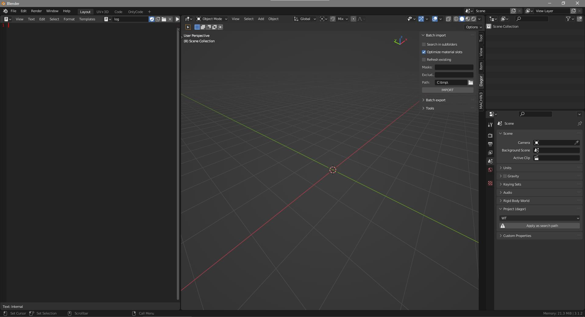

The import/export functions (and others in the future) write execution text information into **log**. 

The **log** is not automatically cleaned, so remember to clean it manually from time to time, making sure there are no unchecked errors and warnings. 
To clear it, you can simply **Delete** the text object. The next time you need it, the **Tools** will create a new one. This approach may be faster than selecting all lines and deleting them with backspace/Delete.

A special text object is also created for editing object properties/dagormats/proximates as text, the name of which is specified in the tooltip.

## Material setting

A separate **dagormat** tab is used to customize materials for the Dagor engine. It has several tabs that can be minimized if necessary:

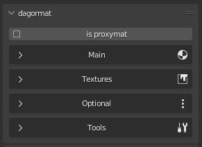

### Main

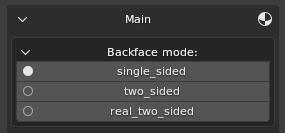

Here you can choose whether the material is double-sided, and if so, which one.

**two_sided** - each triangle is drawn on both sides. The shader becomes a bit heavier, but the geometry is easier. It is used mainly for heavy geometry, for example, for tree crowns.

**single_sided** - one-sided material. The underside is ignored.

**real_two_sided** - each triangle with this material (technically still one-sided) will be duplicated and twisted to be visible from the opposite side. The shader will become easier, but it doubles the weight of the mesh, so it is better to use it on a simpler meshes.

Below is a list of **legacy** properties: ambient/specular/diffuse/emissive and power. The purpose of each is described in a tooltip above the cursor.

This tab also allows you to select a shader from the available ones, or enter a value manually (if new shaders have been added to the game, but the toolkit has not yet been updated).

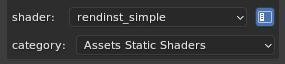

The list of shaders and their possible parameters are taken from the **dagorShaders.cfg** file, located by default in:
**C:\Users\<username>\AppData\Roaming\Blender Foundation\Blender\<version number>\scripts\addons\dag4blend**

### Textures

Here is a list of textures used. Indexes identical to those stored in dag-files are also put in tooltips. You can copy it from your OS File manager (e.g. Windows Explorer) as a path, and the quotes will be removed automatically.

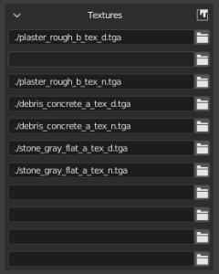

### Optional

Visual editing of shader parameters. Parameters can be entered manually or selected from a list, such as how it works with shader selection.

### Tools

Here you can edit active material in text format. If there is no zone for editing text, then it will be added to the left of the viewport, otherwise the text will be opened in the first text zone found.

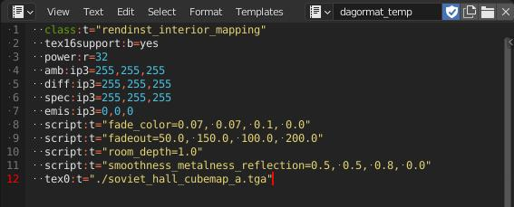

Search is available in two modes: only for the active material or for everyone in the scene. The mode is switched by clicking on the text indicating the current mode.

For the search to work, a correctly specified project is required, so when working on an asset for *Enlisted*, specify *Enlisted*.

By pressing one button **Find missing...** you can find all textures and all proxies, if they exist in a given project. Texture search only works for display in the viewport and does not affect the path in the material.

**Rebuild materials** rebuilds the material(s) for the viewport.

**Update texture paths** makes sense to apply after searching for textures, because it looks for non-existent paths and replaces them with actual ones.

**Clear texture paths** removes the directory information, leaving only the texture names.

### Proxy

The add-on now supports proxies.

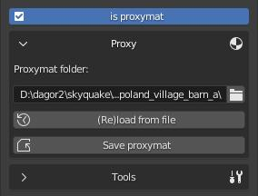

Information about proxymats parameters is taken from the **.blk** file, so all settings for them are hidden. A new tab is added that allows you to specify the path to the folder with the proxy. It can still be edited as text, or by temporarily unchecking the **is proxymat** checkbox.

Changes can be rolled back by reloading the information from the file, or vice versa, saved to proxymat. You can also convert any regular material into a proxy by simply switching the checkbox and saving it to the desired folder.

___
> **Note**: *proxies in Blender use a generated filename, not a user-specified one. When importing, the shader is automatically renamed if the name is different.*
___

## Object Properties

Located in the N-panel, in the Dagor tab. Shows the parameters of the active object and is hidden if the object is not selected.

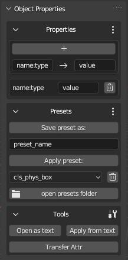

### Properties

Visual editing allows you to add and remove parameters individually, as well as change their value. The UI format is determined by the value string. If the wrong UI option is displayed (e.g., prop:r=0 produced an integer switch, and the variable should have a fractional part for further configuration), enter in the **Name** field the name of this existing parameter and the value in the correct format (0.0 instead of 0 for a float slider). Specifying the type in the name separated by a colon is mandatory.

### Presets

Once you have configured the properties, you can save them as a preset and later apply them to other objects in a couple of clicks. To save the properties of the active object, specify the name of the new preset and then click **Save preset as:**.

To apply one of the existing presets, select the one you need in the drop-down list and click **Apply preset:**

Since presets are simple text files, you may want to edit them in a text editor. The **Open presets folder** button opens a folder with all presets in **.txt** format, where they can also be added, deleted or edited. The changes will be applied immediately.

### Tools

Editing as text in Blender, similar to editing materials, requires opening a text editor on the file from the prompt by clicking **Open as text**.

**Apply...** applies from the text, and **Write example** writes the example into the text.

**Transfer Attr** takes a list of properties from the active object and assigns it to all selected ones.

Since version 2.1.0, the text object **props_temp** is opened automatically if the internal text editor is open.

___
> **Note**: *incorrect values ​​in **Object Properties** are written to a new field **broken properties** separated by **;**, which allows you to restore them manually. Incorrect values ​​are written similarly when using **Apply from text**.*
___

