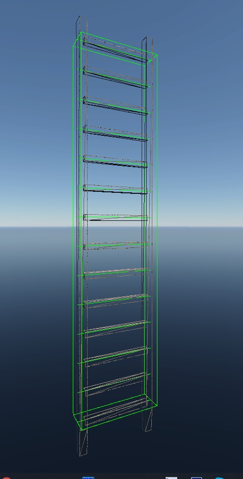
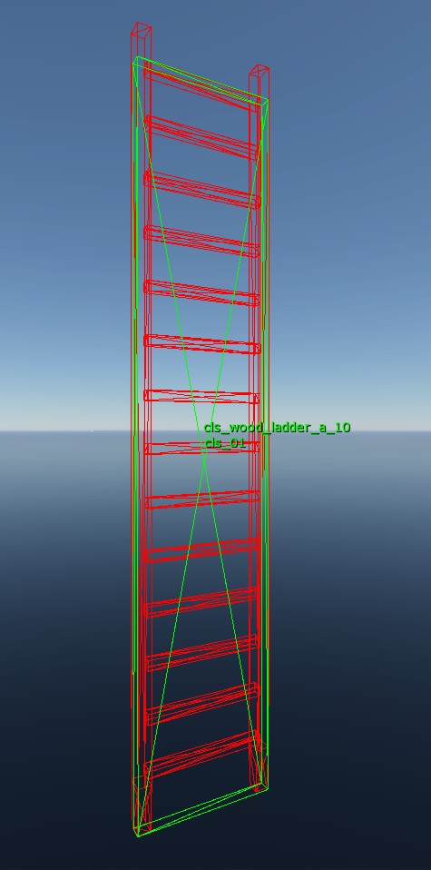
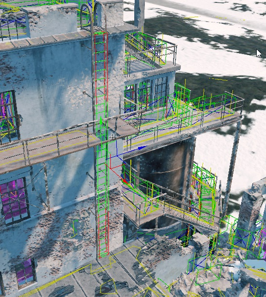

# Climbable Ladders

## General Overview and Structure

In *daNetGame*-projects, there is a technology for climbing vertical (or
near-vertical) ladders.

Vertical ladders that are part of gameplay (which players can climb) are
actually composite objects. They consist of two components:

1. Visual geometry (`*.dag`)
2. Game object (`*ladder.gameObj.blk`).

```{note}
The name of the `.blk` file must follow the convention with the `ladder` suffix
and the `*.gameObj.blk` extension.
```

### Geometry Parameters

The visual geometry has no special distinctive features – everything is standard
and straightforward. It’s simply a model of a ladder with a specific number of
steps (the number of steps is important as it will be used in the game object).

```{important}
The only critical point to observe is that the steps must be spaced evenly.
Otherwise, the character's hands and feet may not correctly align with the steps
during climbing.
```

### Game Object Parameters

The game object (gameObj) is a procedurally generated object (similar to
*wall_holes*, *indoor walls*, etc.). To create it, you need to generate a text
file (`*ladder.gameObj.blk`) with the description of the ladder:

- `volumeType:t="box"` – the geometric type of the generated gameplay area,
  similar to meshes, boxes, convex shapes in collisions. We specifically use the
  `box` type.

- `boxSz:r=0.5` – defines the distance from the center to any side of the box.
  This value represents half the side of a cube, meaning the default value of
  `0.5` generates a 1m cube. By default, it's set to `0.5`, and we do not change
  this. It has minimal impact since the size of the box will later be defined by
  the matrix in the composite object (as ladders are not cubic in shape).

- `isLadder:b=yes` – specifies that this game object is a ladder.

- `ladderStepsCount:i=14` – the number of steps (this is important as it affects
  the character’s hand and foot placement on the actual ladder geometry).

The actual size of the game object is determined in the composite object via its
matrix, which integrates the visual geometry with the game object. This allows
the game object to match the proportions required for the specific ladder.

## Creating the Ladder Game Object

### General Guidelines

1. You do not necessarily need to create a new game object. You can reuse an
   existing one by transforming it within the composite object to fit your
   ladder.

   ```{note}
   However, it’s crucial to remember that the game object contains a predefined
   number of steps, which must not be altered. Changing it would break the
   ladders where this object is already in use. If the step count does not suit
   your needs, create a new object.
   ```

2. Avoid modifying the default cube size (`boxSz:r=0.5`, i.e., 1m per side). If,
   for any reason, you decide to change this value, you must ensure that the
   size is adjusted accordingly when creating the composite object in *3ds Max*
   (discussed below). Otherwise, the results in *3ds Max* and [*Asset
   Viewer*](../../../dagor-tools/asset-viewer/asset-viewer/asset_viewer.md) will
   not match.

3. It doesn't matter whether the ladders are standalone objects or part of a
   building – each case is unique. If a ladder is used multiple times, it makes
   more sense to have it as a separate object. If the ladder is unique to a
   specific building, it can remain part of the building's geometry (consider
   optimization, LODs, etc.).

   The technology remains the same – each ladder must have a game object added
   to it via the composite object.

4. It’s best to store `*ladder.gameObj.blk` alongside the visual geometry.

5. Unless required for gameplay, avoid adding collision to every step in the
   physics system. The physical collision does not interact with the climbing
   animation – it only collides with the capsule.

6. The game object should span *from the bottom step to the top step*.
   Otherwise, there may be incorrect hand and foot positioning.

An example using the `wood_ladder_a` model is shown here:






```{note}
As of July 2023, the system is set up so that *the character can only climb from
the X side of the game object*. Climbing from other sides may not work or may
behave incorrectly.

  

  ---

```

### Methods for Creating the Game Object

#### Method 1

1. In the *3ds Max* scene, create a cube with dimensions 1x1x1m, with its pivot
   point at the center. If you’ve changed the size of `boxSz:r=0.5`, you need to
   adjust the cube size accordingly.

2. Scale the cube to match the dimensions of the ladder.

3. Export the composite object (ladder + game object) using available tools
   (such as [*dag2rires*](../../../dagor-tools/dag2rires/dag2rires.md)).

   

   ---

#### Method 2

1. In [*daEditor*](../../../dagor-tools/daeditor/daeditor/daeditor.md), place
   the pre-created `*ladder.gameObj.blk`.

2. Scale it to match the ladder’s dimensions.

3. Export the composite object (or the entire building) using the menu option
   **Landscape** ▸ **Export as composite**.

   

   ---

   

   ---

## Related Articles

- [Infantry NavMesh Generation for Vertical Ladders](navmesh_gen_vert_ladders.md)


