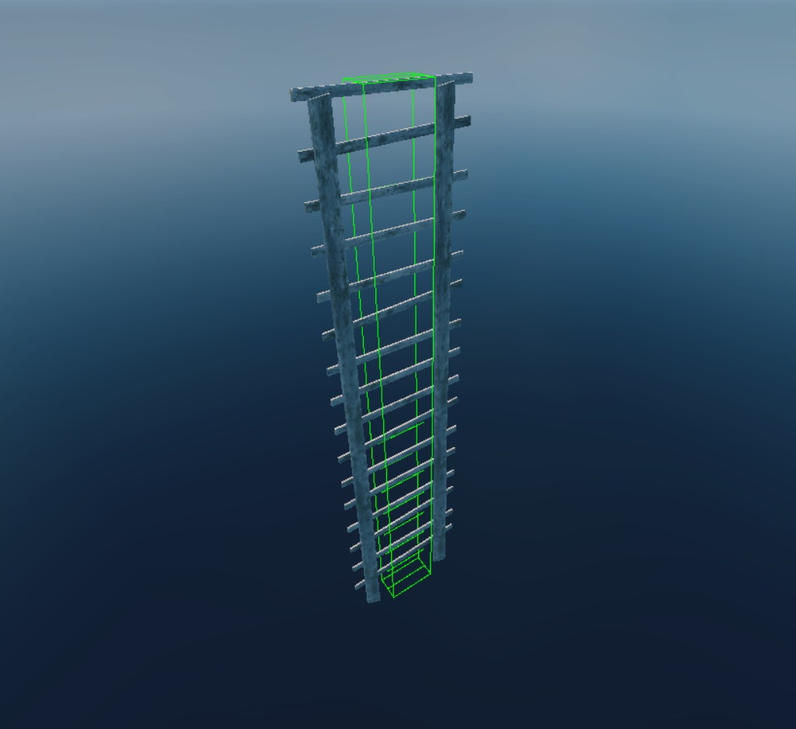
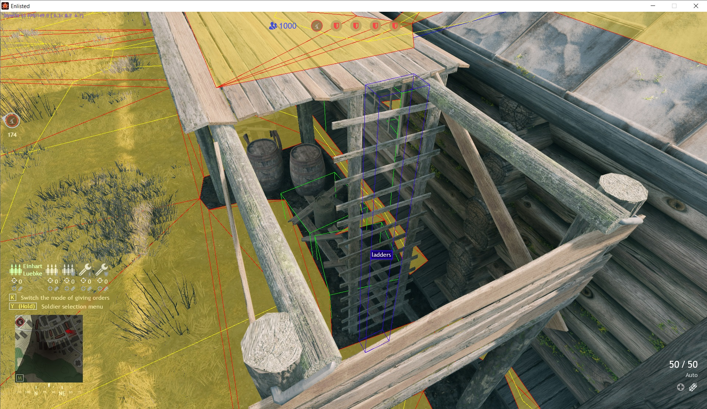
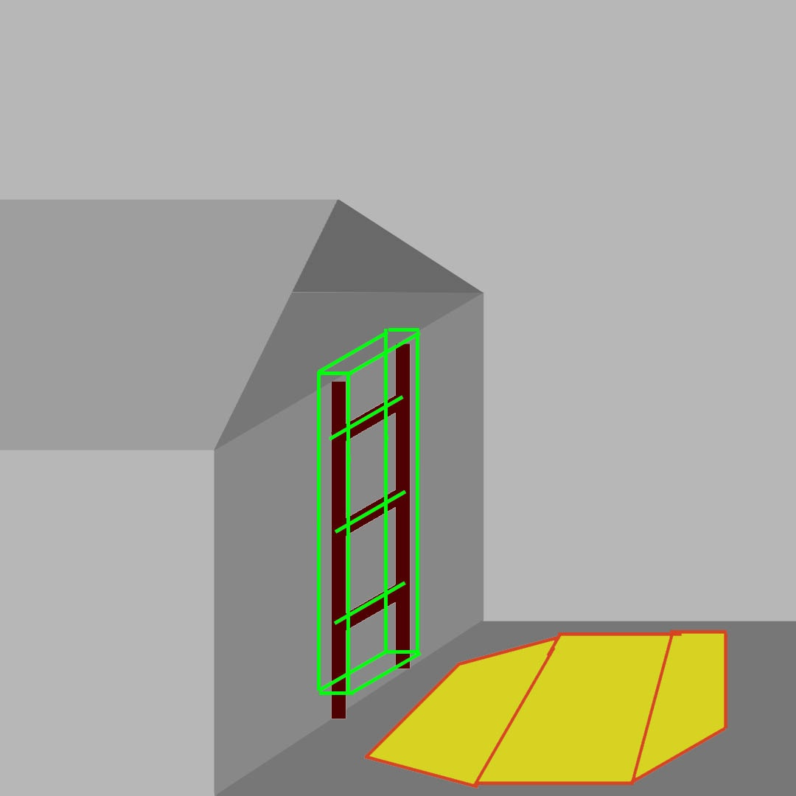
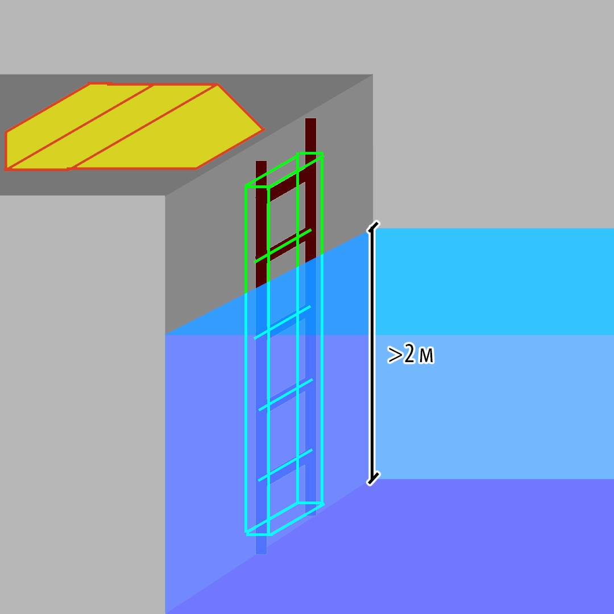

# Infantry NavMesh Generation for Vertical Ladders

## Overview

This article outlines the principles behind NavMesh generation for vertical
ladders and discusses common errors that prevent NavMesh from being generated
for ladders.

```{warning}
Vertical ladders are often problematic for gameplay. Think carefully before
adding them to a level. However, if there is no alternative, please review this
article and consider the important nuances of designing ladders from the
perspective of AI navigation.
```

## How NavMesh Generation for Vertical Ladders Works

The pathfinding for vertical ladders functions as follows. Each ladder has a
gameObj file like `ladder_template.gameObj.blk`, which contains:

- `volumeType:t="box"` – The type of primitive displayed in
  [*daEditor*](../../../dagor-tools/daeditor/daeditor/).
- `boxSz:r=0.5` – The size of the base primitive.
- `isLadder:b=yes` – A flag indicating that this is a ladder.
- `ladderStepsCount:i=13` – The number of steps on the ladder.

This gameObj is used to describe the geometry of the ladder along which a
character can climb vertically.

**Example** of a composite object: ladder geometry + its gameObj:



---

During NavMesh generation in the location, each such gameObj is identified, and
the zones near the ends of the gameObj are analyzed: if there are NavMesh
polygons within a radius of <0.5m from the ends of the gameObj, a link is
created between the polygons through the vertical ladder.

This link is used by AI for pathfinding across NavMesh through vertical ladders.

**Examples** of NavMesh link generation through vertical ladders:

<table style="text-align:center; width:98%"><tr>
  <th style="background-color: #D4D4D4; border-bottom: 1px solid gray; border-top: 1px solid gray; padding: 10px; text-align: center; width:49%">Conditions met</th>
  <th style="background-color: #D4D4D4; border-bottom: 1px solid gray; border-top: 1px solid gray; padding: 10px; text-align: center; width:49%">Conditions not met</th></tr>
</table>


---

## Common Design Errors for Vertical Ladders

Let's examine design errors that prevent link generation. These are typically
specific cases where the conditions for NavMesh generation are not met. To
create a NavMesh link through a vertical ladder, NavMesh polygons must be
generated within a radius of <0.5m from the ends of the gameObj.

### Incorrect Ladder GameObj

The gameObj dimensions prevent the link from being generated.

<table style="text-align:center; width:98%"><tr>
  <th style="background-color: #D4D4D4; border-bottom: 1px solid gray; border-top: 1px solid gray; padding: 10px; text-align: center; width:36%">Problem</th>
  <th style="background-color: #D4D4D4; border-bottom: 1px solid gray; border-top: 1px solid gray; padding: 10px; text-align: center; width:62%">Solution</th></tr><tr>
  <td style="border-bottom: 1px solid gray; padding:  5px; text-align: center; vertical-align: middle; width:36%"><b>The gameObj has insufficient dimensions</b> to meet the conditions for link generation.</td>
  <td style="border-bottom: 1px solid gray; padding: 5px; vertical-align: middle; width:62%">Adjust the dimensions of the gameObj or set up a proper composite object with a gameObj that satisfies the link generation conditions.</td></tr><tr>
  <th style="background-color: #D4D4D4; padding: 10px; text-align:center; width:36%">Scheme</th>
  <th style="background-color: #D4D4D4; padding: 10px; text-align:center; width:62%">Example</th></tr>
</table>




---

<table style="text-align:center; width:98%"><tr>
  <th style="background-color: #D4D4D4; border-bottom: 1px solid gray; border-top: 1px solid gray; padding: 10px; text-align: center; width:36%">Problem</th>
  <th style="background-color: #D4D4D4; border-bottom: 1px solid gray; border-top: 1px solid gray; padding: 10px; text-align: center; width:62%">Solution</th></tr><tr>
  <td style="border-bottom: 1px solid gray; padding:  5px; text-align: center; vertical-align: middle; width:36%"><b>The gameObj has excessive dimensions</b>, preventing the conditions for link generation from being met.</td>
  <td style="border-bottom: 1px solid gray; padding: 5px; vertical-align: middle; width:62%">Adjust the dimensions of the gameObj or set up a proper composite object with a gameObj that satisfies the link generation conditions.</td></tr><tr>
  <th style="background-color: #D4D4D4; padding: 10px; text-align:center; width:36%">Scheme</th>
  <th style="background-color: #D4D4D4; padding: 10px; text-align:center; width:62%">Example</th></tr>
</table>


---

<table style="text-align:center; width:98%"><tr>
  <th style="background-color: #D4D4D4; border-bottom: 1px solid gray; border-top: 1px solid gray; padding: 10px; text-align: center; width:36%">Problem</th>
  <th style="background-color: #D4D4D4; border-bottom: 1px solid gray; border-top: 1px solid gray; padding: 10px; text-align: center; width:62%">Solution</th></tr><tr>
  <td style="border-bottom: 1px solid gray; padding:  5px; text-align: center; vertical-align: middle; width:36%"><b>Two ladder composite objects with gameObjs are placed consecutively</b>. Since there is no NavMesh at the junction of the gameObjs, the link cannot be generated.</td>
  <td style="border-bottom: 1px solid gray; padding: 5px; vertical-align: middle; width:62%">Only one gameObj should be used per ladder segment.</td></tr><tr>
  <th style="background-color: #D4D4D4; padding: 10px; text-align:center; width:36%">Scheme</th>
  <th style="background-color: #D4D4D4; padding: 10px; text-align:center; width:62%">Example</th></tr>
</table>


---

### Problematic Ladder Geometry

The ladder geometry prevents the NavMesh generation conditions from being met.

<table style="text-align:center; width:98%"><tr>
  <th style="background-color: #D4D4D4; border-bottom: 1px solid gray; border-top: 1px solid gray; padding: 10px; text-align: center; width:36%">Problem</th>
  <th style="background-color: #D4D4D4; border-bottom: 1px solid gray; border-top: 1px solid gray; padding: 10px; text-align: center; width:62%">Solution</th></tr><tr>
  <td style="border-bottom: 1px solid gray; padding:  5px; text-align: center; vertical-align: middle; width:36%"><b>The ladder has additional structural elements</b> that obstruct NavMesh generation at the necessary distance to meet the link conditions.</td>
  <td style="border-bottom: 1px solid gray; padding: 5px; vertical-align: middle; width:62%">To resolve this, experiment with the design – solutions vary depending on the ladder and the adjacent platform. In some cases, moving the elements is enough, while in others, the ladder geometry must be modified or replaced.</td></tr><tr>
  <th style="background-color: #D4D4D4; padding: 10px; text-align:center; width:36%">Scheme</th>
  <th style="background-color: #D4D4D4; padding: 10px; text-align:center; width:62%">Example</th></tr>
</table>


---

### Problematic Environment Geometry

The ladder leads to a location where NavMesh cannot be generated.

<table style="text-align:center; width:98%"><tr>
  <th style="background-color: #D4D4D4; border-bottom: 1px solid gray; border-top: 1px solid gray; padding: 10px; text-align: center; width:36%">Problem</th>
  <th style="background-color: #D4D4D4; border-bottom: 1px solid gray; border-top: 1px solid gray; padding: 10px; text-align: center; width:62%">Solution</th></tr><tr>
  <td style="border-bottom: 1px solid gray; padding:  5px; text-align: center; vertical-align: middle; width:36%"><b>Obstacles block access to the ladder</b>, or other geometry obstructs NavMesh generation.</td>
  <td style="border-bottom: 1px solid gray; padding: 5px; vertical-align: middle; width:62%">It is important to clear the path to the ladder so that NavMesh can be generated nearby. Technically, obstacles do not prevent link generation, but the path will remain blocked for AI until the obstacles are destroyed.</td></tr><tr>
  <th style="background-color: #D4D4D4; padding: 10px; text-align:center; width:36%">Scheme</th>
  <th style="background-color: #D4D4D4; padding: 10px; text-align:center; width:62%">Example</th></tr>
</table>


---

<table style="text-align:center; width:98%"><tr>
  <th style="background-color: #D4D4D4; border-bottom: 1px solid gray; border-top: 1px solid gray; padding: 10px; text-align: center; width:36%">Problem</th>
  <th style="background-color: #D4D4D4; border-bottom: 1px solid gray; border-top: 1px solid gray; padding: 10px; text-align: center; width:62%">Solution</th></tr><tr>
  <td style="border-bottom: 1px solid gray; padding:  5px; text-align: center; vertical-align: middle; width:36%"><b>There isn't enough ceiling height for the attic floor</b> to be suitable for NavMesh generation.</td>
  <td style="border-bottom: 1px solid gray; padding: 5px; vertical-align: middle; width:62%">This is often a geometry issue, so it's important to plan for sufficient ceiling height in advance. Incorrect NavMesh generation settings could also be the issue, such as setting the minimum ceiling height too low for NavMesh generation.</td></tr><tr>
  <th style="background-color: #D4D4D4; padding: 10px; text-align:center; width:36%">Scheme</th>
  <th style="background-color: #D4D4D4; padding: 10px; text-align:center; width:62%">Example</th></tr>
</table>




---

<table style="text-align:center; width:98%"><tr>
  <th style="background-color: #D4D4D4; border-bottom: 1px solid gray; border-top: 1px solid gray; padding: 10px; text-align: center; width:36%">Problem</th>
  <th style="background-color: #D4D4D4; border-bottom: 1px solid gray; border-top: 1px solid gray; padding: 10px; text-align: center; width:62%">Solution</th></tr><tr>
  <td style="border-bottom: 1px solid gray; padding:  5px; text-align: center; vertical-align: middle; width:36%"><b>Complex geometry on steep slopes is unsuitable</b> for NavMesh generation.</td>
  <td style="border-bottom: 1px solid gray; padding: 5px; vertical-align: middle; width:62%">This is generally a geometry issue, so during the blocking phase, make sure the geometry along paths is suitable for NavMesh generation. Incorrect NavMesh settings, such as an overly restricted slope angle, may also be the cause.</td></tr><tr>
  <th style="background-color: #D4D4D4; padding: 10px; text-align:center; width:36%">Scheme</th>
  <th style="background-color: #D4D4D4; padding: 10px; text-align:center; width:62%">Example</th></tr>
</table>


---

<table style="text-align:center; width:98%"><tr>
  <th style="background-color: #D4D4D4; border-bottom: 1px solid gray; border-top: 1px solid gray; padding: 10px; text-align: center; width:36%">Problem</th>
  <th style="background-color: #D4D4D4; border-bottom: 1px solid gray; border-top: 1px solid gray; padding: 10px; text-align: center; width:62%">Solution</th></tr><tr>
  <td style="border-bottom: 1px solid gray; padding:  5px; text-align: center; vertical-align: middle; width:36%"><b>No NavMesh is available for link generation</b>. The ladder is placed so that the player can climb it and clear a railing, but for link generation, NavMesh polygons are required. NavMesh does not generate on railings due to their size, and the end of the gameObj is too far from the nearest NavMesh polygons.</td>
  <td style="border-bottom: 1px solid gray; padding: 5px; vertical-align: middle; width:62%">The solution is to ensure the ladder leads to a properly generated NavMesh polygon. In this case, remove the railing or adjust the ladder length appropriately.</td></tr><tr>
  <th style="background-color: #D4D4D4; padding: 10px; text-align:center; width:36%">Scheme</th>
  <th style="background-color: #D4D4D4; padding: 10px; text-align:center; width:62%">Example</th></tr>
</table>


---

<table style="text-align:center; width:98%"><tr>
  <th style="background-color: #D4D4D4; border-bottom: 1px solid gray; border-top: 1px solid gray; padding: 10px; text-align: center; width:36%">Problem</th>
  <th style="background-color: #D4D4D4; border-bottom: 1px solid gray; border-top: 1px solid gray; padding: 10px; text-align: center; width:62%">Solution</th></tr><tr>
  <td style="border-bottom: 1px solid gray; padding:  5px; text-align: center; vertical-align: middle; width:36%"><b>NavMesh will not generate in water deeper than 2m</b>, which prevents the creation of a link.</td>
  <td style="border-bottom: 1px solid gray; padding: 5px; vertical-align: middle; width:62%">The water depth needs to be reduced.</td></tr><tr>
  <th style="background-color: #D4D4D4; padding: 10px; text-align:center; width:36%">Scheme</th>
  <th style="background-color: #D4D4D4; padding: 10px; text-align:center; width:62%">Example</th></tr>
</table>




---

### Code Limitations

Cases not supported by the code:

<table style="text-align:center; width:98%"><tr>
  <th style="background-color: #D4D4D4; border-bottom: 1px solid gray; border-top: 1px solid gray; padding: 10px; text-align: center; width:36%">Problem</th>
  <th style="background-color: #D4D4D4; border-bottom: 1px solid gray; border-top: 1px solid gray; padding: 10px; text-align: center; width:62%">Solution</th></tr><tr>
  <td style="border-bottom: 1px solid gray; padding:  5px; text-align: center; vertical-align: middle; width:36%"><b>Links cannot be generated for intermediate platforms</b>. The code does not account for intermediate platforms along the ladder's path. Each platform must have its own ladder for AI navigation. However, since an overabundance of vertical ladders is undesirable, plan more convenient paths in advance.</td>
  <td style="border-bottom: 1px solid gray; padding: 5px; vertical-align: middle; width:62%">In this case, you can keep the vertical ladder for climbing to the middle level and create ramp-like geometry for reaching the top level.</td></tr><tr>
  <th style="background-color: #D4D4D4; padding: 10px; text-align:center; width:36%">Scheme</th>
  <th style="background-color: #D4D4D4; padding: 10px; text-align:center; width:62%">Example</th></tr>
</table>


