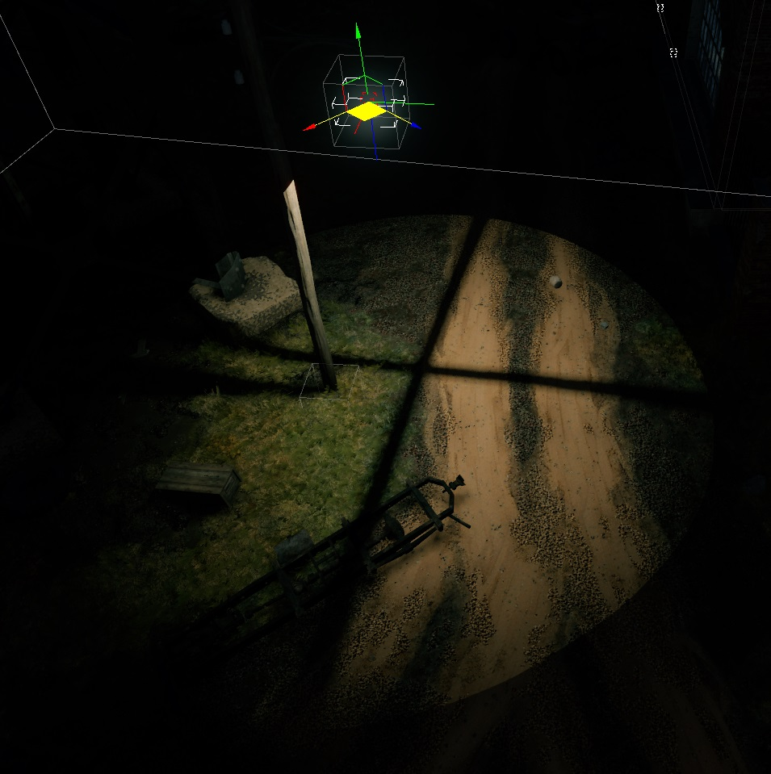

# Lights

## Overview

This article discusses the mechanics and configuration of environmental light
sources, which are used as elements of the game world, added to composite
objects, or placed by level designers as game objects (gameobj).

- Light sources are templates located in the `lights.blk` file within the
  `<project_name>/prog` directory.
- They can be configured either via the `.blk` file or through the mission
  editor (`F12`). However, the editor uses only for configuring settings. To
  save changes, you must manually copy them back into the `.blk` file.
- Globally, light sources fall into two categories: **omni** (spherical) and
  **spot** (a 90-degree directional cone).
- Lights are added to the scene as `gameobj`. More details about this process
  are provided below.
- It's a good practice to name both the light sources and visual models with
  details about their radius and color (if necessary).
- Avoid reusing the same light sources in different environments. For instance,
  if you have a chandelier hanging five meters above the ground, do not use the
  same light at eight meters. Create a separate object with its own settings. In
  reality, larger rooms require stronger bulbs.

## Key Considerations When Creating a New Light Source

1. **Spotlights vs. Omni Lights**: Spotlights illuminate an area six times
   smaller than omni lights, and they are also six times faster in terms of
   performance. Whenever possible, use spotlights instead of omni lights.

2. **Extending Light Templates**: Creating or configuring a new light source
   often involves adding a new visual model, such as a lamp or spotlight. Always
   create a new light source by extending the original template unless there’s a
   special reason to modify an existing one. This ensures that future changes to
   a light source don’t unintentionally affect other lights that extend from it.

   From a performance standpoint, there is no difference between ten clones of a
   single light source and ten unique lights with the same parameters.
   Therefore, don’t hesitate to increase the number of light sources. When
   naming them, use descriptive titles that indicate their specific use,
   including references to the visual model.

## Light Source Parameters and Configuration

### light__color

Defines the light color using RGBA values from `0` to `255`. The alpha channel
(A) has no effect in this context.

### light__brightness

It's crucial to configure brightness in conjunction with the light's maximum
radius.

- Do not set the brightness higher than necessary for the maximum radius.
  Excessive brightness degrades visual quality, affects the eye adaptation
  system, and can negatively impact gameplay.
- Always adjust brightness individually for each light source instead of copying
  values from other lights. Balance brightness with the maximum radius of the
  light.

When configuring natural light sources like torches, candles, kerosene lamps, or
campfires, avoid using overly saturated yellow-orange colors or excessively high
brightness levels.

### light__max_radius

Defines the boundary of the light’s influence. The edge is soft, with a gradient
extending inward. The gradient strength is fixed and represents a percentage of
the radius.

- **Optimize Radius and Brightness Together**: As with brightness, configure the
  radius so it matches the brightness. Overlapping light radii harm performance,
  so keep radii as small as possible and ensure minimal overlap between lights.

```{important}
The maximum visible distance of a light with white color (255, 255, 255) is 3
meters for every unit of brightness.
```

For convenience, here’s a table showing the relationship between brightness and
radius:

| Brightness | Max Radius |
|:----------:|:----------:|
| 0.25       | 0.75       |
| 0.75       | 2.25       |
| 3          | 9          |
| 5          | 15         |
| 10         | 30         |

Set the radius slightly below these values for optimization purposes, but never
exceed them. Additionally, take into account the effect of IES textures – since
light rays rarely reach their maximum value in such profiles, the maximum radius
should be adjusted accordingly on a case-by-case basis. However, the values in
the table should not be exceeded.

### spot_light__shadows / omni_light__shadows

Enable shadows for large light sources that illuminate an entire room. Avoid
using shadows for minor lights like desk lamps or wall sconces, as shadows are
resource-intensive.

### spot_light__dynamic_obj_shadows / omni_light__dynamic_obj_shadows

**Use with extreme caution**. This is very performance-intensive and should only
be applied to large, significant, and unique light sources. On a given map,
there should be no more than two or three such lights. Ideally, dynamic shadows
should not be used at all unless absolutely necessary.

### spot_light__shadow_shrink / omni_light__shadow_shrink

This parameter controls shadow softness and is set using integer numbers (no
decimals).

- Wide visual light sources (like a campfire) should have soft shadows, while
  small sources (like a bulb) should have sharper shadows.
- The valid range is from `0` to `2`.

<table style="text-align:center; width:98%"><thead><tr>
  <th style="text-align:center; width:49%"><p>0</p></th>
  <th style="text-align:center; width:49%"><p>2</p></th></tr></thead>
</table>




### spot_light__inner_attenuation

This parameter is specific to spotlights and controls the softness of the
spotlight’s edge.

- `0` for maximum blur, `1` for sharp edges.

<table style="text-align:center; width:98%"><thead><tr>
  <th style="text-align:center; width:49%"><p>0</p></th>
  <th style="text-align:center; width:49%"><p>1</p></th></tr></thead>
</table>


### light__texture_name

These are photometric data textures used for volumetric shadow mapping. Detailed
information can be found in a [Photometric Lights](./photometric_lights.md)
article.

- IES textures have negligible file size and should be placed in the common
  directory:

  ```
  <project_name>/develop/assets/manmade_common/textures/ies
  ```
- Feel free to create new textures to fit your needs if no existing ones are
  suitable. Name them descriptively, preferably including the name of the visual
  model they are paired with, and begin with `ies_*`. For example,
  `ies_barsed_lamp_b`.

### light__nightly

This is a binary setting (`yes`/`no`). When activated, the light will turn on
only during night time.

### light__use_box

This setting, enabled by default for all omni lights, is a binary (`yes`/`no`)
option that controls whether the light is restricted to render only within an
envi_probe (typically indoors). If the light is used outdoors, this should be
disabled. Spotlights are usually sufficient for outdoor lighting.

## Configuring Emission Strength for Visual Models

For configuring emission on shaders used by lamps and other visual models
associated with light sources, refer to the following shaders:

- [rendinst_simple_glass](../shaders/dng-shaders/rendinst_simple_glass.md)
- [rendinst_emissive/dynamic_emissive](../shaders/dng-shaders/rendinst_emissive.md)

It’s important to keep in mind that overly bright emission, like excessive light
brightness, can ruin the visual quality, interfere with eye adaptation, and
negatively impact gameplay. Adjust emission to be as subtle as possible.

## GameObj

To add a light source to a composite object, create a gameObject for it and
place it in `*/develop/assets/common/gameRes/gameObjects` directory. Name the
file: `template_name.gameObj.blk`.

```{seealso}
For more information, see
[gameObjects](../about-assets/gameobjects/gameobjects.md).
```

If the light source is used with a dynamic model (which cannot be drawn in
*daEditor*), you can add the following line to the `gameObj` to display the
model in the editor:

```
ref_dynmodel:t="name_of_dynmodel"
```

## Restriction Box

It’s possible to further limit the influence of light sources using the
`omni_light_restriction_box.gameObj.blk` object. This is useful for preventing
light from passing through walls, for example. Despite the name containing
`omni_light`, this object also works for spotlights.


