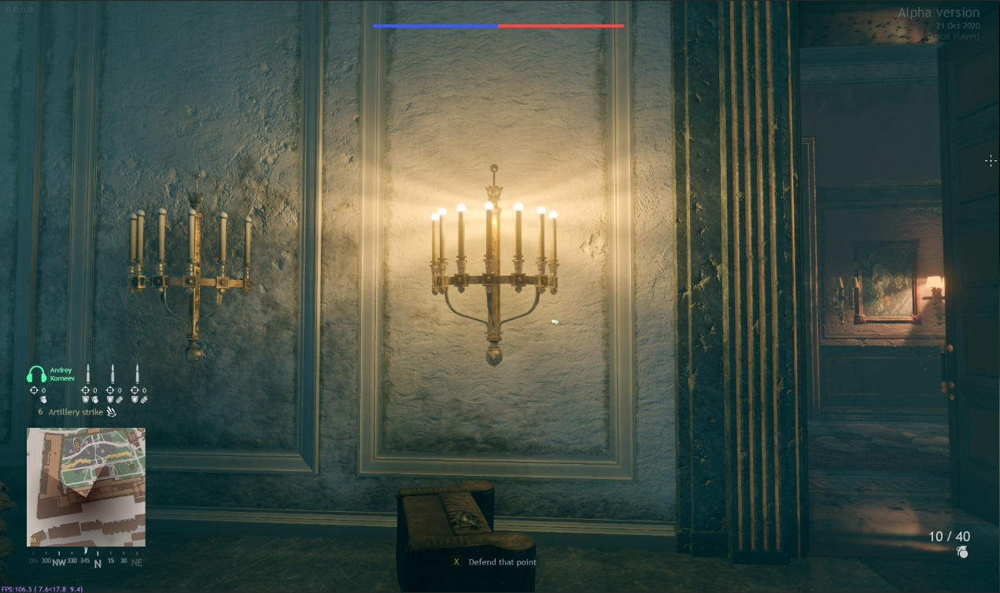
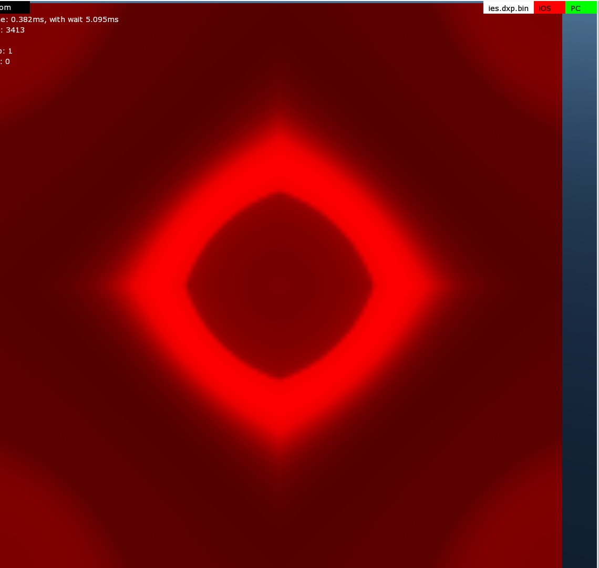
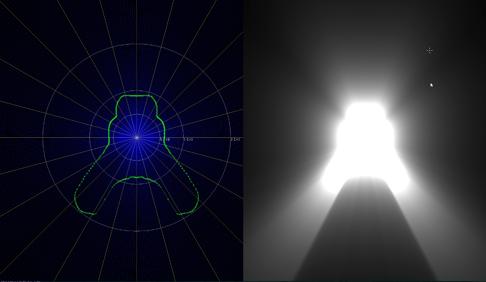
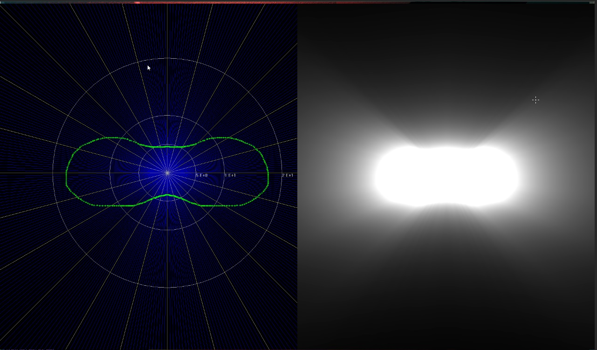
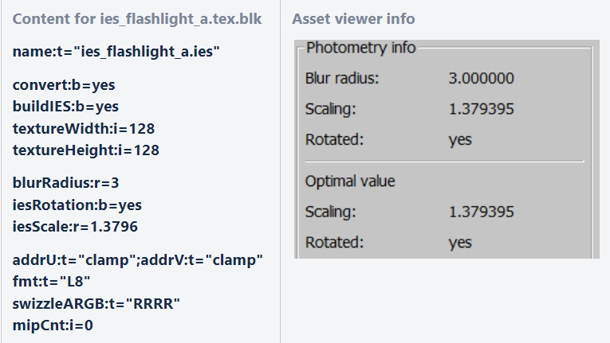
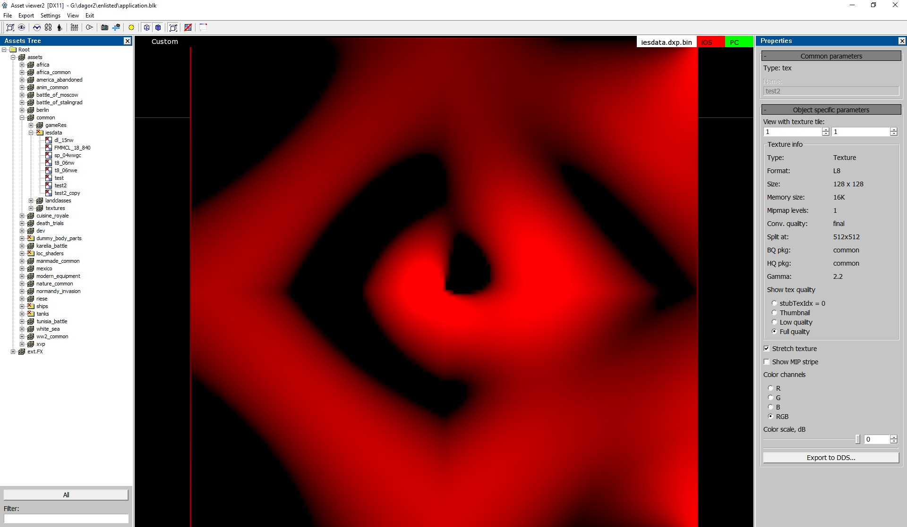
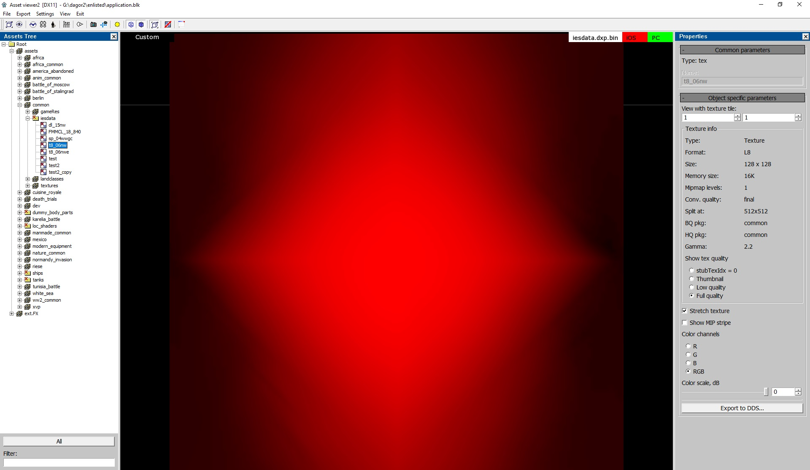

# Photometric Lights (IES)

## Overview

In *daNetGame*-based projects, along with traditional light sources like spot or
omni, you can also add photometric light sources using the [IES
format](https://blog.ansi.org/2020/02/standard-file-photometric-data-ies-lm-63-19/).

An IES file is essentially a text file that defines the distribution of light
intensity from a source, based on angles in 3D space. The format specification
can be found
[here](http://expertunion.ru/normyi-osvescheniya/iesna-lm-63-1995-opisanie-formata-ies.html).

You can download ready-made IES files from the internet, as most lighting
manufacturers provide IES profiles for their products. There are also extensive
IES libraries available, containing thousands of profiles suitable for various
visualization needs.

Alternatively, you can create IES profiles manually using various editors. I’ve
used this [IES
generator](https://lightonline.ru/documents/Other/IES_Generator.html), which is
simple to use: you draw the light profile in the vertical plane with the mouse.
The resulting profile is then "rotated" around the vertical axis (similar to the
*Lathe* modifier in *3ds Max*, which creates a 3D object from a spline).
However, this tool cannot create non-symmetrical IES profiles along both axes,
meaning the light distribution cannot vary simultaneously on walls and floors.


If more complex IES profiles are needed, you'll have to find and test other
software, or search for existing IES files. For simpler tasks, this tool
suffices. Examples are provided at the end of this article.

## Integrating IES Files in daNetGame-based Projects

Once you've downloaded or created an IES file, place it in the following
directory:

```
/<project_name>/develop/assets/manmade_common/textures/ies
```

The following block in the global `foled.blk` file handles the processing of IES
files:

```
virtual_res_blk{
  find:t="^(.*)\.ies$"
  className:t="tex"
  contents{
    addrU:t="clamp"; addrV:t="clamp"
    convert:b=yes
    buildIES:b=yes
    textureWidth:i=128
    textureHeight:i=128
  }
}
```

This means that during the build process, each IES file is converted into a
simple 128x128 pixel texture in L8 format.

Details of the engine's implementation are discussed in the
[Photometry](./photometric_lights.md#photometry) section.

## Using an IES File in a Light Source

To use a specific IES file as a light source, simply specify its name in the
template under the `light.texture_name` variable and compile the vroms.

The light template for *daNetGame*-based projects is located at:

```
/<project_name>/prog/gameBase/content/common/gamedata/templates/_lights.blk
```

For example, a wall sconce with two lamps would look like this:

```
light_sconce_medium{
  _extends:t="omni_light"
  light.max_radius:r=3.5
  light.offset:p3=0, 0, 0
  light.color:c=255, 152, 70, 255
  light.brightness:r=2.5
  light.contact_shadows:b=false
  light.texture_name:t="ies_doublelamp_sconce_a"
}
```

## Important Notes on IES and Omni Lights

Photometric lights can only be applied to omni lights, which means they won’t
cast shadows. As such, they are not suitable for use in lamps, spotlights, or
similar sources. Instead, they should be reserved for artistic lighting effects.

## Examples of IES Usage

Below are some example IES profiles (from left to right: view in the [*Asset
Viewer*](../../dagor-tools/asset-viewer/asset-viewer/asset_viewer.md), view in
the *IESGen 4* generator, and view in-game):

- `ies_doublelamp_sconce_a`


- `ies_multilamp_sconce_a`




- `ies_singlelamp_sconce_a`





- `ies_singlelamp_sconce_b`


- `ies_hand_lantern_a` (initially intended for a kerosene lamp, but ultimately
  used for emergency exit signs).





In one of the examples, to get uneven lighting on the ceiling, I simply rotated
the light source horizontally by 90 degrees.

- `ies_monitor_a`


As shown in the last example, even under the table there is light because omni
lights do not cast shadows. However, the result is acceptable – certainly better
than placing there a spotlight with harsh shadows.

## Limitations of IES

It’s important to understand that a single IES profile cannot perfectly recreate
the complex light pattern of multi-source or surface-based lights. The light
always radiates from a single point, not from multiple sources or an area. For
instance, representing a wall sconce with many small bulbs using a single IES
profile is always a compromise. You'll notice that the light rays emanate from
the center rather than from each individual bulb. Nevertheless, the result is
still visually acceptable.


## Photometry

*daNetGame*-based projects support photometry files to describe the light
distribution of omni lights. This article explains how to use them.

#### Supported File Types

- **IES**
  - Format: [ANSI/IES LM-63-19](https://blog.ansi.org/2020/02/standard-file-photometric-data-ies-lm-63-19/)
  - File details: [Lifewire article on .ies files](https://www.lifewire.com/ies-file-2621816)

#### File Placement

Photometry files should be placed in the `develop/assets/` directory under an
appropriate folder. To export these assets, add the following block to the
`.folder.blk`:

```
virtual_res_blk{
  find:t="^(.*)\.ies$"
  className:t="tex"
  contents{
    convert:b=yes
    buildIES:b=yes
    textureWidth:i=128
    textureHeight:i=128
    blurRadius:r=3
    phiMin:r=0
    phiMax:r=360
    thetaMin:r=0
    thetaMax:r=180
    edgeFadeout:r=-1
  }
}
```

Ensure that the asset names have the `ies_` prefix. Without it, they will not be
recognized as photometry textures in the game.

The `textureWidth` and `textureHeight` components globally define the resolution
of the generated textures. While it's possible to export photometry textures
with different resolutions, the game will not be able to load them. If you
create additional blocks to parse `.ies` files or add another type later, ensure
that all photometry textures maintain the same resolution.

### Spotlights & Special Options

For spotlights, light is concentrated around the center, allowing for enhanced
texture quality. The IES exporter supports limiting light intensity to a
specific angle around the view direction (e.g., 180 degrees to restrict light to
the forward direction).

#### How to Use

This option must be applied individually to lights:

1. Place the `.ies` file in the appropriate directory (with a corresponding
   `.folder.blk` for processing).
2. Open the [*Asset
   Viewer*](../../dagor-tools/asset-viewer/asset-viewer/asset_viewer.md) and
   select the IES resource.
   - Check the photometry info in the right-side panel.
   - The top three values (blur radius, scaling, rotated) show the current
     configuration.
   - The bottom two values represent the calculated optimal values.
3. Create a virtual asset `.blk` file, such as `ies_flashlight_a.tex.blk` for
   `ies_flashlight_a.ies`.
4. Specify the `iesScale:r` and `iesRotation:b` properties with the optimal
   values. (Currently, this process is not automated.)



The rotation value also implicitly adjusts the scaling. These specified values
should be close to the optimal values displayed in the *Asset Viewer*. If the
values are too low, leading to a loss in texture quality, *daBuild* will display
a warning and suggest the optimal values. If the scaling cannot store the
texture properly, *daBuild* will produce an error.

### Blurring

Blurring can help mitigate pixelation or aliasing in lights. The `blurRadius` is
specified in degrees, not pixels, and applies to the entire sphere to ensure
texture edges align seamlessly.

#### Usage

Define the `blurRadius:r` parameter in the `.folder.blk` or the virtual asset
`.blk` file, as shown in the examples. The default value is `3`.

### Angular Restrictions

The light source's content can be restricted to specific angular ranges on both
axes. The relevant options are:

```
phiMin:r=0
phiMax:r=360
thetaMin:r=0
thetaMax:r=180
edgeFadeout:r=-1
```

- The `phiMin`-`phiMax` range defines the restriction around the forward
  direction.
- `thetaMin`-`thetaMax` defines the restriction from forward (theta=`0`) to
  backward (theta=`180`).

Light intensity is fully preserved within the specified area. Outside this area,
it fades out based on `edgeFadeout`. By default, `edgeFadeout:r=-1` calculates
an automatic fadeout to ensure the light doesn't bleed more than one pixel on
the texture (resolution-dependent). If `edgeFadeout >= 0`, it is treated as a
degree value, independent of texture resolution.

**Example**:

To prevent backlight leakage through walls, use a vertical restriction with
`thetaMin:r=0` and `thetaMax:r=93`. You must create a new virtual resource with
these parameters in the `.folder.blk` (e.g.,
`<project-name>/develop/assets/manmade_common/textures/ies/.folder.blk`).


### Setting Photometry for an Omni Light

To set the photometry for an omni light:

1. Add the `.ies` files to an asset folder.
2. Define the photometry of the omni light in the map's `.blk` file:

```
entity{
  _template:t="omni_light"
  light.direction:p3=0, 1, 0
  light.texture_name:t="asset_name"
  ...
}
```

#### Notes for Custom Textures

- Any texture can be used as a photometry texture in `light.texture_name`, but
  for custom textures (not generated by the IES converter), keep the following
  in mind:
  - The red channel is used in the shader.
  - The resolution must match the photometry resolution specified in the
    `.folder.blk`.
  - The layout must match the mapping algorithm (spherical or octahedral).
  - If the resolution is low, folding lines may be visible in the light
    intensity. This can be mitigated by blurring the pixel pairs at the folding
    lines to have similar values:
    - **Spherical mapping**: Left and right sides `(0, y)` ↔ `(w-1, y)`
    - **Octahedral mapping**: Each side's halves fold together, e.g., for the
      top: `(x, 0)` ↔ `(w-x-1, 0)`
  - Using custom textures for purposes other than testing is not recommended due
    to the maintenance overhead associated with resolution and layout changes.

- The game will load assets based on the `ies_` prefix.
- Additionally, since photometry is not uniform, the light source direction must
  be specified. By default, the light points downward, but this may not match
  the orientation of the photometry in the `.ies` file. While this worked for
  tested files, no rule guarantees a specific orientation in `.ies` files.

- For better performance, lights do not store a full orientation and can rotate
  freely around their direction. Below are the exact details of how the light's
  orientation is handled:
    - The light's **direction** corresponds to its **Y-axis**. When sampling
      photometry data, this direction is represented by `theta = 0`, while `phi`
      varies within the range `[0, 2*pi]`. This typically reflects the direction
      in which the light was pointed during measurement.
    - The **X-axis** is either `(1, 0, 0)` or `(0, 0, 1)` — whichever option
      results in a vector that is perpendicular to the light's direction. The
      parallel component along the light's direction is removed to ensure this
      perpendicularity. The axis further from the light's direction is chosen.

- If the texture is not found, the game will issue a warning and proceed without
  applying a photometry texture.

- In cases where no photometry texture is specified or located, the light will
  behave as before, using full intensity.

### Mapping

`.ies` files typically contain a limited number of non-uniformly spaced samples.
These are converted into textures using one of two mapping methods:

- **Octahedral Mapping** (default): Provides better sample distribution.

   

- **Spherical Mapping**: Though implemented, it's not in use due to slightly
  worse performance and uneven sample distribution (dense at the poles, sparse
  on the sides).

#### Changing the Mapping Algorithm

To enable spherical mapping:

1. In `<engine_root>/prog/gameLibs/publicInclude/render/renderLights.hlsl`,
   comment or uncomment the line:

```
#define USE_OCTAHEDRAL_MAPPING
```

2. In `prog/tools/sceneTools/assetExp/exporters/texExp.cpp`, modify the
   following:

```
IesReader::ImageData img = ies.generateOctahedral(width, height);
// IesReader::ImageData img = ies.generateSpherical(width, height)
```

#### Technical Details of Generated Textures

- Format: **L8 (8-bit, single channel)**
- File type: `.DDSX`
- **Spherical Mapping**: The first and last pixel columns are nearly identical
  to avoid issues with interpolation at the folding lines (redundancy: h
  pixels).
- **Octahedral Mapping**: Edge pixels are nearly matched with corresponding
  folding pixels (redundancy: h + w pixels).

**Examples:**

- Test file: [photometry_file_test2.ies](./_images/photometry_file_test2.ies)




- Real data: [photometry_file_t8_06nw.ies](./_images/photometry_file_t8_06nw.ies)




