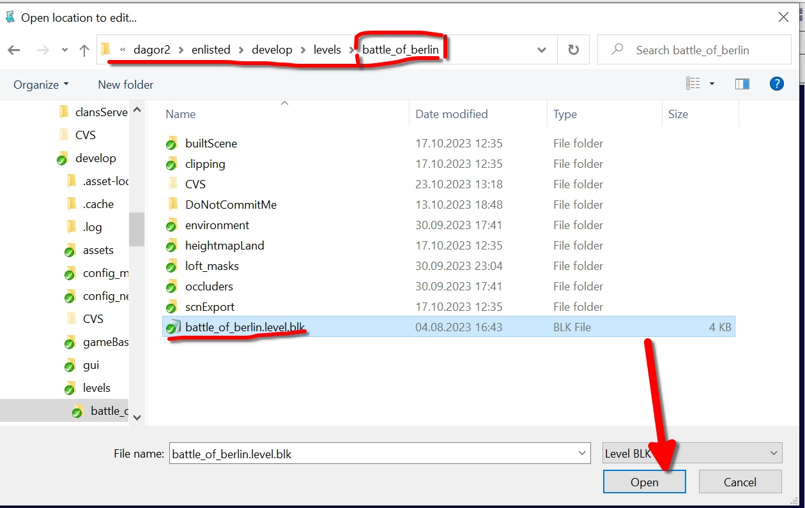
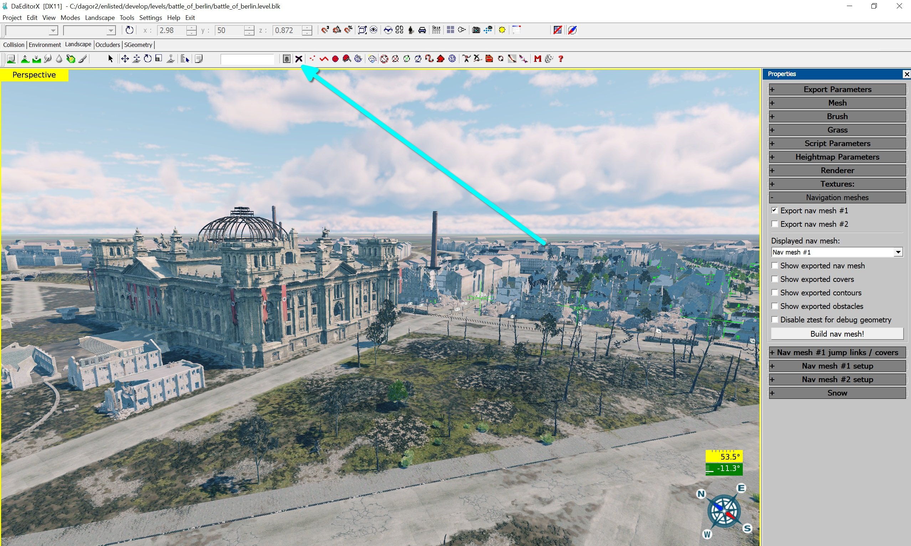
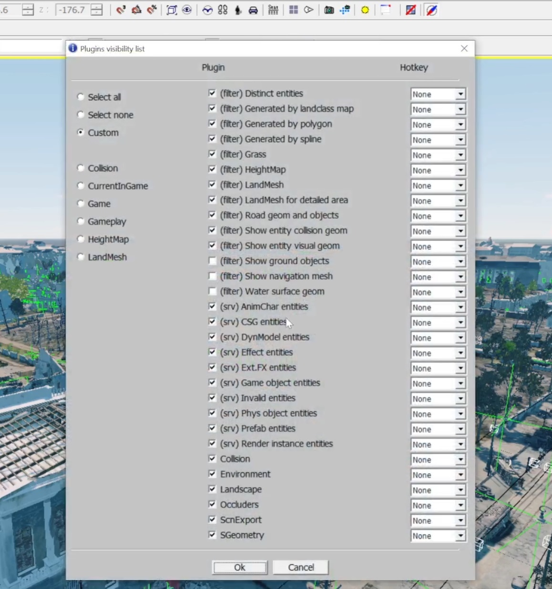
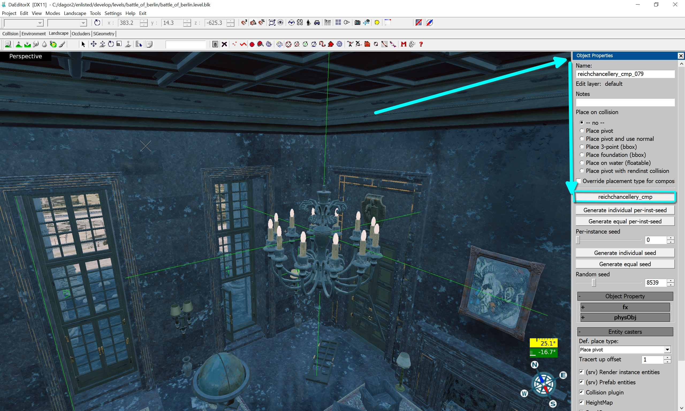
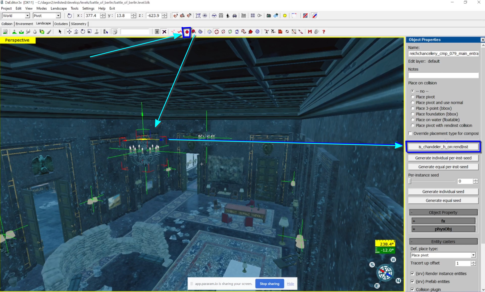
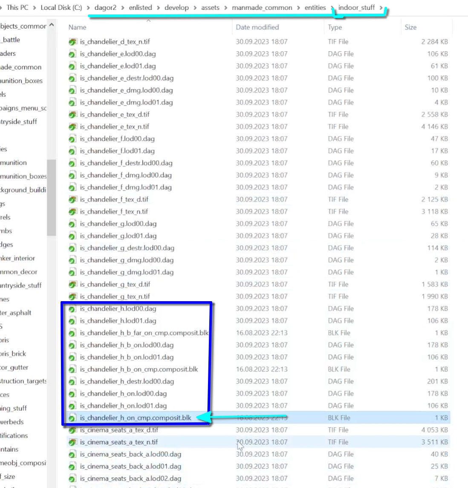
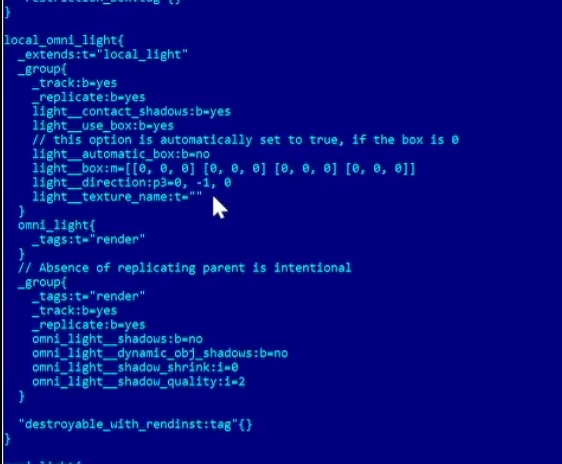
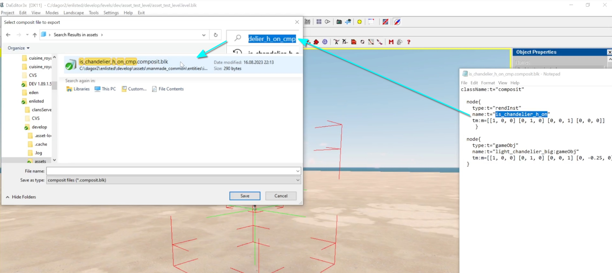
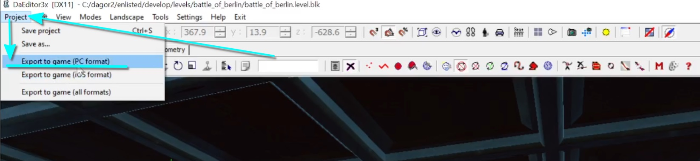
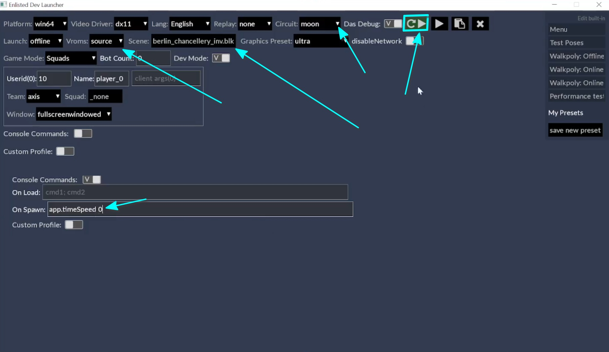

# Replacing or Modifying Lights in Props

This article covers how to replace or modify light sources in props, using the
*Enlisted* project as an example. However, the general process is applicable to
any *daNetGame*-based project.

## Phase 1: Setting Up the daEditor

1. **Open [daEditor](../../dagor-tools/daeditor/daeditor/daeditor.md)**:
   Navigate to your directory: `<your_drive>:/<engine_root>/enlisted/develop`
   and run `daEditor.cmd`.

   

2. **Open the Project**: Select **Open Project** from the menu.

   

3. **Load the Map**: Open the *battle_of_berlin* map.

   

4. **Hide Unnecessary Visual Elements**: Press `P` to open the **Properties**
   window. In the **Navigation meshes** section, uncheck the unnecessary options
   as shown below.

   

5. **Disable Splines**: Red dots represent splines. To hide them, click the
   black cross on the toolbar.

   

6. **Hide Additional Elements**: If anything else needs to be hidden, press
   `F11` and uncheck the relevant boxes in the pop-up window.

   

7. **Navigate to the Prop**: Fly to the prop of interest using *freeCamera*
   mode, toggled with the `Spacebar`. Move with `WASD` and `LMB`.

8. **Select the Target Composite**: When you reach the light fixtures, select
   the composite (in this case, a building like the *reichchancellery*) and
   press `P` to open **Object Properties**.

9. **Identify the Selected Asset**: Pay attention to the highlighted button that
   shows the asset name (`reichchancellery_cmp`), which is more reliable than
   the `Name` field, as these may differ.

   

10. **Break the Composite into Components**: In the **Landscape** menu, select
    **Split components into separate objects** to break the composite down.
    Repeat this until you can access the light fixtures.

   

11. **Select the Light Fixture**: Enable *object selection mode* (red face icon)
    and select the light fixture. The name of the fixture will appear on the
    mentioned button.

   

## Phase 2: Asset Viewer and Light Preset Identification

1. **Open the [Asset
   Viewer](../../dagor-tools/asset-viewer/asset-viewer/asset_viewer.md)**: Run
   `daViewer.cmd` from the same directory as before. Copy the asset name and use
   it to search the asset library.

2. **Select the Composite**: The asset consists of three parts:
   - Geometry
   - Composite (geometry + collision)
   - Collision

   Select the composite, right-click it, and choose **Reveal in Explorer**.

   

3. **Locate the `.blk` File**: In the file directory, right-click the `.blk`
   file and open it with a text editor or a tool like *FAR Commander*.

   

4. **Find the Light Preset**: In the `.blk` file, find the light preset
   referenced by the light fixture. Copy its name.

   

5. **Search for the Preset**: Use *FAR Commander* (or a preferred method) to
   search for the preset in the project directory `<engine_root>/enlisted/prog`.
   Use `Alt+F1` to select the correct drive and `Alt+F7` to start the search.
   The first line specifies the file mask, while the second line is for the name
   of what you're searching for. Enter the name into the second line and press
   `Enter`.

   

6. **Open the Preset File**: The preset will be found in the `lights.blk` file.
   Press `F4` to open it and view all the light templates.

   

   

7. **Search for the Preset Name**: Use `F7` to search for the specific light
   preset (e.g., `light_chandelier_big`) and navigate to the preset.

   

## Phase 3: Modifying and Creating Light Templates

1. **Find the Parent Template**: The `extends` parameter in the preset refers to
   another preset (e.g., `omni_light`). Locate the parent preset.

   

2. **Trace the Parent Presets**: If necessary, trace the hierarchy of templates
   to the top-level light preset (e.g., `local_omni_light`).

   

3. **Create a New Light Template**: Based on the parent template, create a new
   one. This will require a new `.gameObj` file with a unique name, which the
   new light template will reference.

4. **Copy and Rename the Old Game Object**: In the directory where the old
   `.gameObj` file is located, copy it and rename it as needed. Open the
   corresponding `.blk` file and adjust the references.

   

5. **Verify the Asset**: Search for the renamed asset in the *Asset Viewer*,
   right-click it, and find its location in the file structure.

   

   

6. **Rename the Game Object**: Follow the naming conventions as specified in the
   [Naming Conventions](../../dagor-home/documentation/naming_conventions.md)
   article.

   

## Phase 4: Testing and Exporting

1. **Open a Test Map in daEditor**: Open the test map by selecting **Open
   Project** during the *daEditor* load process.

   

   After the compilation is complete, *daEditor* will prompt you to open a map.
   To proceed, navigate to `levels/dev/asset_test_level` and open the `.blk`
   file for the test level.

   

2. **Clean Up the Scene**: Hide unnecessary elements as described earlier, and
   delete any unwanted objects by pressing `Ctrl+A` and `Delete`.

3. **Create and Place the New Entity**: Click the white face icon on the toolbar
   to create an entity. Search for the new `gameObj` in the search field and
   drag it into the scene.

   

4. **Adjust the Pivot**: By default, the entity's pivot will be set to the world
   origin (`0, 0, 0`), as the **Place on collision** toggler is set to **Place
   pivot** . Open the **Properties** window (`P`) and set it to **-no-**.

   

5. **Place the Chandelier Asset**: Copy the chandelier’s asset name, search for
   it in *daEditor*, drag it into the scene, and align its collision settings by
   entering the same numbers into the coordinate lines.

   

   ```{note}
   The orientation of the game object along its axes is currently unclear and
   can only be determined through experimentation.
   ```

6. **Add Entities for Light Bulbs**: Add two entities for future light bulbs and
   duplicate them by dragging while holding `Shift`.

   

7. **Update Composite in daEditor**: You can change the composites tied to
   entities via the **Property** window. Select the asset, click on the asset
   name, and choose the appropriate entity (e.g., `light_***_big`).

   

   

8. **Export the Composite**: Now, you need to assemble a new composite object.
   The first object you select will serve as the root node, from which the
   composite's pivot will inherit. Start by selecting the chandelier (its
   geometry), then hold `Ctrl` and drag to select the remaining elements.
   Next, click on **Landscape** and choose **Export as composite**.

   

9. **Save the Composite**: Find the correct directory in the asset library,
   append `_cmp` to the name, and save it.

   

10. **Verify the Composite in Asset Viewer**: Search for the composite in the
    *Asset Viewer* and ensure everything looks correct.

   

## Final Steps: Export and Testing

1. **Load the Location in daEditor**: Open *daEditor*, load the
   *battle_of_berlin* level, and uncheck all in **Navigation meshes** for faster
   export.

   

   

2. **Export to Game**: Select **Project** ▸ **Export to game (PC format)**,
   leave the settings unchanged, and confirm.

   

   

   The scene will be exported, and the changes will be written into the binary
   file.

   ```{important}
   If you are adding a new prop rather than modifying an existing one, a rebuild
   is required.
   ```
   While the build is exporting, you can update the light preset to the one you
   need. To do this, go to the `prog` directory and find the `light.blk` file.

   

   

3. **Replace the Light Preset**: In the `light.blk` file, find the appropriate
   spotlight preset for replacement and copy it.

   

   Next, replace the active template with the copied preset.

   

   After modifying the template parameters, save the changes and close the file:
   `F2` – save changes, `F4` – exit.

4. **Launch the Game**: Navigate to the `<engine_root>/enlisted/game` directory
   and launch the game via the `z_enlisted_launcher_prog`.

   

   In the **Scene** section, select the *berlin* map, choose `source` in
   **Vroms**, and press the **Play** button.

   (Alternatively, you can enter the command `app/timeSpeed 0` in the console to
   freeze time in the game).

   

5. **Adjust Lighting Orientation**: Once in the game, switch to *free camera*
   mode or press `F12` and navigate to the asset you are working on. As we can
   see, there are now two entity objects, confirming that the changes have been
   applied. However, we also notice that the light fixtures are oriented
   incorrectly.

   

   To fix this, return to the *daEditor* with the test map. Adjust the
   orientation of the light entities, reassemble, and export the composite.
   Afterward, re-export the map, reopen the game, and test the changes again.

   

   Once the lights are correctly oriented, proceed with the final lighting
   configuration as described in the [Lights](./lights.md) article.


