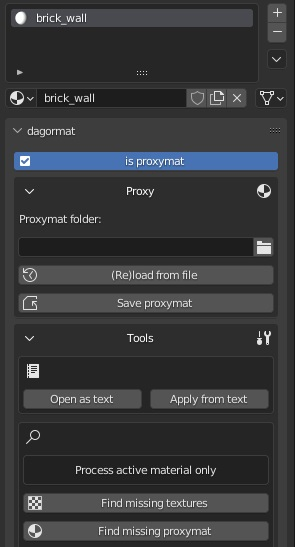

# Proxymats

## Overview

Proxy materials (*proxymats*) are a system of shared reference materials for
multiple `.dag` files. These materials are stored as separate `.blk` files, and
when edited, changes automatically apply to all `.dag` files referencing that
specific proxy material.

To implement the system, follow these steps:
- Create a `.blk` file for the proxy material.
- Specify that the material in the `.dag` file is a proxy material.
- In the `.folder.blk`, specify that the underlying `.dag` files use proxy
  materials. For example:

  ```
  virtual_res_blk{
    find:t="^(.*)\.lod00\.dag$"
    className:t="rendInst"
    contents{
      lod{range:r=200;}
      allowProxyMat:b=yes
    }
  }
  ```

This way, all underlying `.dag` files will be rebuilt whenever the proxy
materials they reference are modified.

```{important}
1. **Do not add this parameter to directories without `.dag` files that utilize
   proxy materials.** Doing so will slow down asset validation and building
   resources.
2. **Use the system wisely.** Avoid creating common proxy materials across
   fundamentally different asset packs.

   For example, you don't want the machine gun materials for player-controlled
   ships to change just because an environment artist tweaked the proxy material
   for their own needs.

   In such cases, it's better to duplicate the proxy material. Remember, it's
   just a material, not the textures themselves.
```

## How to Create a Proxymat

Proxy material `.blk` files must have the suffix `.proxymat.blk`.

For instance, a `.blk` file for a brick wall proxy material would be named:
`brick_wall.proxymat.blk`.

The simplest way to create content for a proxy material `.blk` is to configure a
material on a `.dag` file and then copy the content into a separate `.blk` file.
Only minimal edits are required. Since a proxy material `.blk` can only contain
one material (though a `.dag` can reference any number of proxy materials), you
don't need the material name or the enclosing brackets.

For example, instead of

```
material{
  name:t="stz_workshop_brick_plaster_wall"
  class:t="rendinst_emissive"
  tex16support:b=yes
  twosided:b=0
  power:r=32
  script:t="emissive_color=1,0.1,0.2,8"
  tex0:t="emissive_a_tex_d.tif"
  tex2:t="emissive_a_tex_n.tif"
}
```

the proxy material `.blk` would contain only:

```
class:t="rendinst_emissive"
tex16support:b=yes
twosided:b=0
power:r=32
script:t="emissive_color=1,0.1,0.2,8"
tex0:t="emissive_a_tex_d.tif"
tex2:t="emissive_a_tex_n.tif"
```

## How to Name a Proxymat

Proxy materials should be named according to their application. For example:
`berlin_town_buildings_wall_brick_plaster_a`.

This approach is necessary for the following reasons:

1. To avoid creating multiple similar proxy materials (e.g.,
   `brick_plaster_wall_a-j` for different maps) and losing track of their
   purposes.
2. To ensure that the material's usage is clear, preventing it from being
   inadvertently applied to a different map or asset, which could result in
   broken assets when the original proxy material is changed for other needs.

Thus, always name the proxy material:

- Based on the asset type and location.
- According to the material's composition (i.e., what it's made of).

## How to Assign Proxymat in 3ds Max

```{important}
If you're using proxymats, make sure to clean the materials into which they are
inserted. Leftover parameters won't affect anything, but leftover textures could
cause errors, especially if those textures are later deleted. Although they
won't have any direct influence, missing textures will prevent building
resources because the `.dag` file will reference non-existent textures.

**Rule:** Once you assign a proxymat to a material, remove everything else from
it!
```

Proxy materials are assigned as a `class` (shader), meaning that the class name
should reference the proxy material. For example:

```
class:t="brick_wall:proxymat"
```

An important note is that proxymats can only be assigned through the `DagorMat`
material type in *3ds Max*. For example:


<br>

After export, the `.dag` will contain:

```
material{
  name:t="brick_wall"
  class:t="brick_wall:proxymat"
  tex16support:b=yes
  twosided:i=0
  amb:ip3=255, 255, 255
  diff:ip3=255, 255, 255
  spec:ip3=255, 255, 255
  emis:ip3=0, 0, 0
  power:r=32
}
```

Of course, you can manually change the material in any `.dag` file to a proxy
material by updating the `class` (shader) accordingly.

## How to Assign Proxymat in Blender

To assign a proxymat in *Blender*, create a new material, name it according to
the desired proxymat (without the `:proxymat` suffix), and check the
corresponding checkbox:



<br>

If the proxymat already exists, specify the path to its directory and click
**(Re)load from file** to load it into the viewport.

If you are unsure of the path, but know the material exists in the project,
click **Find missing proxymat**, and the
[add-on](../../dagor-tools/addons/blender/dag4blend/dag4blend.md) will
automatically locate the required `.blk`.

To edit a proxymat, open it as a text file, make changes, and apply them using
the corresponding buttons in the Tools panel. Then, save the changes using the
**Save proxymat** button.

You can also temporarily uncheck the **is proxymat** checkbox and edit the
material using standard tools instead of as text.

Any material can be converted into a proxymat by checking the appropriate
checkbbox, specifying the target directory, and saving it.

```{important}
The material name in *Blender* will always match the name of the proxymat.
Therefore, if an imported `.dag` contains a proxymat with a different name
(e.g., "bricks", but the shader is `"brick_wall:proxymat"`), it will be
automatically renamed to match the proxymat.

If this material is referenced in the object properties for
`apex_interior_material`, that parameter will also be updated to avoid errors
during export and building resources.
```


