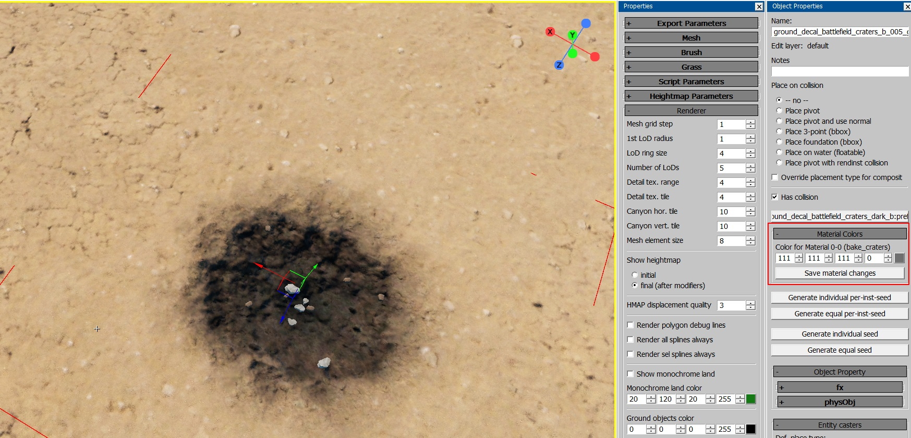

# Shader: land_mesh_height_decal

## Overview

This shader is used for rendering decals in clipmaps on prefabs or loft
geometries.

```{important}
For *WarThunder*-based projects, only the following parameters are supported:
`alpha_threshold`, `height_above`, and `vertex_gamma`.
```

## Parameters

- `height_above=1` – Controls whether the decal is convex or concave.
  - `1`: The heightmap is interpreted as convex and is rendered above the
    `diffuse_threshold`.
  - `0`: The heightmap is interpreted as concave and is rendered below the
    `diffuse_threshold`.

- `diffuse_threshold=0.5` – Determines the diffuse value at which the decal is
  fully rendered. A smooth transition is drawn up to this value, blending with
  the underlying surface.

- `hmap_softness=1` – Configures the contrast of the resulting alpha for height
  displacement.

- `norm_softness=1` – Configures the contrast of the resulting alpha for normal
  mapping.

- `r_softness=1` – Configures the contrast of the resulting alpha for
  reflectance, microdetails, smoothness, and occlusion.

- `vertex_gamma=1` – Configures the gamma for vertex alpha.

- `attenuation_from_heightmap_height=0.7` – Modulates the decal mask based on
  the decal's height above the heightmap surface.
  - `0`: Disabled.
  - `1`: Renders what is 1 meter above the landscape.
  - `-1`: Renders what is 1 meter below the landscape.

- `height_scale=0.15` – Sets the height of the displacement.

- `height_offset=-0.1` – Offsets the height of the displacement.

- `grass_decal_id=255` – Controls the grass index mask:
  - `255`: Removes grass.
  - `0`: Keeps the grass as it was under the decal.
  - Other values: Specific indices where grass is rendered.

- `script:t="vertex_opacity=1"` – To use vertex alpha in decals created from
  prefabs, write the vertex alpha into the second vertex channel. This ensures
  the vertex alpha is read from the object.

- `color_mul_add=255,255,255,0` – Colors the diffuse of the decals. In
  [*daEditor*](../../../dagor-tools/daeditor/daeditor/daeditor.md), there is a
  UI with a color picker that allows saving `.mat.blk` and `.dag` files
  (available only in *War Thunder*).

  


