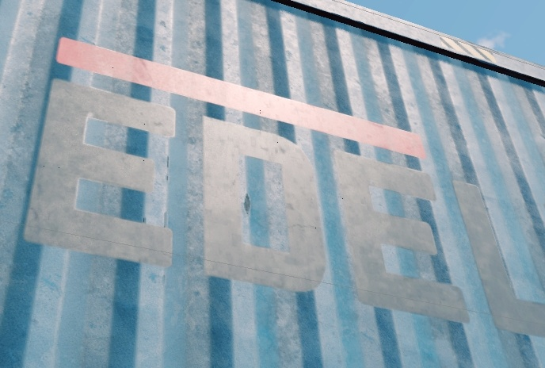

# Shader: rendinst_blend_diffuse_decal

## Overview

This decal shader supports albedo, smoothness, metalness, and normal maps. It
uses blending based on a mask stored in the albedo's alpha channel, where black
indicates areas where the decal is not rendered, and lighter areas progressively
reveal the decal.

**Parameters:**

- `script:t="gamma_mask=1,1,0,0"` – Controls the intensity of the albedo,
  normal, smoothness, and metalness.
  - The first component configures albedo/smoothness/metalness.
  - The second component configures the normal.
  - The third and fourth components are not used but must be specified.

- `script:t="micro_detail_layer=0"` – Standard syntax for microdetails.

- `script:t="micro_detail_layer_uv_scale=9"` – UV scale for microdetails.

- `script:t="micro_detail_layer_v_scale=1"` – Vertical scale for microdetails.

## Parameters

- **Parameter `script:t="gamma_mask=1,1,0,0"`** – This parameter configures the
  gamma of the mask (located in the albedo's alpha channel) separately for
  different maps (albedo, smoothness, metalness, normal). By configuring the
  parameter values, you can control the visibility of specific maps.

The lower values of gamma setting make the map more visible, while higher values
make it less visible.

- The first component configures albedo/smoothness/metalness.
- The second component configures the normal.
- The third and fourth components are not used but must be specified.

```{important}
It's important to understand how this works. Gamma is a power-function, and we
set the power to which the pixel value of the decal mask is raised.
```

Let's look at a decal mask that has only two boundary values (`0` - black, `1` -
white) with some faint gray strokes:


<br>

What happens when you raise `0` (black) to the power of `0.1`? You get `0`.
What happens when you raise `1` (white) to the power of `0.1`? You get `1`.

We cannot affect either the diffuse or the normal, no matter how much we tweak
these parameters. Below are two screenshots with examples:

<table style="text-align:center; width:98%"><tr>
  <th style="text-align:center; width:51%"><p>script:t="gamma_mask=0.1,0.1,0,0"</p></th>
  <th style="text-align:center; width:47%"><p>script:t="gamma_mask=1,1,0,0"</p></th></tr>
</table>




Only the edges of the letters change, where gray outlines appear due to texture
compression. Raising gray (around `0.5`) to `0.1` results in approximately
`0.93` (almost white). Raising gray to `1` results in `0.5` – cutting it off
(possibly not entirely, but significantly).

However, this setting doesn't globally affect the texture channels.

Now, let's reduce the white value from `1` to approximately `0.8`:


<br>

<table style="text-align:center; width:98%"><tr>
  <th style="text-align:center; width:49%"><p>script:t="gamma_mask=0.1,0.1,0,0"</p></th>
  <th style="text-align:center; width:49%"><p>script:t="gamma_mask=1,1,0,0"</p></th></tr>
</table>


At minimal gamma values, the edges around the decal thicken because there's more
information for pixelation due to texture compression.

At higher gamma values, the effects of your settings become apparent. For
example, the decal starts to blend with the corrugated surface, allowing the
normal map to show through. If we further increase the normal's gamma (e.g., to
`4`), the text will conform more closely to the corrugated surface.

<table style="text-align:center; width:50%"><tr>
  <th style="text-align:center; width:50%"><p>script:t="gamma_mask=1,4,0,0"</p></th></tr>
</table>


<br>

**Summary:** Any "tweaks" only work if they can genuinely affect something. If
the texture has boundary values, there’s nothing to "tweak."

```{important}
It's highly recommended to avoid boundary values in decal textures, as this
allows us to apply them in a wider variety of scenarios.
```

- **Microdetail Parameters**

This shader supports
[microdetails](../../about-assets/microdetails/microdetails.md) with the
standard syntax used in *daNetGame*-based projects.

  - `script:t="micro_detail_layer=0"`
  - `script:t="micro_detail_layer_uv_scale=9"`
  - `script:t="micro_detail_layer_v_scale=1"`


