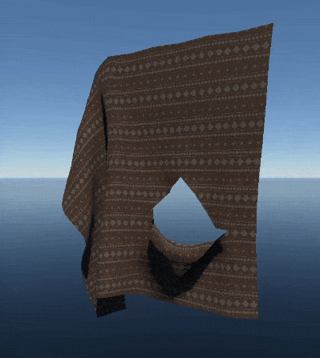

# Shader: rendinst_flag_colored

## Overview

This is a simple shader designed for cloth simulation.

**Parameters:**

- `script:t="frequency_amplitude=1,1,1,1"` – intervals for random frequency and
  amplitude;
- `script:t="wave_length=1"` – wave length;
- `script:t="wind_direction=0,0,1,0"` – wind direction;

- `script:t="use_painting=1"` – main parameter to enable painting;
- `script:t="paint_palette_row=1"` – painting parameters in *daNetGame*–based
  projects, similar to [rendinst_simple_painted](rendinst_simple_painted.md)
  shader;
- `script:t="paint_white_point=0.1"`
- `script:t="paint_black_point=0.05"`
- `script:t="paint_mult=1"`

- `script:t="micro_detail_layer=0"` – microdetail settings;
- `script:t="micro_detail_layer_v_scale=1"`
- `script:t="micro_detail_layer_uv_scale=1"`

## Functionality

This shader uses two textures (diffuse and normal) to enable basic geometry
animation. You can configure sinusoidal parameters for vertex displacement, with
smoother results achieved on denser meshes.

```{important}
Ensure the shader is applied only to geometry that is painted with vertex color,
as using it otherwise may cause errors in the game.
```

## Animated Geometry

The area of the mesh to be animated is defined by the R-channel of the vertex
color. G and B channels are not used.

<table style="text-align:center; width:98%"><tr>
  <th style="text-align:center; width:48%"><p>Vertex Color</p></th>
  <th style="text-align:center; width:50%"><p>Result</p></th></tr>
</table>


```{note}
Always reset unused vertex color channels to black, since they default to white
(with all channels set to maximum).
```

## Parameters

- `script:t="frequency_amplitude=1,1,1,1"` – Defines the frequency and amplitude
intervals. (In this case, frequency controls the speed of the wave oscillations,
not the wavelength):
  - 1st and 2nd components – frequency range (min, max),
  - 3rd and 4th components – amplitude range (min, max).

At the start of the mission, random values are selected from these intervals,
and remain static throughout the game. Different assets across the location will
animate with varying values.

<table style="text-align:center; width:98%"><tr>
  <th style="text-align:center; width:49%"><p>Frequency = 1</p></th>
  <th style="text-align:center; width:49%"><p>Amplitude = 1</p></th></tr>
</table>


<table style="text-align:center; width:98%"><tr>
  <th style="text-align:center; width:50%"><p>Frequency = 3</p></th>
  <th style="text-align:center; width:48%"><p>Amplitude = 3</p></th></tr>
</table>


Random values are not visible in the *Asset Viewer*, so first verify the maximum
values in components 1 and 3 (as these are displayed in the *Asset Viewer*).
After that, move these values to components 2 and 4, and set the minimum values
in components 1 and 3.

- `script:t="wave_length=1"` – Defines the wavelength.

A longer wavelength reduces oscillation detail, as the sinusoidal wave stretches
and the model only captures a small portion of it.

<table style="text-align:center; width:96%"><tr>
  <th style="text-align:center; width:32.5%"><p>Wavelength = 1</p></th>
  <th style="text-align:center; width:31.5%"><p>Wavelength = 0.5</p></th>
  <th style="text-align:center; width:32%"><p>Wavelength = 5</p></th></tr>
</table>


- `script:t="wind_direction=0,0,1,0"` (temporary parameter) – Wind direction is
  defined by a temporary parameter, as a global wind system is planned. In the
  *Asset Viewer* and *daEditor*, the wind direction operates based on global
  axes, so make sure to verify the wave direction in–game:
  - 1st component controls oscillations along the X–axis;
  - 2nd component controls oscillations along the Z–axis (vertical);
  - 3rd component controls oscillations along the Y–axis.

<table style="text-align:center; width:98%"><tr>
  <th style="text-align:center; width:48%"><p>wind_direction=1,0,0,0</p></th>
  <th style="text-align:center; width:50%"><p>wind_direction=0,0,1,0</p></th></tr>
</table>




- `script:t="use_painting=1"` – The painting parameters for the
  *daNetGame*–based projects work similarly to
  [rendinst_simple_painted](./rendinst_simple_painted.md) shader, with the
  exception that this shader does not paint by default. To enable painting, set
  the parameter as follows:
  - `1` – enable painting;
  - `0` – disable painting (optional).

## Working with Global Wind in daNetGame-based projects

This shader also supports wind animation using a global wind map and an
additional set of parameters. The previous algorithm remains available, with
wind behavior controlled by the `shadervar wind_type` parameter.

The new algorithm is preferred, as it takes into account wind strength
variations, including wind emitters.

**Parameters:**

- `wind_type = 0` – Uses the old animation algorithm, independent of external
  factors, and configured using `frequency_amplitude`, `wind_direction`,
  `wind_strength`, and `wave_length`.

- `wind_type = 1` – New algorithm that ignores the R-channel in the vertex
  color, instead using the normalized distance from the flagpole axis (ranging
  from `0` at the attachment points to `1` at the flag's end).

- `wind_type = 2` – New algorithm that uses the R-channel in the vertex color.
  For correct operation, the R-channel must continuously increase from `0` at
  the attachment points to `1` at the flag’s end, although the increase does not
  need to be linear. If a large portion of the flag is uniformly colored,
  incorrect behavior may occur.

- `flagpole_pos_0`, `flagpole_pos_1` – Define a segment in the model's
  coordinate system where the flag is attached. Points along this segment remain
  stationary. For a single fixed point, a very short segment can be used.

- `flag_length` – Defines the length of the flag, or the distance from the axis
  to the flag's end. This value doesn’t need to be exact; setting it 10-15%
  larger than the actual size is acceptable, but setting it smaller is not
  recommended.

Additional optional parameters include:

- `flag_movement_scale = 1` – Controls how much the wind bends and shifts the
  flag from its resting position.
- `stiffness = 0.1` – Determines the flag's resistance to bending.
- `stretch = 0.1` – Controls how much the flag stretches:
  - `0` – no stretch,
  - `1` – unlimited stretch.
- `sway_speed = 1` – Defines how quickly the flag bends.
- `bend = 2` – Shapes how the flag bends.
- `deviation = 4` – Controls the flag's form when deviating from its equilibrium
  position.

```{seealso}
You can view the shader results with different parameter configurations
[here](https://drive.google.com/drive/folders/10mY9r2kewTMMaSTC5YUr2pLRlPb2b-LA?usp=sharing).
```


