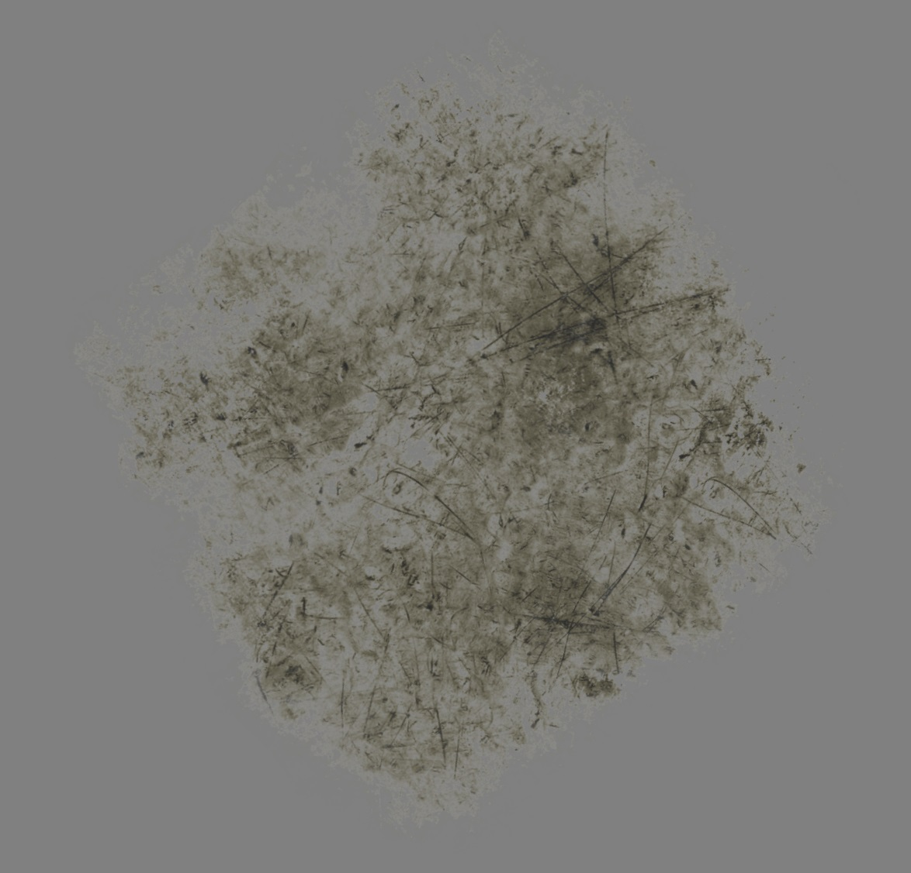
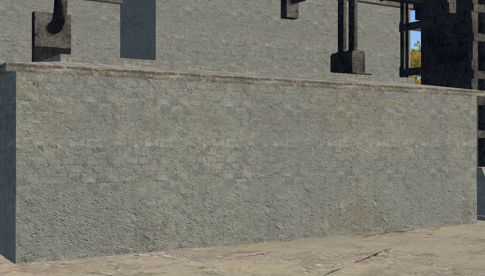
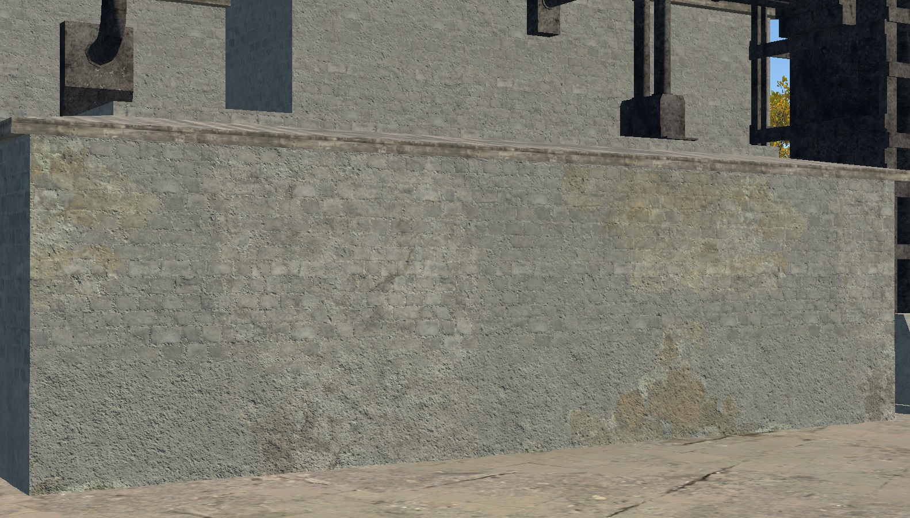
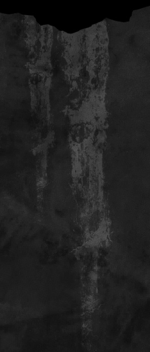
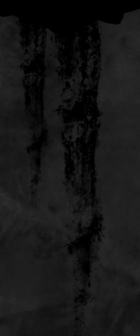

# Shader: rendinst_modulate2x_diffuse_decal

## Overview

The `rendinst_modulate2x_diffuse_decal` shader is used for modulating decals on
geometry within an object's `.dag` file.


**General Parameters:**

- `script:t="intensity=1,0,1,0"`
  - 1st component: intensity (`0` and above).
  - 2nd and 3rd components: clamping range.
  - 4th component: desaturation.

**daNetifme-Based Parameters:**

- `script:t="smoothness_metalness=1,1,0,0"`
  - 1st component: affects smoothness.
  - 2nd component: affects metalness.
  - The remaining components are required but have no effect.

- `script:t="draw_order=1"` – Defines the draw order for decals. The default is
  `0` for all decals. You can set it to `-1` (for decals that should always be
  below others) or `1` (for decals that should always be on top).

## Functionality

The shader uses 24-bit diffuse textures (without alpha). Darker than 50% gray
darkens the underlying surface, while lighter than 50% gray brightens it. This
is how modulation works.

If a texture requires areas that shouldn't affect the surface (essentially,
"transparent" areas), these should be 50% gray. Applying a 50% gray modulation
(for example, using *Photoshop*'s overlay mode) will result in no visible
change.

<table style="text-align:center; width:98%"><thead><tr>
  <th style="text-align:center; width:47.5%"><p>Texture</p></th>
  <th style="text-align:center; width:50.5%"><p>Result</p></th></tr></thead>
</table>




However, simply creating a texture with 50% gray in the "transparent" areas is
not enough. During compression, diffuse textures often get a gamma correction of
`2.2`, which alters brightness.

To avoid this, modulate decal textures must be processed with a gamma of `1`.
These textures should be named with the suffix `_tex_m`, for example,
`wall_dirt_spots_decal_a_tex_m.tif`. Such textures are automatically processed
with gamma `1`.

## Parameters

### General Parameters

- `script:t="intensity=1,0,1,0"` – This parameter controls several properties:
  - 1st component: decal intensity, from `0` upwards. Values below `0` invert the
    decal's color, which can be useful for creating effects like oil stains from
    regular dirt.
  - 2nd and 3rd components: clamping – restricts the texture's brightness range.
    The 2nd component is "from", and the 3rd component is "to". This allows you
    to display only a specific color range of the texture, making edges sharper
    and outlines more distinct. Anything outside the clamping range defaults to
    50% gray (i.e., it has no effect on the surface).
  - 4th component: decal desaturation, from `0` to `1` (default is `1`, fully
    desaturated).

**Examples:**

- `script:t="intensity=0,0,1,0"` – Intensity set to `0`.

  

  <br>

- `script:t="intensity=0.5,0,1,0"` – Intensity set to 50%.

  

  <br>

- `script:t="intensity=1,0,1,0"` – Intensity set to 100%.

  

  <br>

- `script:t="intensity=-1,0,1,0"` – Inverted color.

  

  <br>

- `script:t="intensity=1,0,1,0"` – Full color range.

  

  <br>


- `script:t="intensity=1,0,0.5,0"` – Clamped visible range from `0` to `0.5`
  (50% brightness), showing areas darker than 50%.

  

  <br>


- `script:t="intensity=1,0.5,1,0"` – Clamped visible range from `0.5` to `1`,
  showing areas brighter than 50%. You can also use different ranges, such as
  from `0.23` to `0.37`.

  

  <br>

- The same decals with different parameters can provide a wide range of effects
  with minimal effort.

  

  <br>

  

  <br>

### daNetGame-Based Parameters

- `script:t="smoothness_metalness=1,1,0,0"` – This parameter controls the impact
  on the smoothness and metalness of the underlying material. The default value
  is `0`. Reducing the value decreases the parameters, while increasing it
  enhances them.
  - 1st component: smoothness.
  - 2nd component: metalness.

```{important}
This parameter affects the material that the decal is applied to. If the
underlying material lacks metalness, for example, this parameter will have no
effect.
```

<table style="text-align:center; width:98%"><thead><tr>
  <th style="text-align:center; width:50%"><p>Source decal</p></th>
  <th style="text-align:center; width:48%"><p>script:t="smoothness_metalness=0,0,0,0"</p></th></tr></thead>
</table>


<table style="text-align:center; width:98%"><thead><tr>
  <th style="text-align:center; width:49.5%"><p>script:t="smoothness_metalness=1,0,0,0"</p></th>
  <th style="text-align:center; width:48.5%"><p>script:t="smoothness_metalness=-1,0,0,0"</p></th></tr></thead>
</table>




- `script:t="draw_order=1"` – Controls the draw order for specific decal
  materials. It has three values:
  - `-1`: "lower" draw order – rendered below all other decals.
  - `0`: "middle" draw order – the default value for all decals.
  - `1`: "upper" draw order – rendered above all other decals.

A single object can have many overlapping decals. For example, numbering each
decal type shows how differently they can appear depending on the draw order:


<br>

You can see that wear decals **(2)** are generally bright. However, they can be
darkened by soot decals **(1)**. This is the decal layering in action, with the
soot decal "above" the wear decal, applied on top of it.

Without specifying the draw order, you might encounter:

- **Z-fighting** (where decals with the same draw order fight for visibility).
- **Incorrect layering**, like this black seam (the soot decal should be "below"
  the brick edge decal, but it's drawn "above").

  

  <br>

- Or both issues simultaneously.

```{important}
If you don't assign a draw order to any decal material, they default to `0`.
However, in-game, the system may assign its own order because no clear hierarchy
is defined. Therefore, it's important to specify at least the materials that
should be lower than `0`. This ensures the rest will render above without issue.
For best results, set a clear draw order and don't rely on chance.
```

Typically, modulate decals should be set to `-1`, while wear decals can remain
untouched. Wear often looks fresher than surrounding dirt and soot.

However, if the wear needs to appear dirty, you can either set the wear decals
to `-1`, leaving modulate decals untouched, or set the dirty modulate decals to
`1` to preserve the overall layering scheme for modulate and diffuse decals.

```{note}
This parameter applies to all diffuse and modulate decals, not just this
specific shader.
```


