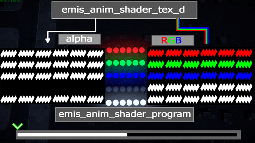

# Shader: rendinst_simple_emissive_anim / dynamic_illum_anim

## Overview

This shader enables toggling, adjusting emission strength, and controlling
emission color.

## Parameters

**rendinst_simple_emissive_anim**:

- `class:t="rendinst_simple_emissive_anim"`
- `script:t="illum_scroll_speed=0.1"` – Controls the scroll speed of the "scan"
  effect across the emission texture program. Reversing the sign of this
  variable changes the scanning direction.
- `script:t="use_additive_blend=1"` – Sets the blending mode: `0` for
  multiplicative emission on the albedo, `1` for additive blending.
- `tex0:t="diffuse_map_tex_d.tif"` – The alpha channel defines the emission
  intensity.
- `tex2:t="normal_map_tex_n.tif"` – Normal map.
- `tex3:t="program_map_program.tif"` – The emission texture program. The minimum
  texture size is 4x4.
- `tex4:t="shift_map_shift.tif"` – Emission shift texture.

**dynamic_illum_anim**:

- `script:t="illum_scroll_speed=0.1"` – Controls the scroll speed of the "scan"
  effect across the emission texture program. Reversing the sign of this
  variable changes the scanning direction.
- `script:t="use_additive_blend=1"` – Sets the blending mode: `0` for
  multiplicative emission on the albedo, `1` for additive blending.
- `tex0:t="diffuse_map_tex_d.tif"` – The alpha channel defines the emission
  intensity.
- `tex2:t="program_map_program.tif"` – Emission texture program. The minimum
  texture size is 4x4.
- `tex3:t="shift_map_shift.tif"` – Emission shift texture.

The shader operates in two modes: *multiplicative* and *additive*. The emission
program texture modifies two channels in the G-buffer: albedo and emission. In
this context, the emission channel is 8-bit (grayscale).

This means that there are three options for achieving colored emission. Choose
the one that best suits your case:

- In multiplicative mode, use a colored albedo and a grayscale program texture
  to avoid overshadowing the albedo.
- In multiplicative mode, use a colored program texture. This will modify the
  base albedo map, subtracting from it.
- Multiplicative mode is the default.

## Textures

For animating the turning on and off of lights, you'll need a `.dag` file for
the lights and two textures:

- `tex0:t="emis_anim_shader_tex_d.tif"` – The diffuse texture defines the lamp's
  color.
- `tex3:t="emis_anim_shader_program.tif"` – The program texture defines when the
  lamp emits light (independent of UV mapping).

 

### tex0:t="emis_anim_shader_tex_d.tif"

Defines the lamp's color and emission level:

- RGB channels: Albedo (color of the emission if no other color is defined in
  the program texture (`tex3:t="emis_anim_shader_program.tif"`)).
- A channel: Emission intensity, where white is the maximum emission and black
  means no emission.

### tex3:t="emis_anim_shader_program.tif"

The emission program texture defines:

1. Emission timing (emitting light in white areas, no emission in black areas).
2. Emission color (the color emitted can be defined here).
3. Emission intensity (non-white colors will reduce emission intensity).

- RGB channels: If not black, the defined color will be emitted.
- A channel: Not used.

Using these two textures, simple emission animations can be created. Separate
mapping for each lamp is not required.

**Example:** The lamp's color is defined in the program texture
(`tex0:t="emis_anim_shader_program.tif`), and to prevent color conflicts between
the diffuse and program textures, the lamps in the diffuse texture are painted
white.

 

### tex4:t="emis_anim_shader_shift.tif"

- R channel: Controls horizontal displacement on the program texture:
  - White: No displacement.
  - Black: Maximum displacement.
- G channel: Controls vertical displacement on the program texture:
  - White: No displacement.
  - Black: Maximum displacement.
- B channel: Controls the speed:
  - White: Speed increases (visually by about 2x).
  - Black: Speed is controlled by the `script:t="illum_scroll_speed=0.1"`
    parameter.

## Usage

For complex animations, use `tex4:t="emis_anim_shader_shift.tif"`.

**Example:** In the example below, only the R channel is used to control the
shift on the program. The green and white lamps, marked by arrows in the shift
texture (`tex4:t="emis_anim_shader_shift.tif`), are painted according to the UV
shell of the lamps. This causes visible artifacts at the seams. It is better to
paint the area as with the red/blue lamps.

 

**Example:** For scrolling text, you'll need a `.dag` file for the banner and
three textures.

 

<table style="text-align:center; width:98%"><tr>
  <th style="text-align:center; width:32%">
tex0:t="text_anim_tex_d"
</th>
  <th style="text-align:center; width:32%">
tex3:t="text_anim_program"
</th>
  <th style="text-align:center; width:32%">
tex4:t="text_anim_shift"
</th></tr>
</table>

For the scrolling text effect, both the gradient (which should be linear) and
the gamma value (`gamma:r=1`) of the textures are critical.

 

Failing to meet these conditions will result in poor animation quality. For
example, using a *Photoshop* gradient with a gamma of `2.2` will produce subpar
results:

 

