# Shader: rendinst_vcolor_layered

## Overview

The `rendinst_vcolor_layered` shader is designed for rendering instances with
three detail layers, which blend based on:

1. The vertex color channels of the object's geometry.
2. Corresponding heightmaps for each layer.

**Parameter List**

- `script:t="atest=1"` and `script:t="details_alphatest=0,0,0,0"` – These
  parameters work together to enable alpha test. The first parameter (`atest`)
  activates alpha test, while the second (`details_alphatest`) sets the alpha
  test strength for each detail layer.
- `script:t="details_tile=1,1,1,0"` – Controls the tiling of the detail
  textures.
- `script:t="invert_heights=0,0,1,0"` – Inverts the heightmaps for each detail
  layer. Fractional values can be used. The value of `0.5` turns heightmap into
  neutral gray fill.
- `script:t="paint_details=0,0,0,0"` – Allows painting over the three detail
  layers.
- `script:t="overlay_color_from=0,0,0,0"` – Defines the starting color for
  overlay blending using linear interpolation (LERP), with masking defined by
  the blue vertex color channel.
- `script:t="overlay_color_to=0,0,0,0"` – Defines the target color range for
  overlay blending, from `0` (black, RGB: `0,0,0`) to `1` (white, RGB:
  `255,255,255`).

```{important}
If vertex color is not painted after applying this shader, the *Asset Viewer*
will produce an error when selecting the model (related to the 5th mapping
channel). Ensure vertex colors are used with this shader, as it will not
function correctly without them.
```

## Textures

- **tex0**: Detail1 Diffuse (Albedo)
- **tex2**: Detail1 Normals + Metalness + Smoothness
- **tex3**: Detail2 Diffuse (Albedo)
- **tex4**: Detail2 Normals + Metalness + Smoothness
- **tex5**: Detail3 Diffuse (Albedo)
- **tex6**: Detail3 Normals + Metalness + Smoothness

## Parameters

### Alpha Test

This shader is suitable for materials that require transparency, such as
tattered cloth or paper. Alpha test is controlled by two parameters:

- `script:t="atest=1"` – Activates alpha test for the material. This parameter
  alone does not alter the appearance until `details_alphatest` is specified.
- `script:t="details_alphatest=0,0,0,0"` – Specifies the alpha test strength
  for each detail layer, with values ranging from `0` to `1`":"
    - 1st component: Detail1
    - 2nd component: Detail2
    - 3rd component: Detail3
    - 4th component: Unused, but required.

### Detail Tiling

The detail tiling parameter behaves similarly to the
[rendinst_perlin_layered](../rendinst_perlin_layered.md) shader.

- `script:t="details_tile=1,1,1,0"`:
  - 1st component: Tiling for Detail1.
  - 2nd component: Tiling for Detail2.
  - 3rd component: Tiling for Detail3.
  - 4th component: Unused, but required.

### Procedural Painting

This feature allows procedural painting over the detail layers (similar to
[rendinst_perlin_layered](../rendinst_perlin_layered.md) shader).

- `script:t="paint_details=0,0,0,0"` – Allows painting over the three detail
  layers.
  - 1st component: Paint strength for Detail 1 (fractional values allowed).
  - 2nd component: Paint strength for Detail 2.
  - 3rd component: Paint strength for Detail 3.
  - 4th component: Selects line of painting palette.

### Vertex Color Overlay

The shader uses the blue channel of the vertex color to create a global color
overlay map. Two colors are blended using linear interpolation (LERP), with the
map defined by the blue vertex color channel.

- `script:t="overlay_color_from=0,0,0,0"` – Defines the starting color for the
  blend.
- `script:t="overlay_color_to=0,0,0,0"` – Defines the target color for the
  blend.
  - The first three components represent the RGB values, ranging from `0`
    (black) to `1` (white).
  - The 4th component is currently unused.

This overlay modulates the blending of the detail layers. For example, storing
curvature data in the blue vertex color channel can create an effect where
cracks in stone appear black, while raised areas appear red. By default, both
colors are set to mid-gray, so no additional color effect is applied.

```{important}
The "from" color is applied globally by default. To prevent the entire model
from being painted, set the "from" color to a neutral gray (`0.5, 0.5, 0.5, 0`)
and configure the "to" color to highlight specific details.
```

## Functionality

### VertexPaint Modifier

Here are key settings you'll need when using the *VertexPaint* modifier with
this shader:

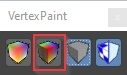

- This button toggles the display of vertex colors on the model.

<br clear="left">

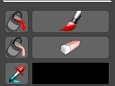

- Tools for painting or filling the vertex color.

<br clear="left">

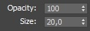

- Brush opacity and size settings (default size is 20 meters).

<br clear="left">


- Options for geometry selection while painting.

<br clear="left">

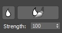

- Smooth brush tool for blending painted colors.

<br clear="left">


- Vertex color blending modes (similar to Photoshop layers). When using multiple
  modifiers, it's recommended to paint each color channel (R, G, and B)
  separately. The red channel typically uses the "normal" blend mode, while
  green and blue use **Add** mode.

<br clear="left">

```{important}
By default, vertex colors on the model are set to white (maximum values for all
channels). To begin painting, fill the entire model with black.
```

### Blending Details

The shader blends three detail layers using both vertex colors and heightmaps.

#### Vertex Color Blending

Initially, Detail1 is applied across the model. Detail2 and Detail3 are blended
into it based on the red and green vertex color channels.

For example, painting an area with 100% red will apply Detail2 there, while 100%
green will apply Detail3. Smooth gradients in the vertex colors create more
natural transitions between the detail layers.

#### Heightmap Blending

The brightness of the heightmaps influences how strongly each detail layer
blends. The intensity of the vertex colors is multiplied by the corresponding
heightmap brightness.

For example:
- If two detail layers have identical heightmaps and vertex color weights, they
  will blend evenly.
- A detail with a black heightmap and another with a mid-gray heightmap will
  blend differently, as the mid-gray heightmap will have a higher visual impact.

### Visual Examples

Let's consider an example of a car tarp using multiple detail textures and their
corresponding heightmaps.

<table style="text-align:center; width:98%"><thead><tr>
  <th style="text-align:center; width:49%"><p>fabric_tarpaulin_a_tex_d – Detail1 and Detail2</p></th>
  <th style="text-align:center; width:49%"><p>fabric_shabby_a_tex_d – Detail3</p></th></tr></thead>
</table>


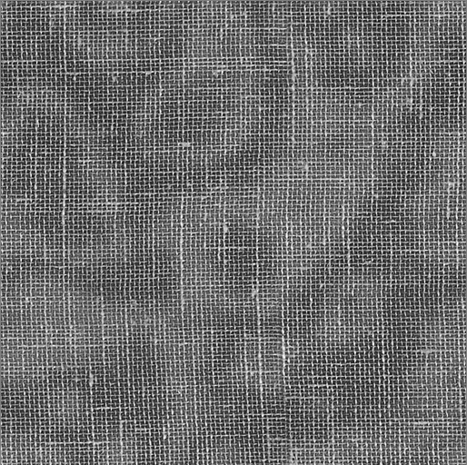

- **Shader Parameters:**

<table><tr><td style="text-align:left; width:49%"><p>
  <ul>
    <li>script:t="paint_details=1,0,0,1"</li>
    <li>script:t="details_tile=12,16,20,0"</li>
    <li>script:t="invert_heights=0,0,0,0"</li>
    <li>script:t="details_alphatest=0,0,0,0"</li></ul></p></td><td style="text-align:left; width:49%"><p>
  <ul>
    <li>tex0:t="fabric_tarpaulin_a_tex_d.tif"</li>
    <li>tex2:t="fabric_tarpaulin_a_tex_n.tif"</li>
    <li>tex3:t="fabric_tarpaulin_a_tex_d.tif"</li>
    <li>tex4:t="fabric_tarpaulin_a_tex_n.tif"</li>
    <li>tex5:t="fabric_shabby_a_tex_d.tif"</li>
    <li>tex6:t="fabric_shabby_a_tex_n.tif"</li>
  </ul></p></td></tr>
</table>

<table style="text-align:center; width:98%"><tr>
  <th style="text-align:center; width:49%"><p>3ds Max</p></th>
  <th style="text-align:center; width:49%"><p>Asset Viewer</p></th></tr>
</table>


By default, the entire model is covered by Detail1 (as we cannot leave the model
without any detail). For clarity, it tinted a yellowish color (see shader
parameters).


- X-axis (100% Red): Subtracts Detail2 from Detail1.
- Y-axis (100% Green): Subtracts Detail3 from Detail1.
- Z-axis (100% Green and Red): Subtracts both Detail2 and Detail3 from Detail1.

These details blend based on their heightmaps (you may notice an uneven
transition from Detail2 to Detail3), but the blend is not perfect – Detail2's
heightmap is stronger than Detail3's.


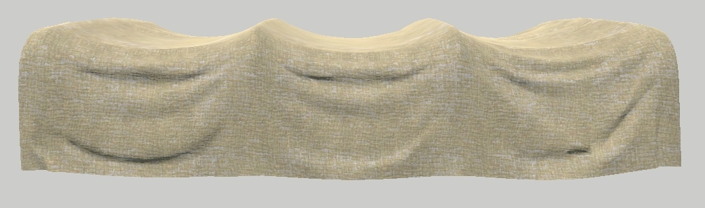

We introduced some subtle variation by applying a 45% fill of Detail2 across the
fabric. This allows Detail2 to appear in scattered areas, blending based on the
heightmaps, which adds visual variety.


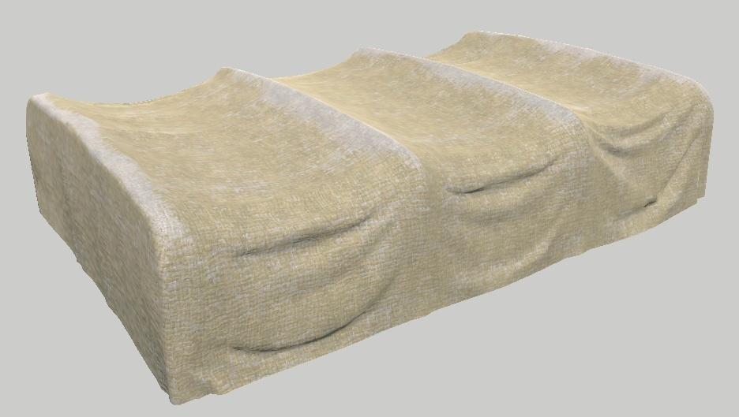

Next, we enhanced the raised parts of the tarp with a 55% application of
Detail2, simulating faded areas on protruding fabric sections. We used 55%
because 45% of the tarp was already covered with red (Detail2).

If we applied 100%, the result would have been 145%, creating an overly
saturated color and causing the wear effect to spread too much across the
fabric. There are two sets of screenshots – before and after blurring the
painted areas.

- **Shader Parameters:**

<table><tr><td style="text-align:left; width:49%"><p>
  <ul>
    <li>script:t="atest=1"</li>
    <li>script:t="paint_details=1,0.4,-4,1"</li>
    <li>script:t="details_tile=12,16,20,0"</li>
    <li>script:t="invert_heights=0,0,0,0"</li>
    <li>script:t="details_alphatest=0,0,0.33,0"</li></ul></p></td><td style="text-align:left; width:49%"><p>
  <ul>
    <li>tex0:t="fabric_tarpaulin_a_tex_d.tif"</li>
    <li>tex2:t="fabric_tarpaulin_a_tex_n.tif"</li>
    <li>tex3:t="fabric_tarpaulin_a_tex_d.tif"</li>
    <li>tex4:t="fabric_tarpaulin_a_tex_n.tif"</li>
    <li>tex5:t="fabric_shabby_a_tex_d.tif"</li>
    <li>tex6:t="fabric_shabby_a_tex_n.tif"</li>
  </ul></p></td></tr>
</table>

<table style="text-align:center; width:98%"><tr>
  <th style="text-align:center; width:49%"><p>3ds Max</p></th>
  <th style="text-align:center; width:49%"><p>Asset Viewer</p></th></tr>
</table>


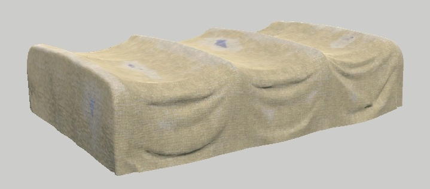

We added 100% spots of Detail3, then applied a 30% smoothing to blend them. At
100%, Detail3 would appear too weak due to its less pronounced heightmap
compared to Detail1 and Detail2.

Notice the spots around Detail3, which are actually from Detail2, even though we
didn't directly paint them. This occurs because the entire tarp was filled with
45% of Detail2, and wherever Detail3 partially subtracts from Detail1, Detail2
also starts to blend in.

We configured the colors for Detail2 and Detail3 to reduce the color contrast.
Additionally, we applied an alpha test to Detail3 (although it's not very
visible in the screenshot).

- **Shader Parameters:**

<table><tr><td style="text-align:left; width:49%"><p>
  <ul>
    <li>script:t="atest=1"</li>
    <li>script:t="paint_details=1,0.4,-4,1"</li>
    <li>script:t="details_tile=12,16,20,0"</li>
    <li>script:t="invert_heights=0,0,0,0"</li>
    <li>script:t="details_alphatest=0,0,0.33,0"</li>
    <li>script:t="overlay_color_from=0.5,0.5,0.5,0"</li>
    <li>script:t="overlay_color_to=0,0,0,0"</li></ul></p></td><td style="text-align:left; width:49%"><p>
  <ul>
    <li>tex0:t="fabric_tarpaulin_a_tex_d.tif"</li>
    <li>tex2:t="fabric_tarpaulin_a_tex_n.tif"</li>
    <li>tex3:t="fabric_tarpaulin_a_tex_d.tif"</li>
    <li>tex4:t="fabric_tarpaulin_a_tex_n.tif"</li>
    <li>tex5:t="fabric_shabby_a_tex_d.tif"</li>
    <li>tex6:t="fabric_shabby_a_tex_n.tif"</li>
  </ul></p></td></tr>
</table>

<table style="text-align:center; width:98%"><tr>
  <th style="text-align:center; width:49%"><p>3ds Max</p></th>
  <th style="text-align:center; width:49%"><p>Asset Viewer</p></th></tr>
</table>


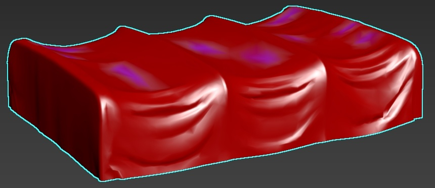


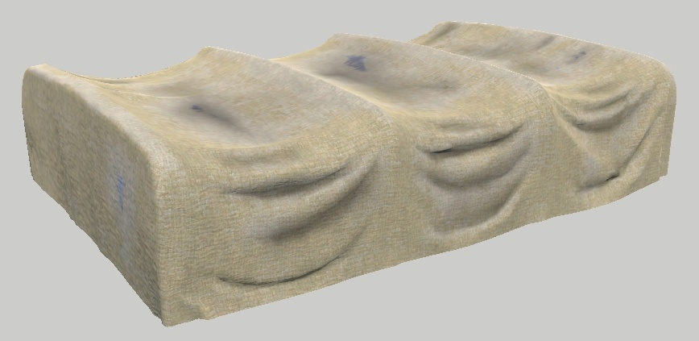

We added a layered overlay in the blue channel. The color gradient ranges from
50% gray (which doesn't affect the texture) `0.5,0.5,0.5,0` to 0% black
`0,0,0,0`.

To illustrate the "from-to" color concept, consider the following example:
`script:t="overlay_color_from=0.549,0.239,0.239,0"` (~RGB `140,61,61`).

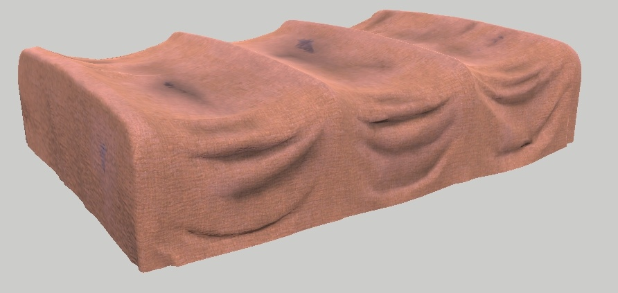

<br>

Any area not painted with blue will be colored using the "from" value. This
approach can be useful in some cases, but not always necessary.


As a final touch, let's create a burnt corner on the fabric. While this effect
may not look perfect without further geometry adjustments, the intention should
be clear. Note that we had to erase the initial 45% red fill in that area to
make Detail3 stand out properly.

Here's an example of appropriate geometry with the shader applied correctly
(only one detail layer is used across the model), showcasing burnt edges:


<br>

Most of the stages were painted in separate layers:

- Global application of Detail2.
- Global application of Detail3.
- Detail3 applied to the burnt corner.
- Overlay for fabric folds.
- Overlay for a dirty tarp top.
- Overlay for individual spots.
- Overlay for the burnt corner.

## Shader Usage

This shader is well-suited for:

- Various types of fabric that don't require fine details (not suitable for
  clothing).
- Stones, where you can highlight sharp edges (similar to a cavity effect) and
  darken the rest.
- Props without sharp details, like clay vases. However, it's less applicable in
  such cases because this shader works best with a dense mesh. Otherwise, it
  will only affect large areas.
- For props, it's usually cheaper to create a unique texture or use the
  [rendinst_mask_layered](./rendinst_mask_layered.md) shader instead.


