# Shader: rendinst_interior_mapping

## Overview

The `rendinst_interior_mapping` shader was developed to simulate interiors for
large windows (and a significant number of windows) by projecting an interior
cubemap onto a plane or box. This shader creates the illusion of an interior
"behind the glass" using a drawn cubemap. Reflections on the glass are simulated
either from a custom-made cubemap or from an environment cubemap that is
generated each time the map is loaded.

## General Parameters

Common parameters:

- `script:t="fadeout=50, 100, 100, 200"` – Cubemap fade settings. The first two
  parameters control the interior fade, while the last two control the exterior
  fade.
- `script:t="fade_color=0.188, 0.224, 0.259, 0"` – Glass color during cubemap
  fading, specified in RGB format using decimal values.

- `script:t="room_depth=1"` – Sets the depth of the far wall, allowing it to be
  pushed back to create the illusion of a larger space.
- `script:t="tile=1, 1, 1, 0"` – Controls the tiling of the interior cubemap.
  This parameter can be used to create multiple rooms on a single plane.
- `script:t="room_size=2, 1, 0, 0"` – Defines the proportions of the window (and
  the room behind it, as the room is usually "matched" to the window's width and
  height).
- `script:t="tile_space=1,1,0,0"` – Creates spaces between the windows. The
  first two components control the tiling, while the last two control the
  offset.
- `script:t="tile_space_color=0.58,0.216,0.62,0,1"` – Defines the color of the
  spaces between the windows (first three components) and the strength of
  reflections in these spaces (fourth component).

- `script:t="room_selfillum=0.4"` – Controls the self-illumination of the
  interior.
- `script:t="illum_random=3"` – Adjusts the randomness of the interior's
  illumination.
- `script:t="illum_only_at_night=1"` – Enables illumination only at night.

- `script:t="convexity_slope=-0.07,0.07,2,2"` – The first two components control
  the concavity/convexity of the glass, while the last two components adjust the
  glass's rotation on the horizontal and vertical axes.

- `script:t="contortion_tiling=1,1,1,1"` – Tiling for refractions. The first two
  components control the tiling width/height, the third controls the width of
  the leftmost tile, and the fourth controls the height of the bottom tiles.

- `script:t="smoothness_metalness_reflection=0.5, 0.5, 1.5, 0"` – Specifies
  values for smoothness, metalness, and reflection.

*daNetGame*-based-specific parameters:

- `script:t="shadow_caster=0"` – Disables shadow casting by the glass using this
  shader. By default, it is set to `1` (casting shadows enabled).

## Asset Requirements

Let's consider the standard requirements that allow the use of all procedural
parameters of the shader. Non-standard features will be discussed separately at
the end of the article.

1. The mapping coordinates should match the asset's coordinates, meaning that
   its top-bottom-left-right should correspond to the top-bottom-left-right on
   the mapping.

   

   <br>

2. The mapping, regardless of the window's proportions, must be a full square in
   the "texture" unwrap.

3. Cubemaps should be created in the following format:

   

  - 1 – Left
  - 2 – Right
  - 3 – Top (rotated 180 degrees)
  - 4 – Bottom (rotated 180 degrees)
  - 5 – Front-facing side. For the interior cubemap, this side should simply be
    black.
  - 6 – Far wall.

   <br clear="left">

4. Cubemaps should be saved in `.tif` format.

```{note}
In *daNetGame*-based projects, cubemaps can be created using the console command
`screencap.take_screenshot_360`.

The result will be saved as six images in the `<project_name>/game/Screenshots`
directory, which can then be assembled according to the template from point 3.
```

## Shader Setup

### Textures

The shader uses one or two textures.

1. The first slot is for the interior cubemap (mandatory texture). Simulates the
   interior behind the glass.

2. The third slot is for the exterior cubemap (optional texture). Simulates the
   external environment and is best used on lower floors. On higher floors, this
   may not work as well because objects in the cubemap can appear
   disproportionately large. For higher floors, it is recommended not to specify
   this texture, in which case the environment cubemap will be used instead.

### Parameters

#### Cubemap Fading

1. `script:t="fadeout=50, 100, 100, 200"` – Controls cubemap fading. The first
   two parameters affect the interior, and the last two affect the exterior. For
   each cubemap, the first parameter specifies the distance at which fading
   begins, and the second specifies the distance at which fading is complete.

2. `script:t="fade_color=0.188, 0.224, 0.259, 0"` – Sets the glass color during
   cubemap fading. The color is specified in the RGB format using decimal
   values. For example, an RGB color of `48, 57, 66` would be divided by 255 to
   yield `0.188, 0.224, 0.259`. The fourth parameter is unused.

#### Smoothness, Metalness, and Reflection

`script:t="smoothness_metalness_reflection=0.5, 0.5, 1.5, 0"` – This parameter
directly sets smoothness, metalness, and reflection values.

#### Room Proportion and Tiling

##### Room Depth

`script:t="room_depth=1"` – Sets the depth of the far wall, allowing it to be
moved back to create the illusion of a larger space or brought closer to
simulate curtains behind the glass.

##### Interior Cubemap Tiling

`script:t="tile=1, 1, 1, 0"` – Controls the tiling of the interior cubemap,
allowing multiple rooms to be created on a single plane using this parameter:

- The first two components set the horizontal and vertical tiling, respectively.
- The third component randomizes the cubemap rotation (`0`/`1` values).

**How does it work?**

1. Map the surface (even if it's a rectangle) into a square texture (1 tile per
   UV) to achieve, for example, the following:

   

   <br>

2. Set the horizontal tiling value to `3` to create three rooms:

   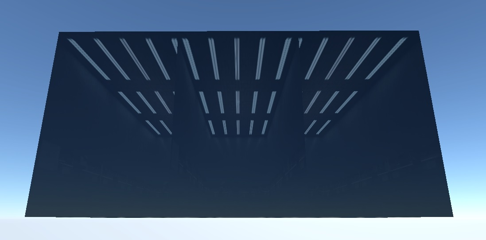

   <br>

3. Set the third component to `1` to achieve random cubemap rotation per room:

   

   <br>

##### Room Size

`script:t="room_size=2, 1, 0, 0"` – Sets the proportions of the window (and thus
the room behind it, as the room usually matches the window's width and height).
The first two components control width and height, respectively. These values
can be in any arbitrary units since they represent proportions, but it's simpler
to use unit values.

Let's examine how it works using the example above:

1. `script:t="room_size=1, 1, 0, 0"` – For testing, the window's width and
   height are set to be equal. This results in rooms curving towards the center:

   

   <br>

2. The model's width is twice its height, so set the corresponding value to
   `script:t="room_size=2, 1, 0, 0"`:

   

   <br>

Everything is now proportionally correct.

```{important}
This also presents a challenge – you cannot apply the same material to windows
with different proportions. The example uses a parallelepiped, and the side part
with the current material looks incorrect:


<br>

```

##### Spacing Between Windows

`script:t="tile_space=1,1,0,0"` – This parameter allows for varying the spacing
between windows, which is useful for buildings with asymmetrical window spacing.
The first two components control X and Y spacing, respectively (though all
components must be specified).

1. By default, the values are set to `script:t="tile_space=1,1,0,0"`:

   

   <br>

2. Increasing these parameters will decrease the size of the windows within the
   same area (the windows shrink relative to their centers):

   `script:t="tile_space=2,2,0,0"`

   

   <br>

3. `script:t="tile_space=5,2,0,0"`

   

   <br>

4. `script:t="tile_space=5,2,0.5,0"`

   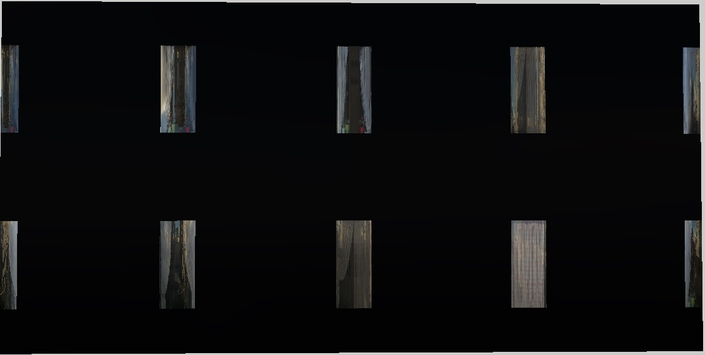

   <br>

5. `script:t="tile_space=5,2,0.5,0.5"`

   

   <br>

Working with this parameter involves:

1. Counting the number of window openings.
2. Setting the appropriate window tiling using `script:t="tile=1, 1, 1, 0"`.
3. Adjusting the spacing between windows with this parameter.

##### Color of Spaces Between Windows

`script:t="tile_space_color=0.58,0.216,0.62,0.1"` – Sets the color of the spaces
between windows using the first three components. The fourth component controls
the reflection strength for these spaces.

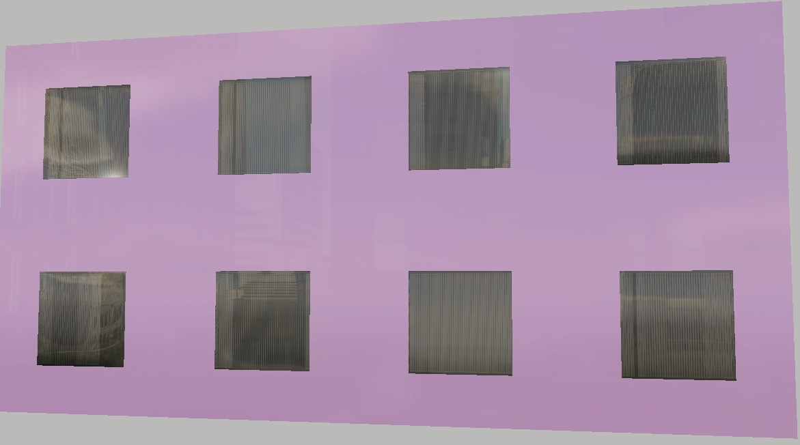

<br>

#### Window Illumination Parameters

Parameters for controlling the illumination of the interior cubemap. The ability
to make windows glow is implemented with two parameters:

- `script:t="room_selfillum=0.4"` – Controls self-illumination. The value can
  range from 0 to any desired amount.

- `script:t="illum_random=3"` – Controls the randomness of illumination. The
  value represents the number of illumination states – the higher the number,
  the greater the variety.

Illumination fades more slowly than the interior cubemap itself. This occurs
according to the function `(1 - 0.8*distFade)`, where `distFade` is calculated
as `(distance to glass)/(interior cubemap fade distance)`, but never exceeds
`1`. Therefore, the minimum illumination is `1-0.8=0.2`, not `0`, because it's
technically impossible to smoothly fade illumination to `0` – it always cuts
off. As a result, a minimal level of light remains.

- `script:t="illum_only_at_night=1"` – Enables illumination only at night.

  ```{important}
  This parameter should be specified for everything that should light up, except
  for rare cases when light is needed during the day.
  ```

#### Glass Distortion Parameters

##### Glass Distortion

You can set the glass distortion (convexity/concavity) and rotation (on
horizontal and vertical planes) to create varied reflections and sun glints on
the glass.

`script:t="convexity_slope=-0.07,0.07,2,2"` where:

- The first two components define the maximum concavity (away from the viewer)
  and convexity (toward the viewer) of the glass. A random value within the
  specified range is added to the glass normal. Usually, these values are less
  than `1` (ranging from hundredths to tenths) and should be tested on specific
  windows. Larger panoramic windows require smaller values, while smaller, less
  common windows can handle larger values. Essentially, this sets the
  "sharpness" of the distortion – the larger the values, the more pronounced the
  center of the distortion. The position of the distortion center is randomized
  across the glass surface.

- The third and fourth components control the glass rotation on the horizontal
  and vertical planes, respectively. This rotation is also added to the glass
  normal and is specified in degrees. These values represent the absolute
  maximum/minimum (e.g., with a value of 2, the range is `|2|`, meaning between
  -2 and +2). As with distortion, a random value is chosen within this range.
  For instance, setting a 10-degree rotation will randomize between -10 and +10.

Let's look at some examples. In the images below: left – the normal map, right –
the result.

1. All distortion parameters set to zero:

   

   <br>

2. `script:t="convexity_slope=-0.03,-0.03,0,0"`

   The normal map shows little change due to the small values, but the
   reflection demonstrates significant distortion.

   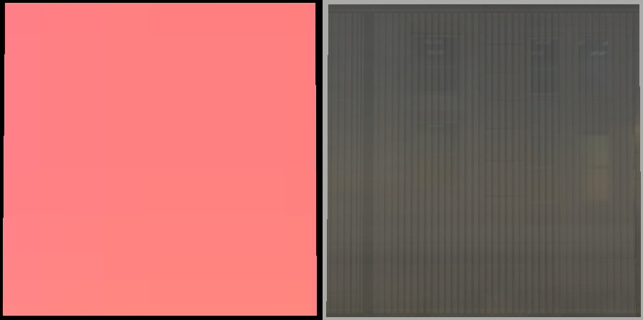

   <br>

3. `script:t="convexity_slope=0,0,10,0"`

   Horizontal rotation is slightly noticeable on the normal map.

   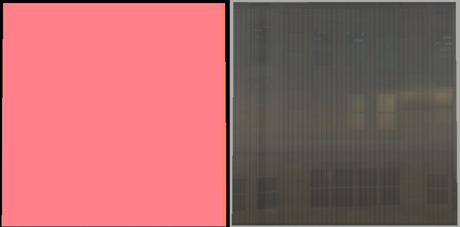

   <br>

4. `script:t="convexity_slope=0,0,0,10"`

   Vertical rotation is also noticeable on the normal map.

   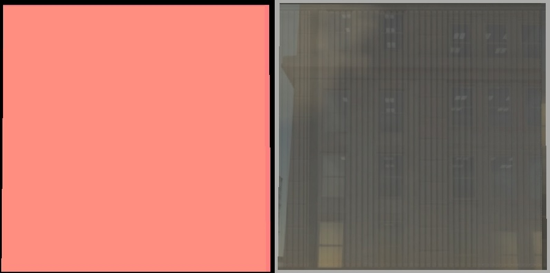

   <br>

5. `script:t="convexity_slope=-100,100,0,0"`

   Extremely exaggerated values are used to illustrate the nature of distortion.
   (Also note that the distortion center is not centered on the window – there's
   a procedural shift on each window tile.)

   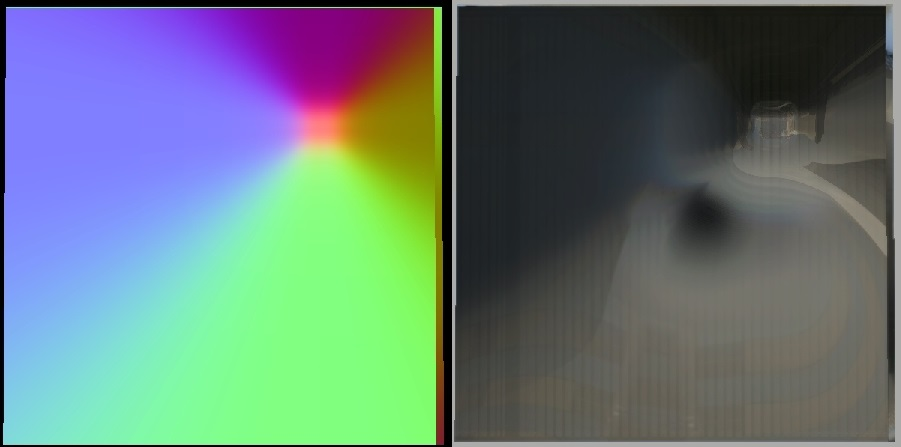

   <br>

6. `script:t="convexity_slope=-0.03,0.3,10,10"`

   Example on "distributed" windows with distortion:

   

   <br>

   Example on "distributed" windows without distortion:

   

   <br>

7. `script:t="convexity_slope=-100.03,100.3,100,100"`

   Example on "distributed" windows with exaggerated values – demonstrating the
   randomness of shifts and selection of values.

   

   <br>

   

   <br>

Different reflections on the windows of a building thanks to this technique.
Visible tiling seams on the cubemap – normal map seams visible across windows.

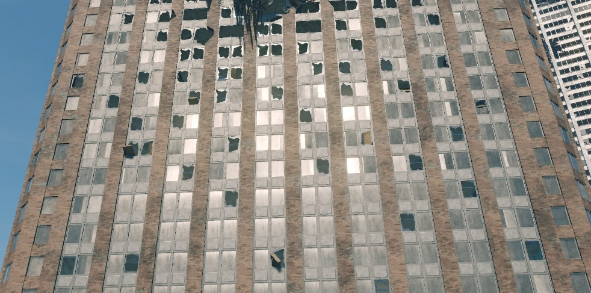

<br>

### Distortion Tiling

In practice, basic window tiling is often insufficient. The interior may consist
of a single "room", but the window frame might have multiple panes of glass,
each needing to reflect light differently.

<table style="text-align:center; width:98%"><thead><tr>
  <th style="text-align:center; width:49%"><p>The current area of a single reflection</p></th>
  <th style="text-align:center; width:49%"><p>The desired area of a single reflection</p></th></tr></thead>
</table>


To achieve this, use the parameter `script:t="contortion_tiling=1,2,1,1"`,
where:

- The first component controls horizontal tiling of distortions.
- The second component controls vertical tiling of distortions.
- The third component sets the width (as a fraction of the window) of the
  leftmost distortion tile.

  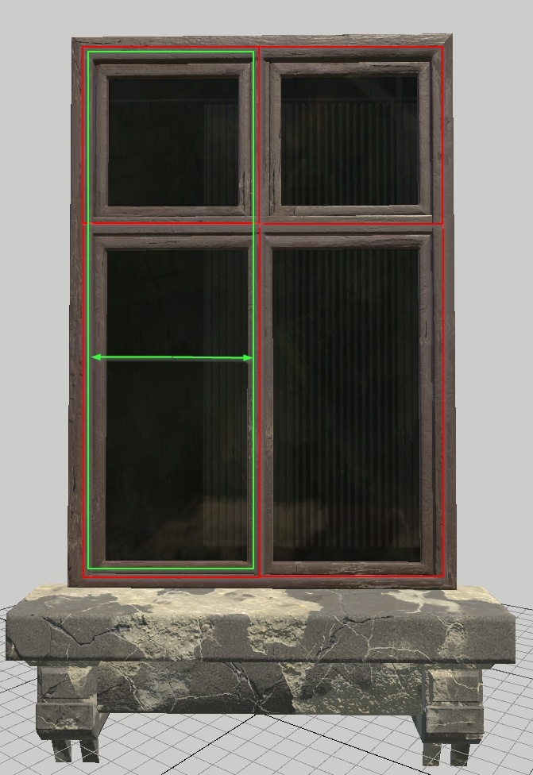

  <br>

- The fourth component sets the height (as a fraction of the window) of the
  leftmost lower distortion tile.

  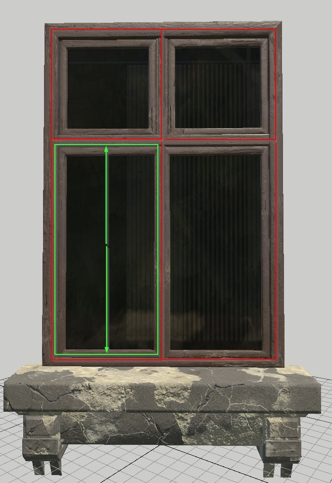

  <br>

For the given window example:

- Horizontal tiling is set to `2` (indicating 2 panes of glass).
- Vertical tiling is also set to `2` (indicating 2 panes of glass).
- The width of the leftmost tile is set to `0.5` (half the window width).
- The height of the bottom tile is set to `0.65` (approximately two-thirds of
  the window's total height).

Thus, `script:t="contortion_tiling=2,2,0.5,0.65"`. This configuration ensures
that each pane of glass has its unique distortion (in *Asset Viewer* it's not so
apparent, but in the game the difference is huge due to the reflections on the
windows).


<br>

```{important}
- The third component specifies the width of **only** the leftmost tile. All
  other tiles will maintain a uniform proportional width.

  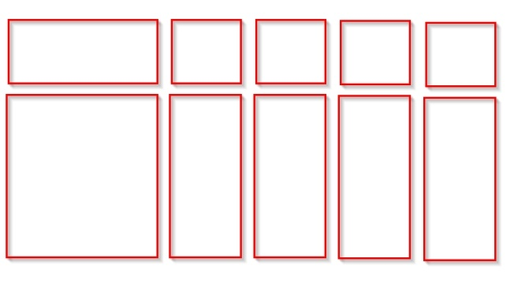

  <br>

- The fourth component specifies the height for all bottom tiles, meaning it
  affects the entire window.

  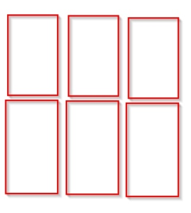

  <br>

- As a result, creating a window with a single vent procedurally isn't
  feasible – additional parameters would be required for every possible
  configuration.
```

## Non-Standard Solutions

### Simulating Large Spaces

According to asset requirements, the window should be mapped strictly within a
square texture. However, this mapping results in the room behind the glass being
perfectly aligned with the window's edges. If we want to increase the space
behind the glass, we need to reduce the mapping.

By reducing the mapping, the space behind the glass appears larger. The ceiling,
walls, and floor are pushed farther back, giving the impression of a room much
larger than the window.

<table style="text-align:center; width:98%"><tr>
  <th style="text-align:center; width:49%"><p>Standard mapping</p></th>
  <th style="text-align:center; width:49%"><p>Reduced mapping</p></th></tr>
</table>

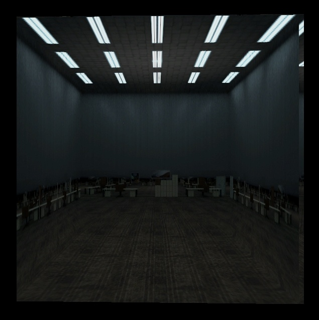


We need to show that a single room lies behind three separate windows. With
default mapping, you end up with three windows, each showing its own room. By
splitting the mapping, you achieve a single large room visible through all three
windows.

<table style="text-align:center; width:98%"><tr>
  <th style="text-align:center; width:49%"><p>Standard mapping</p></th>
  <th style="text-align:center; width:49%"><p>Split mapping</p></th></tr>
</table>


In the previous example, the room became an enormous hangar because we
proportionally reduced the window mapping.

To avoid this, do the following:
1. Scale the mapping non-proportionally.
2. Compensate for the non-proportional mapping with the `room_size=2, 1, 0, 0`
   parameter.

<table style="text-align:center; width:98%"><tr>
  <th style="text-align:center; width:49%"><p>Split mapping</p></th>
  <th style="text-align:center; width:49%"><p>Compensated mapping</p></th></tr>
</table>


```{note}
By default, we use this parameter to emphasize the geometry's proportions – if
the width is twice the height, we set `room_size=2, 1`. However, in our example,
the geometry is square, meaning the parameter should be `room_size=1,1`. But we
reduced the width of the mapping to roughly half the height, so we compensate by
setting the width to `2` and the height to `1`. In this case, the smaller
mapping side corresponds to the larger parameter value.
```

### Random Rotation in Individual Windows

We have a parameter for adding randomness to tiled cubemaps: `script:t="tile=1,
1, 1, 0"`. This works when you have a large window area and procedurally tile
several rooms within it. However, there are often cases where each window is a
separate piece of geometry. Two primary scenarios arise:

- Each window is a separate piece of geometry within a single `.dag`.
- Each window is a separate `.dag`, placed on a building by a composite.

Let's consider both cases.

#### Window as Separate Geometry within a .dag

By default, exporting a `.dag` with windows and randomness enabled will not show
any difference – all windows will be mapped identically. However, when the
object moves across the map, the mapping will shift, but uniformly.

<table style="text-align:center; width:98%"><tr>
  <th style="text-align:center; width:29%"><p>One object</p></th>
  <th style="text-align:center; width:69%"><p>A composite of three objects</p></th></tr>
</table>


The randomness works, but it's flawed – everything remains too similar. To fix
this, you'll need to manually adjust the mapping for each window. The fewer
identical mapping positions, the more randomness you'll achieve.

Adjust the mapping both vertically and horizontally. This can be done
procedurally with plugins; the key is to keep the mapping within the bounds of
texture "cells".

```{note}
It's better to shift neighboring windows vertically rather than horizontally.
This improves the randomness effect.
```

<table style="text-align:center; width:98%"><tr>
  <th style="text-align:center; width:28%"><p>One object</p></th>
  <th style="text-align:center; width:70%"><p>A composite of three objects</p></th></tr>
</table>


The difference might not be obvious here (the cubemap is too uniform), but
everything is randomly rotated on each section. Let's replace the cubemap for
better visibility.

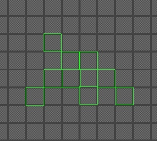


#### Window as a Separate .dag, Placed by a Composite

Although a different scenario, the solution remains the same.

In the previous case, enabled randomness on standard mapping worked in a grouped
manner – all windows changed mapping simultaneously when the object moved (since
the windows were part of one large `.dag`). In this case, the same thing
happens, but with individual windows. The windows are more frequently placed and
mapped. (Let's set a cubemap with curtains in advance to better see the
difference.)

<table style="text-align:center; width:98%"><tr>
  <th style="text-align:center; width:36%"><p>One object</p></th>
  <th style="text-align:center; width:62%"><p>A composite of three objects</p></th></tr>
</table>


Notice that the windows have identical randomness with identical shifts relative
to zero (center window at the bottom). (Exception: the middle left window –
because of some "magic").

To avoid this situation, you can:

- Either set the randomness value to a different **odd** number (it doesn't work
  well with even numbers). For example, set it to `3` (`script:t="tile=1, 1, 3,
  0"`):

  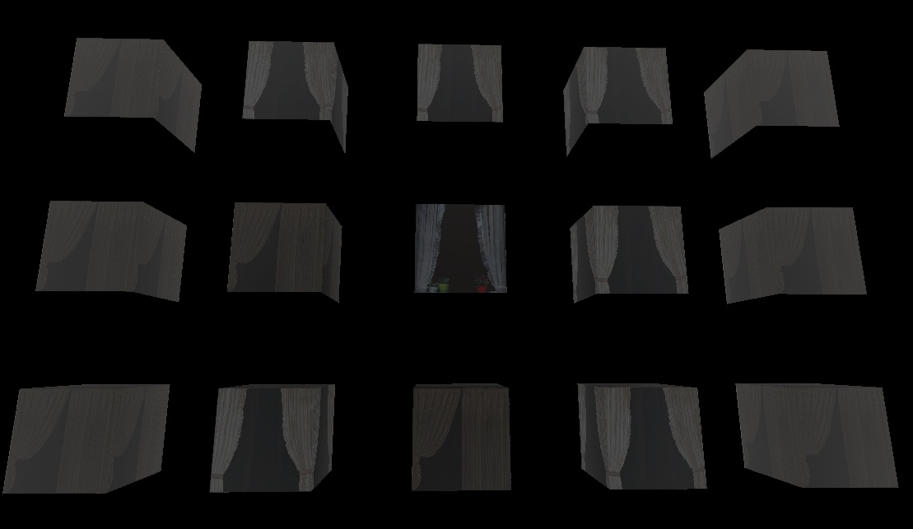

  <br>

- Or shift the window mapping (which I find works better).

  


