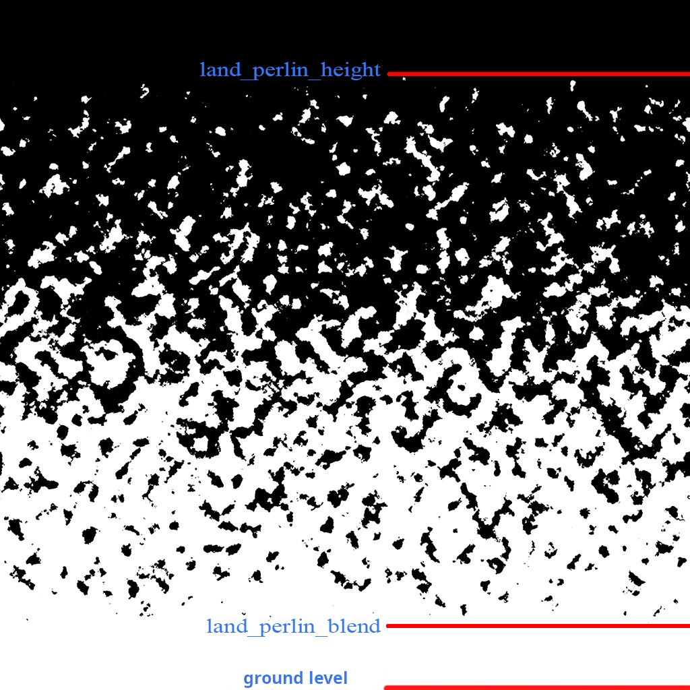
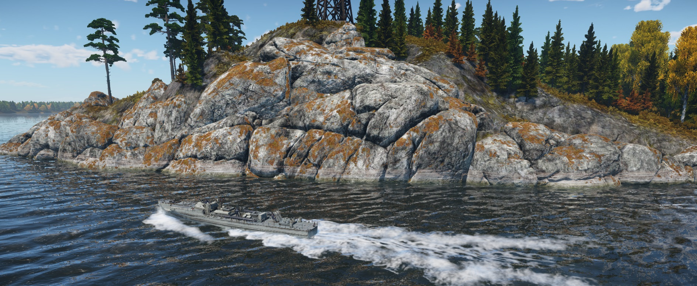

# Shader Family: rendinst_layered

## Overview

As of writing, the `rendinst_layered` family includes four shaders:

- [`rendinst_layered`](#rendinst_layered): The foundational shader of the
  family.
- [`dynamic_layered`](#dynamic_layered): A dynamic version designed for destrs.
- [`rendinst_layered_atest`](#rendinst_layered_atest): A version that
  supports alpha test for detail textures.
- [`rendinst_layered_hmap_blend`](#rendinst_layered_hmap_blend): A version
  that includes heightmap blending functionality.

Let's examine the parameters for each shader.

## rendinst_layered

```{seealso}
For more information, see [rendinst_layered](rendinst_layered.md) shader.
```

## dynamic_layered

This shader functions similarly to `rendinst_layered`, but it is optimized for
dynamic objects (destrs).

## rendinst_layered_atest

This version supports alpha test for one or both detail textures.

### Parameters

- `blended_atest`: 0/1 (disabled/enabled)
- `detail1_atest_weight`: Alpha test level for the first detail texture
  (default: 127)
- `detail2_atest_weight`: Alpha test level for the second detail texture
  (default: 127)

## rendinst_layered_lightmap

This is the standard `rendinst_layered` shader with added support for emissive
maps.

```{seealso}
For more information, see
[rendinst_layered_lightmap](rendinst_layered_lightmap.md) shader.
```

## rendinst_layered_hmap_blend

This version introduces a heightmap blend feature that allows seamless
transitions between the model and the terrain. It also supports projecting a
clipmap using top-down projection onto the model. The clipmap is blended into
the material in two layers: the first blends from the ground up to a specified
height, and the second applies a Perlin noise mask on horizontal surfaces with
positive normals, also modifiable by distance from the ground.

This shader is ideal for objects like rocks, cliffs, and debris piles that need
to blend into the terrain or hide seams with the ground.

Below are screenshots illustrating the effect:

<table style="text-align:center; width:98%"><tr>
  <th style="text-align:center; width:49%"><p>Without heightmap blend</p></th>
  <th style="text-align:center; width:49%"><p>With heightmap blend</p></th></tr>
</table>


<table style="text-align:center; width:98%"><tr>
  <th style="text-align:center; width:49%"><p>Without clipmap projection</p></th>
  <th style="text-align:center; width:49%"><p>With clipmap projection</p></th></tr>
</table>


### Parameters

```{note}
The `hmp_blend_height` parameter is deprecated! If you encounter it, please
remove it.
```

- `land_blend_dist`: Specifies the height (in meters) for the first layer of
  clipmap blending, from the ground up. Default is 0.3 meters if not specified.
- `land_perlin_height`: Specifies the maximum height (in meters) for the
  second layer of clipmap projection, which uses Perlin noise and applies to
  horizontal surfaces with positive normals.
- `land_perlin_scale`: Controls the scale of the Perlin noise. A lower value
  results in coarser noise. Start with a value of 0.2 for tuning.
- `land_perlin_blend`: Defines the range (in meters) over which the Perlin
  noise fades from 1 to 0, starting from the `land_blend_perlin_height`
  parameter. For example, if `land_blend_perlin_height` is set to 20 meters and
  you want the Perlin noise to begin fading 1 meter above the ground, set
  `land_blend_perlin_blend` to 19.
- `land_blend_normal_start`: The normal value at which the clipmap
  projection begins. Default is 1. A value greater than 1 reduces the opacity on
  perfectly horizontal surfaces.
- `land_blend_normal_end`: The normal value at which the clipmap projection
  ends. Default is 0.5.

Below is an illustration showing how the Perlin noise strength gradient operates
from `land_blend_perlin_height` (upper bound) to `land_blend_perlin_blend`
(lower bound):



<br>

### Salt Sediments

The `rendinst_layered_hmap_blend` shader is often used on rocks and cliffs. It
includes a feature called Salt Sediments, which simulates effects like waterline
marks, rust, or algae growth. This effect is illustrated below:



<br>

In the example above, the following texture was used:


<br>

This texture has an alpha channel that controls transparency. It replaces the
combined albedo of the first detail texture and overlay.

```{note}
It only affects the first detail texture.
```

In the example, the effect is visible on the stone, but the orange moss (the
second detail texture) remains unchanged.

The texture is subtracted using the AlbedoAO of the overlay and stretches
infinitely downward below the water level. If this effect is unwanted, make the
bottom two lines of pixels in the texture fully transparent.


<br>

**Parameters:**

In `level.blk`, set the following:

- `saltSedimentsStart:r=-0.25`: Starting height for the sediment effect.
- `saltSedimentsEnd:r=4`: Ending height for the sediment effect.
- `saltSedimentsTile:r=15`: Horizontal tiling scale for the texture, in
  meters.
- `saltSedimentsTex:t="waterline_grdnt_a_tex_d"`: Name of the projected
  texture.

The shader also supports an optional command:

- `script:t="salt_sediments_opacity=1"`: Controls the multiplier for the
  texture's alpha channel. You can use other values, but it's generally
  unnecessary.


