# Shader: rendinst_perlin_layered

## Overview

This shader is a complex tool for creating layered textures on terrain and
assets. It supports blending multiple detail layers with normal maps,
controlling detail tiling, and generating shadows from heightmaps. The shader
includes features like height-based painting, which applies color based on
object elevation using a predefined palette, and integrates Perlin noise to
enhance texture blending. Parameters allow fine-tuning of shadow intensity,
texture scale, and noise behavior, making it useful for adding depth and
variation to surfaces in large-scale environments.

## Parameters

### General Parameters

- `script:t="blend_normals=0,0,0,0"` - Normal blending. The first three
  components specify the normals involved in the blend, while the fourth
  component determines the normal through which the others will blend.
- `script:t="invert_heights=0,0,0,0"` - The first three components control the
  inversion of heightmaps (values can be fractional). The fourth component
  adjusts the height gradient of Detail3.
- `script:t="mask_gamma=0.1,0.1,0.1,0.5"` - The first three components control
  the gamma of the details (the power of their heightmaps). The fourth component
  is a multiplier for noise tiling.
- `script:t="paint_details=0,0,0,0"` - Detail painting. The first three
  components control the intensity of detail painting. The fourth component
  specifies the paint string.
- `script:t="micro_detail_layer=0"` - Index of the micro detail.
- `script:t="micro_detail_layer_v_scale=1"` - Vertical scale of the micro detail
  (for rectangular textures).
- `script:t="micro_detail_layer_uv_scale=1"` - Tiling of the micro detail.

### daNetGame-based Parameters

- `script:t="mask_by_normal=0,1,0,0.5"` - Specifies which normals allow Detail2
  to show through other details. The first three components are normals (which
  can be fractional values), and the fourth component decides whether to use
  normals or Perlin noise.
- `script:t="perlin_noise_offset=1,2,3,1"` - Noise freezing on the model. The
  first three components define the noise offset along the x, y, z axes, while
  the fourth component toggles the noise freezing on or off.
- `script:t="paint_points_black=0,0,0,0"` - Painting points. The first three
  components set black points for three details. The fourth component is unused
  but required.
- `script:t="paint_points_white=1,1,1,0"` - Painting points. The first three
  components set white points for three details. The fourth component is unused
  but required.
- `script:t="palette_index=0"` - Paint palette selection. `0` for global, `1`
  for per-map.
- `script:t="detail0_const_color=0,0,0,1"` - Paint color for Detail1 (using
  modulate2x).
- `script:t="detail1_const_color=0,0,0,1"` - Paint color for Detail2 (using
  modulate2x).
- `script:t="detail2_const_color=0,0,0,1"` - Paint color for Detail3 (using
  modulate2x).
- `script:t="enable_hmap_blend=1"` - Enable/disable blending with the heightmap
  (default is 0).
- `script:t="hmap_blend_height=0.1"` - Height of the blend strip (default is
  0.1).

### War Thunder Parameters

- `script:t="details_tile=1,1,1,0"` - Tiling of the details. The first three
  components are multipliers for the tiling of Details1-3. The fourth component
  is unused but required.

## General Operation and Principles

The shader operates with three details (layered), blending them based on:

1. Perlin noise (`perlin_layered`),
2. Height from the ground,
3. Their heightmaps.

   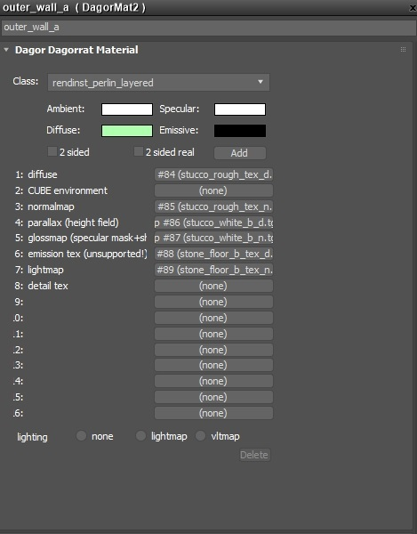

   <br>

Details are assigned to the following slots:

- **Detail 1 (gray stucco)**: Albedo texture (heightmap in alpha) - empty.
- **Detail 1 (gray stucco)**: Normal texture (metalness in blue, smoothness in
  alpha).
- **Detail 2 (white stucco)**: Albedo texture (heightmap in alpha).
- **Detail 2 (white stucco)**: Normal texture (metalness in blue, smoothness in
  alpha).
- **Detail 3 (stone)**: Albedo texture (heightmap in alpha).
- **Detail 3 (stone)**: Normal texture (metalness in blue, smoothness in alpha).

```{note}
- You can use two details instead of three. Detail1 is mandatory and constant.
  You can omit either Detail2 or Detail3, but not both.
- If only Detail1 is used, there's no point in blending – consider using a
  simple shader instead.
```

### Blending Details

#### First Level – Blending by Height Gradient

This is a special case where Detail3 is blended based on its height gradient
from the ground. If not configured properly, Detail3 may not be visible on most
of the object, dominating only at the bottom.

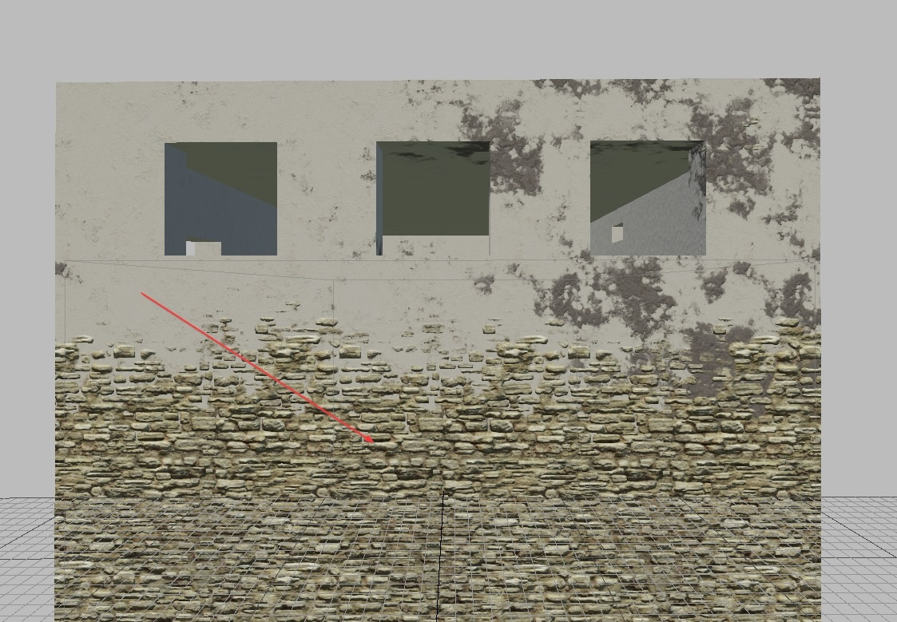

<br>

Essentially, this complex "height gradient" represents a natural gradient
applied to the heightmap of Detail3.

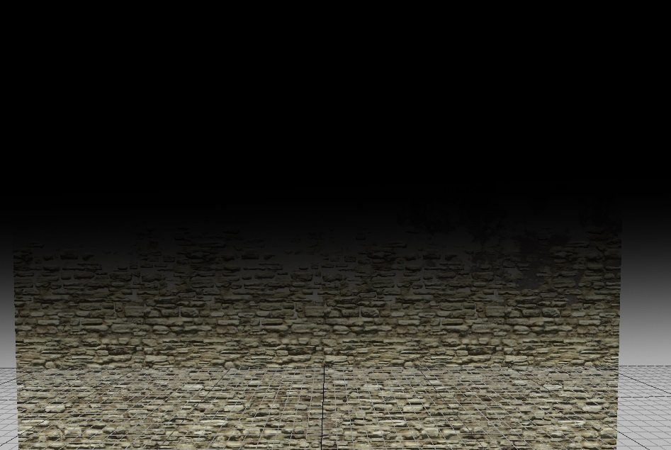

<br>

#### Second Level – Blending by Heightmaps

Each detail has its own heightmap. Let's examine them:

<table style="text-align:center; width:96%"><tr>
  <th style="text-align:center; width:32%"><p>Detail1</p></th>
  <th style="text-align:center; width:32%"><p>Detail2</p></th>
  <th style="text-align:center; width:32%"><p>Detail3</p></th></tr>
</table>

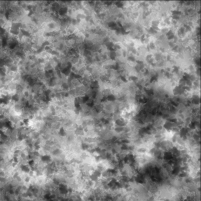


When blending three details over each other, they are strictly blended according
to these heightmaps.

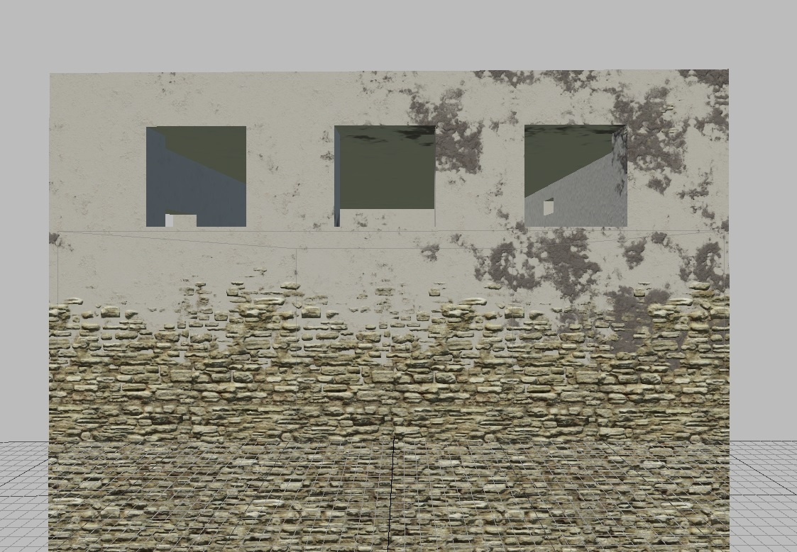

<br>

As shown in the screenshot, the heightmap of the white stucco (Detail2) is
significantly "higher" than that of the gray stucco (Detail1). Meanwhile,
Detail3 appears at the bottom based on the height gradient.

#### Third Level – Blending by Perlin Noise

As seen in the screenshots above, the gray stucco (with a weaker heightmap)
appears in a specific corner. It's absent in other areas because the Perlin
noise at that location lightened the heightmap of Detail2, making it higher than
Detail1.

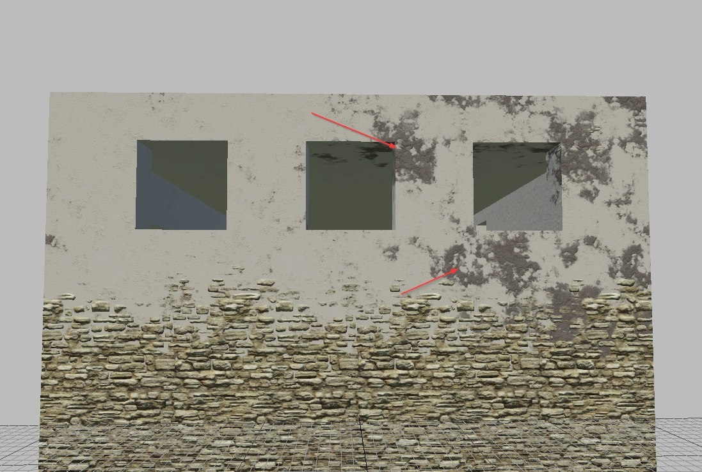

<br>

### Blending Control

Blending is controlled using the following parameters:

#### Parameter: `invert_heights=0,0,0,1`

##### First Three Components

These invert the heightmaps of the respective details (values can be fractional,
representing the linear interpolation factor between the inverted and original
heightmaps).
- `0` - original,
- `1` - inverted.

**Result of Inverted Heightmaps:**

<table style="text-align:center; width:96%"><tr>
  <th style="text-align:center; width:32%"><p>Detail1</p></th>
  <th style="text-align:center; width:32%"><p>Detail2</p></th>
  <th style="text-align:center; width:32%"><p>Detail3</p></th></tr>
</table>


**Visual Appearance of Inverted Heightmap:**

<table style="text-align:center; width:96%"><tr>
  <th style="text-align:center; width:32%"><p>Detail1</p></th>
  <th style="text-align:center; width:32%"><p>Detail2</p></th>
  <th style="text-align:center; width:32%"><p>Detail3</p></th></tr>
</table>

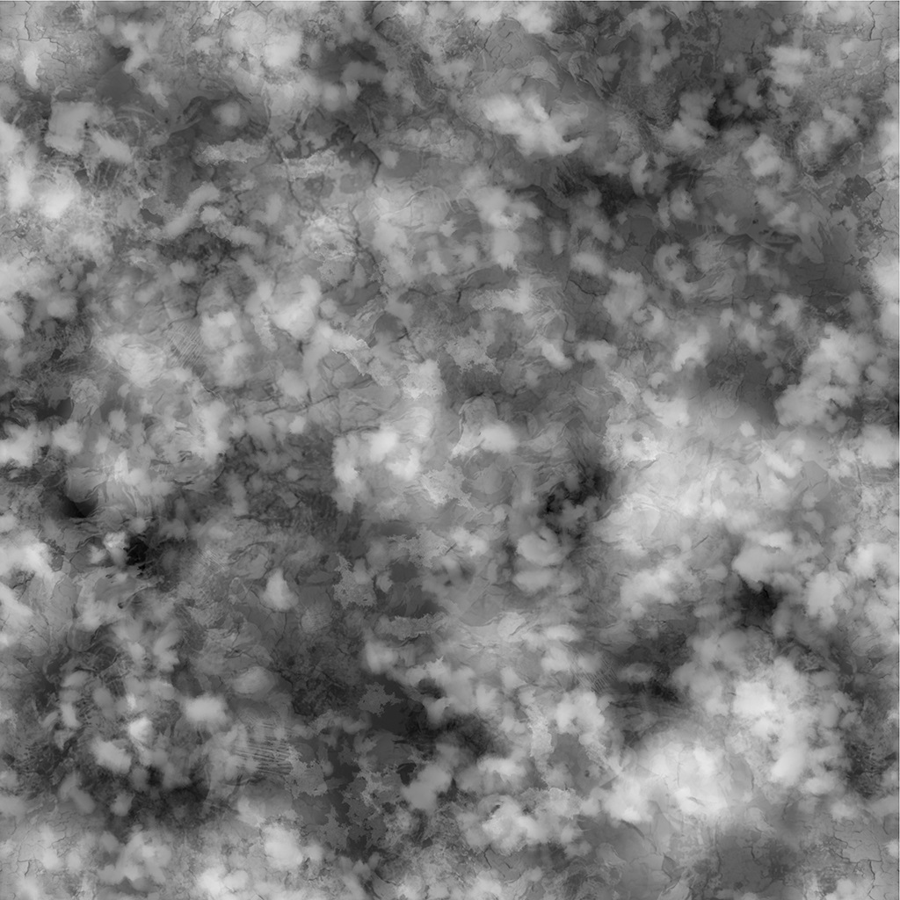

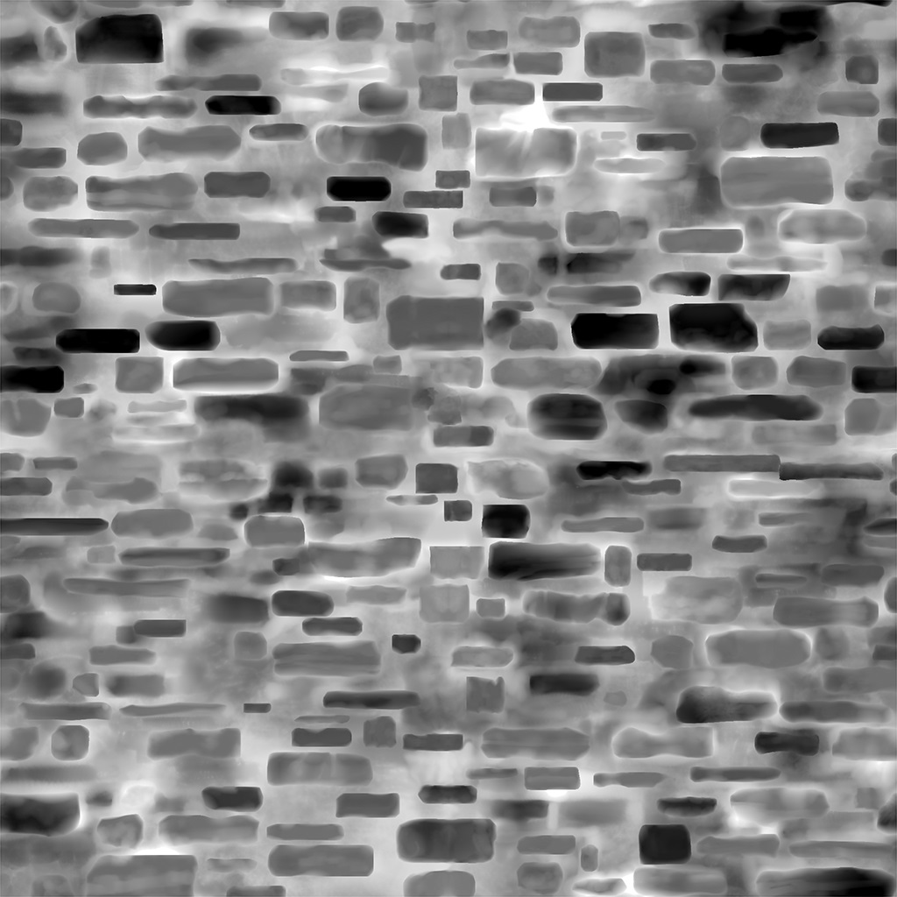

**Explanation:**

<table style="text-align:center; width:96%"><tr>
  <th style="text-align:center; width:32%"><p>Detail1</p></th>
  <th style="text-align:center; width:32%"><p>Detail2</p></th>
  <th style="text-align:center; width:32%"><p>Detail3</p></th></tr>
</table>

<table style="text-align:center; width:96%"><tr>
  <td style="text-align:center; vertical-align:top; width:32%"><p>Inverting the "gray" heightmap has little effect, as it stays "gray" even after inversion.</p></td>
  <td style="text-align:center; vertical-align:top; width:32%"><p>Inverting the "white" heightmap makes Detail1 visible, as its "gray heightmap" becomes higher than the "black" (after inversion) heightmap of Detail2.</p></td>
  <td style="text-align:center; vertical-align:top; width:32%"><p>It may seem unchanged, but note how the brick protrudes through the stucco. It no longer sticks out, as if it was pushed out from underneath. Now, the stucco lies on top of the brick plane, crumbling between layers (which looks much more realistic).</p></td></tr>
</table>

##### Fourth Component

This controls the height gradient for Detail3.
- `0` - original height gradient,
- `1` - no gradient.

Let's see how this works:

<table style="text-align:center; width:96%"><tr>
  <th style="text-align:center; width:34%"><p>value = 0</p></th>
  <th style="text-align:center; width:31%"><p>value = 0.5</p></th>
  <th style="text-align:center; width:31%"><p>value = 1</p></th></tr>
</table>


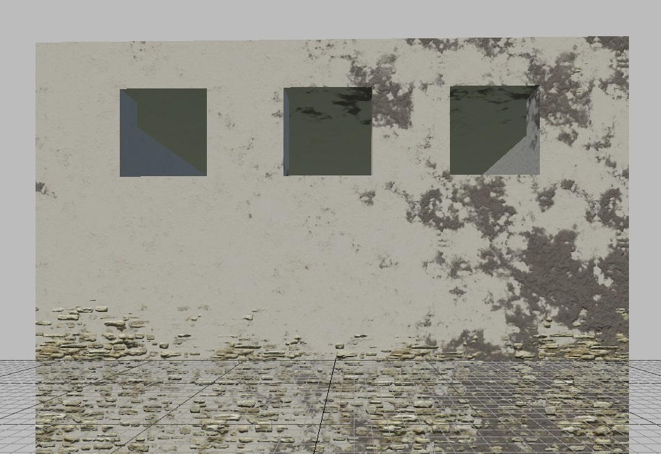


As shown, the higher the value, the less visible Detail3 becomes. This is
because the parameter represents gamma (or the power) of the height gradient.

```{note}
**What does this mean?**

It means the height gradient ranges from almost `0` (black) to nearly `1`
(white). Essentially, from around `0.01` to `0.99` (conditional, as the exact
implementation in code is unknown).

If we set a gamma of `0` for the nearly black part of the gradient (`0.01`), it
becomes `1` (white). Therefore, a value of `0` represents the maximum height of
Detail3.

As the gamma increases, the height decreases. For example, `0.01^0.5 = 0.1`. And
`0.01^1 = 0.01` - the gradient is completely black.
```

#### Parameter: `mask_gamma=1,1,1,1`

##### First Three Components

These set the gamma for a specific heightmap (as explained above). They
effectively darken the heightmaps of the specified details.
- `0` - untouched heightmap,
- `1` - completely darkened heightmap.

```{note}
The formula requires a value slightly above zero, typically around `0.1`.
```

Let's see how this works:

- **Heightmap 1**

<table style="text-align:center; width:96%"><tr>
  <th style="text-align:center; width:32%"><p>value = 0.1</p></th>
  <th style="text-align:center; width:32%"><p>value = 0.5</p></th>
  <th style="text-align:center; width:32%"><p>value = 1</p></th></tr>
</table>


- **Heightmap 2**

<table style="text-align:center; width:96%"><tr>
  <th style="text-align:center; width:32%"><p>value = 0.1</p></th>
  <th style="text-align:center; width:32%"><p>value = 0.5</p></th>
  <th style="text-align:center; width:32%"><p>value = 1</p></th></tr>
</table>


- **Heightmap 3**

<table style="text-align:center; width:96%"><tr>
  <th style="text-align:center; width:32%"><p>value = 0.1</p></th>
  <th style="text-align:center; width:32%"><p>value = 0.5</p></th>
  <th style="text-align:center; width:32%"><p>value = 1</p></th></tr>
</table>


##### Fourth Component

This sets the scale (or more precisely, the tiling) of the world noise. Let's
examine a longer object to see the difference. A value of `0` is not used, as
noise would be absent, and blending would occur solely based on heightmaps.

- **value = 0.1**

  

  <br>

- **value = 0.5**

  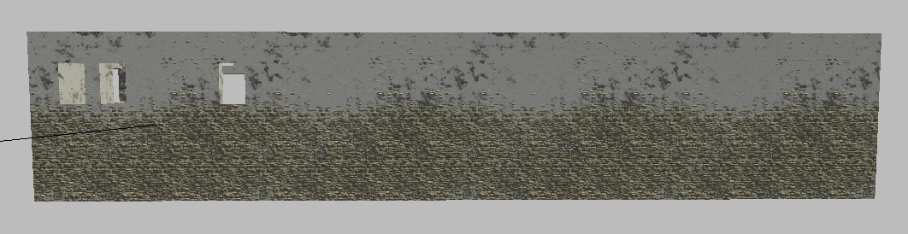

  <br>

- **value = 1**

  

  <br>

### Normal Map Blending

Often, there’s a need to reveal the relief or texture of one detail through
another. For example, you might want to show wood through peeling paint, or moss
growing over tiles. In some cases, you might want to depict painted rusty metal,
or simply add variation to the detail by using different textures.

Instead of generating a bunch of separate textures for each scenario, the shader
provides a parameter for blending the normals of details. Essentially, this
parameter allows the "lower" or "farther" (relative to the camera's position)
details' normals to show through the "upper" or "closer" ones.

#### Parameter: `blend_normals=1,1,1,1`

This parameter controls how the normal maps of different details blend with each
other.

- The **first three components** specify which details' normals participate in
  the blending process.
- The **fourth component** determines the "main" detail through which the other
  normals will show. This is important because the blending effect will only be
  visible through this selected detail (keep in mind that the details are
  numbered starting from 0).

```{important}
You must be cautious with the fourth component. If you set it to the "lower"
detail that is not visible due to blending, you won’t see any blending effect –
because the detail through which the other normals should be visible is itself
not visible.

In other words, for the blending effect to work correctly, the selected "main"
detail (fourth component) must be visible. This ensures that the normals of the
other details can properly blend through it.
```

<table style="text-align:center; width:96%"><tr>
  <th style="text-align:center; width:32%"><p>blend_normals=0,0,0,0</p></th>
  <th style="text-align:center; width:32%"><p>blend_normals=1,1,1,1</p></th>
  <th style="text-align:center; width:32%"><p>blend_normals=1,0,1,0</p></th></tr>
</table>

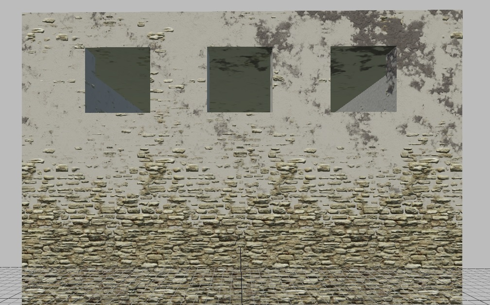

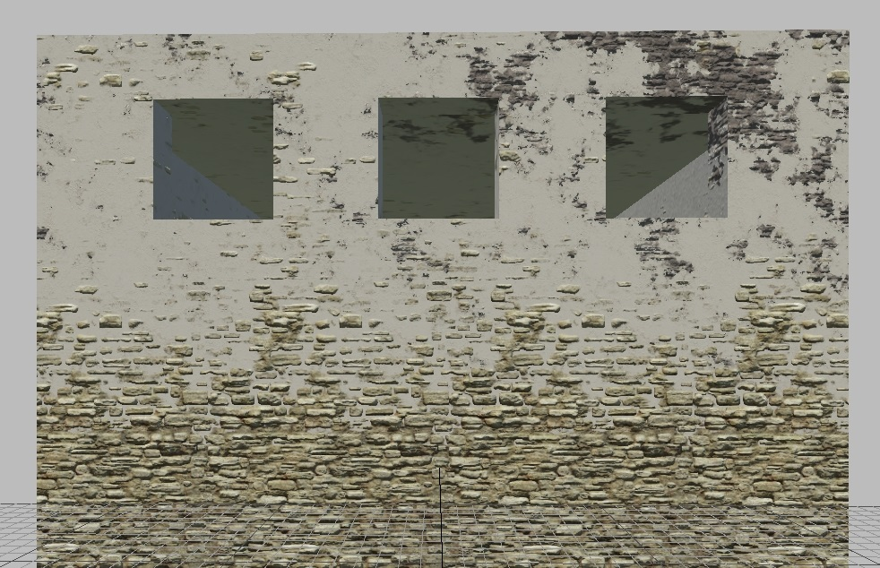

<table style="text-align:center; width:96%"><tr>
  <td style="text-align:center; vertical-align:top; width:32%"><p>All Values Set to 0: No normal map blending occurs.</p></td>
  <td style="text-align:center; vertical-align:top; width:32%"><p>All Values Set to 1: All normals (first three components) are blended, with the main normal (through which others blend) set to 1, representing white stucco.</p></td>
  <td style="text-align:center; vertical-align:top; width:32%"><p>Blending Through 0 (fourth component): This blends through the gray stucco (Detail3). The Detail2 (white stucco) does not participate in the blend.</p></td></tr>
</table>

### Procedural Object Painting

```{seealso}
For more information on procedural painting, see [Procedural Rendinst
Painting](../about-assets/procedural-rendinst-painting/procedural_rendinst_painting.md).
```

### Microdetails

The shader supports one microdetail across the entire stack of details. The
syntax is similar to `simple_aces`. For example:

- `micro_detail_layer=0` - Index of the microdetail.
- `micro_detail_layer_v_scale=1` - Vertical-to-horizontal ratio for the
  microdetail texture.
- `micro_detail_layer_uv_scale=16.371` - Scale (tiling) of the microdetail
  texture.

## daNetGame-Based Parameters

### Overlaying the Detail2 by Normals

This is controlled by the parameter:

`script:t="mask_by_normal=0,1,0,0.5"`

- The **first three components** set the reference normal that dictates where
- the second detail will appear (these are not normalized normals, so values
  greater than one will cause the detail to appear more strongly with sharper
  edges).
- The **last component** controls the interpolation (lerp) between the noise
  mask weight and the normal mask weight (0 means no normals are used, 1 means
  only normals are used).

### Freezing Perlin Noise

Controlled by the parameter:

- `script:t="perlin_noise_offset=1,2,3,1"`

- The **first three components** determine the Perlin noise offset in the x, y,
  and z directions.
- The **fourth component**: `0` keeps the default noise unaffected by the
  offset, while `1` freezes the noise, making it look consistent across both the
  editor and the game regardless of the asset's position, orientation, and
  scale.

This parameter is recommended only for extreme cases, where more artistic
control over noise on unique assets is required.

### Paint Points

These are analogous to black/white points in
[rendinst_simple_painted](./dng-shaders/rendinst_simple_painted.md) and
[rendinst_mask_layered](./dng-shaders/rendinst_mask_layered.md).

Controlled by the parameters:

- `script:t="paint_points_black=0,0,0,0"`

- The **first three components** set the black points for the three details, and
  the **fourth component** is mandatory but unused.

- `script:t="paint_points_white=1,1,1,0"`

- The **first three components** set the white points for the three details, and
  the **fourth component** is mandatory but unused.

```{important}
Black and white points **must always be different**, even if their details are
not being painted. If these parameters are added, ensure all black and white
points are different. By default, you can copy these parameters directly – black
points as all zeros, white points as all ones:

- `script:t="paint_points_black=0,0,0,0"`
- `script:t="paint_points_white=1,1,1,0"`

Otherwise, you will encounter a "divide by zero" error:

`rendinst_perlin_layered: divide by zero [real] while exec shader code. stopped at operand #45`
```

### Painting Details in Different Constant Colors

You can color each detail separately. However, this technology works with
shader-defined colors rather than a paint map – there is no randomness. Only the
color you specify will be applied.

```{important}
Painting works via `modulate2x`, so the resulting color may differ slightly from
what you set. This is a limitation of the technology.
```

Controlled by parameters like:

- `script:t="detail0_const_color=0,0,0,1"` - Paints the Detail1
- `script:t="detail1_const_color=0,0,0,1"` - Paints the Detail2
- `script:t="detail2_const_color=0,0,0,1"` - Paints the Detail3

```{important}
To activate these parameters, detail painting must be enabled, meaning the
parameter `script:t="paint_details=1,1,1,0"` should be set to `1` (or another
necessary value, just not `0`) for the required details. The fourth component
(the paint line) does not affect those details for which a fixed color is set.
```

Parameter values:

- The **first three components** represent the color in RGB, scaled to the 0-1
  range.

  

  <br>

- The **fourth component** controls the influence of the paint map on the
  specified color: `0` means full influence, `1` means no influence.

This type of painting can be combined with standard paint map-based
painting – some details can use the map, while others use the specified color.

Paint points still apply.

### Heightmap Blending

To better integrate objects with the terrain, you can use parameters that blend
the details of the terrain and the asset based on the mask of where the asset
intersects with the heightmap. This is useful for piles, rocks, cliffs, etc.

```{important}
This is a computationally expensive technique, so use it only when necessary.
```

Example of blending:

<table style="text-align:center; width:98%"><tr>
  <th style="text-align:center; width:49%"><p>Without Blending</p></th>
  <th style="text-align:center; width:49%"><p>With Blending</p></th></tr>
</table>


#### Initialization and Operation of the Blend

Parameters to initialize the blend in the shader:

- `script:t="enable_hmap_blend=1"` - (default - 0) - enable/disable blending
  with the heightmap.
- `script:t="hmap_blend_height=0.1"` - (default - 0.1) - height of the blend
  stripe.

#### Global Shadervars

Primary shader parameters, initialized in `gamedata/.../scene.blk` in the
`"shader_vars__vars:object"` block:

- `ri_hmap_blend_sharpness = 8.0` - (default - 8.0) - higher value means sharper
  blend edges.
- `ri_hmap_min_angle = 12.0` - (default - 12.0) - gradient perlin noise starts
  from this angle to the max angle.
- `ri_hmap_max_angle = 50.0` - (default - 50.0) - maximum angle.
- `ri_hmap_perlin_tex_scale = 0.25` - (default - 0.25) - perlin noise tiling
  multiplier.
- `ri_hmap_min_height = 0.5` - (default - 0.5) - minimum blend height, overrides
  shader parameter if necessary.

#### Static Shadervars

Additional shader parameters that adjust the influence of global shadervars for
a specific asset:

- `script:t="ri_hmap_blend_sharpness_mul = 1.0"` - multiplier for
  `ri_hmap_blend_sharpness`.
- `script:t="ri_hmap_min_angle_mul = 1.0"` - multiplier for `ri_hmap_min_angle`.
- `script:t="ri_hmap_max_angle_mul = 1.0"` - multiplier for `ri_hmap_max_angle`.
- `script:t="ri_hmap_perlin_tex_scale_mul = 1.0"` - multiplier for
  `ri_hmap_perlin_tex_scale`.
- `script:t="ri_hmap_min_height_mul = 1.0"` - multiplier for
  `ri_hmap_min_height`.

#### Global and Static Shadervars for `ri_hmap`

1. **Global Shadervars**: Affect all assets on a level with initialized blending.
2. **Default Values**: If global shadervars are not initialized in `scene.blk`,
   the default values listed above are used.
3. **Static Shadervars**: These are shader parameters that act as multipliers
   for the global shadervars initialized in `scene.blk`.

For example, if the global shadervar is:

`ri_hmap_blend_sharpness = 8.0`

and the asset `example.dag` has a static shadervar set to:

`script:t="ri_hmap_blend_sharpness_mul = 0.5"`

the final blend sharpness value for `example.dag` on the level will be
calculated as:

`blend_sharpness = ri_hmap_blend_sharpness * ri_hmap_blend_sharpness_mul = 8.0 * 0.5 = 4`.

```{important}
The heightmap blending shader works in the
[*daEditor*](../../dagor-tools/daeditor/daeditor/daeditor.md), but since the
global shadervars for the editor are initialized separately and not pulled from
`scene.blk`, be aware that if you select global shadervars values in `scene.blk`
that differ from the default values, the editor will display something different
from what you will see in the game. Instructions on how to set global shadervars
for the editor will be added to the article later.
```

```{tip}
Global shadervars can be changed in the game in real-time:

- If global shadervars are not initialized in `scene.blk`, they can only be
  changed through the web UI Shader_vars – show global shader vars;
- If initialized, they can be changed in the game itself using the mission
  settings UI, which is called up by pressing `F12`.
```

## War Thunder Parameters

### Detail Tiling

In *War Thunder*, the texel density of details isn't always consistent (although
all new details are created with correct texel density). To address this, the
parameter `details_tile=1,1,1,0` was introduced.

- Only the **first three components** are used, with each one controlling the
  tiling of its corresponding detail.
- The default value for each component is `1`.

### Height-Based Painting


<br>

- `script:t="use_painting=1"`: Controls painting from a palette defined in the
  scene's shader variables.
    - `1` enables painting, while `0` disables it.
    - Values between `0.01` and `0.9` reduce the painting intensity
      (multiplier). Painting is based on the alpha of the diffuse texture,
      multiplied by the `use_painting` value.
    - Values between `1.01` and `1.9` affect the painting intensity from `0.0`
      to `1.0` but disable the random pixel selection from the paint stripe when
      the object is displaced vertically. This is useful for ensuring that
      modular skyscrapers, for example, are painted the same color.

The palette used is called `paint_colors.dds` and can be found at
`.../develop/assets/textures/colorize_textures`.

```{seealso}
For more information on procedural painting, see [Procedural Rendinst
Painting](../about-assets/procedural-rendinst-painting/procedural_rendinst_painting.md).
```

### Material Shadows

These are shadows derived from the heightmap of the details. The available
parameters include:

- `script:t="material_shadow_influence=0.5, 1, 0.3, 0"`: Controls the "strength"
  of shadows for each detail.
    - Each component affects the corresponding detail (e.g., `0.5` for the first
      detail, `1` for the second, and `0.3` for the third).
    - The fourth component is not used in the `rendinst_perlin_layered` shader.

- `script:t="material_shadow_scale=2"`: Acts as a multiplier for the "size" of
  the shadow.
    - This scale is applied uniformly to the shadows of all details, as calculating it individually for each detail would be computationally expensive.

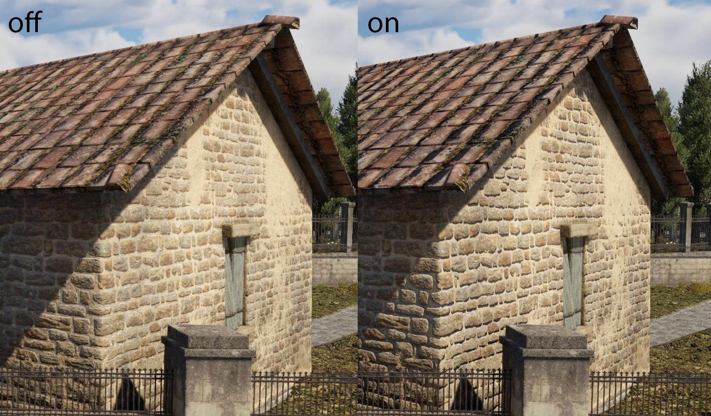


