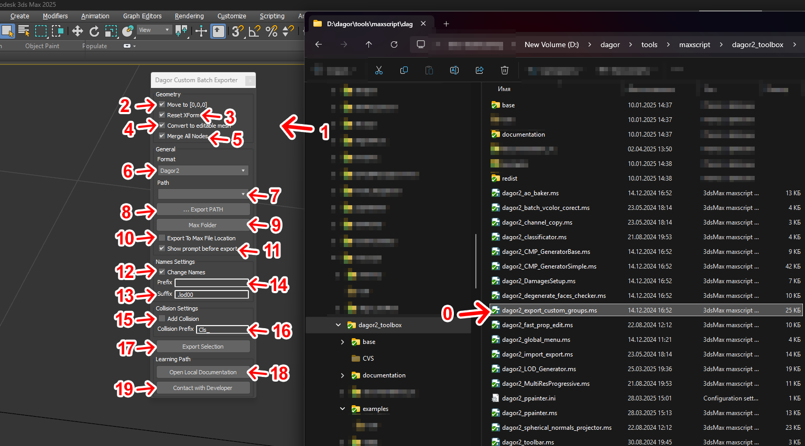

# Dagor 2 Custom Groups Export Tool

## Installation

The Dagor 2 Custom Groups Export Tool is a specialized script designed to
prepare scenes for export, automating the process of saving multiple groups of
objects with predefined properties into the `.dag` format. This script is not
included in the Dagor Tool set, as it is tailored for a specific mode of object
export.

To install the script, simply drag and drop the `dagor2_export_custom_groups.ms`
file located at `.../dagor2_toolbox/base` {bdg-dark-line}`0` into the active
Viewport of 3ds Max {bdg-dark-line}`1` (green marks on the picture below). This
action will open the Dagor Custom Batch Exporter script window.

```{important}
- This script requires 3ds Max 2013 or a newer version.
- Ensure that Dagor Plugins are installed before using this script.
```



## Using the Custom Groups Export Tool

The script provides several configurable settings:

- **Move to [0,0,0]** {bdg-dark-line}`2`: moves selected objects to the
  coordinate center before export. After export, objects are returned to their
  original positions.
- **Reset XForm** {bdg-dark-line}`3`: automatically resets the XForm on selected
  objects before export.
- **Convert to Editable Mesh** {bdg-dark-line}`4`: converts selected objects to
  **Editable Mesh** before export.
- **Merge All Nodes** {bdg-dark-line}`5`: merges all selected objects within
  groups into a single object and assigns the group name to this new object. If
  enabled, the log will only display a general summary for the group. If
  disabled, the log will detail which specific objects have degenerate
  triangles.

```{note}
These settings only apply during export. Once the export is complete, the scene
will revert to its previous state.
```

### Export Settings

- **Format** {bdg-dark-line}`6`: selects the export format. The script is
  designed exclusively for the Dagor Engine, so only the `.dag` format is
  available.
- **Path** {bdg-dark-line}`7`: displays previously saved export paths. These
  paths are automatically added when you select an export path using button
  **... Export Path** {bdg-dark-line}`8`.
- If the checkbox **Export to Max File Location** {bdg-dark-line}`10` is
  enabled, list {bdg-dark-line}`7` and button {bdg-dark-line}`8` become
  unavailable. This option allows you to export to the directory where the
  current `.max` scene is saved.
- **Max Folder** {bdg-dark-line}`9`: opens the directory containing the current
  `.max` scene in Windows Explorer.
- **Show prompt before export** {bdg-dark-line}`11`: enables the display of logs
  after export. Any errors or warnings encountered during export will be shown.

### Naming Conventions

- **Change Names** {bdg-dark-line}`12`: enables the addition of prefixes and
  suffixes to the names of exported objects. You can specify the prefix and
  suffix in text fields {bdg-dark-line}`14` and {bdg-dark-line}`13`,
  respectively. For example, if the object name is `OBJ_01`, by default, only
  the suffix `.lod00` will be applied, resulting in the final file name
  `OBJ_01.lod00.dag`.

### Collision Settings

- **Collision Settings** block allows you to export collision objects based on a
  prefix specified in text field {bdg-dark-line}`16`. To enable this function,
  enable the checkbox {bdg-dark-line}`15`. The script will search for collision
  objects in the scene that match the prefix (default: `Cls_`) specified in
  field {bdg-dark-line}`16`. If found, these objects will be included in the
  export. Otherwise, they will be exported as normal objects.

### Additional Controls

- **Export Selection** {bdg-dark-line}`17`: initiates the export process. Ensure
  that at least one object with triangles is selected in the scene before
  proceeding.
- **Visit to Learning Web Site** {bdg-dark-line}`18`: opens a browser window
  with this documentation.
- **Contact with Developer** {bdg-dark-line}`19`: displays the contact
  information for the script developer.


