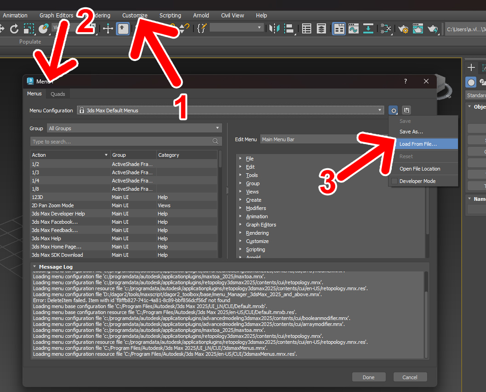
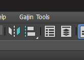

# Installation

```{important}
If you have already installed any of the Dagor 2 3ds Max Tools, you should
uninstall the previous version.

If you are installing the tools for the first time, skip the
[Uninstallation Steps](#uninstallation-steps) section.
```

## Uninstallation Steps

1. Go to **Customize User Interface**.
2. Choose **Menus** tab.
3. Delete **GaijinTools** from **Main Menu Bar**.
4. Now you can close the **Customize User Interface** window.

   

5. Close the 3ds Max.
6. Remove all `GJ_Tools\*.mcr` files from `usermarcos` directory. It should be
   located here by default:

   ```text
   C:\Users\USER_NAME\AppData\Local\Autodesk\3dsMax\YOUR_3DS_MAX_VERSION\ENU\usermacros
   ```

7. Remove all startup scripts, that you did not added yourself. Default path:

   ```text
   C:\Users\USER_NAME\AppData\Local\Autodesk\3dsMax\YOUR_3DS_MAX_VERSION\ENU\scripts\startup
   ```

## Clean Installation

For a clean installation, follow these steps:

1. Open **Customize > Configure User and Subsystem Paths**.
2. Go to **User and System** tab.
3. Select the **Additional Startup Scripts** line and click the **Modify...**
   button.
4. Specify path to `...\dagor2_toolbox\base`
5. Confirm the changes by clicking **OK**.

   

6. Restart 3ds Max. The script will automatically add the **Gaijin Tools** menu
   right after the **Help** menu.

## Autodesk 3ds Max 2025 and Later

```{warning}
If you are using 3ds Max version 2025 or later you should perform manual
installation procedures of the Gaijin Tools menu.
```

To install the Gaijin Tools menu, follow the steps below:

1. Open **Customize** {bdg-dark-line}`1` **> Menu Editor... **
   {bdg-dark-line}`2` **> Load From File...** {bdg-dark-line}`3`**:

   

2. Specify the path to the file:

   ```text
   ..\base\menu_Manager_3dsMax_2025_and_above.mnx
   ```

   Once the menu has been successfully loaded, it will appear at the top:

   

3. Save current state with the button:

   

4. Restart Autodesk 3ds Max.

