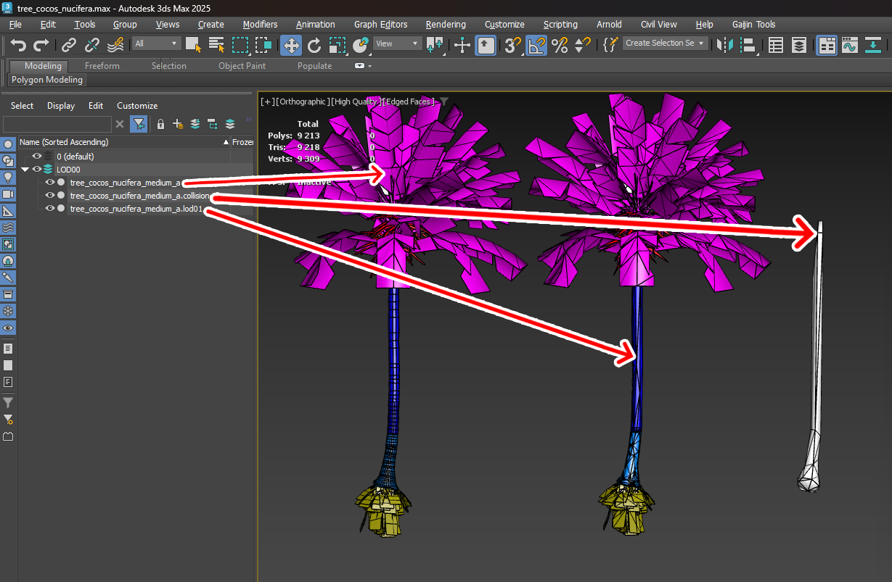

# Dagor 2 LODs and Collisions Generator

## Installation

[Install the script](installation.md) following the provided instructions.

```{important}
This script requires 3ds Max 2018 or newer version to run.
```

## Overview

This script provides superior triangle optimization compared to tools like
MultiRes or ProOptimizer. It simplifies the process by requiring only a single
button press. The script more accurately preserves texture coordinates and
texture coordinate edges. Additionally, the advanced features support
high-quality collision generation and specific settings tailored for the Dagor
Engine.

### Comparison of Optimization Quality

The following image illustrates the differences in optimization quality:


### Key Advantages

1. **More Accurate Contour Representation**. The optimized model more closely
   follows the original object's contours.
2. **Increased Segment Density**. More segments are generated along the radius,
   resulting in a finer mesh.
3. **Enhanced Knot Detail Preservation**. Critical details, such as knots, are
   retained, which are often lost in other optimization methods.

The script optimizes the placement of triangles more effectively, ensuring the
shape of the object is conveyed with greater precision, even with the same
number of triangles.

## Accessing the LODs and Collisions Generator

1. Navigate to **Gaijin Tools** {bdg-dark-line}`1` **> LOD Generator...**
   {bdg-dark-line}`2`. This will open the main window of the Dagor 2 LOD
   Generator.

2. To verify the version {bdg-dark-line}`3` of the script, go to **Gaijin
   Tools > About**. The **About** window will display the current version. It's
   important to check this regularly to ensure your script is up to date.

   

```{note}
Make sure that the plugin version is at least `1.4`.
```

## Using the LODs and Collisions Generator

To open the script window, navigate to **Gaijin Tools > LOD Generator...** in
the menu.


### Key Parameters and Controls

- **Vertex %** {bdg-dark-line}`1`: defines the percentage by which the number of
  triangles is reduced in each LOD (level of detail). For example, LOD01 will
  contain 50% of the original model's triangles, LOD02 will have 25%, and so on.

- **Iterations** {bdg-dark-line}`2`: specifies the number of iterations for the
  optimization algorithm. Higher iterations generally yield better quality in
  point placement. The optimal number of 10 was determined experimentally,
  though in some cases, using the maximum allowable value is recommended.

- **Number of LODs:** specifies how many LODs will be created.

- **Engine Optimization Type** {bdg-dark-line}`3`: Allows you to choose a more
  appropriate optimization algorithm for certain tasks. MultiRes is more
  suitable for tasks with aggressive LODs optimization. ProOptimizer is more
  flexible in optimization settings.

- **Protect Borders** {bdg-dark-line}`4`: Open edges will be excluded from the
  optimization process. This allows them to be left without distortion.

- **Keep UV Bondaries** {bdg-dark-line}`5`: Points that contain edges of UV
  coordinates will be excluded from optimization. Allows you to keep undistorted
  UV coordinates on edges untouched.

- **Build LODs!** {bdg-dark-line}`6`: initiates the generation process. The
  script can batch process all selected models, creating LODs or collisions for
  each.

```{important}
**Supported Model Types.** The script works correctly with **Edit Poly**, **Edit
Mesh**, and **GrowFX** model types. Other model types are not supported and may
cause errors. Note that all modifiers applied to LODs and collisions will be
removed if they were used on the model from which LODs or collisions are
generated.
```

This basic functionality covers the use of MultiRes and ProOptimizer. For users
familiar with these tools, the script should suffice for achieving optimal
results. For more advanced collision generation and further optimization without
visual quality loss, consider exploring the advanced settings detailed below.

### Advanced Options

1. **Loading the Test Scene:** load the following test scene:
   {download}`tree_cocos_nucifera.max <_examples/tree_cocos_nucifera.zip>`.

   ```{important}
   This scene requires 3ds Max 2021 or later version.
   ```

   This scene features a complex object with a Multi/Sub Material applied. It is
   crucial that Sub Materials are correctly named, as this influences collision
   generation.

   

2. **Material Keyword Filtering:** in **Keep Material Name** {bdg-dark-line}`14`
   field, you can enter keywords separated by commas to specify which materials
   should be retained during collision generation. For example, on a palm tree,
   you might exclude roots and fruits but retain anything named "bark".
   Materials matching the specified keywords will be preserved, while all
   others, along with their associated triangles, will be removed.

   **Example:** highlight the palm tree. Enter "bark" in field
   {bdg-dark-line}`14`. Run the script by clicking button {bdg-dark-line}`6`.
   The result will show that all unnecessary triangles (e.g., leaves, roots,
   fruits) have been removed from the collision generation:

   

   This filtering can be toggled off using **Collision Use Name Mask**
   {bdg-dark-line}`9` checkbox .

   ```{warning}
   If the object does not have a Multi/Sub Material, the script will issue a
   warning and skip processing. No changes will be made in such cases.
   ```

3. **Collision Height Cutoff:** enabling **Collision Cut FromTop**
   {bdg-dark-line}`8` checkbox allows you to cut off the collision mesh at a
   specified height, set in **Collision Cut Height** {bdg-dark-line}`13`
   parameter. This can be useful for optimizing performance by removing
   unnecessary upper parts of the collision mesh, such as branches or trunks
   that characters cannot interact with.

   **Example:** highlight the palm tree and set the desired cutoff height in
   parameter {bdg-dark-line}`13`. Run the script with button {bdg-dark-line}`6`
   again to see the result:

   

4. **Additional Options:**

   - **Collision Generation** {bdg-dark-line}`7`: enables or disables collision
     generation.
   - Custom Properties allows replaced by default custom
     object properties with those specified in fields **LODs Custom Properties**
     {bdg-dark-line}`15` for LODs and **Collision Custom Properties**
     {bdg-dark-line}`16` for collisions.
   - **Collision Remove Small Parts** {bdg-dark-line}`10` and **Collision Part
     Size %** {bdg-dark-line}`12`. This feature will allow the removal of small,
     non-essential parts of the object (e.g., small twigs or debris) based on
     their bounding box size. This will help optimize LODs and collisions.

### Support

  - **Open Local Documentation** {bdg-dark-line}`18`: provides access to this
    article.
  - **Contact with Developer** {bdg-dark-line}`19`: provides access the
    developer's web page.

