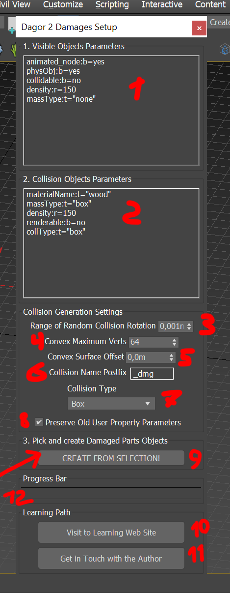
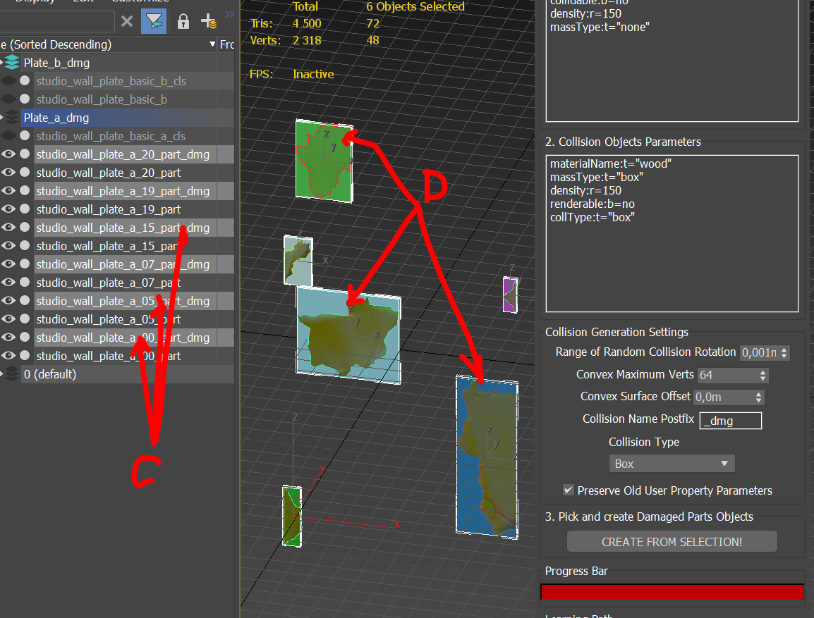

# Dagor 2 Damages Setup Tool

## Installation

[Install the script](installation.md) following the provided instructions.

```{important}
This script requires *3ds Max 2013* or newer version to run.
```

## Accessing the Damage Setup Tool

1. Navigate to **Gaijin Tools (1)** ▸ **Damage Objects Setup... (2)**.
   This will open the main window of the **Dagor 2 Damages Setup (3)**.

2. To verify the version of the script, go to **Gaijin Tools (1)** ▸ **About
   (4)**. The **About** window will display the current version. It's important
   to check this regularly to ensure your script is up to date.


```{note}
Make sure that the plugin version is at least `1.4`.
```

## Configuring the Damage Setup Tool

Download the following test scene:
[dmg_example.max](https://drive.google.com/file/d/1B2ppFE_EY5JKeHJ10WesAY_6Ot78miXH/view?usp=drive_link)
and open the downloaded project in *3ds Max*.

```{note}
The minimum supported version for this file is *3ds Max 2018*.
```

Open the utility window:



Configure the following parameters:

1. **Visible Object Parameters:** Define parameters for object chunks that will
   be visually displayed in the game. Default settings are optimized for most
   cases but can be customized as needed.

2. **Collision Object Parameters:** Set parameters for the collisions generated
   by the tool. These are pre-configured for common use cases, but you can
   modify them to fit specific requirements.

3. **Collision Rotation:** Adjust the rotation limits for generated collisions
   to create more natural-looking destruction effects.

4. **Max Points in Collision:** Specify the maximum number of points in a
   generated collision. This option is only active if a convex hull is selected
   as the collision type.

5. **Collision Surface Displacement:** Define the displacement of the collision
      surface relative to the object surface. This setting is also only active
      when using a convex hull collision type.

6. **Collision Name Postfix:** Add a postfix to the names of generated
   collisions to easily distinguish them from other objects.

7. **Collision Type:** Select the type of collision to generate. The default is
   a box, but other options include sphere, capsule, and convex hull.

8. **Overwrite Existing Parameters:** Use this checkbox to determine whether the
   existing parameters in "Visible Object Parameters" and "Collision Object
   Parameters" will be overwritten. If unchecked, all existing parameters will
   be removed and replaced with the new ones.

9. **Generate Collisions:** After selecting the objects for which you want to
   generate collisions, click this button to start the process.

10. **Documentation:** Click this button to access the current documentation.

11. **Contact Author:** If you need additional information, use this button to
    contact the author.

12. **Progress Bar:** Displays the progress of the scene processing. For scenes
    with many objects (50-100), this may take several minutes.

## Generating Collisions

1. Select the objects you want to generate collisions for **(A)**.
2. Prepare them for export to the engine.
3. Click the **Generate** button **(B)**.


## Reviewing Generated Collisions

After processing, a list of new objects **(C)** and generated collisions **(D)**
will appear.




