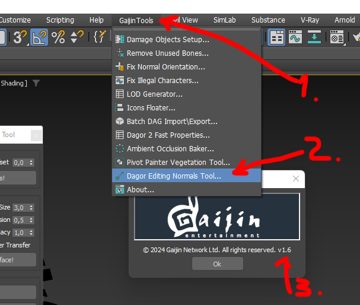
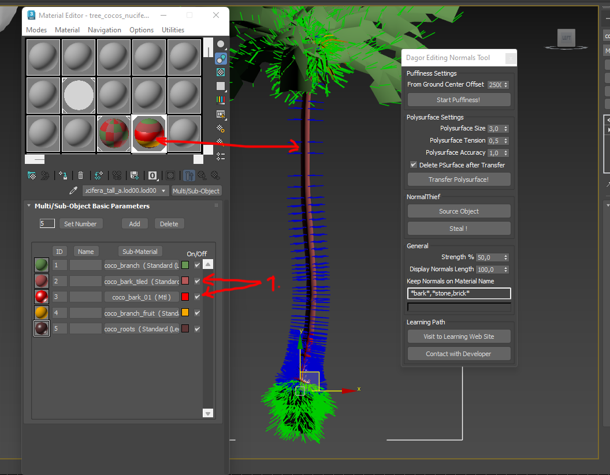
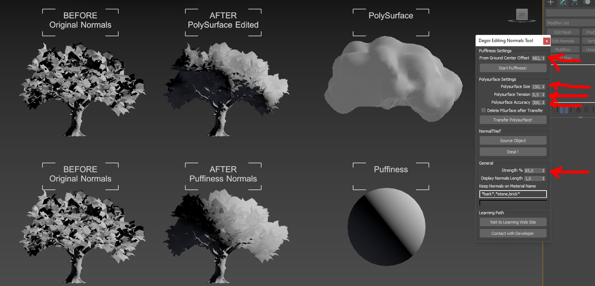

# Dagor Editing Normals Tool

## Installation

[Install the script](installation.md) following the provided instructions.

```{important}
This script requires *3ds Max 2023* or newer version to run.
```

## Overview

The *Editing Normals Tool* provides comprehensive functionality for generating
and transferring vegetation normals using all widely recognized methods
available at the time of publication. It supports:

- **Puffiness**, similar to the technique used in *SpeedTree*.
- **Polysurface Method**, as demonstrated by Guerrilla Games' Gilbert Sanders
  during the 2018 GDC session on *Horizon Zero Dawn*.
- **Classic Normal Transfer**, via the *Noors Normal Thief* approach, which
  transfers normals from a parent object.

Example of the tool's output:
[editing_normals_00.gif](https://drive.google.com/file/d/1f8c4idDREgLSav8ov20TXvwzSwPupsuu/view?usp=drive_link)

## Accessing the Editing Normals Tool

1. Navigate to **Gaijin Tools (1)** ▸ **Dagor Editing Normals Tool...**. This
   will open the main window of the *Dagor Editing Normals Tool*.

2. To verify the version **(3)** of the script, go to **Gaijin Tools (1)** ▸
   **About (2)**. The **About** window will display the current version. It's
   important to check this regularly to ensure your script is up to date.



```{note}
Make sure that the plugin version is at least `1.6`.
```

## Using the Editing Normals Tool

To begin, open the tool panel by navigating to **Gaijin Tools** ▸ **Dagor
Editing Normals Tool**.

Download the following test scene:
[tree_example.max](https://drive.google.com/file/d/1CNkq4Y6LVBvwzL67XplG-Vu5MA5Kx-4J/view?usp=drive_link).

```{important}
This scene requires *3ds Max 2024* or a newer version.
```

### Interface Overview

The *Editing Normals Tool* interface is divided into three main sections:
*Puffiness Settings*, *Polysurface Settings*, and *Classic Normals Thief
Settings*, with a *General Settings* block that affects all three sections.


- **From Ground Center Offset (1):** Adjusts the elevation of the Puffiness
  build point from the ground to the center of the build.
- **Start Puffiness! (2):** Initiates the Puffiness generation process.
- **Strength % (10):** Controls the blending ratio between the new and existing
  normals on the object. This is crucial when you only need to partially replace
  the normals' weight. A typical range is 70-90%.
- **Display Normals Length (11):** Determines the duration that normals are
  displayed in the Viewport.

### Working with Puffiness

To see how Puffiness works, set parameter **Strength % (10)** to `100` and
parameter **Display Normals Length (11)** to `100` for clear visibility. Note
that the normal length is dependent on the scene’s scale and units. Select the
palm tree in the test scene (you can also process multiple objects or LODs at
once). Press the **Start Puffiness! (2)** button to generate the normals:


Initially, the center aligns with the tree’s base, near the Pivot. If needed,
adjust the center by setting **From Ground Center Offset (1)** to 2500. Remove
the **EditNormals** modifier generated by the script before re-running the
process. After pressing the **Start Puffiness! (2)** button again, you should
see the result:


As you can see, everything is much better with the crown. With the crown
adjusted, set the **Strength % (10)** to 80%, remove the **EditNormals**
modifier again, and run the process:


The result shows improved lighting on the large palm leaves, though issues may
still exist with the root system. To address this, you may need to edit the
normals on the roots separately. Some tree bark normals might remain unedited,
shown as blue. The **Keep Normals on Material Name (12)** parameter is vital
here, as it allows you to specify which materials' normals will be processed.



For instance, if the bark is named "bark," ensure that "bark" is listed in
**(12)**. This field supports RegExp, enabling precise control over which
materials are included or excluded from processing. After adjusting the
expression, set the **From Ground Center Offset (1)** parameter to zero. After
all, the center of illumination of the root beam should be just somewhere at
zero. At the Pivot point of the object. Set the parameter of normal
transfer strength **(10)** to 80% and rerun the Puffiness generation:


### Polysurface Settings

The *Polysurface Settings* block provides advanced tools for generating and
transferring normals, originally used in the *Horizon Zero Dawn* project. More
details about the method see
[here](https://www.youtube.com/watch?v=wavnKZNSYqU).

To apply similar lighting effects to your tree, select the tree without the
**EditNormals** modifier and configure the *Polysurface Settings* and
**General Group** as shown below. Ensure that "bark" is excluded from normal
adjustments:



After applying, you should see a result similar to this:


You can remove the Polysurface after generation using **Delete PSurface after
Transfer (6)** checkbox.

```{note}
All Polysurface parameters are sensitive to the scene size and object scale. If
values are set too high, Polysurface may not generate; too low, and it could
generate with excessive triangles, causing processing issues in *3ds Max*.
```

Adjust these settings carefully:

- **Polysurface Size (3):** Controls surface smoothness. A larger value results
  in a smoother surface, while a smaller value creates more detailed but less
  smooth surfaces.
- **Polysurface Tension (4):** Sets the surface tension. A value of 1.0 creates
  a maximally bulged surface, and 0.0 creates a tight surface. Typically, 0.5 is
  optimal, though this may vary based on the object type (e.g., higher for
  conifers, lower for palm trees).
- **Polysurface Accuracy (5):** Defines the step size for generating surface
  triangles. Smaller steps yield more precise surfaces but increase the triangle
  count exponentially. Usually 20-30 thousand triangles are enough to get an
  excellent result of Polysurface generation. Carefully reduce the value.
  Reducing the value by 2 times you increase the number of resulting triangles
  from 4x to 9 times!

### Classic Normals Thief Method

The *Normals Thief* method, dating back to 2008, allows manual creation and
projection of normals. Select the source object with the **Source Object (8)**
button, and project normals onto the target object using the **Steal ! (9)**.
More details are available here: [Noors Normal
Thief](http://www.scriptspot.com/3ds-max/scripts/noors-normal-thief)

In the *General Block*, you can adjust the normal transfer strength (**10**)
(default: 50%). Setting this to 100% replicates the classic *Normals Thief*
behavior. You can also clear the material exclusion mask for full normal
transfer, mimicking the original tool's functionality.

- **Progress bar (13):** Progress bar.
- **Visit to Learning Web Site (14):** Access this article.
- **Contact with Developer (15):** Contact the author for additional support.


