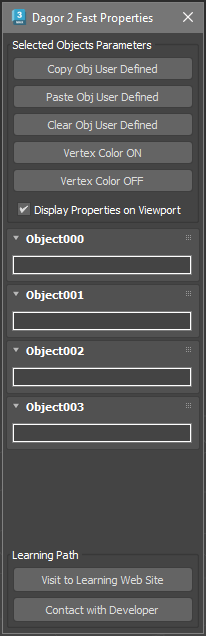
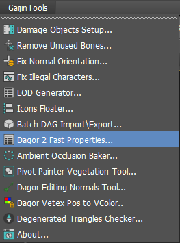

# Dagor 2 Fast Editor User Properties

## Installation

[Install the script](installation.md) following the provided instructions.

```{important}
This script requires 3ds Max 2012 or newer version to run.
```

## Accessing the Fast Editor User Properties

- Press `Ctrl`+`Shift` to open the floating panel:

  

- Closing the panel by pressing **X** disables this editor completely. To return
  the toggle behavior, reopen the editor from the **Gaijin Tools >  Dagor 2 Fast
  Properties...**

  

## Using the Fast Editor User Properties

The panel buttons shown in the picture above perform several key functions:

1. **Copy Obj User Defined:** copies the User-Defined Properties of the **first
   selected object** to the system clipboard as plain text.

   ```{note}
   The other toolbar buttons apply to all selected objects.
   ```

   ```{note}
   Fast access is limited to the first 20 selected objects to prevent
   performance degradation with larger selections.
   ```

2. **Paste Obj User Defined:** pastes the text from the system clipboard into
   the Properties of all selected objects.
3. **Clear Obj User Defined:** clears the Properties of all selected objects.
4. **Vertex Color ON:** enables the display of Vertex Color in the **Viewport**.
5. **Vertex Color OFF:** disables the display of Vertex Color in the
   **Viewport**.
6. The **Display Properties on Viewport** checkbox allows you to display
   Properties directly in the **Viewport**, near the pivot point of each object.

7. The block of **Objects** below displays **copies** of the Properties of the
   selected objects. Editing the text in this panel will not modify the actual
   object properties. To make changes, use the **Clear** and **Paste** buttons.

8. The support section at the bottom of the panel provides quick access to the
   documentation via the **Visit to Learning Web Site** button. Since you're
   already here, you may have found it. For further assistance, contact the tool
   developer by clicking the **Contact with Developer** button.


