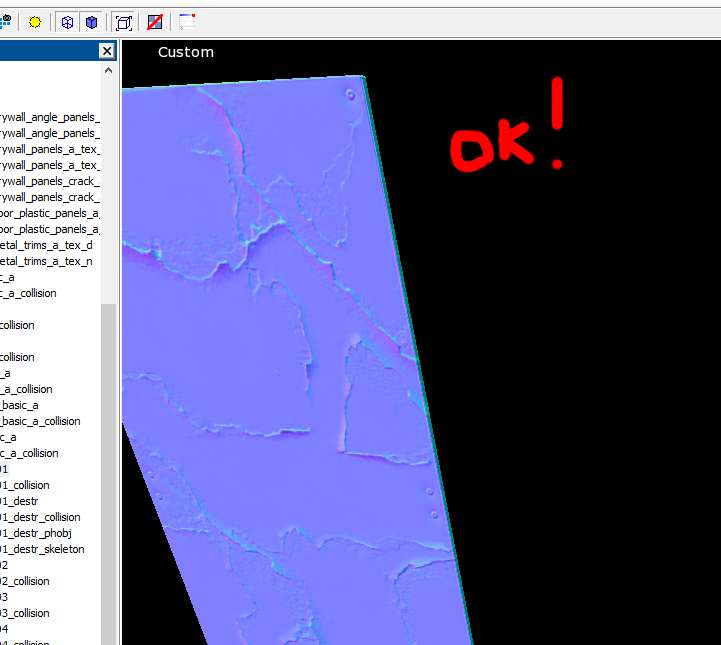

# Dagor 2 Fix Normal Orientation Tool

## Installation

[Install the script](installation.md) following the provided instructions.

```{important}
This script requires *3ds Max 2013* or newer version to run.
```

## Accessing the Fix Normal Orientation Tool

1. Navigate to **Gaijin Tools (1)** ▸ **Fix Normal Orientation... (2)**. This
   will open the main window of the **Dagor 2 Fix Normals Orientation script
   (3)**.

2. To verify the version of the script, go to **Gaijin Tools (1)** ▸ **About
   (4)**. The **About** window will display the current version. It's important
   to check this regularly to ensure your script is up to date.


```{note}
Make sure that the plugin version is at least `1.4`.
```

## Using the Fix Normal Orientation Tool

After exporting objects, you may encounter issues with normals in *daEditor*, as
shown in the screenshot below:


The *Fix Normal Orientation Tool* is designed to resolve these issues in most
cases. To correct the normals:

1. In the Viewport, select the objects with incorrect normals.
2. Click the **Fix Normals from Selection** button.

This should correct the normals for the selected objects. In most cases, the
issue is resolved upon re-export. See the screenshot below for an example of the
corrected normals:




