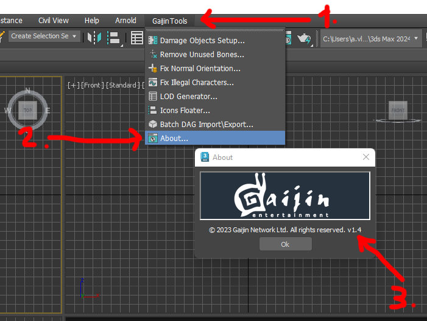
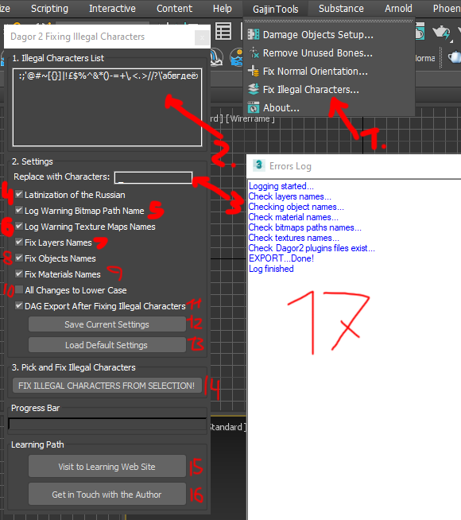
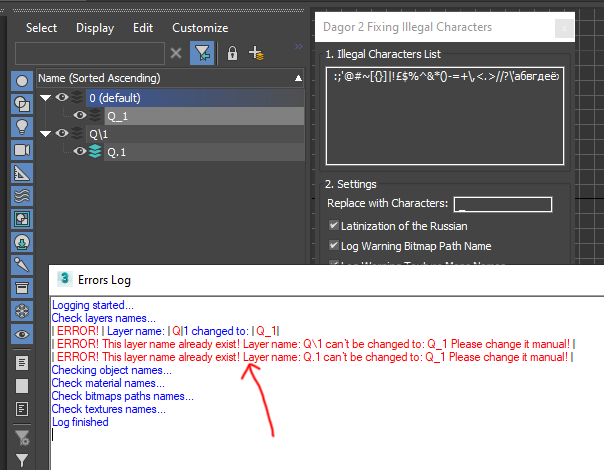
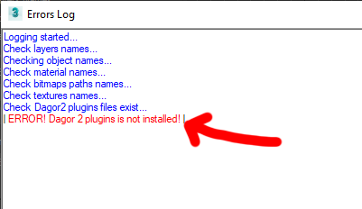
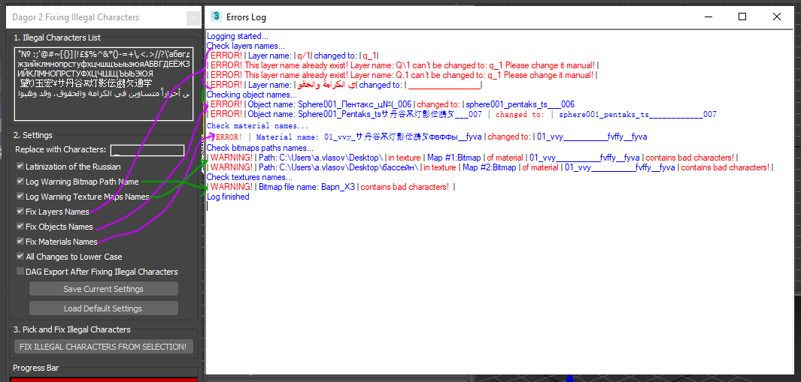

# Dagor 2 Fixing Illegal Characters Tool

## Installation

[Install the script](installation.md) following the provided instructions.

```{important}
This script requires *3ds Max 2013* or newer version to run.
```

## Accessing the Fixing Illegal Characters Tool

1. Navigate to **Gaijin Tools (1)** ▸ **Fix Illegal Characters...**. This
   will open the main window of the **Dagor 2 Fix Illegal Characters script**.

2. To verify the version of the script, go to **Gaijin Tools (1)** ▸ **About
   (2)**. The **About** window will display the current version. It's important
   to check this regularly to ensure your script is up to date.



```{note}
Make sure that the plugin version is at least `1.4`.
```

## Using the Fixing Illegal Characters Tool

To begin, run the script from the **GaijinTools ▸ Fix Illegal Characters...
(1)** menu. The following window will appear:



### Tool Options

- **Illegal Characters List (2):** Enter or delete illegal characters in this
  field.
- **Replace with Characters (3):** Specify characters to replace the illegal
  ones. If left blank, illegal characters will be removed. This option supports
  UTF-8, including hieroglyphs, Slavic languages, and Arabic characters, etc.
- **Latinization of the Russian (4):** Converts all Russian characters to Latin
  according to standard Latinization rules. If unchecked, Russian characters
  will be replaced with the characters specified in the **Replace with
  Characters** (3) field.
- **Log Warning Bitmap Path Name (5):** Logs warnings for file paths containing
  illegal characters to the log window **(17)**.

  ```{note}
  No substitutions are made; this only outputs warnings.
  ```
- **Log Warning Texture Maps Names (6):** Logs warnings for texture names
  containing illegal characters to the log window **(17)**.

  ```{note}
  No substitutions are made; this only outputs warnings.
  ```
- **Fix Layers Names (7):** Replaces illegal characters in layer names with the
  specified replacement characters.

  ```{note}
  Layer 0 (default) cannot be renamed.
  ```

  There cannot be layers with the same name. If naming conflicts occur or
  renaming fails, a warning is displayed in the log window **(17)**:

  

- **Fix Objects Names (8):** Replaces illegal characters in object names with the
  specified replacement characters. For check naming it's necessary to select
  objects.

  ```{note}
  This may result in objects having identical names.
  ```

- **Fix Materials Names (9):** Replaces illegal characters in material names
  with the specified replacement characters.

  ```{note}
  This may result in materials having identical names.
  ```

- **All Changes to Lower Case (10):** Converts all names to lower case and
  performs checks in lower case.
- **DAG Export After Fixing Illegal Characters (11):** Opens the DAG format
  export window after all checks are complete.

  ```{note}
  Ensure you are familiar with how *Dagor 2 plugins* work before enabling this
  option.
  ```

- **Save Current Settings (12):** Saves the current settings.
- **Load Default Settings (13):** Loads the default settings.
- **FIX ILLEGAL CHARACTERS FROM SELECTION (14):** Executes the script to fix
  illegal characters in the selected objects.
- **Visit to Learning Website (15):** A link to this article.
- **Get in Touch with the Author (16):** Contact the author if the article does
  not resolve your issue.
- **Errors Log (17):** Displays information about the results of the checks and
  any changes made.

If the scene contains no errors, you will see a window like this:


Any errors will be highlighted in red and labeled as **ERROR!** or **WARNING!**:



A scene containing multiple errors may produce results like this:




