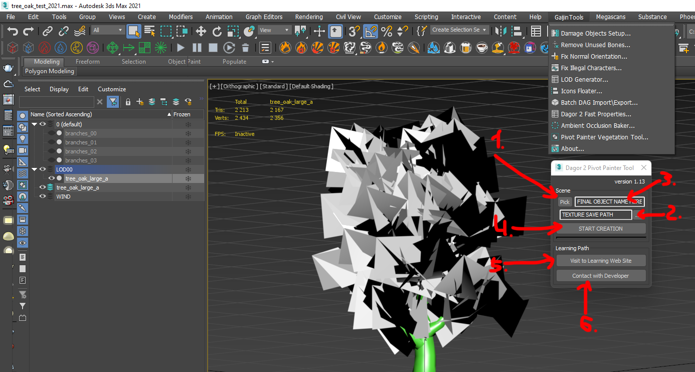
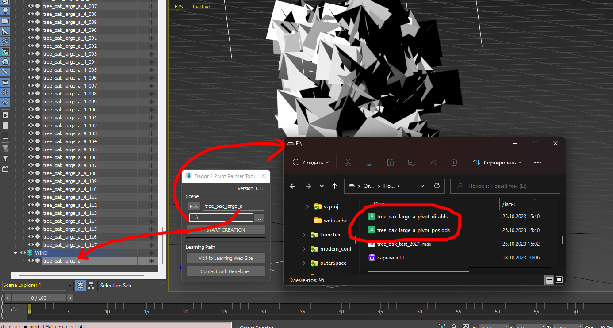

# Dagor 2 Pivot Painter Vegetation Tool

## Installation

[Install the script](installation.md) following the provided instructions.

```{important}
This script requires 3ds Max 2015 or newer version to run.
```

## Accessing the Pivot Painter Vegetation Tool

1. Navigate to **Gaijin Tools > Pivot Painter Vegetation Tool**. This will open
   the main window of the Dagor 2 Pivot Painter Tool.

2. To verify the version {bdg-dark-line}`3` of the script, go to **Gaijin
   Tools** {bdg-dark-line}`1` **> About** {bdg-dark-line}`2`. The **About**
   window will display the current version. It's important to check this
   regularly to ensure your script is up to date.

   

```{note}
Make sure that the plugin version is at least `1.4`.
```

## Using the Pivot Painter Vegetation Tool

To begin, open the **Pivot Painter Vegetation Tool** by navigating to **Gaijin
Tools > Pivot Painter Vegetation Tool**.

Download the following test scene:
{download}`tree_oak_test_2021.max <https://drive.google.com/file/d/1-emRZYAaXEJ09EgGQnMjzUxQkfmLEu-h/view?usp=drive_link>`.

```{important}
- This scene requires 3ds Max 2021 or a newer version.
- Be sure to have installed GrowFX no lower than version `2.0.1`.
```

The tool window will appear as shown below:



### Key Features and Controls

1. **Pick** {bdg-dark-line}`1`: choose the GrowFX object that will serve as the
   parent for all other elements of the tree.
2. **Texture Save Path** {bdg-dark-line}`2`: select the directory where the
   generated position and rotation textures will be saved. For more information
   about these textures and their purpose, refer to the article: [Pivot Painter
   Wind on Vegetation for daNetGame-based
   Projects](../../../../tutorials/pivot_painter_wind.md).
3. **Final Object Name** {bdg-dark-line}`3`: specify a custom name for the
   resulting object. By default, the tool assigns the name of the selected
   object.
4. **Start Creation** {bdg-dark-line}`4`: initiates the tool's operation.
5. **Visit to Learning Web Site** {bdg-dark-line}`5`: links to this
  documentation.
6. **Contact with Developer** {bdg-dark-line}`6`: provides contact information
   for the developer if assistance is needed

### Workflow Example

1. Select `tree_oak_large_a` and navigate to the **Modify** panel. Locate the
   **Create Hierarchy of Meshes** button. Ensure the **Group by Path Color**
   checkbox is unchecked before clicking the button.

2. The script will generate a large number of hierarchically connected objects
   within the layer:
   .

3. Select all the contents of this layer and assign the material previously
   applied to `tree_oak_large_a`. The tool is now ready to work.

4. Select the parent object using button {bdg-dark-line}`1` at the beginning of
   the hierarchy. This object is the root of all branches in the tree:

   

5. Use button {bdg-dark-line}`2` to specify the output path for the resulting
   `.dds` textures. Press button {bdg-dark-line}`4` to generate the textures
   `pivot_pos.dds` and `pivot_dir.dds`, along with a new **WIND** layer
   containing the completed object with the assigned name.

   

6. After generating the textures, follow the instructions in the document:
   [Pivot Painter Wind on Vegetation for daNetGame-based
   Projects](../../../../tutorials/pivot_painter_wind.md).

```{important}
- **Script Limitations.** Unlike the Houdini graph version, this script is
  limited to a maximum of 4 hierarchy levels within GrowFX. Consequently, the
  number of allowed links is restricted to 4x. In Houdini, any levels beyond
  the 4th will be merged into the last one, while this script will discard and
  not display them.
- **Object Limitations.** Both this script and Houdini impose a limit of 2048
  objects, derived from the maximum allowed texture size. Any objects exceeding
  this limit will be ignored by the script, and Houdini will also disregard
  them.
```


