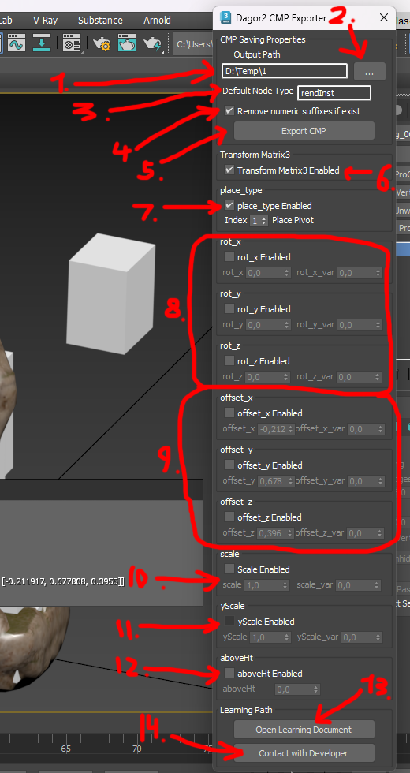
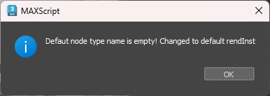
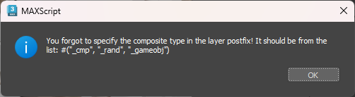

# Dagor 2 Simple CMP Editor

```{caution}
This tool is currently under development.
```

## Installation

[Install the script](installation.md) following the provided instructions.

```{important}
- This script requires 3ds Max 2021 or newer version to run.
- Make sure that the plugin version is at least `1.8`.
- This Simple CMP Editor requires the
  [Dagor 2 Fast Editor User Properties](fast_editor_user_properties.md), which
  is part of the toolbox.
```
## Accessing the Simple CMP Editor

To get started, ensure that your toolbox is up to date. Then, drag and drop
`dagor2_CMP_GeneratorSimple.ms` into the **Viewport**.

- Press `Ctrl`+`Shift` to open the floating panel:

  

- Closing the panel by pressing **X** disables this editor completely. To return
  the toggle behavior, reopen the editor from the **Gaijin Tools > Dagor 2 Fast
  Properties...**

  

- To open the main window of the Dagor2 CMP Exporter, navigate to **Gaijin
  Tools > Dagor CMP Exporter...** {bdg-dark-line}`1`.

- To verify the version {bdg-dark-line}`2` of the script, go to **Gaijin Tools >
   About**. The **About** window will display the current version. It's
   important to check this regularly to ensure your script is up to date.

  

## Using the Simple CMP Editor

All node properties are stored in **Object Properties**. The script
automatically updates these properties when the position, rotation, or scale of
an object changes. Below is an example:


Always use the CMP Exporter to edit properties. The following is a list of
currently supported properties:

### Supported Properties

<table style="text-align:center; width:100%">
  <tr>
    <th style="border-bottom: 1px solid gray; border-top: 1px solid gray; padding: 10px; text-align: center; width:">Property</th>
    <th style="border-bottom: 1px solid gray; border-top: 1px solid gray; padding: 10px; text-align: center; width:">Example</th>
    <th style="border-bottom: 1px solid gray; border-top: 1px solid gray; padding: 10px; text-align: center; width:">Description</th></tr>
  <tr>
  <tr>
    <td style="border-bottom: 1px solid gray; padding: 10px; text-align: left"><pre>place_type:i</pre></td>
    <td style="border-bottom: 1px solid gray; padding: 10px; text-align: left"><pre>place_type:i = 1</pre></td>
    <td style="border-bottom: 1px solid gray; padding: 10px; text-align: left">"No Collision Type"=0, "Place Pivot"=1, "Place Pivot and use Normal"=2, "Place 3-point (bbox)"=3, "Place Foundation (bbox)"=4, "Place on Water (flootable)"=5, "Place Pivot with Rendinst Collision"=6</td>
  </tr>
  <tr>
    <td style="border-bottom: 1px solid gray; padding: 10px; text-align: left"><pre>rot_x:p2</pre></td>
    <td style="border-bottom: 1px solid gray; padding: 10px; text-align: left"><pre>rot_x:p2=90, 2 </pre></td>
    <td style="border-bottom: 1px solid gray; padding: 10px; text-align: left">Rotates the node 90° on the chosen axis, then applies a random angle between -2° and 2°</td>
  </tr>
  <tr>
    <td style="border-bottom: 1px solid gray; padding: 10px; text-align: left"><pre>rot_y:p2</pre></td>
    <td style="border-bottom: 1px solid gray; padding: 10px; text-align: left"><pre>rot_y:p2=0, 30 </pre></td>
    <td style="border-bottom: 1px solid gray; padding: 10px; text-align: left">Rotates the node randomly on the chosen axis between -30° and 30°</td>
  </tr>
  <tr>
    <td style="border-bottom: 1px solid gray; padding: 10px; text-align: left"><pre>rot_z:p2</pre></td>
    <td style="border-bottom: 1px solid gray; padding: 10px; text-align: left"><pre>rot_z:p2=90, 2</pre></td>
    <td style="border-bottom: 1px solid gray; padding: 10px; text-align: left">Rotates the node 90° on the chosen axis, then applies a random angle between -2° and 2°</td>
  </tr>
  <tr>
    <td style="border-bottom: 1px solid gray; padding: 10px; text-align: left"><pre>offset_x:p2</pre></td>
    <td style="border-bottom: 1px solid gray; padding: 10px; text-align: left"><pre>offset_x:p2=1, 2</pre></td>
    <td style="border-bottom: 1px solid gray; padding: 10px; text-align: left">Moves the node 1 unit along the x-axis, then randomly between +/-2 units</td>
  </tr>
  <tr>
    <td style="border-bottom: 1px solid gray; padding: 10px; text-align: left"><pre>offset_y:p2</pre></td>
    <td style="border-bottom: 1px solid gray; padding: 10px; text-align: left"><pre>offset_y:p2=1, 2</pre></td>
    <td style="border-bottom: 1px solid gray; padding: 10px; text-align: left">Moves the node 1 unit along the y-axis, then randomly between +/-2 units</td>
  </tr>
  <tr>
    <td style="border-bottom: 1px solid gray; padding: 10px; text-align: left"><pre>offset_z:p2 </pre></td>
    <td style="border-bottom: 1px solid gray; padding: 10px; text-align: left"><pre>offset_z:p2=1, 2 </pre></td>
    <td style="border-bottom: 1px solid gray; padding: 10px; text-align: left">Moves the node 1 unit along the z-axis, then randomly between +/-2 units</td>
  </tr>
  <tr>
    <td style="border-bottom: 1px solid gray; padding: 10px; text-align: left"><pre>scale:p2</pre></td>
    <td style="border-bottom: 1px solid gray; padding: 10px; text-align: left"><pre>scale:p2=1.5, 0.1</pre></td>
    <td style="border-bottom: 1px solid gray; padding: 10px; text-align: left">Uniformly scales the node to 1.5, with variation in the range [-0.1 .. 0.1]</td>
  </tr>
  <tr>
    <td style="border-bottom: 1px solid gray; padding: 10px; text-align: left"><pre>yScale:p2</pre></td>
    <td style="border-bottom: 1px solid gray; padding: 10px; text-align: left"><pre>yScale:p2=1, 0.1</pre></td>
    <td style="border-bottom: 1px solid gray; padding: 10px; text-align: left">Alters the node height by a value in the range [-0.1 .. 0.1]</td>
  </tr>
  <tr>
    <td style="border-bottom: 1px solid gray; padding: 10px; text-align: left"><pre>tm:m</pre></td>
    <td style="border-bottom: 1px solid gray; padding: 10px; text-align: left"><pre>tm:m=[[1.0, 0.0, 0.0] [0.0, 1.0, 0.0] [0.0, 0.0, 1.0] [0.0, 0.0, 0.0]]</pre></td>
    <td style="border-bottom: 1px solid gray; padding: 10px; text-align: left">Non-randomized location, rotation, and scale</td>
  </tr>
  <tr>
    <td style="border-bottom: 1px solid gray; padding: 10px; text-align: left"><pre>aboveHt:r</pre></td>
    <td style="border-bottom: 1px solid gray; padding: 10px; text-align: left"><pre>aboveHt:r=0.0</pre></td>
    <td style="border-bottom: 1px solid gray; padding: 10px; text-align: left">Specifies a fixed height above the surface</td>
  </tr>
</table>

<br>

The script does not affect manually entered properties not listed above. The
animation below shows that when you change the parameters, unsupported
properties of the collision object remain untouched, example:

```{eval-rst}
.. video:: _images/simple_cmp_preserving_unsup_prop.webm
   :width: 90%
```

```{important}
Only one selected object can be edited at a time. If you select more than one
object, the CMP Exporter interface will be greyed out and unavailable for
parameter editing. This is intentional to prevent damaging or erasing properties
of different objects.
```

However, objects can be moved, rotated, or scaled in selected groups. When the
script runs, it automatically updates all parameters inside user custom
properties for all selected objects. If the script is not run during editing,
parameters will automatically update when you press the **Export CMP** button.
Alternatively, run the script and select an object to update its parameters
automatically.

```{important}
If an object does not already have any CMP properties, default properties such
as `Matrix3` and `Place type` will be automatically assigned. Note that only
Editable Mesh or Editable Poly objects can have CMP settings. For non-editable
objects, the interface will be greyed out and unavailable for editing.
```

For example, create a box and select it when the script window is open. The
whole interface will be grey because it is not an Editable Mesh or Editable
Poly.

It will look like this (only node name and Matrix3):

```text
node{
  name:t="ancient_statue_c_dmg_056_dmg:rendInst"
  tm:m=[[0.606621, 0.0, 0.0105886] [0.000184797, 0.606621, -0.010587] [-0.010587, 0.0105886, 0.606528] [-0.211369, 3.01566, 0.255796]]
}
```

```{important}
All objects in the scene must have the same scale on all axes.
```

If an object is not uniformly scaled along all axes, a warning will appear,
suggesting correction:


The script will not correct this error; it leaves the decision to your
discretion. However, every time such an object is selected while the script is
running, a warning will appear.

### CMP Editor Interface

Let's consider the functionality of the script interface:



- **Output Path** {bdg-dark-line}`1`: specify the path where the `.composit.blk`
  file will be saved after export. Button {bdg-dark-line}`2` allows you to
  select a custom path. On first use, this will default to the 3ds Max export
  path.
- **Default Node Type** {bdg-dark-line}`3`: set the default node type. If the
  name contains some gross errors like invalid characters, the script will
  indicate an error of the form:

  

- **Remove numeric suffixes if exist** {bdg-dark-line}`4`: if enabled, removes
  the last three digits from object names during export. For example,
  `ancient_statue_c_dmg_087` will be exported as `ancient_statue_c_dmg_`. This
  is useful since objects in 3ds Max often include numbers that are unnecessary
  in the final composite file.
- **Export CMP** {bdg-dark-line}`5`: exports objects to the specified directory.
  All objects in the current active layer will be exported. Recall that the
  active layer is the layer highlighted by the blue folder

  

  For example a layer
  
  is exported to `ancient_statue_c_dmg_cmp.composit.blk` at the specified path.

  Ensure the active layer is named correctly; otherwise, a warning will appear:

  

Next are parameters to export from 3ds Max to Dagor:

- **Transfor Matrix3 Enabled** {bdg-dark-line}`6`: exports the transformation
  matrix (position, rotation, scale) to Dagor's format.

  ```{seealso}
  For more information, see
  [Transformation matrices](https://en.wikipedia.org/wiki/Transformation_matrix#Examples_in_3D_computer_graphics).
  ```

- **place_type Enabled** {bdg-dark-line}`7`: enables object placement type in
  Dagor. There are seven different placement methods, which your mentor can
  explain in detail.
- **Parameter block** {bdg-dark-line}`8`: responsible for randomizing node
  rotations along the x, y, z axes.

  **Example:**

  ```{eval-rst}
  .. video:: _images/simple_cmp_ed_prop_edit_rot_02.webm
     :width: 90%
  ```

  ```{important}
  - If any checkbox for `rot_x`, `rot_y`, `rot_z`, `offset_x`, `offset_y`,
    `offset_z`, `scale`, or `yScale` is enabled, the `Matrix3` parameter will be
    unavailable.
  - This limitation is intentional and adheres to Dagor Engine requirements.
  ```

- **Parameter block** {bdg-dark-line}`9`: responsible for randomizing node
  offsets along the x, y, z axes relative to the current position.
- **Scale Enabled** {bdg-dark-line}`10`: enables randomization of node scaling
  from the base scale value within the specified range.
- **yScale Enabled** {bdg-dark-line}`11`: enables randomization of scaling along
  the Y-axis (Z-axis in 3ds Max, which is up in Dagor).
- **aboveHit Enabled** {bdg-dark-line}`12`: enables fixed node positioning above
  the surface by the specified value in the `aboveHt` parameter.

As the Dagor Engine evolves, new parameters may be added or existing ones
modified. Always refer to the updated table of parameters.

```{note}
This script is complex, functioning as an editor within the 3ds Max editor. It
may contain bugs or errors. If you encounter any strange behavior or issues, do
not try to resolve them yourself. Report them to the developer immediately to
save time and facilitate quick fixes.
```

- **Open Learning Document** {bdg-dark-line}`13`: links to this documentation.
- **Contact with Developer** {bdg-dark-line}`14`: provides contact information
  for the developer if assistance is needed.


