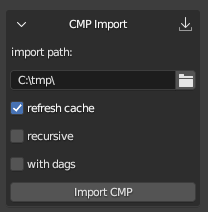
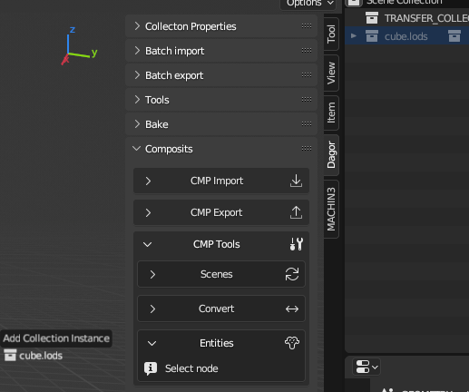
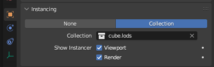
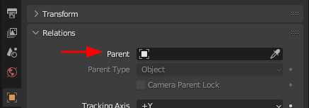
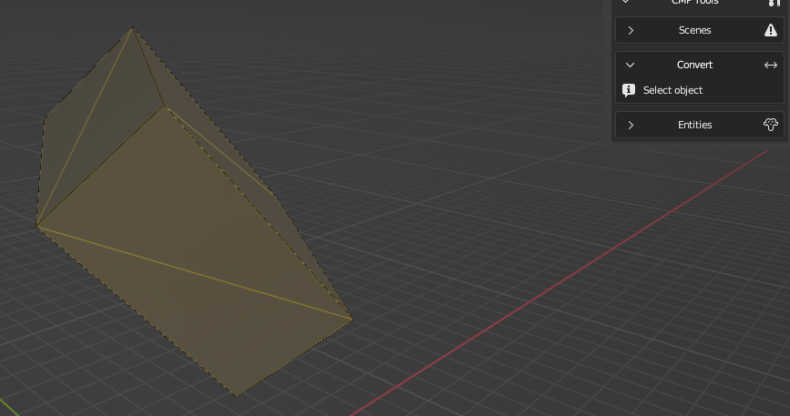
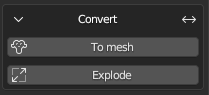
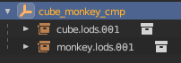
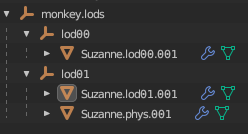

# dag4blend Composite Editor

## How to Enable

The *Composite Editor* is currently under development and is considered an
experimental feature. As such, it is hidden by default. To enable its
visibility, you need to check the appropriate box in the add-on settings.


<br>


<br>

The *Composite Editor* can be found in the **N-panel** under the **Dagor** tab.
The panel itself is divided into three main sections: **CMP Import**, **CMP
Export**, and **CMP Tools**.

## CMP Import



<br>

- **import path**: This is the full path to the `name.composit.blk` file.
  However, if the correct project is selected, you can simply specify
  `name.composit.blk` or even just `name` – the add-on will locate and import
  it.

- **refresh cache**: To import subcomposites and geometry, the add-on needs to
  know where to find them. When this checkbox is active, the importer will scan
  all files in the active project directory once and record where everything is
  located. This list is then used during the import process, which significantly
  speeds up the operation compared to the previous version, where the directory
  might be searched multiple times across several levels of nesting. If you're
  importing composites from the same project, you can uncheck this box to save a
  few seconds, but only if you're certain the paths are up-to-date. A separate
  cache is maintained for each project.

- **recursive**: This option imports not only the specified composite but also
  its subcomposites, which are nodes, and their subcomposites. The algorithm
  should be self-explanatory.

- **with dags**: Imports `*.lod00.dag` rendinsts and `*.dag` prefabs for all
  composites. If **recursive** is disabled, it only imports geometry directly
  within the composite being imported; otherwise, it also imports the necessary
  assets for the subcomposites.

- **with lods**: Available only when the previous checkbox is active. This
  option allows you to import not just `lod00` but all other LODs (Level of
  Detail) as well. Keep in mind that this significantly slows down the import
  process and increases the scene's complexity – useful only when you need to
  adjust a mesh in a small composite, rather than the position of nodes. For
  example, if you need to reposition a couple of apples so they don't stick out
  of a box in a composite, and the apple pile is a single mesh, you still need
  to update all LODs, not just the first one.

If a collection named after the composite already exists, it will be cleared
during import, and the import will occur within that collection. If the
collection isn't found, a new one will be created. All nodes are placed in a
collection named `NODES`; again, if a collection with this name exists, it will
be used.

If a `.dag` (rendinst or prefab) collection existed before the composite import,
the asset will not be imported.

The node type and its name are explicitly set in the collection's properties.
For rendinsts, this isn't critical since the name is stored in `*.lods` rather
than the nested geometry collections. However, for prefabs, this is important to
remember – **Override Name** will select the overridden collection name.

```{note}
Don't forget to check the log.
```

### New Blend File Structure

The *Composite Editor* also introduces a new file structure for `.blend` files.
Instead of having everything in a single scene, the new approach suggests using
multiple scenes, each organized by content type.


<br>

Scenes in *Blender* can be thought of as "`.blend` files within a `.blend`
file". They are independent of each other, meaning that settings like checkbox
states, export paths, and other parameters are unique to each scene.

- **COMPOSITS**: This scene is where all composites are imported.
- **GAMEOBJ**: Collections for game objects are created here. These objects are
  not automatically readable, so placeholders for previews (and some tools,
  discussed later) must be manually added.
- **GEOMETRY**: This is where all `.dag` files are imported, including through
  dag-imports if the scene exists.
- **Scene**: The default scene that exists in a new `.blend` file. Any scenes
  you create will also appear in this list; tools do not delete user-created
  resources.
- **TECH_STUFF**: Ideally, you should never need to use this scene. It contains
  temporary collections of random nodes, and in the future, other resources
  required for the add-on's internal tasks.

These scenes are not linked to each other. To transfer resources between them,
the add-on adds a collection called **TRANSFER_COLLECTION** to each scene. This
collection isn't a copy but the same entity across all scenes. For example, you
can enter the **GEOMETRY** scene, create nodes from the necessary rendinsts,
place them in this collection, and then switch to the **COMPOSITS** scene to
start assembling your composite using those nodes.

If you want to set up this scene structure without importing a composite, or if
you've accidentally deleted the **TRANSFER_COLLECTION**, don't worry. The **CMP
Tools**▸**Scenes** section includes a button for creating or updating the scene
structure, along with a duplicate scene switcher. This dropdown differs from the
standard one in that it prevents accidental deletion or duplication of scenes.


<br>

### Creating Nodes

Let's start by exploring the different methods for creating nodes. There are
several approaches:

1. **Adding an Empty Object**

   You can add an Empty object to the scene, enable instancing in the
   **Entities** panel, and select the desired object's collection from the
   dropdown menu. If instancing is disabled, or enabled but the collection is
   not specified, the node will be exported as empty.

   

   <br>

2. **Dragging a Collection**

   In the **Outliner**, you can drag the collection containing the desired asset
   into the 3D view.

   ```{grid} 2
   
   
   ```

   In this case, there is no need to enable instancing.

3. **Enabling Instancing via Object Properties**

   Add an Empty object and enable instancing through the **Object Properties**
   panel (*Blender*'s native properties, not the add-on's).

   

   <br>

The first method is effectively a more flexible version of the third. Why is it
more flexible? This will be explained below.

### Editing Nodes

To convert a standard node into a random node, simply click the **"+"** button in
the **Entities** panel.


<br>

The second entity will initially be empty, and you can assign a collection to it
either through the dropdown menu, by entering the collection name manually, or
by dragging it from the **Outliner** into the field.

```{important}
There is no safeguard against incorrect selections, so all collections are
available for selection. Ensure that the chosen collection is indeed a node.
```

To set a weight different from the default value of `1.0`, click **Init weight**
and enter the desired value in the newly generated field.

By default, all entities are displayed immediately, which may hinder your
workflow. To hide one or more entities in a random node, click the **Monitor**
icon next to its name.

To delete an entity, click the **Trash** icon. Once only one entity remains, the
node will revert to a non-random state.

### Setting Node Types and Changing Display

In composites, it's possible (and sometimes necessary) to specify the node type
– whether the asset is a rendinst, game object, composite, or prefab. The
importer determines the type automatically, but when creating new nodes, you'll
need to specify it manually.

In *Blender*'s editor, an asset is represented by a collection that is drawn
over an Empty object. Therefore, the type needs to be set in the collection's
properties. When the *Composite Editor* is enabled, a new panel, **Type**, is
added to the **Collection Properties**.

To specify the type, click the **circle** next to the appropriate type – your
selection will be highlighted. A newly created collection will show
**Undefined** as the active value until a type is set.


<br>

During export, the collection's name (without any suffix like `.lodNN`, `.lods`,
or `.002`) and its type, if specified, will be recorded. Nodes with instanced
collections such as:

- `asset`
- `asset.lods`
- `asset.lod01`
- `asset.001`

are treated equivalently by the exporter (assuming their types are the same).
The "suffix trimming" allows you to toggle the display of all rendinst LODs at
once (by default), switch to only the base LOD for cleaner and more accurate
display, or focus on the LOD with collision to check for intersections between
the *parent* and *child* colliders for proper destruction setup.

To hide a mesh from the composite preview, you can disable its original in the
source collection for the viewport using the monitor icon, as you did with
entities in the previous section. This is useful for disabling collision meshes,
for example, when you want to view LODs with collisions but not the colliders
themselves, or temporarily disabling decals if Z-fighting is visually
distracting.

Any collection can be used:


<br>

### Node Hierarchy in a Composite

To establish a *parent*-*child* relationship among nodes and build a more
complex hierarchy, use *Blender*'s standard tools.

You can set a *parent* for a node through the object's properties. However, this
will cause the matrix to recalculate, resulting in the object visually "jumping"
as its new "zero" point changes.



<br>

To maintain the node's visual position, use the **Set Parent** command – either
by pressing `Ctrl`+`P` or through the **Object**▸**Parent** menu.

To reverse this process and remove the parent while preserving the matrix, use
the `Alt`+`P` shortcut or select the option in the same **Object**▸**Parent**
menu.

### Using Blender's Built-in Features

To display nodes as Empty objects, the *Composite Editor* uses *Blender*'s
built-in feature: **collection instancing**. As a result, tools that work with
collection instancing also work with composites.

#### Replacing Node Content Quickly

If you need to quickly replace the content of multiple nodes with the same
asset:

1. Select all the nodes you want to replace.
2. Assign the desired collection to the active node (the order of this step and
   the first one can be swapped – both work the same).
3. Then, link the same collection to all the selected Empty objects. You can do
   this by pressing `Ctrl`+`L` and selecting **Link Instance Collection** (the
   default hotkey), or by accessing the same option through the
   **Object**▸**Link/Transfer Data** menu if your hotkeys have been customized.

   

   <br>

   

   <br>

#### Snap to Surface

Remember that snapping also works here. For placing objects on an uneven
surface, you might find the **Face** snapping mode with **Project Individual
Elements** active to be useful. This ensures that all selected nodes will snap
their pivot points to the surface. Optionally, you can also enable rotation to
match the surface normal.

```{important}
Do not confuse this with the `place_type:i` setting for exported nodes – this
specific snapping needs to be set in the **dagObject Properties** of the Empty
object if required.
```

## CMP Tools

### BBOX to Node

The **BBOX to Node** tool converts the bounding boxes of all selected objects
into instances of a chosen collection. This tool is designed to simplify the
placement of objects like indoor walls, environment probes, wall holes, etc.
You'll need to create the necessary collections yourself.


<br>

Once the collection is set up, you can hide it and leave it untouched – just add
a few meshes for future game objects and transform them as needed, whether in
Object or Edit mode. The pivot position is irrelevant; the replacement will work
as intended. Just be sure to monitor the bounding box before the transformation
(you can enable its display in the **Object Properties**).

Here's an extreme example (such rotations are rarely needed in practice):


<br>


<br>



<br>

For clarity, it's recommended adding a 1-meter cube with `gi_black` to the
future game object's collection. This will make it easier to temporarily convert
it back to a mesh for further adjustments.

### To Mesh

The **To Mesh** tool converts selected composite nodes (collection instances)
into actual geometry.

Once converted, the geometry can be exported to any other format – now it's just
a mesh. For example, you can transfer the composite to *Houdini* via
*Alembic/FBX*, where a `.dag` export already exists but importing isn't
supported yet.



<br>

### Explode

Want to edit a subcomposite directly in place, such as moving a plate on a table
or adding another one? No problem! The **Explode** tool temporarily disassembles
the selected composite instance and places its components as *child* objects of
the original node, which now becomes "empty". You can then make changes – adjust
transforms, add or remove objects, etc.


<br>



<br>

Changes can either be reverted to the original state by clicking **Revert** or
applied using **Rebuild**, which will replace the original collection. Don't
forget to save these changes by exporting the modified subcomposite.


<br>

However, reassembly is not mandatory – the disassembled composite can be
exported without issues as an empty node with several children. If desired, you
can separate them using **Clear Parent and keep transformation** and delete the
"empty" node altogether. This is useful when you need to replace a multi-level
random composite with one of its states – disassemble it (you can disassemble
several nested levels at once) and remove the unnecessary parts.

The **Explode** tool also allows you to disassemble rendinsts and prefabs to
make changes to their geometry, which can be useful at times. If the source was
a directory containing all LODs, a disassembled rendinst will appear slightly
different:



<br>

Each LOD will be tied to its own "empty" node.

To reassemble it, you'll need to select the top-level empty, not the one with
the LOD number. Unlike a disassembled composite, disassembling a mesh will cause
an export error, so be sure to either revert the node to its original state or
apply the changes before exporting.

```{important}
A known limitation is that this type of editing leaves "garbage" indices, as it
works through creating copies, and *Blender* doesn't allow two objects of the
same type to have identical names. Additionally, **Explode** currently cannot
retain the *parent*-*child* relationships within the disassembled collection,
but it does preserve the correct coordinates relative to the composite's "zero"
point. If the hierarchy is important, you'll need to manually restore it after
using **Rebuild**.
```

## CMP Export

The **CMP Export** section is straightforward: specify the directory path where
the composite should be exported, along with the collection representing the
composite to be exported.


<br>

### Parameters

Export parameters, such as random offsets, are specified in the **Object
Properties** of the Empty object. These parameters do not appear
in the viewport. During import, only the initial state (the first part of the
value) is applied, but any random deviation (the value after the comma) will not
be.

If a node has at least one random field specified, its transformation matrix
will not be saved. If the imported node has both a matrix and random fields, the
random parameters will be ignored, and a corresponding notification will be
logged.


<br>

### Limitations of the Composite Editor

- **Includes Not Supported**: Currently, includes are not supported. Lines with
  the `include` directive are ignored during import, which may lead to some data
  loss. This will be noted in the log.
- **Blender's Limitation**: *Blender* supports a maximum of 7 levels of nesting.
  Multi-level composites may experience performance issues and may not display
  correctly – starting from the 8th level of nesting, the content will not be
  rendered. However, import and export are still possible.

  For example, a node-rendinst represents one level of nesting. A random node
  with several rendinsts represents two levels. A subcomposite with these random
  nodes would be three levels, and so on. This issue mainly arises when
  importing buildings with interiors, such as in *daNetGame*-based games, where
  `indoor_stuff` includes numerous nested composites with randomness – like
  random cabinets with objects placed on the shelves, each with random offsets.
- **Axis Mismatch**: In *Blender*, the Z-axis is up, while in *Dagor*, the
  Y-axis is up. While matrix adjustments are handled automatically, preventing
  scenes from tilting, it's important to remember that `offset_y:p2` refers to
  up/down movement despite the name. The same logic applies to rotation and
  scaling.
- **Random Offset Parameters**: Currently, random offset parameters do not
  automatically display in the viewport. During import, the add-on sets the
  initial offset, but if you add or modify a random parameter, you'll need to
  manually adjust the node's position.


