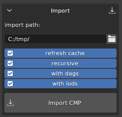
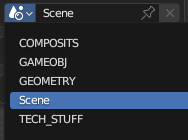
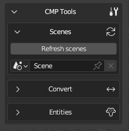
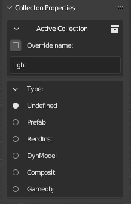
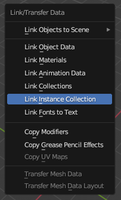
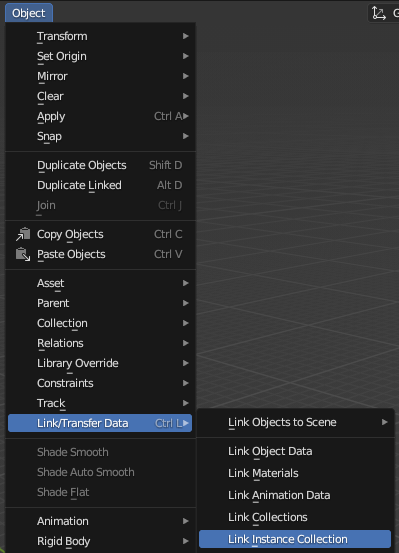
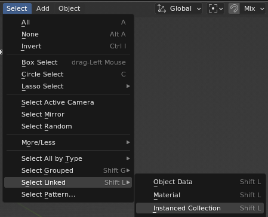
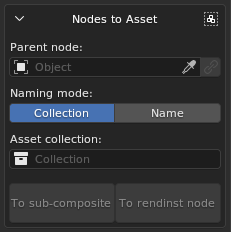
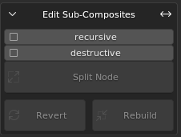
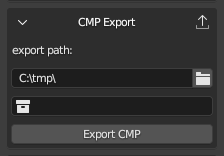

# dag4blend Composite Editor

## How to Enable

The Composite Editor is currently under development and is considered an
experimental feature. As such, it is hidden by default. To enable its
visibility, you need to check the **Composite Editor** box in the add-on
settings.


The Composite Editor can be found in the **N-panel** under the **Dagor** tab.
The panel is divided into four main sections: **Import**, **Export**, **Tools**
and **Node Properties**:


## CMP Import



- **import path**: this is the full path to the `name.composit.blk` file.
  However, if the correct project is selected, you can simply specify
  `name.composit.blk` or even just `name`, the add-on will locate and import it.

- **refresh cache**: to import subcomposites and geometry, the add-on needs to
  know where to find them. When this option is checked, the importer will scan
  all files in the active project directory once and record where everything is
  located. This list is then used during the import process, which significantly
  speeds up the operation compared to the previous version, where the directory
  might be searched multiple times across several levels of nesting.

  If you're importing composites from the same project, you can uncheck this box
  to save a few seconds, but only if you're certain the paths are up-to-date. A
  separate cache is maintained for each project.

- **recursive**: this option imports not only the specified composite but also
  its subcomposites, which are nodes, and their subcomposites. The algorithm
  should be self-explanatory.

- **with dags**: imports `.lod00.dag` rendinsts and `.dag` prefabs for all
  composites.

  If **recursive** is disabled, the import will only place the models found in
  the `.blend` file, and for all others, it will create empty collections.

  It makes sense to disable this option if you only need to slightly adjust the
  position of a specific node, or if you know that the required rendinsts are
  already present in the file.

- **with lods**: available only when the **with dags** option is enabled. Allows
  importing not only `lod00`, but all other LODs (level of detail) as well.

  Keep in mind that this will significantly slow down the import process and
  make the scene heavier. It's only reasonable to enable it when you need to
  modify the mesh (not node positions) in a small composite. For example, if you
  need to move a couple of apples so they don’t stick through the side of a box
  in a composite, and the pile of apples is a single mesh, you still need to
  update all LODs, not just the base one.

If a collection named after the composite already exists, it will be cleared and
reused for import. If it doesn't exist, a new collection will be created.

The importer respects the hierarchy of the `.blend` scene. Rendinsts and prefabs
are imported into the **GEOMETRY** scene, while composites are imported into
**COMPOSITS**.

If a `.dag` collection (rendinst or prefab) already existed before importing the
composite, that asset will not be re-imported.

The node type and name are explicitly written to the **Collection Properties**.
For rendinsts, this is not critical (since the name is stored in the `*.lods`
file, not in nested geometry collections), but for prefabs, this is important,
the **Override Name** option will use the overridden collection name.

```{note}
Don't forget to check the log.
```

### Blend File Structure

The Composite Editor also introduces a new file structure for `.blend` files.
Instead of having everything in a single scene, the new approach suggests using
multiple scenes, each organized by content type.



Scenes in Blender can be thought of as "`.blend` files within a `.blend`
file". They are independent of each other, meaning that settings like checkbox
states, export paths, and other parameters are unique to each scene.

- **COMPOSITS**. This scene is where all composites are imported.
- **GAMEOBJ**. Collections for game objects are created here. These objects are
  not automatically readable, so placeholders for previews (and some tools,
  discussed later) must be manually added.
- **GEOMETRY**. This is where all `.dag` files are imported, including through
  dag-imports if the scene exists.
- **Scene**. The default scene that exists in a new `.blend` file. Any scenes
  you create will also appear in this list; tools do not delete user-created
  resources.
- **TECH_STUFF**. Ideally, you should never need to use this scene. It contains
  temporary collections of random nodes, and in the future, other resources
  required for the add-on's internal tasks.

These scenes are not linked to each other. To transfer resources between them,
the add-on adds a collection called **TRANSFER_COLLECTION** to each scene. This
collection isn't a copy but the same entity across all scenes. For example, you
can enter the **GEOMETRY** scene, create nodes from the necessary rendinsts,
place them in this collection, and then switch to the **COMPOSITS** scene to
start assembling your composite using those nodes.

If you want to set up this scene structure without importing a composite, or if
you've accidentally deleted the **TRANSFER_COLLECTION**, don't worry. The **CMP
Tools > Scenes** section includes a button for creating or updating the scene
structure, along with a duplicate scene switcher. This dropdown differs from the
standard one in that it prevents accidental deletion or duplication of scenes.



### Creating Nodes

Let's start by exploring the different methods for creating nodes. There are
several approaches:

1. **Adding an Empty Object**

   You can add an Empty object to the scene, enable instancing in the
   **Entities** panel, and select the desired object's collection from the
   dropdown menu. If instancing is disabled, or the collection is not specified,
   the node will be exported as empty.

   

2. **Dragging a Collection**

   In the **Outliner**, you can drag the collection containing the desired asset
   into the 3D view.

   ```{eval-rst}
   .. grid:: 1
      :class-container: center-grid

      .. grid-item::
         :class: center-cell
         :child-direction: row
         :child-align: center

         .. image:: _images/dag4blend_comp_ed_07.png
            :height: 25em
            :class: image-gap

         .. image:: _images/dag4blend_comp_ed_08.png
            :height: 25em
   ```

   In this case, there is no need to enable instancing.

3. **Enabling Instancing via Object Properties**

   Add an Empty object and enable instancing through the **Object Properties**
   panel (Blender's native properties, not the add-on's).

   

The first method is effectively a more flexible version of the third. Why is it
more flexible? This will be explained below.

### Editing Nodes

To convert a standard node into a random node, simply click the **"+"** button
in the **Entities** panel.


The second entity will initially be empty, and you can assign a collection to it
either through the dropdown menu, by entering the collection name manually, or
by dragging it from the **Outliner** into the field.

```{important}
There is no safeguard against incorrect selections, so all collections are
available for selection. Ensure that the chosen collection is indeed a node.
```

To set a weight different from the default value of `1.0`, click **Init weight**
and enter the desired value in the newly generated field.

By default, all entities are displayed immediately, which may hinder your
workflow. To hide one or more entities in a random node, click the **Monitor**
icon next to its name.

To delete an entity, click the **Trash** icon. Once only one entity remains, the
node will revert to a non-random state.

### Setting Node Types and Changing Display

In composites, it's possible (and sometimes necessary) to specify the node type,
whether the asset is a rendinst, game object, composite, or prefab. The importer
determines the type automatically, but when creating new nodes, you'll need to
specify it manually.

In Blender's editor, an asset is represented by a collection that is drawn over
an Empty object. Therefore, the type needs to be set in the collection's
properties. When the Composite Editor is enabled, a new panel, **Type**, is
added to the **Collection Properties**.

To specify the type, click the **circle** next to the appropriate type, and your
selection will be highlighted. A newly created collection will show
**Undefined** as the active value until a type is set.



During export, the collection's name (without any suffix like `.lodNN`, `.lods`,
or `.002`) and its type, if specified, will be recorded. Nodes with instanced
collections such as:

- `asset`
- `asset.lods`
- `asset.lod01`
- `asset.001`

are treated equivalently by the exporter (assuming their types are the same).
The "suffix trimming" allows you to toggle the display of all rendinst LODs at
once (by default), switch to only the base LOD for cleaner and more accurate
display, or focus on the LOD with collision to check for intersections between
the *parent* and *child* colliders for proper destruction setup.

To hide a mesh from the composite preview, you can disable its original in the
source collection for the viewport using the monitor icon, as you did with
entities in the previous section. This is useful for disabling collision meshes,
for example, when you want to view LODs with collisions but not the colliders
themselves, or temporarily disabling decals if Z-fighting is visually
distracting.

Any collection can be used:


### Node Hierarchy in Composite

To establish a *parent*-*child* relationship among nodes and build a more
complex hierarchy, use Blender's standard tools.

You can set a *parent* for a node through the object's properties. However, this
will cause the matrix to recalculate, resulting in the object visually "jumping"
as its new "zero" point changes.


To maintain the node's visual position, use the **Set Parent** command, either
by pressing {bdg-dark-line}`Ctrl+P` or through the **Object > Parent** menu.

To reverse this process and remove the parent while preserving the matrix, use
the {bdg-dark-line}`Alt+P` shortcut or select the option in the same **Object >
Parent** menu.

### Using Blender's Built-in Features

To display nodes as Empty objects, the Composite Editor uses Blender's built-in
feature: **collection instancing**. As a result, tools that work with collection
instancing also work with composites.

#### Replacing Multiple Nodes Content

If you need to quickly replace the content of multiple nodes with the same
asset:

1. Select all the nodes you want to replace.
2. Assign the desired collection to the active node (the order of this step and
   the first one can be swapped – both work the same).
3. Then, link the same collection to all the selected Empty objects. You can do
   this by pressing {bdg-dark-line}`Ctrl+L` and selecting **Link Instance
   Collection** (the default hotkey),

   

   or by accessing the same option through the **Object > Link/Transfer Data**
   menu if your hotkeys have been customized.

   

#### Selecting Identical Nodes

Nodes that share the same instance collection can not only be merged, but also
selected together:

1. Select the node containing the asset you want to locate in the scene.

2. Use **Select > Select Linked > Instanced Collection** to select all other
   nodes that reference the same collection.

   

   In the default keymap, this menu can be accessed with
   {bdg-dark-line}`Shift+L`.

#### Snap to Surface

Remember that snapping also works here. For placing objects on an uneven
surface, you might find the **Face** snapping mode with **Project Individual
Elements** active to be useful. This ensures that all selected nodes will snap
their pivot points to the surface. Optionally, you can also enable rotation to
match the surface normal.

```{important}
Do not confuse this with the `place_type:i` setting for exported nodes, this
specific snapping needs to be set in the **dagObject Properties** of the Empty
object if required.
```

## CMP Tools

Contains several main sections.

### Scenes

A single button initializes the file structure with separate scenes for game
objects, geometry, composites, etc.

Pressing the button again restores this structure. For example, to recreate a
deleted `TRANSFER_COLLECTION` or missing scenes.


### Basic Converters

Operators that convert the selected object into another type. For example, an
instance collection into a mesh, and vice versa.


- **Nodes to mesh**: converts each selected node into a single mesh.

  This operator does not analyze the node contents. If the node includes several
  LODs or collisions, all of their geometry will be merged into one mesh without
  any object properties. Custom normals are also not preserved.

  The operator was primarily designed for exporting composites as `.dag` files
  to 3ds Max, which currently cannot import composites directly.

  It can also be useful in combination with the following operator.

- **Mesh BBOX to node**: converts the bounding boxes of all selected objects
  into instances of the selected collection. This is intended to simplify
  placement of objects such as `indoor_wall`, `envi_probe`, `wall_hole`, and so
  on.

  The required collections must be created manually.

  After that, you can hide the collection completely and leave it untouched.
  Simply add a few meshes for future game objects and transform them however you
  like, either in *Object* mode or *Edit* mode. The pivot position does not
  matter. The replacement will work correctly as long as the bounding box is
  correct before conversion (its display can be enabled in **Object
  Properties**).

  An extreme example (such rotations are unlikely to be needed in practice):

  

  

  

  It's recommended to add a 1-meter cube with a `gi_black` material to the
  collection of the future game object for clarity. This way, you can later
  temporarily convert it back into a mesh for adjustments.

### Nodes to Asset

This section contains more advanced converters with similar functionality. They
allow you to create a new rendinst or composite from the selected nodes.



#### Parent Node

Expects an Empty object. If not specified, the center of the new asset will be
placed at the scene's origin. If specified, the pivot of the new asset will be
placed at the position of that Empty.

If a selected node is accidentally deleted from the scene, it will still remain
in the `.blend` file. The button on the right allows you to re-link a mistakenly
deleted Empty back into the scene.

#### Naming Mode

- In **Collection** mode, you can choose the collection to which the new asset
  will be sent.

  If none is specified but the parent node has an **Instance Collection**, the
  new asset will be placed there, replacing its previous contents.

  If no collection is specified either directly or through the parent node, the
  asset will be named `new_asset` and placed into a collection of the same name.

- In **Name** mode, a collection will be automatically created in the correct
  scene, and the user only needs to enter the desired asset name.

#### Operators

- **To sub-composite**: creates a new collection containing a composite and
  moves the selected nodes into it. The new composite will be assigned as the
  entity of the **Parent Node**.

- **To rendinst node**: breaks down the selected nodes to the rendinst level and
  organizes the LODs into subcollections so that the rendinsts can be easily
  exported in **Collections Separated** mode.

  This operator does not take LOD distances into account; it simply checks how
  many LODs exist in the root objects. All `lod00` objects are placed into a
  `*.lod00` collection, all `lod01` objects into `*.lod01`, and so on.

  The operator will not execute correctly if any of the selected nodes lack the
  standard hierarchy, i.e. a collection named `name.lods` containing
  `name.lod00`, etc.

### Edit Sub-Composites

These operators are designed to modify the hierarchy within composites.



#### Split Node

Breaks down a composite node into its components. For example, it can replace a
node like `some_building_indoor_stuff_cmp` with the individual props contained
within that composite.

- If the **recursive** checkbox is enabled, not only the selected composite will
  be unpacked, but all its sub-composites as well, down to the individual
  rendinst nodes. Otherwise, only one level will be unpacked.

- If the **destructive** checkbox is enabled, the extracted nodes will appear
  directly in the root of the collection, and the original node will be
  permanently deleted. If not enabled, the original node will remain in place
  but with instancing disabled, and the new nodes will be parented to it. In
  this case, the following operators can be used.

#### Revert

Works only on nodes previously unpacked using **Split Node**. It deletes all
child nodes of the unpacked subcomposite and restores instancing, the composite
will once again be drawn inside the node.

#### Rebuild

Also works only on previously unpacked nodes, but is intended to apply changes
rather than revert them. The contents of the unpacked composite are replaced
with the current child nodes of the processed instance.

#### Usage Examples

1. You've imported a building composite with all nested levels. Inside
   `indoor_stuff`, a picture is positioned incorrectly, it floats in the air
   with a visible gap from the wall.

   In the building composite, select the `indoor_stuff` node and apply **Split
   Node**, ensuring both checkboxes are disabled. Now you can move the
   `indoor_stuff` nodes while seeing their correct position within the final
   asset. Move the picture flush against the wall, select the original
   `indoor_stuff` node, and click **Rebuild**. Done, the `indoor_stuff`
   collection has been updated and can now be exported so the changes appear in
   Asset Viewer.

   If, after unpacking the composite, you accidentally deleted a table, you can
   use **Revert** instead of **Rebuild** to return the node to its original
   state and try again.

2. You've imported a building composite created in daEditorX, where all nodes
   are placed in the root.

   You need to divide it into subcomposites. Select the decorative wall assets
   and, in **Name** mode, create a new subcomposite called `my_building_decor`
   with its origin at the scene center. Repeat the process for `indoor_stuff`
   and other groups.

3. A level designer assembled wooden floors from many separate planks. It looks
   good, but destruction behaves poorly, and there are too many nodes per cell
   in the level.

   Import the composite, select all planks, and create one rendinst instead of a
   composite made up of dozens of individual planks, assigning meaningful names
   to each rendinst. If needed, merge nodes within the rendinst and optimize
   collisions and LODs. The process isn;t fully automated, but it;s a solid
   starting point for cleanup and optimization.

## CMP Export

The **CMP Export** section is straightforward: specify the directory path where
the composite should be exported, along with the collection representing the
composite to be exported.



### Parameters

Export parameters, such as random offsets, are specified in the **Object
Properties** of the Empty object. These parameters do not appear
in the viewport. During import, only the initial state (the first part of the
value) is applied, but any random deviation (the value after the comma) will not
be.

If a node has at least one random field specified, its transformation matrix
will not be saved. If the imported node has both a matrix and random fields, the
random parameters will be ignored, and a corresponding notification will be
logged.


Some of the parameters are also displayed in the Composite Editor, under the
**Node Properties** panel:


This section shows the list of Entities, their weights, and the special
parameter **Place Type**. Internally, this is a numerical value, it can still be
viewed in the standard **Object Properties** list, but here it's presented in a
more user-friendly way, displaying mode names instead of numeric indices.

### Limitations of the Composite Editor

- **Includes Not Supported**

  Currently, includes are not supported. Lines with the `include` directive are
  ignored during import, which may lead to some data loss. This will be noted in
  the log.

- **Blender's Limitation**

  Blender supports a maximum of 7 levels of nesting. Multi-level composites may
  experience performance issues and may not display correctly – starting from
  the 8th level of nesting, the content will not be rendered. However, import
  and export are still possible.

  For example, a node-rendinst represents one level of nesting. A random node
  with several rendinsts represents two levels. A subcomposite with these random
  nodes would be three levels, and so on. This issue mainly arises when
  importing buildings with interiors, such as in daNetGame-based games, where
  `indoor_stuff` includes numerous nested composites with randomness – like
  random cabinets with objects placed on the shelves, each with random offsets.

- **Axis Mismatch**

  In Blender, the Z-axis is up, while in Dagor, the Y-axis is up. While matrix
  adjustments are handled automatically, preventing scenes from tilting, it's
  important to remember that `offset_y:p2` refers to up/down movement despite
  the name. The same logic applies to rotation and scaling.

- **Random Offset Parameters**

  Currently, random offset parameters do not automatically display in the
  viewport. During import, the add-on sets the initial offset, but if you add or
  modify a random parameter, you'll need to manually adjust the node's position.


