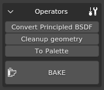
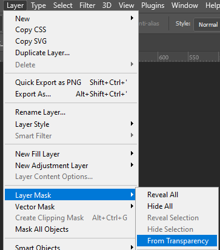

# dag4blend Texture Baker

## Overview

This tool is designed to convert "heavy" materials into a single low-resolution
`rendinst_simple` material, suitable for use on the last LOD (Level of Detail).
It is also useful for porting assets to mobile projects.

Starting from version `2.2.0`, the baker also supports re-baking *Blender*'s
Principled BSDF, enabling the transfer of assets with textures from other
software via GLB/glTF with texture conversion, as well as "mixing" materials
directly in *Blender*.

## Where to Find It

The **Bake** panel is located in the N-panel under the **Dagor** tab. To ensure
proper operation of the baking process, you need to specify the rendering device
in *Blender*'s **Edit**▸**Preferences** settings. However, this parameter is set
for any render, so it is likely already configured.


<br>

## Settings

Here, various parameters for the upcoming bake are organized into groups.


<br>

### Renderer

You can choose the device to perform the baking – either the CPU or GPU – and
set the number of samples. It is recommended to start with one sample and only
increasing the value if the bake appears "noisy".

### Inputs

Here, you can select the baking mode – either from the object to itself or from
one object to another. Depending on the mode, the parameters may vary slightly.


<br>


<br>

- **Asset**: The collection containing the asset to be baked. It will be
  converted to **Lowpoly** when the mode is switched.
- **Highpoly**: The collection with the asset from which the bake will be
  performed. This is only relevant in the second mode, so it is hidden in the
  first.
- The **Recursive** checkbox determines whether to check child collections. If
  baking a house for *War Thunder* that consists of a base and several `_dp`,
  it's better to place their collections in a parent collection and activate
  this parameter.

```{important}
The parameters below are only relevant when baking from one object to another,
but not from UV to UV.
```

- **Use Cage**: Whether to use a cage for baking. This option is only relevant
  when baking from object to object, so it is hidden in the first mode.
- **Extrusion**: Defines how much the search area for the high-poly will be
  "inflated" along the normal. If the **Use Cage** checkbox is active and a
  custom cage is not specified, the low-poly node itself will be used as the
  cage, inflated evenly without considering sharp edges. If the checkbox is not
  active, the inflation will account for sharp edges.


<br>


<br>

- **Max Ray Distance**: Specifies the distance from the cage (inward) to search
  for baking information. If set to zero, the ray is not limited.

### Active Node

This tab only exists in the **HP to LP** mode and allows for detailed settings
for Lowpoly nodes. It displays the parameters of the active object.


<br>


<br>

- **Cage**: If the **Use Cage** checkbox is active, you can specify a custom
  cage here. Press **Init Custom Cage** to create a parameter reference, then
  select the desired node. This can be done from the general list by clicking on
  the parameter, using the eyedropper from the Viewport or Outliner, or simply
  dragging the node from the Outliner. You can delete the parameter entirely by
  pressing the **trash can** icon, or reset it with **X** and select a different
  node. If the selected node does not match the topology of the baked object,
  the bake will fail with an error.

  ```{important}
  Do not place the cage in the **Lowpoly** or **Highpoly** collection.
  ```

- **Highpoly** allows you to specify nodes from which information should be
  captured for the active node. If nothing is specified, the bake will be
  performed from each Highpoly node sequentially, which can take a significant
  amount of time. It is better to specify only the relevant sources. To do this,
  click on **ADD** and select sources similarly to how the cage is selected.
  Multiple sources can be selected.

### Outputs

This section allows you to define what you want to get as output.


<br>

- **tex_d**, **tex_n**: Checkboxes for selecting the corresponding textures. If
  neither is active, the bake will not start as there is nothing to bake.
- **Width** and **Height**: The resolution of the output texture. Limited to
  powers of two.
- If the **Reveal Result** checkbox is active, the add-on will open the
  directories containing the output files after a successful bake.
- **Tex Dirpath**: Where to save the textures. You can enter the path as text or
  select it through *Blender*'s built-in file browser by clicking the folder
  icon on the right.
- **open texture folder**: Opens the specified directory using your operating
  system's file explorer.
- If the **Save Proxymat** checkbox is active, the baker will also create new
  `rendinst_simple` proxy materials from the new textures. If one of the
  textures is missing in the directory (for example, if only **tex_d** was
  baked), the process will be interrupted with a corresponding log entry. The
  path for saving it is set in the same way as for textures.

The add-on can also assign the resulting proxymat immediately after baking. In
this case, unnecessary UVs and materials will be removed, and the Bake UV
channel will be renamed to UVMap, which the add-on expects for correct display.
This saves time if you need to export the result as render instance. If the
Viewport result is unsatisfactory and needs re-baking, the assignment of the
proxymat and deletion of information can be undone with `Ctrl`+`Z`.

```{seealso}
For more information, see
[Proxymats](../../../../assets/materials/proxymats.md).
```

## Operators



<br>

- **Convert Principled BSDF**: As the name suggests, this converts *Blender*'s
  standard shader, allowing it to be baked as
  [rendinst_simple](../../../../assets/shaders/dng-shaders/rendinst_simple.md).
  Useful when the material was mixed directly in *Blender* or when an asset was
  imported from GLB/glTF from another program along with textures.

- **Cleanup geometry**: Removes unsupported shader polygons from the source
  geometry. How do you know if a shader is supported? In the *Shader Editor*,
  the material's Shader node should have outputs for `_tex_d_rgb`,
  `_tex_d_alpha`, `_tex_met_gloss`, and `_tex_mask`. This feature is primarily
  designed for decals, which cannot be baked. *Blender* cannot bake through
  transparent polygons; the top polygon will completely overwrite the
  information beneath it.

  If there is an unsupported shader on the geometry that is important for
  baking, you can reassign it to a similar one. For example, the unsupported
  [rendinst_mask_layered](../../../../assets/shaders/dng-shaders/rendinst_mask_layered.md)
  can be replaced with
  [rendinst_perlin_layered](../../../../assets/shaders/rendinst_perlin_layered.md).
  This does not have to be done manually. In the directory with the installed
  add-on, there is a text file with remapping parameters:

  `C:\Users\<username>\AppData\Roaming\Blender Foundation\Blender\<version
  number>\scripts\addons\dag4blend\extras\remap.txt`.

  Use a colon to specify the name of the missing shader node and the name of the
  replacement node. If you only want to change the material, specify its name.
  If you also want to remap texture coordinates, include them as well (same
  names with the `_uv` postfix).

- **To Palette**: As the name suggests, creates a "palette" of materials. A
  plane is created for each material with the name of that material and the Bake
  UV layer. Useful when you need to re-bake tiles – the actual geometry of the
  asset would only get in the way for such a task.

- **BAKE**: Starts the baking process. Creates texture files (asset collection
  name + texture type postfix separated by `_`). The collection name is
  truncated at the first dot, so `my_material.001` creates
  `my_material_tex_d.tif` instead of `my_material.001_tex_d.tif`. It also
  removes endings indicating the LOD number.

  If something goes wrong, it will display an explanatory popup and write a log
  entry.

  Baking is performed on the UV channel named Bake – you need to create it for
  all low-poly objects. Shaders are bound to the naming of UV channels, so
  renaming existing ones is not recommended.

## Scene Requirements

- All geometry used in the bake must be visible and selectable when you press
  the **BAKE** button. The only exceptions are optional cages.

- The source geometry must only have supported shaders. The receiver geometry
  must have a UV channel named `Bake`. For self-baking, this is the same asset.

- Naturally, the UV layout must be reasonable. It's not enough to just create a
  UV channel; you also need to unwrap it properly.

- Everything outside the unit square will not affect the result – shift
  overlapping geometry left/up to avoid strange artifacts from blending
  information from different triangles in the same place.

## Limitations

The output textures and proxymat are ready for use in the engine and display
correctly in most image viewers and editors. However, *Photoshop* is currently
an exception. It does not interpret the alpha channel correctly, neither
displaying it as the fourth channel nor as a layer mask.


<br>

If you need to make changes to the alpha channel of such a texture, here's a
temporary solution: **Layer**▸**Layer Mask**▸**From Transparency** allows you to
extract the alpha channel into a mask. After this, you can copy the mask's
contents, delete the mask, and place its copied contents into a new alpha
channel.



<br>

This solution is not the most elegant, but it works. Apply it only when
necessary to edit the alpha.


