# dag4blend

## Installation

1. Go to **Edit**▸**Preferences**▸**Add-ons** in *Blender*.

2. Click **Install...** and navigate to the `.zip` file of the add-on.

3. After installation, check the box next to the add-on in the list.

Before starting, you need to perform some initial configuration, so do not close
the **Preferences** window yet:


<br>

The path for **ObjProps presets:** and shader list **dagorShaders.cfg:** can now
be set manually. This feature ensures that updating the add-on does not
overwrite any user-made changes. It is recommended to store presets outside the
add-on directory.

Until the path to an existing directory is specified, the preset menu will not
be displayed. For each project you  work on, you need to specify the path to the
`\assets` directory.

Set the name (it can be any name as long as it is clear to the user), specify
the path, and click **+ ADD Project** to add the project to the list of
available projects.

```{note} Many interface elements have tooltips that appear when you hover the
cursor over them.
```

Starting from version `dag4blend2.0`, projects have additional parameters
available. These parameters can be found in the **Projects** panel:

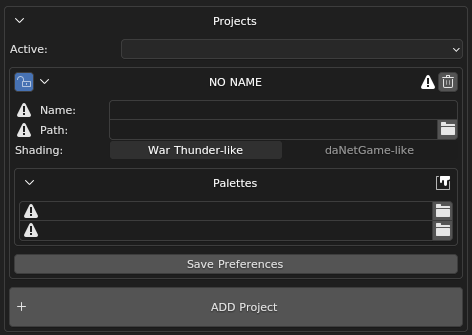

<br>

- **path:** You can edit the path after adding a project – for example, if you
  move resources to a different drive. You no longer need to delete and re-add
  the project with the new path.

- **Shading mode:** Shaders behave slightly different between projects. The
  add-on is designed to adapt to two main shader groups: *daNetGame*-like and
  *War Thunder*-like shaders.

- **Palettes**: There are default global and local palettes.

- **Experimental Features**: New tools that are functional but have some
  limitations. Currently, these include a [*Composite
  Editor*](#composite-editor) and [*Texture Baker*](#bake) tools:


<br>

The active project is set through the menu in the scene properties. You can also
change palettes here without needing to go into **User Preferences** each time:

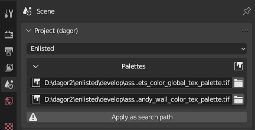

<br>

```{note} The add-on applies settings when these parameters are changed, but
only if there is an appropriate target. Therefore, to fix the **Shading mode**,
you need to re-select the project after creating at least one dagormat in the
scene. For **Palettes**, re-select the project after creating a painted
dagormat.

By default, the global and local palettes will be simple red and green fills,
and the shaders will be in *War Thunder*-like mode. To correct this, re-select
the project from the dropdown after the first asset import or creation.

```

## Log and Text Editors

Text objects play an important role in this toolset, so it is recommended to add
a text field to your layout or add a new window with just a text field if you
are working with multiple monitors.


<br>

The import/export functions (and future ones) write execution information to a
text  **log** field.

```{note}
The **log** does not clear itself, so remember to clear it periodically after
ensuring that there are no unchecked errors and warnings. To clear it, you can
simply delete the text object. The next time you need it, the toolset will
create a new one. This approach can be faster than selecting all the lines and
deleting them with `Backspace`/`Delete`.
```

To edit object properties, dagormats, or proxymats as text, the toolset creates
a special text object. The name of the object is provided in the tooltip.

```{seealso}
For more information, see
[Proxymats](../../../../assets/materials/proxymats.md).
```

## Material Setup

For setup material for *Dagor Engine*, there is separate **dagormat** tab. It
contains several subtabs that can be collapsed when not needed:

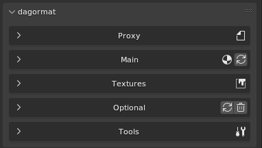

<br>

### Main

Here you can choose whether the material is two-sided, and if so, how it
behaves:

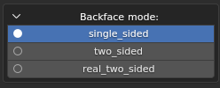

<br>

- **single_sided**: Enables backface culling for triangles with this material.

- **two_sided**: Each triangle is rendered from both sides. The shader is
  slightly heavier, but the geometry is lighter. Use this primarily for heavy
  geometry, such as tree crowns.

- **real_two_sided**: In the engine, a single-sided material is uses, but each
  triangle with this material will be duplicated and flipped to be visible from
  the other side. This shader is lighter, but it doubles the mesh weight. It is
  better used on simpler meshes.

Below is a list of **legacy** properties: *ambient*, *specular*, *diffuse*,
*emissive* and *power*. Hover over them to see tooltips describing each
property.

This tab also allows you to select a shader from the available options or
manually enter a value. It is useful if new shaders have been added to the game
but the toolset has not been updated yet.

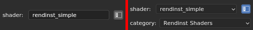

<br>

The list of shaders and their possible parameters are taken from
`dagorShaders.cfg`, which by default is located at:
`C:\Users\<username>\AppData\Roaming\Blender Foundation\Blender\<version
number>\scripts\addons\dag4blend`.

### Textures

This section lists the textures in use. Indices (matching those stored in `.dag`
files) are available in tooltips. You can copy and paste paths from [*Asset
Viewer*](../../../asset-viewer/asset-viewer/asset_viewer.md) or Explorer; quotes
will be removed automatically.

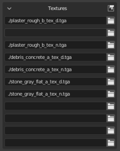

<br>

### Optional

Visual editing of shader parameters. You can manually enter values or select
from a list, similar to how shader selection works.


<br>

### Tools

Here you can edit the active material in text format.

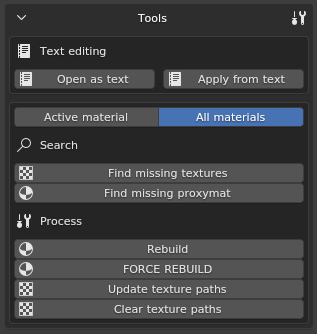

<br>


<br>

If there is no text editing field, one will be added to the left of the
viewport, otherwise, the text will be opened in the first available text field.

Search is available in two modes: only for the active material or for all
materials in the scene. Switch modes by clicking the text indicating the current
mode.

A correctly specified project is required for search to function properly – when
working on a daNetGame asset, specify *daNetGame*.

- **Find missing...**: Finds all textures and all proxymats (if they exist in
  the project). The texture search only affects viewport display and does not
  alter the material path.

- **Rebuild materials**: Rebuilds the materials for the viewport.

- **Update texture paths**: Finds non-existent paths and replaces them with
  current ones. Should be used after texture search.

- **Clear texture paths**: Removes directory information, leaving only texture
  names.

### Proxy

The add-on now supports proxymats.


<br>

Proxymat parameter information is taken from the `.blk` file, so all settings
for them are hidden. Instead, a new tab allows you to specify the path to the
proxymat directory. It can still be edited as text or temporarily unchecked as
**is proxymat**.

Changes can be reverted by reloading information from the file or saved to the
proxymat. Any regular material can also be converted to a proxymat by toggling
the checkbox and saving it to the desired directory.

```{note}
Proxymats in *Blender* use the file name, not a user-defined one. Upon import,
shaders are automatically renamed if the name differs.
```

```{seealso}
For more information, see
[Proxymats](../../../../assets/materials/proxymats.md).
```

## Object Properties

Located in the N-panel under the **Dagor** tab, it shows parameters of the
active object and is hidden if there is no active object.

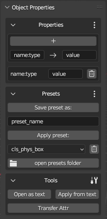

<br>

### Properties

Visual editing allows you to add or remove parameters individually and change
their values.

The UI format is determined by the `value` string. If the wrong UI option
appears (e.g., `prop:r=0` gives an integer toggle, while the variable should be
a float slider), enter the parameter name in the **name** field and the correct
format value (e.g., `0.0` instead of `0` for a float slider). Specify the type
in the name using `:`.

### Presets

Once properties are configured, you can save them as a preset for quick
application to other objects.

To save the active object's properties, enter a name for the preset and click
**Save preset as:**. To apply an existing preset, select it from the dropdown
and click **Apply preset:**.

Since presets are simple text files, you might want to edit them in a text
editor. The **open presets folder** button opens the directory containing all
presets in `.txt` format, where you can add, delete, or edit them. Changes are
applied immediately.

### Tools

Editing in text format within *Blender*, similar to material editing, requires
opening the to the file specified in the tooltip by clicking **Open as text**.

**Apply...**: Applies changes from the text.

**Write example**: Writes an example to the text (without applying it, since
you will likely need to modify the example for your specific situation).

**Transfer Attr**: Copies the properties from the active object to all selected
objects, saving time on manual copying.

Starting from `version 2.1.0`, the text object **props_temp** opens
automatically if the internal text editor is open.

```{note}
Incorrect values in Object Properties are recorded in a new **broken
properties** field; separated by `;`, allowing manual recovery. Similarly,
incorrect values when using **Apply from text** are recorded.
```

## Export

Like any other import-export add-on, the `.dag` exporter is available through
**File**▸**Export**. However, to save time during multiple re-exports in the
workflow, the exporter is also available in the N-panel. The functionality is
identical, so choose the option that is most convenient for you.

### Batch Export

General parameters:

- **vNormals**: Saves custom normals if they have been added to the object.
  Without custom normals, even with the checkbox active, the export will include
  smoothing groups.

- **applyMods**: Exports geometry with visible modifiers applied.

- **Optimize Materials**: Keeps only the materials used on at least one polygon
  for each object.

- **Path**: The path where the file will be saved.

- **Cleanup Names**: Ignore indices (`.000+`) during export.

```{note}
Use **Cleanup...** only for exporting composite parts for *3ds Max*! It can
cause issues. In a `.dag` file for the game engine, there should not be multiple
objects with the same name.
```

- **Name**: Context-sensitive field, appearing only when exporting to a single
  `.dag` file. This field is hidden in other export modes.

- **Collection**: Also context-sensitive field. You do not need to select a
  collection from the dropdown; you can simply drag the desired collection from
  the **Outliner**.

- **Limit by**: Allows you to choose the export mode.

#### Examples

1. **Limit by:** Visible

   **Export object:** export all scene contents to `Path\<Name>.dag`.

   **Example input:**

   

   <br>

   **Example output:** `C:\tmp\asset.dag` – contains all scene objects with
   custom normals.

1. **Limit by:** Sel.Joined

   **Export object:** export selected objects to `Path\<Name>.dag`.

   **Example input:**

   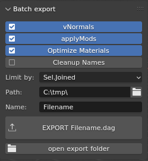

   <br>

   **Example output:** `C:\tmp\asset.dag` – contains only selected scene
   objects.

1. **Limit by:** Sel.Separated

   **Export object:** export selected objects to separate `.dag` files, where
   the names of selected objects are used as file names.

   **Example input:**

   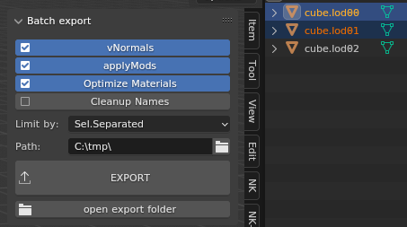

   <br>

   **Example output:** `C:\tmp\cube.lod00.dag`, `C:\tmp\cube.lod01.dag`.

1. **Limit by:** Col.Separated

   **Export object:** export collections from the hierarchy starting from the
   selected one, if there are no subcollections inside. The **exportOrphans**
   checkbox allows exporting objects that lie next to subcollections.

   **Example input:**

   

   <br>

   **Example output:** `C:\tmp\cube.lod00.dag` – contains visible geometry and
   occluder inside, `C:\tmp\cube.lod01.dag` – contains visible geometry and
   collider inside and `C:\tmp\cube.lod02.dag`. `C:\tmp\cube_temp.dag` – will
   not be exported, because the **exportOrphans** checkbox is not active. If
   you don't specify the collection at all, then in this case the result will
   be identical, because the check will start with **SceneCollection**, and it
   contains only the **cube** collection.

2. **Limit by:** Col.Joined

   **Export object:** export all contents of the selected collection to a file
   with the name of this collection. Created mainly for [*Asset
   Viewer*](../../../asset-viewer/asset-viewer/asset_viewer.md) of assets
   created from several `.dag` files.

   **Example input:**

   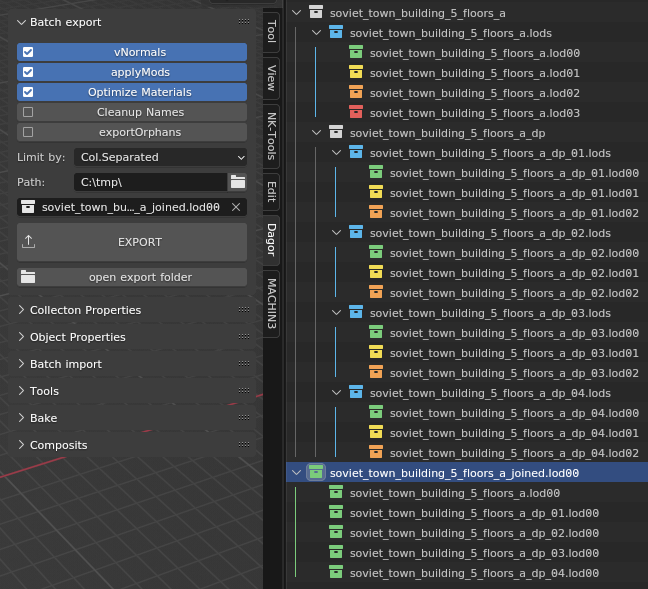

   <br>

   **Example output:**
   `C:\tmp\soviet_town_building_5_floors_a_joined.lod00.dag`, containing all
   null LODs related to this building. The collections have been linked
   (transfer with `Ctrl` in **Outliner**), i.e. they are not copies, but the
   same collections. The rest of the temporary LODs (Level of Detail) can be
   prepared in the same way. It's much faster than selecting objects and typing
   the name manually.

   ```{note}
   Since they are the same collections and not copies, do not delete them with
   `Del`, but remove them with `RMB`▸**Unlink**, so that you don't overwrite
   them.
   ```

## Collection Properties

Located in the N-panel, similar to Object Properties. It shows properties of the
active collection. Unlike Object Properties, these properties exist only within
*Blender* and are used for internal purposes.

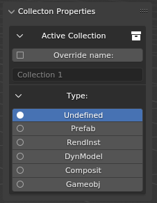

<br>

### Override Name

Allows you to override the name with which the collection will be exported to
**Col.Separated** mode. By default, overriding is disabled.

When importing `.dag` files with names longer than 63 characters (the *Blender*
limit), the name will be recorded in this field to preserve the "overflow"
characters. You can also manually rename it – check the checkbox and enter the
new name:


<br>

In the given example, the contents of the collection will be exported to
`C:\tmp\cube.lod00.dag` instead of `C:\tmp\Collection.dag`. However, this is not
the most useful application.

A much more practical use is when you need to save multiple `.dag` files in
different subdirectories. Here, you can specify a subpath that will be appended
to the main export path. If there is no need to rename the collection, simply
end the subpath with `*`, which will be replaced by the collection name during
export:

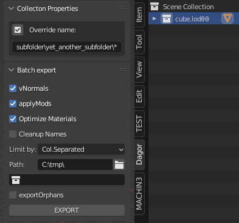

<br>

In this example, the export path will be
`C:\tmp\subfolder\yet_another_subfolder\cube.lod00.dag`, which is convenient for
working with complex assets like buildings. For example, windows in
`composit_parts\windows\*`, doors in `composit_parts\doors\*`, and so on.

Additionally, you can completely override the path – start it with the drive
letter:

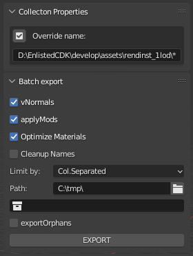

<br>

In this case, the **Path** field will be ignored for this collection, and the
file will be exported to `D:\daNetGame\develop\assets\rendinst_1lod\`.

#### Type

Used by the [*Composite
Editor*](../dag4blend-comp-editor/dag4blend_comp_editor.md). When importing, it
records the node type, and during export, it ensures a unique type (to avoid
double interpretation in the presence of asset namesakes, typically found among
composites and rendinsts). For manually created item intended for composite
export, set this manually.


<br>

Since it is used for composites, DynModel is in the list but not actually
applied – it can't be arranged through composites. Therefore, the composite
importer assumes all assets with `.lod**.dag` in their name are RendInsts, not
DynModels.

### Geometry Nodes

```{note}
Currently, geometry nodes cannot be combined with custom normals, as applying
the modifier erases them. If you're placing instances using geometry nodes,
don't forget to add the **Realize instances** node; otherwise, the geometry will
be lost during export. Technically, before this node, they are similar to
"empty" without their own geometry.
```

## Smoothing Groups

A bug was discovered in *Blender*'s function for calculating smoothing groups
for formats that use them. To solve this, a smoothing group editor has been
added. It's available in Edit Mode when Face selection mode is active.

Upon import, objects retain smoothing groups from the original file. New
objects, however, do not have smoothing groups, so you must create them with the
**Init** button:


<br>

When smoothing exist, the interface works similarly to *3ds Max*, but without
real-time display. Partial preview is available via **Convert to Sharp Edges**,
which shows only sharp edges from the smoothing groups.


<br>

Starting with `version 2.1.0`, the **Live Update** function recalculates hard
edges during smoothing group editing. This can slow down performance on heavy
geometry, so it is off by default.

From the same version, you can also select polygons by smoothing group. Click
the corresponding group button in the **Select by SG** subpanel.

```{note}
Selecting by smoothing group adds to the existing selection, rather than
replacing it. So, if you need to select only group 3, for example, clear the
selection first.
```

### When to use?

If a model has areas where sharp edges do not fully divide the surface into
closed regions, the smoothing group calculation will be incorrect and needs
manual adjustment. You may also need to adjust smoothing groups after modifying
existing `.dag` file post-import if the groups were saved as an attribute.


<br>

## Import

Similar to export, there are two methods for import – the standard method via
**File**▸**Import** and the batch import via N-panel.

### Import and Textures

A `.dag` file contains not only the texture name but also its path. However,
these paths are often become invalid when files are transferred. If the texture
path os invalid or only the texture name is provided, it will be replaced with a
UV checker texture. If a texture is used in multiple materials, updating the
path in one will update it across all materials.

Texture slots are still used as in
[rendinst_simple](../../../../assets/shaders/dng-shaders/rendinst_simple.md),
regardless of the chosen shader. Nodes do not overlap but are arranged
meaningfully. Images from all slots are now added to the *Shader Editor*, so
with **Node Wrangler** enabled, they can be viewed by pressing
`Shift`+`Ctrl`+`LMB`.

### File▸Import

Parameters:

- **Optimize material slots**: Removes unused slots and merges slots with the
  same material.

- **Import LODs**: Imports all LODs, not just the selected `.dag` file.

- **Import dps**: Imports all damage_parts (_dp).

- **Import dmgs**: Imports all damage versions.

- **Replace existing**: If a collection with the asset name exists in the scene,
  it will replace its contents with those from the `.dag` file instead of
  creating a duplicate with a `.001+` suffix. Useful for quickly reverting
  multiple changes.


<br>

For bulk imports, it's smart to use batch import.

### Batch Import

This panel allows importing `.dag` files from a specified directory.

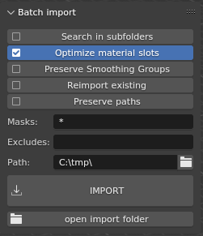

<br>

Options:

- **Search in subfolders**: Checks all subdirectories for files. Use cautiously,
  as it can hang *Blender* if too many matches are found.

- **Optimize material slots**: Same as in regular import.

- **Preserve Smoothing Groups**: Saves smoothing groups as an attribute to
  ensure they don't change during export. Not recommended if you plan to modify
  the geometry after import.

- **Preserve paths**: Saves the full path to the `.dag` file (including the
  file name) in Collection Property. Useful when importing file from multiple
  directories and needing to export them back to original locations.

- **Masks**: Specifies masks for import, using `*` instead of `.*` for multiple
  characters, and `.` instead of `\.`. Separate masks with `;`. Spaces are
  ignored.

- **Excludes**: Same syntax as masks, but for excluding files from import.

#### Example

Masks: `“asset_a.lod0[0,2]*; asset_b_dp*”; Excludes=“*_dmg*”` imports
`asset_a.lod00.dag`, `asset_a.lod02.dag`, and all LODs of all `asset_b_dp`,
except their `_dmg` versions.

- **Path**: The directory to search.

```{note}
*Blender* will be unresponsive until the import is complete. To monitor the
import process, open the console (**Window**▸**Toggle system console**).
```

#### Additional Features

Often, you may need to import a single asset that is already open in [*Asset
Viewer*](../../../asset-viewer/asset-viewer/asset_viewer.md) or Explorer.
Instead of searching for it through **File**▸**Import**, you can copy the path
from [*Asset Viewer*](../../../asset-viewer/asset-viewer/asset_viewer.md) or
Explorer (`RMB`▸**Copy as path**) and paste it into **Path** field of the batch
import panel. This action will automatically transfer the file name to
**Masks**, and clicking **IMPORT** will load only the desired asset.

If you only have the asset's name, you can enter it in **Masks** and then use
the **Apply as search path** button to set the entire project directory with
subdirectories as the search path.

If the path is unknown, the import will be slower by a few seconds (due to
search file), but this is often faster than searching the full path manually.

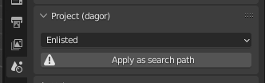

<br>

## Tools

The panel is continuously being improved. Tools are grouped into blocks that can
be collapsed when not in use to avoid cluttering the interface.

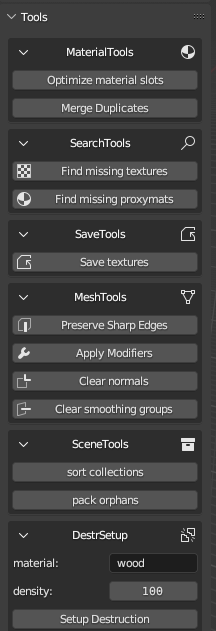

- **Optimize material slots**: Merges identical material slots and removes
  unused ones.

- **Merge Duplicates**: Merges identical materials with different indices (e.g.,
  `Material` and `Material.001`). These duplicate materials often arise when
  copying objects using `Ctrl`+`C` / `Ctrl`+`V`, as this operation saves the
  selection to an external `.blend` file and then appends it to the active scene
  along with all its materials.

- **Find missing textures**: Searches the textures without valid paths in the
  selected project's directory.

- **Find missing proxymats**: Similar functionality for proxymats.

- **Save textures**: Collects all textures with valid paths from selected
  objects and saves them in the `/textures/` subdirectory of the export
  directory.

- **Preserve Sharp Edges**: Marks sharp edges based on Autosmooth Angle, and
  sets the angle to 180&deg; to ensure consistency between the model in the
  scene and in the `.dag` file. This function is not mandatory before exporting,
  as it will automatically apply to the exported geometry (keeping the original
  scene geometry unchanged).

- **Apply Modifiers**: Applies modifiers to the geometry. Not mandatory before
  export as the exporter can preserve modifiers in the original scene.

- **Clear normals**: Removes custom normals from selected objects.

- **sort collections**: Recursively groups scene collections by the longest
  matching name prefix. You can see the example on the screenshot for the
  [“Col.Joined” export](#batch-export).

- **pack orphans**: Searches for objects not at the hierarchy's bottom and
  creates individual collections for them.

- **Setup Destruction**: Assigns a list of typical object properties for
  destruction to all selected objects:

<br clear="left">

```
  animated_node:b=yes
  physObj:b=yes
  collidable:b=no
  massType:t=none
```

Creates *bounding boxes* (BBoxes) objects with `gi_black` material, sets them as
children, and assigns collider parameters:

```
  materialName:t=[value from the material field]
  density:r=[value from the density field]
  massType:t=box
  collType:t=box
```

The BBoxes may still need to be adjusted and scaled to better fit the
silhouette. In some cases, they may also need to be duplicated. However, this
process still saves time in the overall setup.

## Experimental Features

### Bake

Allows baking textures from complex shaders to
[rendinst_simple](../../../../assets/shaders/dng-shaders/rendinst_simple.md).
Commonly used for final LODs or porting assets to mobile projects.

```{seealso}
For more information, see
[*Texture Baker*](../dag4blend-texture-baker/dag4blend_texture_baker.md) tool.
```

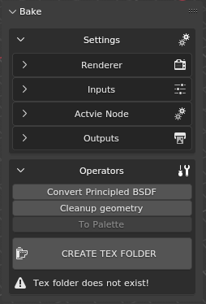

<br>

### Composite Editor

```{seealso}
For more information, see
[*Composite Editor*](../dag4blend-comp-editor/dag4blend_comp_editor.md).
```


<br>

#### General Limitations of the Add-on Tools in Blender

- Limitation on the number of characters in the name – names longer than 63
  characters will be truncated, and when importing objects with the same name,
  an index `.001` is appended, reducing the maximum name length by 4 more
  characters. Starting from version `1.2.6`, overly long names are saved in
  Collection Property.

- Animations are not supported yet.


