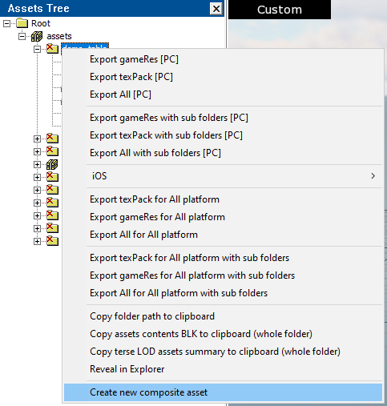

## Overview

Before proceeding, it is highly recommended to review the main article on
[composite structures](../../../assets/all-about-blk/composit_blk.md).

## How to Enable

You can now edit composites directly from the [Asset
Viewer](../asset-viewer/asset_viewer.md). To enable the Composite Editor,
navigate to the **View** menu:


If you prefer the editor to open automatically when a composite is selected in
the Asset Tree and close when any other type of object is selected, you can
enable this option in the **Settings**:


```{caution}
The *Composite Editor* is still under development, and it may significantly
impact performance when working with large composites that have many nested
elements. This is especially relevant, for example, for houses with complex
indoor structures in daNetGame-based games. For this reason, the auto-open
option is disabled by default. Use it at your own risk.
```

## Creating a New Composite

1. In the **Asset Tree**, select the directory where you want to place the
   composite.
2. Right-click and select **Create new composite asset** from the context menu.

   

3. In the pop-up window, enter the desired name, making sure to follow the
   [naming
   conventions](../../../dagor-home/documentation/naming_conventions.md). If an
   asset with this name already exists, a warning will be displayed when you
   attempt to create it.

   

## Composite Editor Interface

The interface is divided into two main sections: **Outliner** and **Properties**.


### Composite Outliner

The **Composite Outliner** functions similarly to the **Asset Tree** but is
specific to composites. The composite itself serves as the "root" of the
structure.

When you create a new composite, it will initially contain only the root block
with its name. To add a new node, click on this sole element and select **Add
Node** from the context menu.

A newly created node does not contain any parameters, making it equivalent to an
empty `node{}`.

Through the context menu, you can define the type of the node:

- **Change asset** allows you to select an asset for rendering, analogous to
  `name:t =`.
- **Add entity**: turns the node into a random entity, analogous to `ent{}`.
- **Add node**: adds a child node.
- **Delete node**: deletes a node.

```{note}
- Adding an asset hides the option to add an entity, and vice versa – a node
  cannot simultaneously contain both `name:t` and `ent{}`.
- You can also delete a node using the **Delete** key, but in both cases,
  confirmation is required.
- Deleting a node will also remove all its child nodes since they are
  technically nested within it (e.g., `node{node{}}`). Keep this in mind.
```

If a node already contains an asset, you can open it by double-clicking. This is
useful when you need to edit a subcomposite. However, since there is currently
no history of recently opened assets, returning to the "main" composite will
only be possible by finding it again in the **Asset Tree**. Therefore, the
editor will ask for confirmation before switching to another asset.

#### Identifying Random Nodes

A random node is displayed with the same icon as an empty node, but it will be
named `random` instead of `node`.

All possible entities are listed one level lower in the hierarchy.

Since a random node can have child nodes, this can cause significant confusion –
these *children* are also displayed one level lower. To address this, all
`ent{}` entries are shown with an additional icon. The first icon represents an
empty node, while the second indicates the entity type.


In the `.composit.blk` file, what is shown in the screenshot might look
something like this:

```text
node{
  ent{name:t="table_a:rendinst"}
  ent{name:t="table_b:rendinst"}
  node{name:t="cup_a:rendinst"}
  ent{name:t=""}
  node{name:t=""}
}
```

To improve readability, it's recommended to add all `ent{}` entries first,
followed by the child nodes. However, it will work either way.

### Editor Properties

Do not confuse this with the **Properties** of the entire composite asset.


This section contains the properties of the selected node, along with options to
save or revert changes.

**Entities**

This panel lists all `ent{}` nodes. Here, you can set the weight for existing
entities, change the asset (via a large button displaying the asset's name, or
**"--"** if no asset is selected), and add a new entity to the end of the list
using the **"+"** button. The context menu (accessed by the **"..."** button)
allows you to add an entity after any existing one (instead of at the end of the
list) or delete the selected entity.

**Children**

A similar panel exists for *child* nodes, although weight is not assigned here
for obvious reasons. This panel may be removed in the future, as it impacts the
performance of heavy composites (some buildings have thousands of *child*
nodes), and the same functionality is available through the **Outliner**.

**Node Parameters**

This section contains the properties of the selected node. To move the node, you
need to enable the **Use transformation matrix** checkbox, which corresponds to
the `tm:m=` block. If this checkbox is enabled, you can edit the matrix in a
human-readable format:


**Add Parameters**

Here, you can set additional parameters for the node. Since the transformation
matrix takes precedence over random offsets, attempting to add both will trigger
a warning, and the parameter fields will be locked for editing.


To apply random transforms, disable the **Use transformation matrix** checkbox.

**Composit**

The **Composit** tab offers only two options: **cancel** or **save changes**. If
you try to switch from the composite to another asset, the editor will also ask
how to handle the current changes.

## Visual Editing

Now we have reached the interesting part. In addition to text-based editing, you
can make adjustments directly in the viewport. You can left-click on any object,
and the corresponding node will be selected in both the 3D view and the
**Outliner**. Pressing `Z` will center the camera on the selected node and zoom
in on it. Unfortunately, selecting multiple nodes simultaneously is not yet
supported. However, you can edit matrices using the gizmo.

When the Composite Editor is open, new icons appear in the toolbar: **Select**,
**Move**, **Rotate**, and **Scale**. The **Select** icon is always active, but
for the other tools to have an effect, the transformation matrix must be enabled
for the selected node using the checkbox mentioned earlier. Random offsets
cannot be applied via the gizmo. These tools can be activated using the standard
hotkeys: `Q`, `W`, `E`, and `R`, respectively.


