## Overview

The Asset Viewer is one of the two main tools for working with assets, and in
some cases, for creating them. It offers a vast array of parameters and
capabilities. In this article, we'll cover the basic principles for new users.

## Navigation

The navigation within Asset Viewer closely mirrors the controls in 3ds Max. The
key combinations and shortcuts are directly carried over. You can get a hint
window with navigation shortcuts within Asset Viewer by clicking on the **Eye**
icon in the control panel:

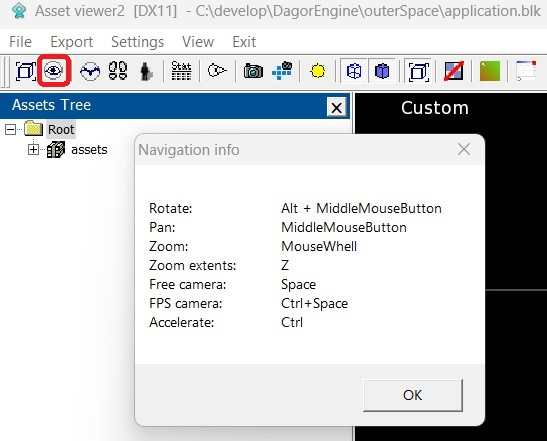

## Working with Assets

The interface is organized into three main panels:

1. **Control Panel**

   

2. **Properties Panel**

   

3. **Viewport Settings Panel**

   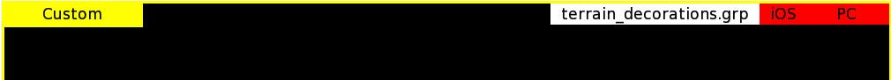

## Control Panel

The most frequently used features in this panel are the **Sun** and the
**Console** buttons.

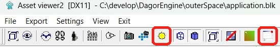

**Console**: this is your go-to tool. If something isn't displaying correctly,
don't just report "it doesn't work" – check the console first. You'll be
surprised how often it flags issues like duplicates and LOD (level of detail)
errors.

**Sun**: a set of environment management settings (including service textures).
Let's dive deeper into its parameters:

- **Settings**

  

- **Debug Settings**

  - You can choose different model display modes to check for issues.
  - Most commonly used are per-channel modes (diffuse, normal, smoothness, and
    metallness) and albedo_ao, to check black-and-white range conformity.

    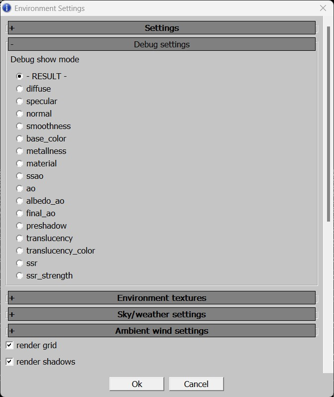

- **Environment Textures**
  - **envi snapshot**: assign a texture that applies lighting properties from a
    specific location (first, create this texture in that location).
  - **background texture**: add a custom background in `.dds` format (works when
    an environment texture is connected).
  - **paint details texture**: required for daNetGame-based games, which
    supports multiple paint textures. To see the correct color of an object,
    connect its paint texture here. War Thunder only uses one texture, which
    loads automatically in Asset Viewer.
  - **background texture stretch**: background texture tiling.
  - **reflection texture**: reflection texture, you can connect a cubemap, but
    it only works with an environment texture.
  - **Level BLK (for microdetails texture)**: necessary for War Thunder, where
    microdetails vary by map. If your assets appear black or with incorrect
    microdetails in the [daEditor](../../daeditor/daeditor/daeditor.md), connect
    the `level.blk` file for the appropriate `level.blk` files are located at
    `<project_name>/develop/gameBase/levels`. In daNetGame-based games,
    microdetails load automatically, so no manual setup is needed.

    

- **Sky/Weather Settings** (lighting and time of day settings)
  - Limited in scope and rarely used, but be sure to set a weather preset during
    the initial setup (it's off by default).

    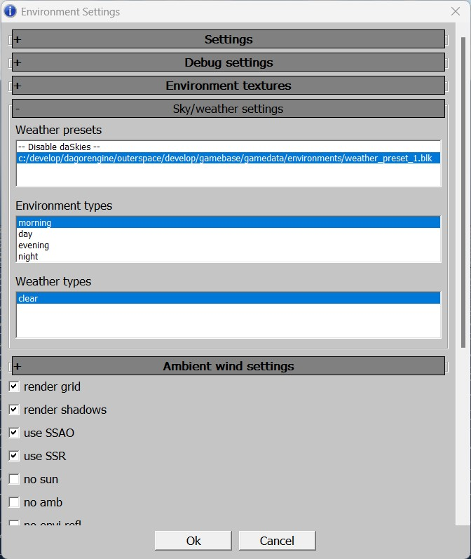

- **Ambient Wind Settings**
  - **Direction**: wind direction
  - **Strength (Beaufort)**: wind speed in Beaufort.
  - **Noise strength (Multiplier of strength)**: multiplier of wind gust
    strength.
  - **Noise speed (Beaufort)**: wind gust speed.
  - **Noise scale (Meters)**: multiplier of wind gust size.
  - **Noise perpendicular**: direction of wind gust movement.

    

  ```{note}
  Wind effects are only applied to assets with `tree` in their name. Although
  not all assets have advanced wind, all vegetation assets created after 2022
  include wind effects.
  ```

- **Several Display Settings**
  - Usually, the settings shown in the image below are enabled.
  - Previously, disabling all post-effects and enabling no `postfx` was the only
    way to view a more accurate polygon count:
    - In War Thunder, this provided a clear display with honest polygon counts.
    - In daNetGame-based games, the image was unreadable, but the polygon count
     was accurate.
  - Now, this is unnecessary, as the asset statistics are sufficient without
    these workarounds.
  - **Shadow Quality**: adjusts shadow quality (rarely needed).
  - **Render Envi Entity**: allows to load a background asset into Asset Viewer
    and display everything else alongside it. Useful, e.g. for checking how your
    tank looks in a hangar or comparing the size of two assets.

    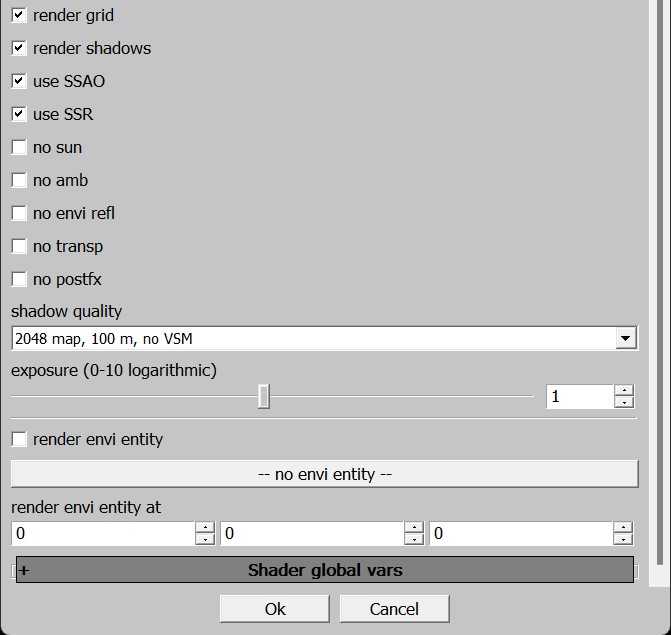

The other parameters are typically not needed.

## Properties Panel

Let's look at its key parameters:

- **Common Parameters**
  - Object type (rendinst, prefab, texture, decal, etc.).
  - Object name.

    

- **Object Specific Parameters**
  - Rotate object horizontally.
  - Rotate object vertically.
  - **PN-triangulation**: geometry tessellation with `rendinst_clipmap`
    material. The closer the camera, the more detailed the object becomes.
    However, since this doesn't affect rounding, it's not very useful.
  - LOD distances (you can switch and view LODs).
    - You can also switch LODs with hotkeys – numbers (starting from zero) force
      a specific LOD. This works on the numpad as well. `Backspace` and `NumDel`
      return to automatic LOD selection. A number that's too large (3+ in the
      example) will select the last existing LOD.
    - In automatic mode, you can move away from the object (tracking distance by
      camera position) and observe the LOD transition quality. By displaying the
      distance from the camera to the center and manually switching LODs, you
      can fine-tune the distances.
  - **generate per-instance seed**: properties for composites.

    

- **Set of Used Textures and LODs**
  - Here, you can track all the textures used by the asset as a whole and by
    each LOD.
  - Always consider that the more textures an asset uses, the heavier it is to
    process. You should ask yourself, "Do I really need this many textures?"
  - Additionally, the number of textures should typically decrease with LODs –
    polygons with assigned materials are removed.

    

    ```{note}
    The **Properties** panel can slightly slow down the loading of assets,
    especially with heavy rendinsts containing many submaterials. If you only
    need to check that each element of a large pack loads without errors (e.g.,
    missing LODs), you might want to temporarily disable **Properties** for
    faster asset switching. The hotkey to toggle the panel is `P`. You can also
    toggle it via **View > Properties** in the menu.
    ```

## Viewport Settings Panel

By right-clicking on the highlighted yellow rectangle, you can access the
following options:

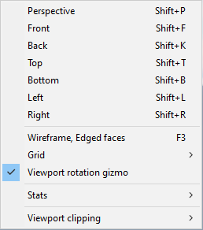

From here, you can explore shortcuts for projection views, model grids, ground
grids, and how to enable statistics (**Stats > Show Stats**). You can also
toggle the display of statistics with or without a black background (**Stats >
Opaque Stats**).

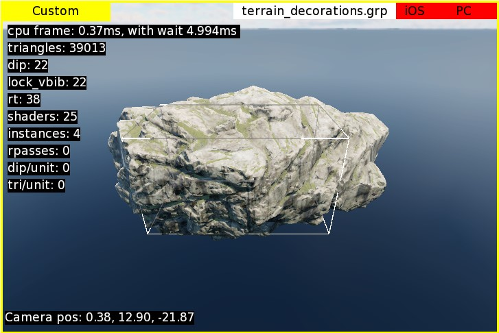

Polygon count is shown by default after all post-effects are applied; the camera
position is displayed as [X, Y, Z] coordinates relative to the scene's center.
While these metrics might not be crucial for asset creators, you can customize
them to better suit your needs.

### Customizing Scene Statistics Display

You can access the statistics settings in two ways:

1. Right-click on the viewport window and select **Stats > Stats settings**.

   

2. From the **Settings** menu, choose **Stats Settings**.

   

   In this menu, you can select which information is important to you.

   

The settings are organized into a two-tier hierarchy, grouped into categories.
Disabling a top-level category will disable all its nested options. At the very
top, you'll find the **Show stats** option, which is the same as the one in the
previously mentioned context menu.

Here, you can select the information that matters most to you:

- **Stat 3d**: is not particularly useful for asset work; it's more relevant for
  rendering engineers. You might want to keep `cpu frame` enabled for
  performance tracking.
- **Camera**: it is more useful. Knowing the camera position can be handy when
  working on composites, but more often, you'll need to track the distance from
  the camera to the center of the scene. This is where the pivot of the rendinst
  is located, simplifying the process of adjusting LOD distances – you won't
  need to manually calculate the vector from zero to the camera's coordinates.
  `camera FOV` helps ensure that the field of view matches the in-game setting
  and that you're adjusting LOD distances with the correct camera setup.
- **Asset Stats**: provides the most useful information for asset creators,
  including:
  - Number of visible triangles in the asset.
  - Statistics on physics collisions: the number of meshes, triangles (referred
    to as faces, but assets are always triangulated), boxes, convex shapes, and
    vertices.
  - Similar information for trace collisions. Since there's no distinction
    between these in War Thunder, you can disable one of the options – they'll
    show identical values anyway.
  - Number of materials in the rendered geometry.
  - Number of textures used.
  - The index of the currently displayed LOD.

```{note}
Asset statistics are still under development and have known issues:
- Tested on render instances; there may be bugs with dynamic models – take the
  information with a grain of caution.
- If an asset lacks a specific parameter, the statistics will show the last
  known value, such as the number of materials and textures on collisions that
  are actually zero.
- Composites in Asset Viewer are displayed without collisions, so statistics
  will show zeros for both physics and trace collisions.
- In War Thunder, there's no distinction between phys and trace collisions, but
  the statistics are output as they are in daNetGame-based games – twice.
```

### Customizing the Grid

In addition to statistics, you can also customize the grid parameters.


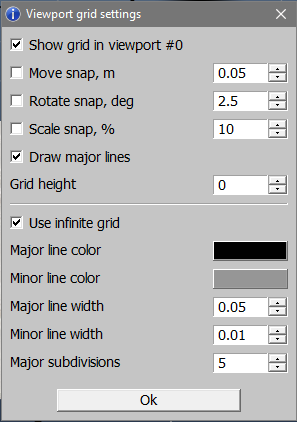

Beyond toggling grid visibility, you can configure snapping parameters (used in
the [Composite
Editor](../asset-viewer-comp-editor/asset_viewer_comp_editor.md)), height
offset, cell size and count, as well as the colors and thickness of the grid
lines.

### Viewport Rotation Gizmo

Unlike the grid and statistics, the viewport rotation gizmo only has visibility
settings.


When enabled, it appears in the top-right corner of the viewport(s). Beyond
simply displaying the axes, it can also be used for quick navigation:

- You can use it as a virtual trackball to rotate the viewport – just hover over
  the gizmo and start rotating by holding down the left mouse button.
- Clicking on an axis letter with the left mouse button automatically rotates
  the camera along that axis. Unlike hotkeys for projections, this rotation
  doesn't switch to an orthographic view; it retains the perspective view.

  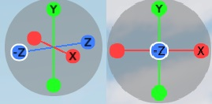

## Building Assets

To learn more about what *building* entails and why it's necessary, refer to the
dedicated article about [Resource
Building](../../resource-building/resource_building.md). In short, the game
doesn't directly handle files like `.dag` files, textures, etc.; it operates on
binary files where these resources are compiled. To check your work in-game, you
need to compile these resources into the binary files.

### General Considerations

It's important to remember that when you export assets into `.dag` files, they
are processed by `.folder.blk` and converted into various types of in-game
objects.

For example, if you export a house with four LODs and an overlay texture, it
might look like this:

- **LOD00**: Geometry + Materials; Apex settings
- **LOD01**: Geometry + Materials
- **LOD02**: Geometry + Materials; Collision
- **LOD03**: Geometry + Materials
- **Overlay Texture**

In the Asset Viewer and the game itself, these components will be transformed
into the following object types:

- **Render Instance**: all LODs with geometry and materials
- **_Apex Object**: a sliced asset processed by Apex
- **_Collision Object**: collision data from `LOD02`
- **Texture**: the overlay texture

When building your changes to view them in the game, it's crucial to keep track
of what exactly you have modified. If your changes only affect a specific type
of object (e.g., the render instance), it's more efficient to build only that
object type.

However, if your changes impact multiple object types, it's usually easier to
build the entire directory containing the modified asset. This approach prevents
the need to sequentially build each object type one by one.

### Selecting and Exporting Assets

1. Choose either an individual asset or the directory containing the asset you
   wish to export. Your choice depends on what exactly you want to export.

   For example:

   - If only the collision data of a specific asset has been modified, select
     the **collision object** type.
   - If only the asset itself (geometry, materials) has been modified, select
     the **render instance** type.
   - If both the asset (geometry, materials) and its collision data have been
     modified, you have two options:
     - Select the **render instance** first, followed by its **collision
       object** (as separate asset types within Asset Viewer).
     - Or, select the entire directory containing the asset and its collision
       data, which allows you to handle everything at once.

       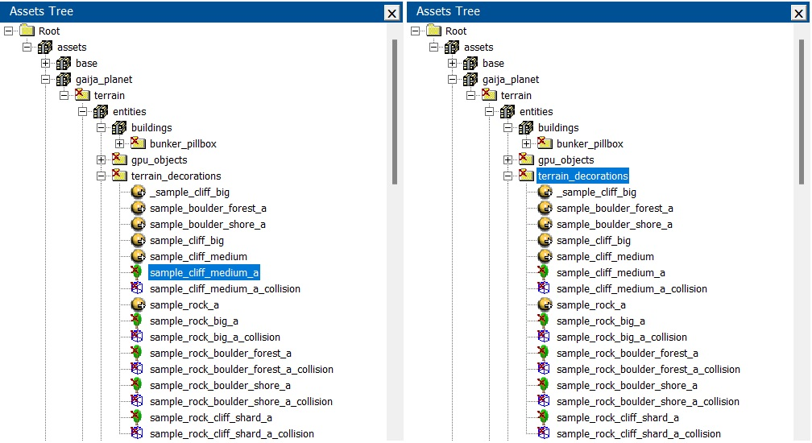

2. Right-click on the selecting asset or directory.

   For an individual asset, you'll be given a single action option – exporting
   the package for that specific asset (e.g., `terrain_decorations.grp`).

   For a subdirectory, you'll have several export options:
   - **Export resources** (including subdirectories) – this covers render
     instances, destructibles, collisions, etc., excluding textures.
   - **Export textures** (including subdirectories).
   - **Export everything** (including subdirectories).

   If you haven't changed textures, for instance, select only the **gameres**
   option. Conversely, if you've modified everything, choose to export
   everything.

   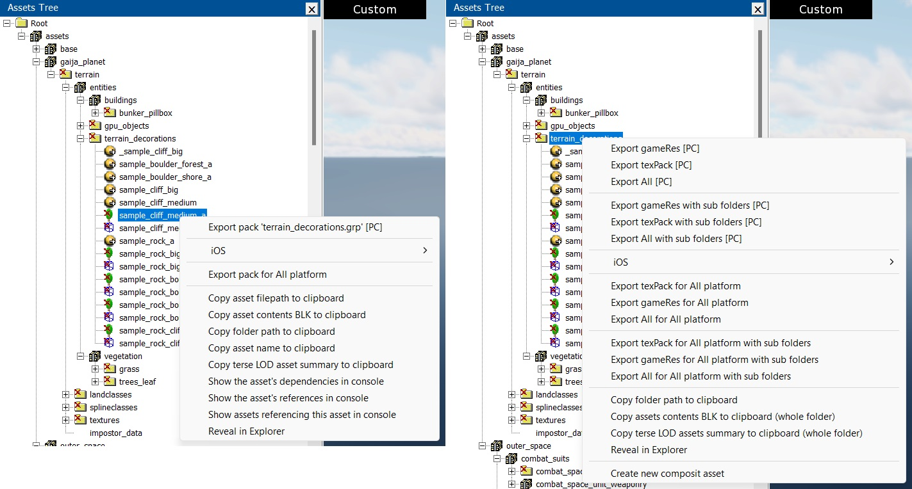

   You can monitor the build log in the console. When building resources using
   Asset Viewer, the build speed is significantly slower compared to using
   daBuild.

   ```{note}
   Be mindful of what you select before building.

   Exporting an asset won't automatically include its textures located nearby.
   Similarly, exporting a directory containing an asset won't automatically
   include textures located in a different directory, even if the asset
   references them.
   ```

### Nuances

#### Package Name Conflicts

- **War Thunder**. Package name conflicts are not a significant issue.
- **daNetGame-based**. These conflicts are common. Package names often repeat
  across different packages. For example, the directory `indoor_stuff` (and its
  corresponding package) exists in both the `manmade_common`, `city_1`, and
  `city_2` packages. When you select the `indoor_stuff` directory and choose
  **export all with subdirectories** (or select an asset and choose **export
  pack indoor_stuff.grp**), all `indoor_stuff` packages across these packages
  will be built.

  This will result in the build of not just the single modified item, but
  potentially hundreds of objects. If a full resource rebuild was done recently,
  unchanged packages will be skipped. However, if a full rebuild hasn't been
  done in a while, this process could take considerable time.

#### HQ Texture Pack Build

Initially, Asset Viewer couldn't handle the assembly of HQ texture packs. Now it
can. When triggering a build from the texture's context menu, ensure you select
the option that includes HQ textures. Note that in the context menu for
directories, there's no separation – both base and HQ texture packs will always
be assembled.


#### Logging Errors in the Console

By default, all asset-related errors (loggers) will be output to the console. If
you need to control these locally, you can add the following block to your
`application.blk`:

```text
logerr_to_con{
  assetViewer{
    include_re:t=... // only loggers matching this regex will be shown
    exclude_re:t=... // loggers matching this regex will be excluded
  }
}
```

**Example:**

```text
logerr_to_con{
  assetViewer{
    exclude_re:t="(warning: node <occluder_box> from)|(Shader 'land_mesh_combined' not found in bin dump)|(has mesh with 0 faces)|(degenerate tri)|(degenerate mesh node)" // loggers matching this regex will be excluded
  }
}
```


