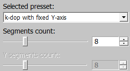

# Collision Generation for Assets in Asset Viewer

## Overview

The [*Asset Viewer*](../asset-viewer/asset_viewer.md) now supports the ability
to generate new collision nodes from a combination of original nodes. These
nodes can be built for assets through the `daBuild` process.

A new node can be of one of the following six types:

- `mesh`, `box`, `sphere` – merges the selected nodes into the corresponding
  primitive.
- `k-dop` (discrete oriented polytope) – a bounding volume for a specific
  geometry. The generation algorithm "wraps" the original mesh using predefined
  directions. After export, the collision type becomes `convex`.

  The `k` in `k-dop` represents the number of initial directions used for
  generation.

- `convex computer` – creates a convex shape around the selected nodes.
- `convex v-hacd` – decomposes the mesh of the selected nodes, breaking the
  geometry into multiple convex nodes. For more details on the algorithm, refer
  to the original [repository](https://github.com/kmammou/v-hacd).

## Parameters in Asset Viewer

In the properties panel for collision assets, a tree of nodes available for
merging is now displayed.

### Collision Nodes Panel


This panel shows the collision node tree. The node prefixes indicate their
flags. If a node is merged from multiple nodes, its original child nodes will be
displayed. Merged nodes can be edited or deleted.

### Create New Node Panel


When creating a new node or editing an existing one, you can:

- Select nodes to include in the new node during generation.
- Assign a unique name to the node, even if it replaces child nodes during the
  process.
- Set the flag for whether the selected nodes will be replaced. If nodes are
  replaced, they will not be exported.
- Set the `Phys Collidable` and `Traceable` flags.
- Choose a collision type for the new node from the six types described earlier.

### Viewport Display Option

For `mesh`, `box`, and `sphere` types, the result will be displayed in the
viewport and can be saved. For `k-dop`, `convex computer`, and `convex v-hacd`
types, the next step involves generating based on the selected parameters.


Clicking on a node in the viewport will highlight it in the list of selected
nodes. Holding `Ctrl` allows for multiple node selection.

### k-dop Node Generation Parameters

#### Selected Preset




Select a preset for the chosen nodes. The following presets are available for
`k-dop` generation:

- `6-dop` – regular box.
- `14-dop` – basic 6 directions + 8 corner directions.
- `18-dop` – basic 6 directions + 12 face directions.
- `26-dop` – combines face and corner directions from `14-dop` and `18-dop`.
- `k-dop with fixed X-axis` – generates `k-dop` with a fixed number of segments
  around the X-axis.
- `k-dop with fixed Y-axis` – generates `k-dop` with a fixed number of segments
  around the Y-axis.
- `k-dop with fixed Z-axis` – generates `k-dop` with a fixed number of segments
  around the Z-axis.
- `Custom k-dop` – generates `k-dop` with a custom number of segments around the
  X and Y axes.

The number of segments can vary from 4 to 20 with an increment of 1.

#### k-dop Rotations


Rotate the `k-dop` around 3 axes to better match the original mesh.

#### k-dop Cut Off Planes


For optimization, small-area planes can be trimmed relative to the plane with
the largest area. The maximum trim value is 40%.

#### Show k-dop


The `k-dop` can be displayed in several ways:

- Drawing planes.
- Drawing triangles.
- Drawing directions from the center, with a distance to the corresponding
  plane.

**Example:** Generating an `18-dop`.


---

### Convex Computer Node Generation Parameters


A `convex` will be generated around the selected nodes. Using the `Shrink`
parameter, the shell can be "shrunk" inward toward the selected mesh.

**Example:** Generating a `convex computer`.


---

### Convex v-hacd Node Generation Parameters


This generation method is governed by four parameters:

- `Convex depth` – recursion depth of the algorithm. Lower values lead to
  earlier exits from the algorithm, resulting in rougher convex shapes.
- `Max convex hulls` – the number of convex nodes generated by the algorithm. If
  the value is 1, it is more efficient to use `convex computer` to reduce asset
  export time.
- `Max verts` – the maximum number of vertices for a single convex node.
- `Resolution` – voxelization resolution. Higher values produce more accurate
  results, but also increase export time.

```{note}
Some parameter combinations may result in invalid geometry. In such cases, the
result cannot be saved, and it is recommended to adjust the parameters, for
example, by incrementing or decrementing the `Resolution` by one step.
```

**Example:** Generating a `convex v-hacd`.


---

To save all changes, press `Ctrl+S`. If this is the first time saving changes
for the asset, a `.collision.blk` file will be created alongside the `.dag`
file. The exported result will only be visible after restarting the *Asset
Viewer*. When editing, the exported result is displayed immediately after
saving.

If a node previously exported is selected, it will revert to its original
geometry for editing. If no changes are made, switching to a different asset
will restore the `.collision.blk` file.

```{note}
If a crash occurs while working with collisions, data loss may occur.
```

## Parameters in .blk

Generation parameters are stored in the `.collision.blk` file within the
`nodes{}` block. This block lists all nodes and their generation parameters.

### Common Parameters

- `collision:t` – type of collision for node generation. Possible values:
  - `"mesh"`
  - `"box"`
  - `"sphere"`
  - `"kdop"`
  - `"convexComputer"`
  - `"convexVhacd"`
- `replaceNodes:b` – indicates whether the original nodes are replaced during
  generation.
- `isPhysCollidable:b`, `isTraceable:b` – flags set for the node.
- `refNodes{}` – block with the names of the nodes used as a reference for
  generation.

### k-dop Parameters

- `kdopPreset:i` – preset index:
  - `0` – 6-dop.
  - `1` – 14-dop.
  - `2` – 18-dop.
  - `3` – 26-dop.
  - `4` – k-dop with fixed X-axis.
  - `5` – k-dop with fixed Y-axis.
  - `6` – k-dop with fixed Z-axis.
  - `7` – Custom k-dop.
- `kdopSegmentsX:i`, `kdopSegmentsY:i` – number of segments.
- `kdopRotX:i`, `kdopRotY:i`, `kdopRotZ:i` – rotation around axes in degrees.
- `cutOffThreshold:r` – trim percentage of the maximum plane area.

### Convex Computer Parameters

- `shrink:r` – amount to shrink the shell inward toward the selected mesh.

### Convex v-hacd Parameters

- `convexDepth:i` – recursion depth of the algorithm.
- `maxConvexHulls:i` – number of convex nodes generated.
- `maxConvexVerts:i` – maximum number of vertices for a single convex node.
- `convexResolution:i` – voxelization resolution used by the algorithm.


