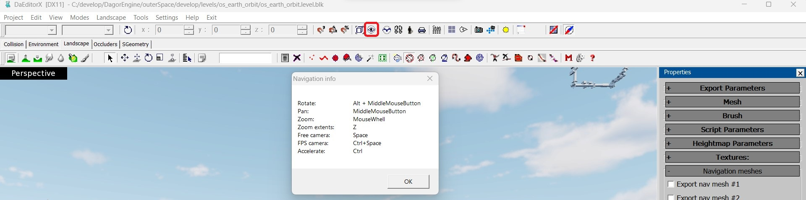
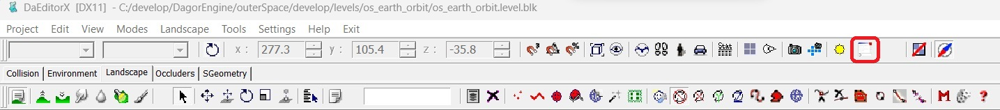
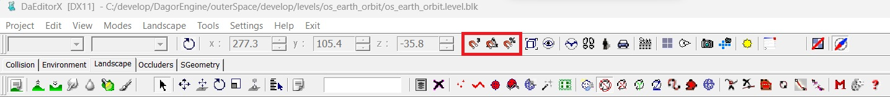
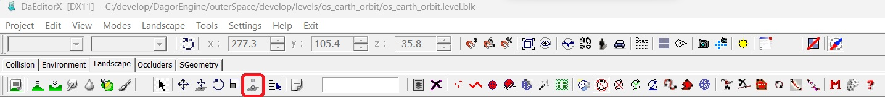
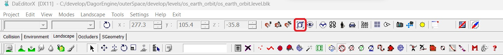
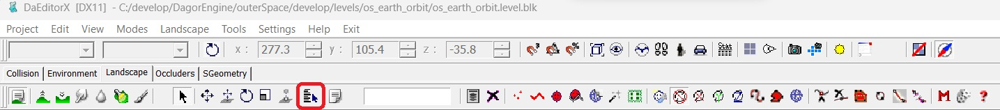
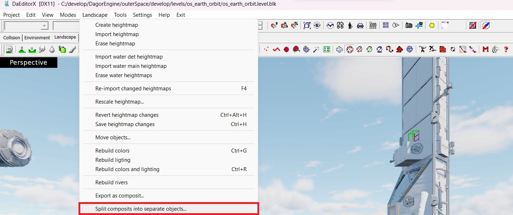

## Overview

*daEditor* (*Dagor Editor*) is one of the two primary tools for working with
assets, and in some cases, for creating them. It offers a vast array of
parameters and features. In this article, we will cover the basic principles of
using daEditor, aimed at helping new users get started.

## Navigation

The navigation within daEditor closely mirrors the controls in 3ds Max. The key
combinations and shortcuts are directly carried over. You can get a hint window
with navigation shortcuts within daEditor by clicking on the **Eye** icon in the
control panel:



## Working with Assets on the Landscape

All asset-related work is performed within the **Landscape** tab. This is the
central workspace for placing, editing, and managing assets on the terrain or
environment you're developing.


## Basic Logic and Controls

The logic in daEditor is largely similar to that of 3ds Max. Below is an
overview of the essential controls and buttons, all of which come with tooltips
– be sure to read them for more detailed information.

### Create Entity

This button allows you to place an object onto the map.


### Console

If something isn't working as expected, or if something isn't working at all,
check the console for errors (look for red text).



### Object Movement Controls

These buttons control the movement of objects. The hotkeys are the same as in
3ds Max.


### Snap Settings

This button allows you to snap objects to the landscape grid (for object
movement), as well as snap rotation and scale.



### Drop Pivot to Ground

Use this to "drop" the pivot point to the ground if you've accidentally placed
it in the air. If your object has the **Place on collision** property, this will
only affect the pivot, while the object itself will always remain on the
landscape.



### Move to Selected Object

This button will move your camera to the currently selected object.



### Select Object by Name

This allows you to select an object by its name.



### Export Group as Composite

This button lets you export a group of objects as a composite entity.


### Break Composite into Individual Entities

Use this button to break down a composite entity into its individual components
(`.dag` files).



## Working with Object Properties

When an object is selected, you can access its properties by pressing `P` (for
"Properties") on your keyboard.


{bdg-dark-line}`1`  **Object Name in Scene** This field displays the name of the
object within the scene. It is often helpful to have the scene names match the
asset names. You can use the **Landscape > Unify object names** command to
accomplish this.

{bdg-dark-line}`2`  **Collision Placement Settings** This property defines how
the object interacts with landscape collision:

- **Ignore Collision**: the object's height matches its pivot point.
- **Place Pivot**: the pivot point (typically the origin point of the asset in
  the 3ds Max scene) is placed directly on the collision surface.
- **Place Pivot and Use Normal**: the object's pivot aligns to the normal of
  the landscape, useful for placing objects like houses on hills so that they
  tilt naturally.
- **Place 3-Point (bbox)**: a bounding box is created around the object, and
  the object is placed so that at least three points of the bounding box align
  with the collision surface.
- **Place Foundation (bbox)**: all four points of the bounding box base align
  with the collision surface.
- **Place on Water (floatable)**: specifically for floating objects, this
  option places the object on a water surface.
- **Place Pivot with RendInst Collision**: this option aligns the object's
  pivot with the collision of the corresponding rendinst.

{bdg-dark-line}`3`  **Actual Object Name** This property shows the real name of
the object placed on the map. You can select a different object here instead of
placing a new one.

{bdg-dark-line}`4`  **Shader Parameter Seed Generation** This option generates
seeds for the shader parameters of selected objects, including those within
composite entities (as they contain many sub-objects):

- **Individual**: generates a unique seed for each selected object.
- **Equal**: generates the same seed for all selected objects.
- **Seed Slider**: adjust the seed value for the previously selected seed type
  (either individual or equal).

  ```{note}
  These seeds affect only shader parameters, not other aspects of composites.
  Currently, this feature is used solely for procedural painting.
  ```

{bdg-dark-line}`5`  **Object Seed Generation on the Map** This is similar to the
previous property but operates on a larger scale, generating seeds for entire
composite entities rather than individual shader parameters:

- **Individual**: generates a unique seed for each selected object.
- **Equal**: generates the same seed for all selected objects.
- **Seed Slider**: adjust the seed value for the previously selected seed type
  (either individual or equal).

## Exporting a Location

To export a location, navigate to the menu **Project > Export to Game (PC
format)**.


After selecting this option, a series of dialogs will appear, allowing you to
choose whether to export all elements of the created location. The default
settings are typically correct and do not require adjustments.

The most critical part of this process is specifying the correct export path for
the level. Occasionally, the tools might malfunction and suggest saving the
level in incorrect directories.

A simple way to verify that you're exporting the level to the right location is
to check whether you're replacing the existing binary file. If you're prompted
with a message indicating that you're about to overwrite an existing file, and
given the option to "replace" or "rename", then you're exporting to the correct
directory.


