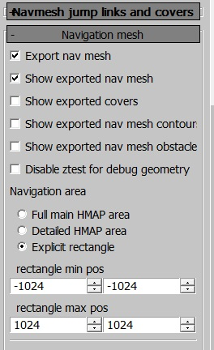
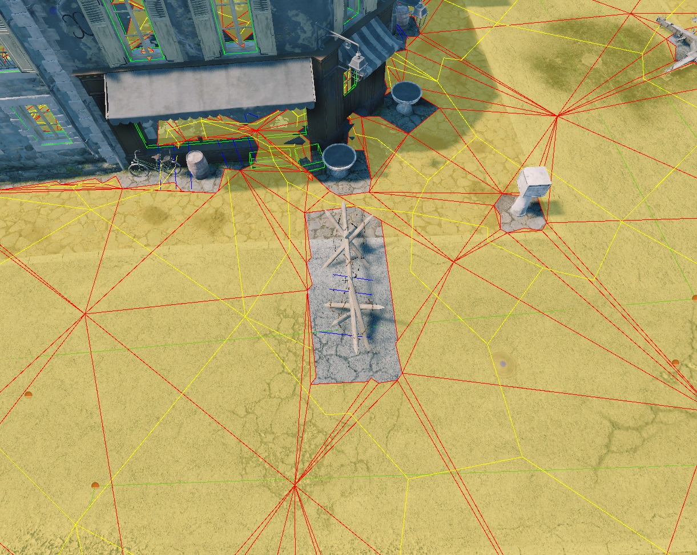

## Overview

To ensure bots navigate around obstacles like buildings and trees, we use a
*navigation mesh* system. This system generates a separate mesh based on the
heightmap, landmesh, or water (depending on settings) that defines areas bots
can traverse. The mesh is generated in the [daEditor](../daeditor/daeditor.md)
under the **locationed/properties** tab.

The navigation mesh is baked into a binary file during every export.

The navigation mesh is generated from a top-down view, which means there will be
no navmesh under bridges or other elevated assets. To avoid this, you can
specify the rendinst to exclude in `develop/gameBase/config/navmesh_layers.blk`
under the `filter{}` block. The syntax is as follows:

```text
"^.*af_conveyor.*$" {}
```

This is a regular expression, allowing you to exclude either all assets or
specific ones by name. Note that the ending `*$" {}` is required.

```{important}
For successful ground navigation mesh generation, at least one spline must be
present in the level (water navigation meshes are calculated based on the water
surface alone).
```

## Navigation Mesh Interface


The settings are generally straightforward, but here are the key options:

- **Full main HMAP/Detailed HMAP/Explicit area**: this option selects which part
  of the location to generate the navmesh for. It is recommended to map only the
  detailed area or even less if the entire location isn't used. Mapping the
  entire detailed area can:
  - Increase the binary size beyond reasonable limits.
  - Slow down server performance.

- **Navmesh type**: defines how the navigation mesh is generated.

- **Water navigation**: generates a navigation mesh on water.

- **Splines navigation**: generates a navmesh around splines. If there are no
  splines with the **Use for navmesh** checkbox enabled, no navmesh will be
  generated.

- **Height from above**: generates the mesh based on geometry from a top-down
  view.

- **Detailed geometry**: uses high-detail rendinsts for the navigation mesh.

- **Water and geometry**: generates the navigation mesh based on both water and
  geometry, considering any rendinsts encountered on the surface.

- **Use water surface**: excludes the underwater portion of the heightmap,
  making it inaccessible to tanks. The water height is defined in the **Crossing
  water** block, ensuring bots can cross small bodies of water.

- **Water navigation**: generates a navigation mesh for ships. Currently, it's
  not possible to have both tank and ship navigation meshes on the same
  location.

By default, the navigation mesh generates a reasonably dense grid. However, for
narrow streets or other tight spaces, it may be necessary to adjust the cell
size or distance to obstacles.

- **Use detailed geometry** and **Tiled navmesh** are available for
  daNetGame-based projects.

<br clear="left">

daNetGame-based projects also allow bots to use the navigation mesh for jumping
over obstacles (e.g., fences) and taking cover behind objects.

## Navmesh Jumps, Links, and Cover Interface


- **Export jump links mesh**: generates jump links, essential for most maps.
  Without this, bots won't be able to jump over fences.

- **jump over height**: the maximum height of an obstacle that bots can jump
  over.

- **jump length**: the depth of the obstacle and the maximum distance between
  two jump points.

- **delta height**: defines the height difference at which a single jump link is
  split into smaller jumps (prevents bots from jumping over overly tall objects
  like poles).

- **merge delta angle**: the angle at which different jump links are merged.

- **max angle between edge**: another setting related to jump link merging.

- **Export covers**: generates cover points for bots.

For the first four settings, these are simply size constraints for covers:

- **min window for shoot**: defines a window (e.g., a small opening) through
  which a bot can shoot. Once found, it marks the end of a cover point.

- **collision transparent**: determines the transparency of collisions. This
  feature has limited accuracy because voxelized collision is imprecise. Since
  simplified collision data is used for map generation, small gaps might not be
  recognized (e.g., for carts or fences with large openings).

- **delta height**: similar to jump links, this setting divides cover points
  based on height differences (e.g., a wall with a window in the middle could
  result in three separate cover points: full cover, half cover, and full
  cover).

- **shoot depth**: checks the possibility of shooting from cover. Special points
  are generated from which bots can shoot, and these points are traced from the
  cover's edges.

<br clear="left">

## Tank Navigation Mesh

The tank navigation mesh is constrained by splines. You can use existing splines
or create new ones specifically for navigation mesh purposes.


If a spline has the **Use for navmesh** checkbox enabled in the properties
panel, the mesh will include the area within the specified radius around the
spline.

<br clear="left">

After creating a navigation mesh, additional files such as `navMesh.PC.bin`
and/or `navMesh2.PC.bin` will appear in the level directory.

To view the navmesh in the [daEditor](../daeditor/daeditor.md), enable the
**show exported navmesh** option in the panel.

To view the navmesh in-game, use the console command `ai.debug_nav`.

**Common Error**

The following error indicates that the tank/ship navigation mesh is missing from
the level:

```text
18.43 [F] $03 FATAL ERROR: skyquake\prog\main\app.cpp,5191: assert failed in ..\..\skyquake\prog\main\app.cpp:5191,AcesApp::doJob() : "pathfinder::isLoaded() || (strstr(levelFileName, "avg_") != levelFileName && strstr(levelFileName, "avn_") != levelFileName)" Call stack (5 frames): ...
```

## Displaying Navigation in daEditor

The navigation and additional object display modes can be toggled from the
following menu:



- **Show exported nav mesh**: displays navigation areas with a red-yellow
  overlay.

  

- **Show exported covers**: displays cover points for AI in green.

  

- **Show exported nav mesh obstacles**: displays navigation obstacles in purple
  boxes.

  


