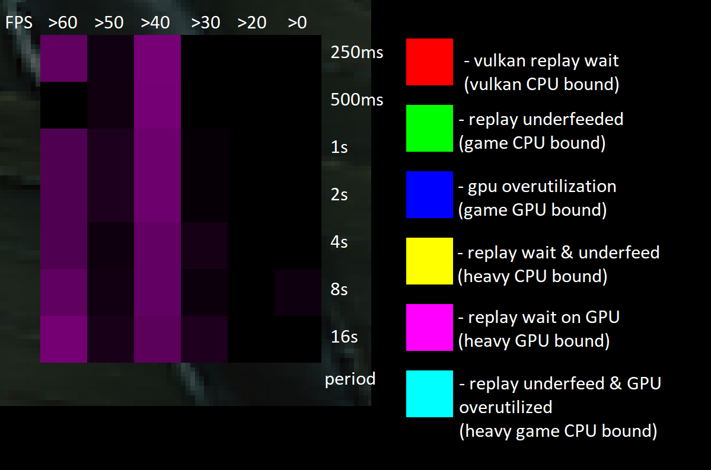

# Performance Rating Statistics Panel

The Performance Rating Statistics Panel in Dagor Engine provides an analytical
view of frame rate performance over multiple time periods, helping developers
diagnose performance bottlenecks in their game. This visualization is crucial
for identifying CPU and GPU limitations in both the game and replay systems.

## Structure

The panel consists of a **NxM grid** of colored quads:

- **N** represents different FPS groups (e.g., +60&nbsp;FPS, 50-60&nbsp;FPS,
  etc.).
- **M** represents different averaging periods, with each period being twice as
  long as the previous one, starting from 250&nbsp;ms.

## Color Representation

Each cell's **brightness** indicates the proportion of frames falling into a
specific FPS group within a given period. The **color** identifies the primary
bottleneck limiting the frame rate:

| **Color**   | **Bottleneck Type**                                       |
| ----------- | --------------------------------------------------------- |
| **Red**     | Vulkan replay wait (Vulkan CPU bound)                     |
| **Green**   | Replay underfed (Game CPU bound)                          |
| **Blue**    | GPU overutilization (Game GPU bound)                      |
| **Yellow**  | Replay wait & underfed (Heavy CPU bound)                  |
| **Magenta** | Replay wait on GPU (Heavy GPU bound)                      |
| **Cyan**    | Replay underfed & GPU overutilized (Heavy game CPU bound) |

 

## Usage and Analysis

Developers can leverage this panel to:

- Detect whether performance limitations stem from CPU or GPU bottlenecks.
- Identify if issues originate from the game itself or the replay system.
- Evaluate performance trends over progressively increasing time periods.

### Enable Panel

The Performance Rating Statistics Panel can be enabled via the **ImGui overlay**
([Dear ImGui and ImPlot](../dear-imgui/dear_imgui.md)), providing an intuitive
and real-time graphical representation of frame rate performance.

