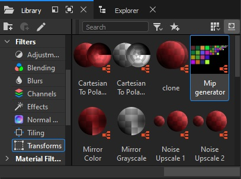
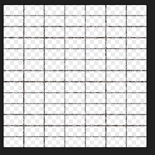
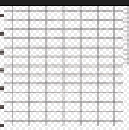
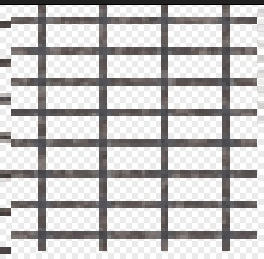

# Substance Designer Mip Generator

## Installation

To avoid having to search for the node on your disk every time, you can add it
to your custom library. To do this, go to **Edit** ▸ **Preferences** ▸
**Projects** ▸ **Library** ▸ **+**, and in the pop-up window, add the directory
containing the node. For internal team members, the directory is located at:

```
<engine_root>/tools/substance_library/
```

If you already have a custom library, you can simply copy the node into it. Once
added, the node will be available under the **Filters** ▸ **Transforms** tab and
accessible via search.



---

## Usage

To use the node, drag it into a new Substance Graph and connect your diffuse
texture with an alpha channel to the `tex_d` input. The initial result
(`tex_d_mips`) may not be perfect and could require further configuration. If it
looks correct from the start, custom mips may not be necessary.

### Initial Setup

Let’s consider a less-than-ideal input example: a metallic grid of 7x13 cells,
where the edges of the cells align with the edges of the texture.

```{note}
This is an exaggeratedly bad case, and ideally, most of these issues should be
resolved during the texture creation process.
```

First, adjust the global offset. In the **Main** tab, enter the number of grid
cells and set **Half Cell Offset** to `True`. Note that changing this parameter
will generate a second output – `tex_d_offset`, which doesn’t contain mips.
After configuring the diffuse, remember to connect the normal map input to apply
the same offset.




### Mip Adjustment

Now, let’s move on to configuring the mips. The settings are consistent across
all mip levels. The first few mips likely won’t require modification. From left
to right in the output image, the mips are ordered as 0, 1, 2, and so on. Once
you find the first mip that looks unclear, start configuring the settings.

For example, by mip level 2 (`mip02`), the lines may appear unclear. Initially,
you can improve this by adjusting the contrast and midpoint sliders.

However, at some point, the contrast will no longer be enough – the mip
resolution will be too low to properly render the cells. This is where the
**cell count** setting comes in handy.

First, set the number of cells so that one complete cell is drawn per mip level.
It’s easier to configure when the edges are aligned around the perimeter, so you
may want to temporarily switch to half-cell offset for the zero mip.

Then, reduce the number of cells, approximately to half the original count. You
can experiment with a smaller reduction, but you’ll need to test in-game to
ensure no noticeable flickering occurs due to line shifts rather than a
reduction in cell count.




For `mip05`, improving line clarity required reducing the `7x13` grid to `4x8`.

If a significantly distinct area of the texture has been cropped out, you can
reposition it with the offset tool. The step size corresponds to one grid cell.

As the resolution decreases, the line thickness will inevitably increase in
proportion since it can’t be thinner than a single pixel. However, if the lines
remain two pixels thick on distant mips and contrast adjustments don’t help, you
can manually enter a non-integer offset for problematic mips. Often, a value of
`0.01` will suffice.


Eventually, the texture will degrade into an unreadable cluster of pixels. To
avoid manually adjusting the "midpoint" for every mip beyond this point, the
**Main** tab allows you to replace the alpha channel in all subsequent mips with
a solid fill – either fully transparent or fully opaque.

The settings for these mips are hidden to keep the interface uncluttered and
make it easier to navigate the list.

## Enabling Custom Mips

Simply modifying the texture in this way will break its display in both the
[*Asset Viewer*](../asset-viewer/asset-viewer/asset_viewer.md) and in-game. You
must also specify that the texture contains custom mips, or the engine will
misinterpret it.

To do this, create a `.tex.blk` file named after the texture (without the
extension) in the same directory as the texture itself. Inside this file,
specify the texture name and include the appropriate block.

For example, for the texture `barbwire_tex_d.tif`, the `barbwire_tex_d.tex.blk`
file would look like this:

```
name:t="barbwire_tex_d.tif"
include "#/develop/assets/_srgbx_with_mips.blk"
```


