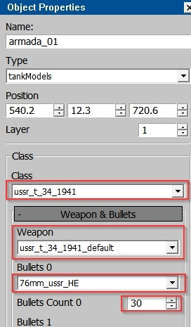
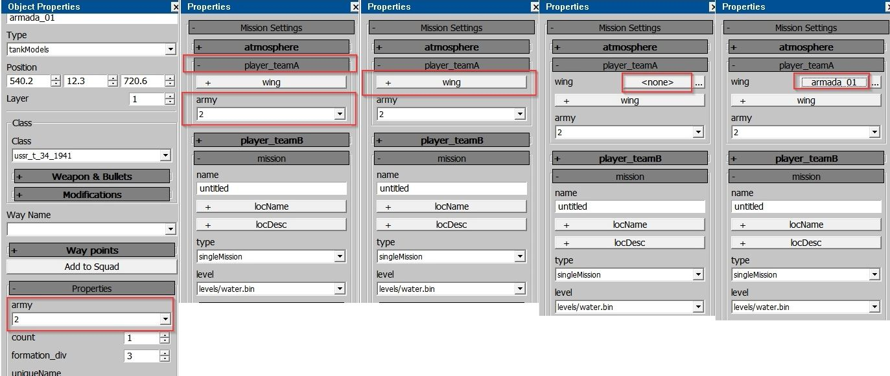
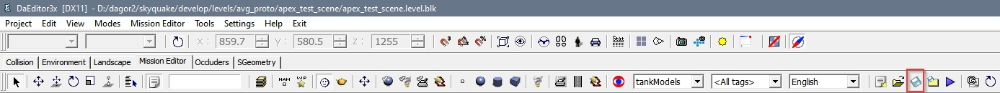

# Creating a Mission

In the War Thunder editor, there is an additional tab called **Mission
Editor** (this tab is not available in daNetGame-based games). Through this
tab, you can create a mission to test assets on a specific location.

A key difference between **Mission Editor** tab and the **Landscape** tab is
that in the Mission Editor, you can use two property panels:

1. **Mission Properties** panel: This is always present in the **Mission
   Editor** tab.
2. **Object Properties** panel: This can be accessed using the standard `P` key.

## Basic Steps

For creating a mission make the following steps:

1. **Select the Type of Unit**

   From the dropdown menu, choose the type of vehicle or unit you want to place:
   - **armada:** airplanes
   - **tankModels:** tanks
   - **ships:** ships
   - other types are non-playable units

   Place the selected unit on the ground using:
   1. The **Create Unit** button.
   2. Click on the desired location on the map.

   

   ```{note}
   Tanks and ships will be placed on the ground, but planes may not appear
   to be placed immediately. Zoom out from the map to see the plane high in the
   sky.
   ```

2. **Changing the Unit Type (Optional)**

   If you initially placed a tank but forgot to select **tankModels** in the
   first step, you can still change the unit type in the **Object Properties**
   panel by pressing the `P` key.

   

3. **Configuring the Unit**

   Suppose you placed a tank and moved it to the desired position. Now, you need
   to configure the following:
   - **Tank model**
   - **Weapon** (usually set to `default`)
   - **Ammunition type** (typically `default` or `HE`)
   - **Ammunition quantity**

   All these settings are adjusted in the **Object Properties** panel.

   

4. **Assigning the Unit to an Army**

   Check the "army" number assigned to your unit (since this is a PvP game,
   different factions represent different armies) in the **Object Properties**
   panel. Then, specify this army number in the **player_teamA** field within
   the **Mission Properties** panel. After this, assign your unit to the
   corresponding **wing** in the same panel.

   

5. **Setting Up the Mission Properties**

   In the **Mission Properties** panel:
   - Give your mission a **name**.
   - Select **singleMission**.
   - Specify the **location** where the mission should start.

   

   ```{warning}
   If you skip this step, your units might end up on the default location, which
   is in the middle of the ocean.
   ```

6. **Saving the Mission**

   Save your mission to the following directory:
   `/develop/gameBase/gameData/missions`.

   ```{important}
   Make sure to save after any changes, as there is no auto-save feature.
   ```

   

7. **Running the Mission**

   Once everything is set up, you can launch the mission.

   

## War Thunder CDK

The War Thunder CDK (Content Development Kit) is a set of tools available to
every player for creating user-generated content. You can access the tools for
mission creation and more here: [War Thunder
CDK](https://wiki.warthunder.com/War_Thunder_CDK).


