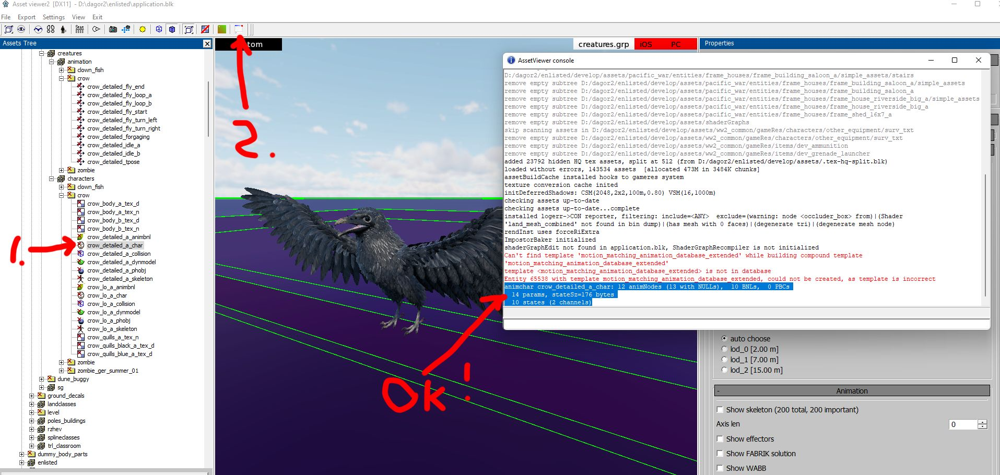
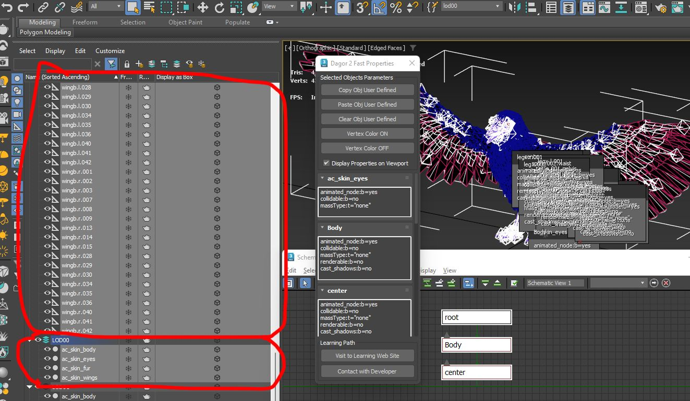
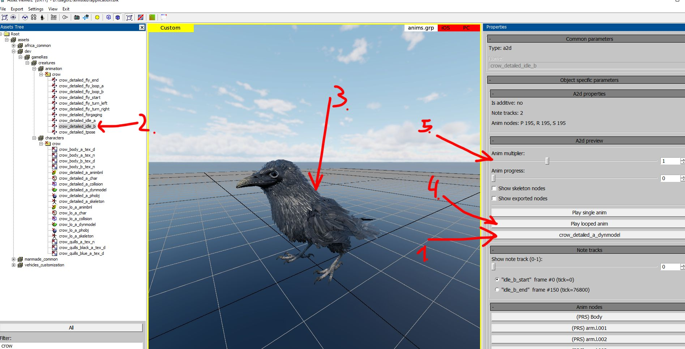
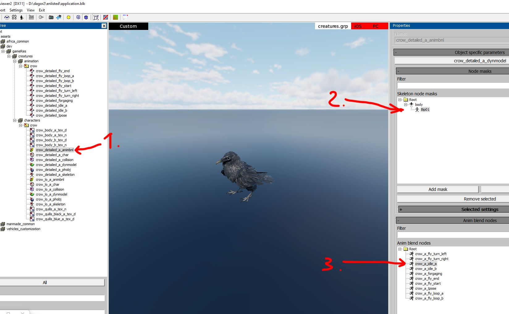

# Non-Human Character: Step-by-Step Guide

## General Guidelines for Creating Creatures of All Types

The *Dagor Engine* supports creating any bone-animated object (character).
However, this guide focuses on simple examples that do not involve IK (Inverse
Kinematics), upper or lower body animations, complex animation blending, or
additive animations. After reading this guide, you will be able to create
characters with any number of limbs. Additionally, we will set up animation
states for smooth transitions between character animations.

## Example Scenes in 3ds Max

You can download scenes with models properly prepared for export:
{download}`3dsMax2024Files.zip <https://drive.google.com/file/d/1ipgkTLOA5AhLe3tbCWG8PfuD7wD9RfW8/view?usp=drive_link>`

## Examples in Dagor Engine

These examples are designed for use in *daNetGame*-based projects. The files
include ready-to-use game assets: a fish and a crow. Compatibility with *War
Thunder* has not been tested due to shader-related issues.

Download the archive:
{download}`creatures.zip <https://drive.google.com/file/d/1HqMoxCPhsEb7mBvXAGqd71WcWdXcTLnZ/view?usp=drive_link>`

Extract the files into the `dev` directory of your project (a testing directory
not included in the game build). For example,
`<engine_root>/<project_name>/develop/assets/dev/gameRes/`. After extraction,
the path should look like this:
`<engine_root>/<project_name>/develop/assets/dev/gameRes/creatures`.

If everything is set up correctly, loading the [*Asset
Viewer*](../../dagor-tools/asset-viewer/asset-viewer/asset_viewer.md) and
selecting the crow asset {bdg-dark-line}`1` will result in error-free loading.
Click {bdg-dark-line}`2` to review error logs. The highlighted section indicates
successful loading.



```{note}
Scenes are compatible with *3ds Max 2024* or later.
```

## Skeleton Bone Structure: Features and Scene Configuration

Let's analyze the crow scene. Open the file {bdg-dark-line}`0`
`crow_detailed_tpose.max`.


Make sure to specify in the file name that it is the character's T-pose. The
model must include a root bone {bdg-dark-line}`3`. The naming is flexible, but
if you plan to use existing `.blk` files as templates, it is better to name it
`root`. This bone is used to move the entire scene. Additionally, a `Body` bone
{bdg-dark-line}`4` must be defined.

```{seealso}
For more information, see
[.blk File Format](../../dagor-tools/blk/blk.md).
```

For complex models with separate upper and lower animations, different
animations may play simultaneously based on specific events. In such cases, bone
names must clearly indicate their purpose for programmers. In this example, the
same animation always applies to all bones, so `Body` directly follows `root`.
This will become crucial when defining properties for generating animation
dependencies.

```{note}
For more complex characters, the structure may involve actions like running
while rotating the torso and looking at the camera. Such setups require advanced
configurations, which are beyond the scope of this guide. Here, we focus on a
simpler and more straightforward task.
```

The *3ds Max* scene must include the following mandatory features:

- **LODs** (Level of Detail) {bdg-dark-line}`2` must be named consistently,
  e.g., `LOD00` {bdg-dark-line}`1`. Inconsistent names across LODs will cause
  errors during the [*Asset
  Viewer*](../../dagor-tools/asset-viewer/asset-viewer/asset_viewer.md) resource
  loading. While *3ds Max* discourages identical names for objects, *Dagor
  Engine* requires this convention. To distinguish objects, place them in layers
  named according to their LOD levels, as shown in the example above.

- For the **Skin modifier**, always disable **Dual Quaternion**
  {bdg-dark-line}`6` and set the number of points per bone {bdg-dark-line}`5` to
  match the configuration specified in the project's `application.blk`. Refer to
  the **Skin Parameters in Dagor** section for more details: [Working with the
  Skin Modifier](#working-with-the-skin-modifier).

  ```{seealso}
  For more information, see
  [application.blk](../../assets/all-about-blk/application_blk.md).
  ```

- Store skinned objects as **Editable Mesh** {bdg-dark-line}`7` to ensure point
  weights accurately reflect in *Dagor* after export. These steps help replicate
  the Skin modifier's behavior in *Dagor* precisely.

- Use **Selection Sets** {bdg-dark-line}`8` for easier object selection during
  export. For instance, to export `LOD00`, create a group named `lod00`
  containing all the scene bones and all objects from the `LOD00` layer.

Each bone in the scene must include **Custom Properties** so that the *Dagor*
identifies them as bones. Below is the minimum required configuration for the
crow skeleton:

```text
animated_node:b=yes  // Specifies the object is animated
collidable:b=no      // Disables all collisions
massType:t="none"    // No mass, but the object is physical
renderable:b=no      // Excluded from rendering
cast_shadows:b=no    // Excluded from shadow generation
```

## Adding Basic Physics

To initialize the scene properly in *Dagor*, assign physical properties to at
least one bone using **Custom Properties** {bdg-dark-line}`2`.


Without physics, the engine cannot generate a valid skeleton. Below is an
example configuration for the `head` bone {bdg-dark-line}`1`:

```text
animated_node:b=yes  // Specifies the object is animated
collidable:b=no      // Enables collision handling, though further settings are required
massType:t="box"     // Specifies the mass calculation type
collision:t=capsule  // Specifies the collision type; consult your mentor for alternatives
physObj:b=yes        // Enables physics for the object
density:r=2000       // Density for mass calculation
renderable:b=no      // Excluded from rendering
cast_shadows:b=no    // Excluded from shadow generation
```

```{seealso}
For more information, see
[Rigging, Skinning, and Exporting New Character](../dng-rig-skin-export-new-char.md/dng_rig_skin_export_new_char.md).

Download example files to review the custom properties of bones like `Bip*`.
These properties dictate how the physical skeleton is generated.
```

## Working with the Skin Modifier

The most critical aspect of working with the **Skin** modifier is controlling
the number of bones per vertex. By convention, this value is set to 4 bones per
vertex. This parameter is defined in the project's general configuration file,
`application.blk`. Other required settings have already been covered earlier.

Example configuration in `application.blk`:

```text
dynModel{
  descListOutPath:t="dynModelDesc"
  separateModelMatToDescBin:b=yes

  ignoreMappingInPrepareBillboardMesh:b=yes
  enableMeshNodeCollapse:b=no
  maxBonesCount:i=318   // This is ineffective! Shader limitations cap bone count at 200.
                        // Exceeding 200 will result in errors during daBuild.
  setBonePerVertex:i=4  // Number of bones per vertex
}
```

## Creating LODs: Special Considerations for Dynamic Models

The primary rule for creating LODs is ensuring consistent naming for all LOD
levels. Using the crow as an example:


As shown, LODs share the same base name but are placed in separate layers. Each
LOD may contain multiple skinned objects. This approach is useful, especially
when the total triangle count for a single object exceeds the limit of 65,000
triangles. If your model exceeds this limit, divide it into multiple pieces.

For each model with a **Skin** modifier, the following **Custom Properties**
must be added:

```text
animated_node:b=yes  // Specifies the object is animated
collidable:b=no      // Disables all collisions
massType:t="none"    // Indicates no physical mass for this object
```

Ensure all skinned objects {bdg-dark-line}`1` have the specified properties
{bdg-dark-line}`2`:


For efficient management of **Custom Properties**, use an editor or viewer tool.

```{seealso}
For more information, see
[*Dagor 2 Fast Editor User Properties*](../../dagor-tools/addons/3ds-max/dagor2-3ds-max-tools/fast_editor_user_properties.md).
```

## Materials for Dynamic Models

Let's examine the materials assigned to the skinned models in the scene. In this
case, the materials used are `crow_base` and `Dagor Dagorrat Material 2`
{bdg-dark-line}`0`. To view all available **dynamic materials**, open the
dropdown menu and navigate to the relevant section {bdg-dark-line}`1`.

While each material type requires dedicated documentation, we will focus on the
simplest and most versatile option for
[PBR](https://en.wikipedia.org/wiki/Physically_based_rendering) lighting:
**dynamic_simple** {bdg-dark-line}`2`. This material supports standard textures
such as **albedo** (with optional transparency), **normal**, **smoothness**, and
**metalness** maps. In this case, the textures are:
- `crow_body_a_tex_d.tif` (albedo)
- `crow_body_a_tex_n.tif` (normal map)

If the archive was unpacked correctly, these textures can be found at the
following path:
`<engine_root>/<project_name>/enlisted/develop/assets/dev/gameRes/creatures/characters/crow`.

Assign the textures to the appropriate slots {bdg-dark-line}`3`. To enable
transparency, add the **atest** property {bdg-dark-line}`4` and set its value
{bdg-dark-line}`5` to `127`. This controls the alpha test threshold, where
mid-level brightness determines transparency. Also, enable two-sided rendering
{bdg-dark-line}`6`, as crow feathers must be rendered on both sides.

:::{grid} 2


:::

Verify that this material is applied to all skinned objects before proceeding
with export.

## Exporting the Dynamic Model

If the **selection sets** {bdg-dark-line}`1` were prepared correctly earlier,
exporting is straightforward. In the crow scene, select the set named `lod00`
{bdg-dark-line}`2`. This action highlights the `LOD00` layer and all associated
bones.




Next, navigate to **Utilities**, and choose **Dagor Scene Export**. If this
option is unavailable, add it using the **Sets** button. Within the **Dagor
Export** settings, ensure the following options are enabled:
- **Export hidden objects**
- **Export selected objects only**

These options are essential for every export. Finally, click **Export DAG**.

### Important Naming Conventions

The *Dagor* legacy constraints require specific naming conventions. The files
extracted from the `creatures.zip` archive must follow this format to maintain
compatibility with `.blk` scripts and project building pipelines.

For dynamic models:
- Append the postfix `_dynmodel`.
- Specify the LOD using the `.lodXX` postfix, where `XX` is the LOD level.

For example, the crow model's most detailed LOD(00) should be named as <b><font
color="MediumSeaGreen">crow_detailed_a</font><font
color="red">_dynmodel.lod00.dag</font></b>.

- **Green text**: Customizable according to your naming needs.
- **Red text**: Fixed and mandatory to ensure correct processing during build
  and to define the LOD number.

```{note}
Post-export, you may encounter errors like:


These errors occur because bones lack assigned **Dagor** materials. Assigning
materials does not resolve this issue; it can be safely ignored.
```

Repeat the export process for the other two LODs, naming them:
- `crow_detailed_a_dynmodel.lod01.dag`
- `crow_detailed_a_dynmodel.lod02.dag`

Once the export is complete, verify the model in the [*Asset
Viewer*](../../dagor-tools/asset-viewer/asset-viewer/asset_viewer.md) by
selecting `crow_lo_a_dynmodel` {bdg-dark-line}`1`:


If everything was done correctly, the model should load without errors.

## Exporting Animation

In essence, animation is simply a record of the bone movements associated with a
model.

```{important}
- **Bone Count, Naming, and Hierarchy:** These must match exactly between the
  dynamic model and the animation file.
- Any mismatch can result in odd animation hierarchies or failure to display the
  animation altogether.
```

Open the file `crow_detailed_idle_b.max`, which contains the animation for idle
movements. Select all bones in the scene; there should be **195 selected
objects**, including all Helpers.

In the **Dagor Export** panel, ensure the following:
1. Enable the **Export selected objects only** button {bdg-dark-line}`1`.
2. Explicitly set the animation key range for export {bdg-dark-line}`2`, from
   **frame 0 to 150**.


```{note}
The animation range displayed on the timeline **is irrelevant** for export. You
must manually specify the key range in the export settings.
```

Enabling the checkboxes {bdg-dark-line}`4` significantly increases animation
precision, which is essential in this case to prevent visual errors such as
"sliding" feet.

```{note}
Exporting the animation with high precision increases the file size by hundreds
of times. Use this option only when it is really necessary.
```

Without these checkboxes, animations are compressed hierarchically, accumulating
minor errors over time. This can cause noticeable visual discrepancies. Enabling
high precision minimizes these errors, ensuring smoother playback.

Leave the **scaling checkbox** unchecked if there is no scaling animation in the
scene (as in this crow example).

Click the **Export Animation** button {bdg-dark-line}`3`.

Naming and location conventions for animation files are similar to those for
dynamic models:
- Store animations in:
  `<engine_root>/<project_name>/develop/assets/dev/gameRes/creatures/animation/crow`
- Use the `.a2d` extension.
- Naming guidelines:
  - Use the same base name as the dynamic model but omit LOD-related or
    dynamic-model-specific postfixes.
  - Avoid key script processor keywords in the filename (e.g., dynamic-related
    terms).

In this example, save the animation as: `crow_detailed_idle_b.a2d`.

Next to this file, there should also be a configuration file named:
`crow_detailed_idle_b.a2d.blk`.

This file contains individual properties and settings for the animation.

**Example:**

```text
name:t="crow_detailed_idle_b.a2d"  // Name of the animation linked to this script
opt:b=no                           // Conservative optimization disabled.
posEps:r=0.001                     // Position compression accuracy during project build.
                                   // Higher values (e.g., 0.1 > 0.01) reduce file size but decrease accuracy.
rotEps:r=0.001                     // Rotation compression accuracy. Higher values reduce accuracy.
sclEps:r=0.1                       // Scaling compression accuracy (if applicable).
```

This is an example of a `.blk` script used for post-export processing. Carefully
adjust compression values to balance file size and animation precision.

After exporting, open the animation in the [*Asset
Viewer*](../../dagor-tools/asset-viewer/asset-viewer/asset_viewer.md). If you
select the exported animation (`crow_detailed_idle_b`), you might initially see
nothing:


**Steps to Display the Animation:**
1. Assign the dynamic model {bdg-dark-line}`1` associated with the animation.
2. Re-select the animation {bdg-dark-line}`2`.

At this point, the crow {bdg-dark-line}`3` should appear in the scene in the
first frame of the animation instead of the default T-pose.

**Playing the Animation:**
- To play the animation, click the play button {bdg-dark-line}`4`.
- By default, animations play very quickly. Use the speed slider
  {bdg-dark-line}`5` to reduce playback speed (e.g., set it to `0.5x` for
  smoother observation).



At this stage, all necessary data has been exported from *3ds Max*:
- Animation
- Bone structure
- Hierarchy
- Model and its LODs

The final step is updating the `.blk` scripts to define the roles of each
component (e.g., bones, animations, models) for integration into *Dagor Engine*.

## Principles of Working with Dynamic Models in Dagor and Resource Integration

The `*.blk` files found alongside models in `creatures.zip` are scripts that
automate the preparation, conversion, and generation of resources for the game.
These scripts, written in an internal language for *Dagor*, define specific
processes for managing game entities and objects.

```{note}
**Reloading After Changes:**
- Some `.blk` files (e.g., `.folder.blk`) only update after reloading the
  [*Asset Viewer*](../../dagor-tools/asset-viewer/asset-viewer/asset_viewer.md)
  or the [*daEditor*](../../dagor-tools/daeditor/daeditor/daeditor.md).
- In contrast, files related to animations can be edited dynamically, and
  changes take effect immediately.
```

The `.folder.blk` file processes all contents of the directory it resides in,
along with its subdirectories. This is particularly useful when working with a
large number of resources.

**Example: Processing Animations**

`<engine_root>/<project_name>/develop/assets/dev/gameRes/creatures/animation/.folder.blk`

```text
export{
  gameResPack:t="anims.grp" // Export processed animation resources into the specified game resource package
  exported:b=yes            // Perform the export
}

virtual_res_blk{        // Create virtual resource
  find:t="^(.*)\.a2d$"  // Locate all *.a2d files in the directory tree
  className:t="a2d"     // Assign the "a2d" class, marking them as animation objects
  contents{
    opt:b=yes      // Enable conservative optimization
    posEps:r=0.01  // Compression accuracy for position
    rotEps:r=0.2   // Compression accuracy for rotation
    sclEps:r=0.1   // Compression accuracy for scaling
  }
}
```

This script:
1. Exports animations into the `anims.grp` game resource package.
2. Finds all `*.a2d` files, assigns them the "a2d" class, and processes them as
   animations.
3. Applies compression with default thresholds to balance file size and
   animation quality.

**Example: Processing Dynamic Models**

`<engine_root>/<project_name>/develop/assets/dev/gameRes/creatures/.folder.blk`

This script is slightly more complex but follows the same structure.

```text
scan_assets:b=yes   // Search for objects
scan_folders:b=yes  // Search for directories

export{
  ddsxTexPack:t="creatures.dxp.bin" // Process textures and store them in this game resource
  gameResPack:t="creatures.grp"     // Store processed models and virtual objects here
}

virtual_res_blk{                         // Create virtual resource
  find:t="^((.*)_dynmodel)\.lod00\.dag$" // Locate dynamic model files
  stopProcessing:b=false                 // Continue processing this object in other blocks
  className:t="skeleton"                 // Generate skeleton from dynamic models
  name:t="$2_skeleton"                   // Assign a skeleton name
  contents{
    addSkinNodes:b=yes  // Attach skin nodes to the skeleton
    reduceNodes:b=yes   // Remove bones without Skin vertices
  }
}

virtual_res_blk{                          // Create virtual resource
  find:t="^((.*)_dynmodel)\.lod00\.dag$"  // Scan again for dynamic models
  stopProcessing:b=false
  className:t="DynModel"  // Assign "DynModel" class to dynamic models
  name:t="$2_dynmodel"    // Assign a name to dynamic model objects
  contents{
    lod{
      range:r=3000; fname:t="$1.lod00.dag";  // Set LOD00 rendering distance to 3000 meters
    }
    ref_skeleton:t="$2_skeleton"             // Assign the corresponding skeleton
  }
}
```

**Key Steps:**

1. **Search Directories:**
   - Use `scan_assets:b=yes` and `scan_folders:b=yes` to locate objects and
     directories.

2. **Export Textures and Models:**
   - Textures are saved in `creatures.dxp.bin`.
   - Models and virtual objects are saved in `creatures.grp`.

3. **Generate Skeletons:**
   - Find models named as `*_dynmodel.lod00.dag`.
   - Create skeletons for these models, removing unused bones and linking skins.

4. **Assign Properties to Models:**
   - Assign a rendering distance of `3000` meters for LOD00.
   - Link dynamic models to the generated skeletons.

After running the scripts, the resulting files (`creatures.grp` and
`creatures.dxp.bin`) are ready for integration into the game. These resources:
- Contain properly configured skeletons, bones, and skin objects.
- Are optimized for gameplay with attributes such as rendering distance and
  compression settings.

These configurations ensure all objects are processed as game entities with
specific classes and properties.

## Real Resources vs. Virtual Resources and Objects in Dagor

**Key Concepts:**

Understanding the distinction between **real resources** (files on disk),
**virtual resources** (engine-created entities), and **virtual resources
converted into game entities** is critical when working with *Dagor*.

The *Dagor Engine* processes exported files (e.g., `*.a2d`, `*.dag`) into
optimized formats (`*.dxp.bin`, `*.grp`) ready for game use. While physical
files on disk represent raw data, virtual objects in the engine are entities
assigned game properties. These virtual objects are subsequently written into
binary game resources.

**Real vs. Virtual Resources:**

1. **Exported Files:** Files from tools like *3ds Max* include animations
   (`*.a2d`) and dynamic models (`*.dag` with LOD levels). These raw files are
   intermediate resources.

2. **Engine Optimization:** The *Dagor Engine* transforms exported data,
   applying compression and processing to meet game engine requirements (e.g.,
   reducing file size, optimizing for performance).

3. **Game Resource Files:** Final outputs like `*.dxp.bin` and `*.grp` are the
   only formats recognized by the game executable. Scripts (`*.blk`) process the
   exported data into game entities.

**Example: Crow Dynamic Model Breakdown**

From a single dynamic model file, the following game entities can be generated
using `*.blk` scripts:
- Skeleton (`crow_skeleton`)
- Model Shell
- Physics Model
- Collision Data

Notably, physics {bdg-dark-line}`1` and collision {bdg-dark-line}`2` data may
remain empty if unnecessary for the object, as in the case of the crow model.
For example:

- **Skeleton:** Visible because it was explicitly processed in the script.

  


- **Physics & Collisions:** Empty because the script did not define these
  components.

  

## Configuring `*_char.animchar.blk`

This script assembles the virtual resources (e.g., skeleton, model, physics)
into a character with complex structures that the game code can manage
efficiently.

**Example:** `<engine_root>/<project_name>/develop/assets/dev/gameRes/creatures/characters/crow/crow_detailed_a_char.animchar.blk`

```text
//no_anim_dist:r=100    // Distance beyond which animations stop (commented out)
//no_render_dist:r=200  // Distance beyond which the model stops rendering (commented out)
//useCharDep:b=no       // Not used here; consult specific documentation if needed
rootNode:t="root"       // Starting bone of the skeleton
dynModel:t="crow_detailed_a_dynmodel" // Dynamic model name for the character
skeleton:t="crow_detailed_a_skeleton" // Skeleton name for the character
animTree:t="crow_detailed_a_animbnl"  // Animation description tree for blending and rules
physObj:t="crow_detailed_a_phobj"     // Physical model for the character

//ref_states{           // Optional reference states (commented out)
//  state:t="stand_ground"
//}
```

**Key Points:**

1. Operates exclusively on **virtual objects** (e.g., skeletons, models).
2. Does not search for or sort physical files; all objects must already exist as
   virtual entities.
3. Assembles the higher-level character structure by linking components (dynamic
   model, skeleton, physics).

## Configuring `*_dynmodel.dynmodel.blk`

This script applies specific properties to an individual model. Unlike
`.folder.blk`, which processes groups of files, `*_dynmodel.dynmodel.blk`
targets a single resource.

**Example:** `<engine_root>/<project_name>/develop/assets/dev/gameRes/creatures/characters/crow/crow_detailed_a_dynmodel.dynmodel.blk`

```text
ref_skeleton:t="crow_detailed_a_skeleton" // Assign the corresponding skeleton

lod{range:r=2;}   // LOD00 switches to LOD01 at 2 meters
lod{range:r=7;}   // LOD01 switches to LOD02 at 7 meters
lod{range:r=15;}  // LOD02 turns off rendering at 15 meters
```

**Key Points:**

1. The **naming convention** ensures precise targeting of a specific dynamic
   model (`crow_detailed_a_dynmodel`).
2. **LOD Configuration:**
   - `range:r=2`: Transitions from the highest detail (LOD00) to a lower detail
     (LOD01).
   - `range:r=15`: Stops rendering entirely beyond this distance.
3. Links the skeleton to the dynamic model (`ref_skeleton`), ensuring it uses
   the correct hierarchy.

```{important}
**Real vs. Virtual:**
- Real resources are raw files (e.g., `*.a2d`, `*.dag`), while virtual
  resources are entities created and optimized by the engine.
- Game resource files (`*.dxp.bin`, `*.grp`) are the final, optimized outputs.

**Script Layers:**
- `.folder.blk`: Processes groups of resources.
- `*_char.animchar.blk`: Assembles characters from components like skeletons,
  models, and physics.
- `*_dynmodel.dynmodel.blk`: Configures individual models with properties such
  as LOD ranges.
```

## Configuring `*_animbnl.animtree.blk`

The `*_animbnl.animtree.blk` file defines the rules for animation states,
blending, and other related configurations, such as additive animations for a
character. This script is one of the most complex due to its detailed control
over animation blending and state transitions.

```{seealso}
For more information, see
[daAnimations](../../assets/animation/daanimations.md).
```

**Key Points:**
1. **Sequential Execution Matters:** Blocks and commands must be executed in the
   order they are defined. For instance, a blending controller must be declared
   before it is used.

2. **Nodes as Units:** A **node** can represent an object, model, or bone. Nodes
   are identified by names, which are used for configuration.

3. **Critical Documentation:** It is highly recommended to read related
   documentation thoroughly to understand controllers, states, and blending
   techniques.

**Example:** `<engine_root>/<project_name>/develop/assets/dev/gameRes/creatures/characters/crow/crow_detailed_a_animbnl.animtree.blk`

**Script Breakdown:**

```text
export:b=yes              // Process the script
root:t="fifo3"            // Root node for animation blending
defaultForeignAnim:b=yes  // Enables blending foreign animations
```

```text
nodeMask{         // Defines masks for specific nodes (bones in this case).
  name:t="body"   // Bone name from 3ds Max
  node:t="Bip01"  // Root bone name as recognized by Dagor
}
```

- **Purpose:** Aligns the bone naming conventions between *3ds Max* and *Dagor*
to ensure compatibility. For example, `Bip01` is historically used for root
bones in *3ds Max*.

```text
stateDesc{             // Specifies all possible animation states for the character.
                       // In this example states represent conditions like "flying"
                       // and "turning right while flying".
  defMorphTime:r=0.15  // Transition time between states (morphing)
  defNodeName:t="*"    // Applies to all bones (nodes)

  chan{                // Mixing channel for the "body" and nodes
    name:t="body"
    fifo3:t="fifo3"    // Controller type
    nodeMask:t=""      // Applies to all nodes
    cond_target:i=1
  }

  chan{                // Mixing channel for the "root" and nodes
    name:t="root"
    fifo3:t="fifo3_root"
    nodeMask:t=""
    cond_target:i=0
  }

  state{               // Example animation state
    name:t="crow_a_fly_turn_right"           // State name
    body{ name:t="crow_a_fly_turn_right"; }  // Links the state to an animation for the "body"
  }
}
```

- **States:** Represent high-level conditions that can mix multiple animations
  or transitions.
- **Channels:** Control how specific nodes or groups of bones are blended in
  animation.

Each animation state is linked to an `AnimBlendNodeLeaf{}` block that specifies
the actual animation file (`*.a2d`) and its properties.

```text
AnimBlendNodeLeaf{
  a2d:t="crow_detailed_fly_turn_right" // Animation file

  continuous{
    name:t="crow_a_fly_turn_right"      // Internal name linked to the state
    key_start:t="fly_turn_right_start"  // Start keyframe from 3ds Max
    key_end:t="fly_turn_right_end"      // End keyframe from 3ds Max
    time:r=2.0                          // Playback duration
    own_timer:b=yes                     // Unique timer for this animation
    eoa_irq:b=yes                       // End-of-animation interrupt marker
  }
}
```

- **Purpose:** Prepares the raw animation file for use in the defined states.
- **Keys:** Define specific animation segments exported from 3ds Max.

Blend controllers manage the mixing of different animation states.

```text
AnimBlendCtrl{
  fifo3{
    name:t="fifo3"         // Name of the controller
    varname:t="fifo3_var"  // Variable name for internal use
  }

  fifo3{
    name:t="fifo3_root"
    varname:t="root_ctrl"
  }
}
```

**Key Execution Steps:**

1. **Define Controllers:** Controllers like `fifo3` and `fifo3_root` are
   declared first.

2. **Specify States:** States such as `crow_a_fly_turn_right` link animations to
   logical conditions.

3. **Create Animation Nodes:** For each state, an `AnimBlendNodeLeaf{}` is
   created to prepare the corresponding animation file.

4. **Test the Configuration:** Use the *Dagor Engine* visualization tools (e.g.,
   the [*Asset
   Viewer*](../../dagor-tools/asset-viewer/asset-viewer/asset_viewer.md)) to
   verify the setup.

```{important}
- **Purpose:** The `*_animbnl.animtree.blk` file establishes a framework for
  managing animation states and blending.
- **Components:**
  1. **Node Masks:** Define skeleton relationships.
  2. **State Descriptions:** Link logical states to animations.
  3. **Animation Nodes:** Prepare animations for state transitions.
  4. **Controllers:** Manage blending logic.
```

When viewed {bdg-dark-line}`1` in the [*Asset
Viewer*](../../dagor-tools/asset-viewer/asset-viewer/asset_viewer.md), the
following elements should appear based on this configuration:

1. **Skeleton Nodes:** The root node (`Bip01`) and associated hierarchy
   {bdg-dark-line}`2`.
2. **Blend Nodes:** All defined `AnimBlendNodeLeaf` elements {bdg-dark-line}`3`,
   corresponding to animation states.
3. **Controllers:** All specified controllers (`fifo3`, `fifo3_root`).
4. **States:** List of all defined animation states, such as
   `crow_a_fly_turn_right`.



## Testing the Character in Asset Viewer

**Step 1: Checking Files in Asset Viewer**

1. Open the [*Asset
   Viewer*](../../dagor-tools/asset-viewer/asset-viewer/asset_viewer.md) and
   load all the files related to your character {bdg-dark-line}`1`.

   **Goal:** Ensure no errors appear in the console {bdg-dark-line}`2`. A
   successful result looks like this:

   

2. **Common Checkpoints:**
   - Inspect every file linked to the character (e.g., animations, blend
     controllers, state descriptions).
   - Console errors indicate an issue with one or more configurations.

**Step 2: Local Resource Building**

1. **Initiate `daBuild`:**
   To include the created character in `.grp` and `.dxp.bin` files:
   - Navigate to the folder {bdg-dark-line}`1` containing the character
     resources (e.g., `crow`).
   - Right-click the folder and select the **Export All (PC)** option
     {bdg-dark-line}`2`.

     

2. **Monitor Build Progress:**
   - The building process starts and may take a significant amount of time
     depending on your computer's performance.
   - Build progress is displayed in the console. A successful build ends with an
     output similar to this {bdg-dark-line}`1`:

     

3. **Integration:**
   Once built, the character is ready for inclusion in the game.

## Common Errors

### Error: Bracket Mismatches

Missing or extra brackets can cause critical errors during script parsing.

**Example:**

```text
BLK error 'D:/dagor2/enlisted/develop/assets/dev/gameRes/creatures/characters/crow/crow_detailed_a_animbnl.animtree.blk',228: unexpected EOF:
```

- **Cause:** Unmatched brackets result in an "unexpected end of file" (EOF)
  error.
- **Solution:** Carefully check the script for bracket pairs, especially in
  deeply nested blocks.


### Error: Incorrect Data Types

**Example:**

```text
BLK invalid time (type real) value in line 209 of 'D:/dagor2/enlisted/develop/assets/dev/gameRes/creatures/characters/crow/crow_detailed_a_animbnl.animtree.blk': 'sdfsd'
DataBlockParser: invalid value 'sdfsd' at line 209 of file '.../crow_detailed_a_animbnl.animtree.blk'
```

- **Cause:** A non-numeric value (e.g., string) is assigned to a numeric
  property like `time`.
- **Solution:** Review and correct the value. Ensure all numeric parameters
  are defined as valid numbers (e.g., `time:r=2.0`).


### Debugging Tips

1. **Error Line Numbers:** While error messages indicate a line number, they may
   not always be accurate. Errors often occur earlier in the script but only
   show later.

2. **Manual Validation:**
   - Verify the syntax for critical properties such as `state`, `chan`, and
     `AnimBlendNodeLeaf`.
   - Cross-check with examples or templates to ensure consistency.

3. **Progressive Testing:**
   - Test the script incrementally by adding elements in small chunks.
   - This approach isolates errors more effectively.

### Summary

**Key Steps for Testing:**

1. Verify all character files in the [*Asset
   Viewer*](../../dagor-tools/asset-viewer/asset-viewer/asset_viewer.md).
2. Perform a local build using the the *daBuild* and monitor for successful
   output.
3. Address any errors detected during the process.

**Common Pitfalls:**

- Missing or extra brackets (`{`, `}`).
- Incorrect value types (e.g., string instead of number).
- Errors at incorrect line numbers due to delayed detection.

By following these steps and debugging techniques, you can ensure your character
is fully functional and ready for game integration.

```{tip}
If you encounter any errors or have questions regarding this document, please
reach out to the author directly at {octicon}`mail;1.4em;sd-text-info`
<a.vlasov@gaijin.team>.
```


