# Designing Vehicle Deformations

## Overview

This article provides a step-by-step guide for creating vehicle deformations. It
uses three vehicle models as examples, detailing how to implement destruction on
them. The focus is on working with existing vehicles. You'll need advanced
knowledge of *3ds Max* and a thorough understanding of how *Dagor Engine*
handles destruction.

### Prerequisites

**Plugins and Tools:**

- *Dagor import/export plugin*.
- [*Dagor 2 Transfer Vertex Position to Vertex Color
  Tool*](../../dagor-tools/addons/3ds-max/dagor2-3ds-max-tools/transfer_vertex_position_to_vertex_color_tool.md).
- [*Dagor 2 Damages Setup
  Tool*](../../dagor-tools/addons/3ds-max/dagor2-3ds-max-tools/damages_setup_tool.md)
  for setting up rigid-body destruction.
- [*Dagor 2 Fast Editor User
  Properties*](../../dagor-tools/addons/3ds-max/dagor2-3ds-max-tools/fast_editor_user_properties.md)
  for streamlined property editing.
- [*Dagor 2 Fix Normal Orientation
  Tool*](../../dagor-tools/addons/3ds-max/dagor2-3ds-max-tools/fix_normal_orientation_tool.md)
  to preemptively correct normal issues in dynamic objects.
- [*RayFire plugin*](https://rayfirestudios.com/) for glass and wood
  destruction.

### Platform Specifics

The examples and guidelines are based on *War Thunder*. Projects based on
*daNetGame* framework will follow the same principles, with minor differences in
shaders.

### Version Requirements

- Minimum *3ds Max 2021* is required.
- All example files were created using *3ds Max 2024*.

## General Concepts of Vehicle Deformations and Destruction

### Key Constraints

The primary limitation in a single Dagor `.dag` model file is that only **one
deformable object** can exist. If multiple deformable objects are present, the
engine will prioritize the largest object by bounding box, as indicated in logs:

```text
43.52 [E] multiple nodes with dynamic_deformed shader in instance, choosing the biggest one
```

Rigid-body (non-deformable) objects are limited to **a few hundred per model**.
These rigid objects should be identified and separated during the design phase
to achieve the desired destruction effect. Objects that visually detach during
real-world vehicle destruction or significantly differ in material (e.g.,
wheels, wooden fences, glass, plastic panels) must be isolated into separate
components by material type.

## Preparing the Model for Destruction

### Importing the Model

Import the `.dag` model:
{download}`m123_truck.lod00.zip
<https://drive.google.com/file/d/1zwt9_2s5TmtXz6rWM7DZxisFAlPnpWGt/view?usp=drive_link>`

For material insights, preview the model with textures in the [*Asset
Viewer*](../../dagor-tools/asset-viewer/asset-viewer/asset_viewer.md):
`<engine_root>/<project_name>/develop/assets/entities/vehicles/cars_modern/m123_truck.lod00.dag`

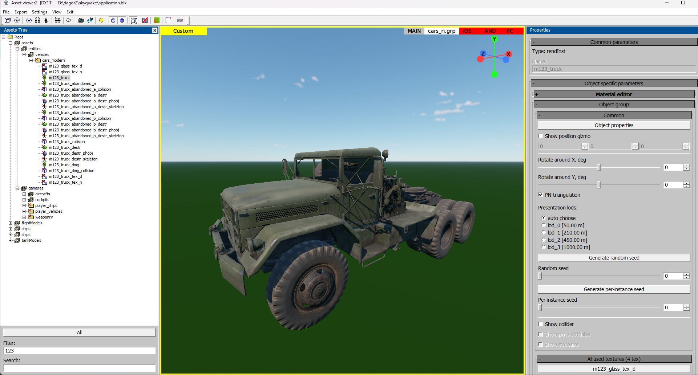

### Setting Up Layers

Organize your scene into layers for a structured workflow:

1. **DeformStart**: Contains objects to be deformed.
2. **DeformEnd**: Contains objects after deformation.

   ```{important}
   Pay close attention to the naming of objects in **DeformStart** and
   **DeformEnd** layers. The quantity and naming must be identical. This
   consistency will prevent indexing errors in the order of vertices in the
   final model during the subsequent merging of all deformable objects.
   ```

3. **RigidObj**: Houses rigid, detachable components.
4. **EXPORT**: Final output layer.

#### Object Identification

- **Green (1)**: Deformable metal requiring tessellation (placed in
  **DeformStart**).
- **Brown (3)**: Metal with sufficient detail, no tessellation needed (also in
  **DeformStart**).
- **Blue (2)**: Metal requiring separation for realistic deformation (e.g.,
  doors).
- **Purple (4)**: Rigid objects, such as detachable components (placed in
  **RigidObj**).


## Deforming Large Rigid Components

Pre-deform large rigid objects to improve realism post-separation. Minor parts
can remain mostly intact. For example, large tires should appear damaged and
should resemble this degree of deformation:

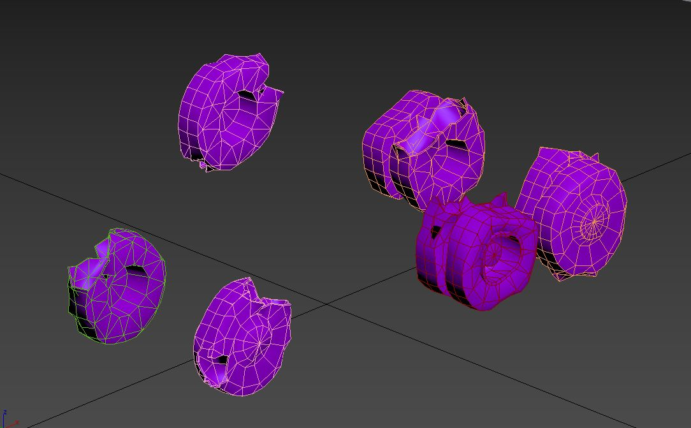

## Configuring Rigid Components

1. **Set Active Layer**: Work in the **RigidObj** layer.

   

2. **Launch Script**: Use [*Dagor 2 Damages Setup
   Tool*](../../dagor-tools/addons/3ds-max/dagor2-3ds-max-tools/damages_setup_tool.md).
3. **Reset Pivots**: Reset pivots to object centers.

   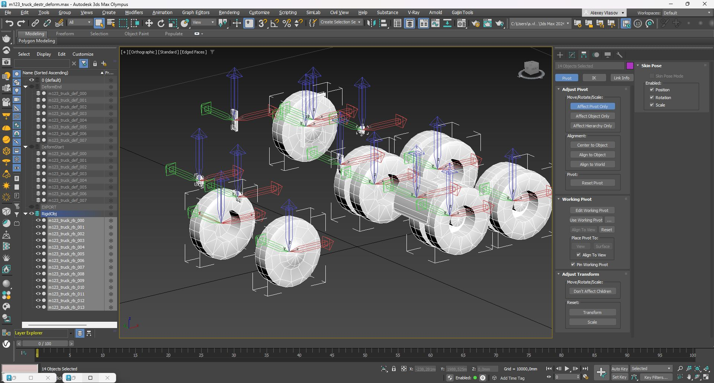

### Script Adjustments

- Change `materialName:t="wood_solid"` to `materialName:t="metal"` for proper
  sound and effects.
- Change `density:r=150` to `density:r=250` for metal properties.

  

### Applying Changes

- **(1)** Select all objects in **RigidObj** layer.
- **(2)** Apply the script to generate accurate collision hierarchies and
   user-defined properties.

  

  

### Adjusting Collision Boxes for Objects

As observed, a collision box **(1)** is generated for each object, but it does
not always precisely conform to the shape of the objects **(2)**. Therefore, it
is necessary to manually adjust the collision boxes in the scene to achieve
accurate coverage.

For instance, when working with wheels, align the box size to the wheel's
diameter and duplicate the box collisions by rotating them. This will create an
approximate cylinder shape. Unfortunately, *Dagor Engine* does not support
native cylinder or sphere collisions, so all shapes must be approximated using
boxes. The final scene will look as follows:


```{note}
All scaling, positioning, and rotation adjustments must be performed in **Local
Space**.

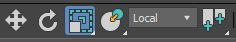

Failure to do so will result in distortions and inaccuracies after export to
*Dagor Engine*. Correcting these issues later is extremely difficult and
time-consuming.
```

Notice that components such as wheels **(1)**, headlight lenses **(1)**, and
mudguards **(1)** are defined using multiple collision boxes. For complex
shapes, take an existing collision box and modify it to match the object's
contours as closely as possible. If one box is insufficient, add as many as
necessary. Simpler shapes, such as side mirrors **(2)**, can typically be
described with a single box.

To streamline the review of object properties, it is recommended to use the
[*Dagor 2 Fast Editor User
Properties*](../../dagor-tools/addons/3ds-max/dagor2-3ds-max-tools/fast_editor_user_properties.md)
script. After installation, the script is activated with `Alt`+`Ctrl`. For all
selected objects **(1)**, it will display the contents of their **custom user
properties** **(3)** in a dedicated window **(2)**, eliminating the need to
individually access these properties via context menus. To hide the script
window, press `Alt`+`Shift`.

With this step, the configuration of solid objects is complete. Hide this layer,
as it will no longer be needed before export.

## Configuring the Deformable Parts of the Vehicle

Begin by configuring objects within the **DeformStart** and **DeformEnd**
layers. For realistic vehicle deformation, the model must have sufficient
detail. This often necessitates tessellating the model to enhance deformation
quality. For example, attempting to deform fuel tanks **(1)**, the vehicle base
**(2)**, wheel arches and fenders **(4)**, mudguards **(3)**, and the cab
**(5)** will result in issues if there are insufficient triangles to allow
proper deformation. Even separate components, like the door **(6)**, require
tessellation.


After tessellation, the model should not exceed 65,000 triangles in total. A
properly tessellated vehicle should look approximately like this:


Unfortunately, there are no strict tessellation rules. A good recommendation is
to create cuts every 20-30 cm, striking a balance between visual quality and the
triangle count. Aim to keep the triangle count as low as possible without
sacrificing deformation quality. The optimal balance comes with experience after
deforming 3-4 models.

Next, copy all objects from the **DeformStart** layer into the **DeformEnd**
layer. **Pay close attention to naming conventions**. Ensuring consistent naming
is crucial for preserving vertex indexation when combining pieces later.
Matching the vertex indexing between the initial (undeformed) and final (fully
deformed) models is essential. Hide the **DeformStart** layer, as it contains
the undeformed model version needed only at the end of the workflow to bake
vertex position data into vertex colors. Verify that all names and object
sequences are identical:


At this stage, you are ready to begin deformation. **Save the scene before
starting each deformation step**. Results may not always match your
expectations, and rolling back is often easier. Consider setting undo steps to
at least 300-400 for safety. However, saving regularly is more reliable, as
*3ds Max* may crash unexpectedly during deeper undo actions.

### Deformation Process

Deforming the vehicle involves using **Soft Selection** on vertices to create a
realistic crumpled effect. Start with broader adjustments and refine as you go.
For example:

- **Doors**: Open or partially open the doors before deformation. Doors nearly
  always open or partially detach during vehicle collisions.
- **Fragile parts**: Separate brittle components rather than deform them.

Initially, apply an **FFD (Free Form Deformation)** modifier to all objects for
rough adjustments:

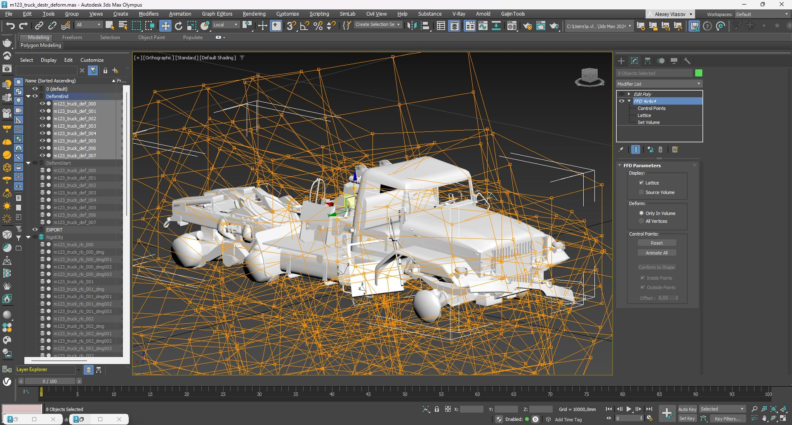

Then carefully deform individual vehicle elements:

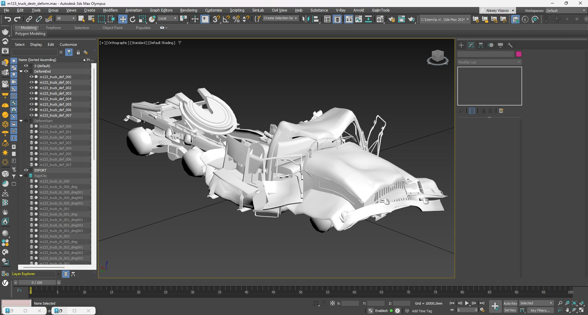

### Combining Layers

After deformation, merge all parts in the **DeformStart** layer and then do the
same for the **DeformEnd** layer. When merging, ensure that objects are attached
in numerical order (e.g., attach to object `*000` in sequence). This step is
critical to maintain consistent vertex indexing. The result will be two distinct
models – deformed and undeformed. For convenience, move the pivot point of each
model to the center of the scene and perform a **Reset Transform**. This step
helps prevent potential issues with normals during export. Tools such as the
[*Dagor 2 Fix Normal Orientation
Tool*](../../dagor-tools/addons/3ds-max/dagor2-3ds-max-tools/fix_normal_orientation_tool.md)
or *3ds Max*'s built-in tools can assist with this. The scene should now appear
as follows:


### Transferring Vertex Positions to Vertex Colors

Run the [*Dagor 2 Transfer Vertex Position to Vertex Color
Tool*](../../dagor-tools/addons/3ds-max/dagor2-3ds-max-tools/transfer_vertex_position_to_vertex_color_tool.md)
script. Select the undeformed model, set the deformed model as the source in the
**Pick Source Object** field, and click **Transfer Vertex Position to VColor!**
This will map the deformed model's vertex position changes into the vertex color
channel of the undeformed model. Check the vertex color channel to confirm it
contains data. The undeformed model should now look similar to this:


The intensity of the vertex colors indicates the degree of deformation –
stronger deformations produce more vibrant colors, while minimal deformations
appear closer to gray. This step verifies the successful transfer of position
data into vertex colors. The deformed model is no longer needed and can be
hidden along with the **DeformEnd** layer.

### Assigning Custom User Properties

Assign the following **custom user properties** to the undeformed model to
ensure correct behavior in *Dagor Engine*:

```text
animated_node:b=yes
physObj:b=yes
collidable:b=no
density:r=15500
massType:t="none"
```

The `density:r=15500` parameter is set based on the vehicle type. For a heavy
vehicle, use a value of ~`15,500`; for passenger cars, values between `5,000` and
`7,000` are typical.


### Final Scene Setup

Complete the general scene configuration to ensure the vehicle interacts
properly in *Dagor Engine*. The vehicle body must behave correctly as a physical
object and respond as intended within the engine.

## Auxiliary Collision Objects

To ensure proper interactions between the destructible vehicle model and tanks
or other vehicles, auxiliary collision boxes need to be added to the scene.
These objects are designed similarly to standard collision boxes but must be
attached

to the main deformable body of the vehicle.


- **Stepped Base (2)**: Enables wheeled vehicles with smaller wheel diameters to
  visually climb onto a deformed section of the vehicle.
- **Bumper (2) and External Platforms**: Ensure the detached wheels are pushed
  correctly away from the main body.
- **Box (3)**: Simulates falling glass fragments dispersing outward.
- **Cabin (large deformation)**: Prevents tanks from driving further by creating
  a larger physical obstacle.
- **Box Set (4)**: Facilitates correct interaction with the vehicle's rear bulk.
- **Rear Platform Box (5)**: Acts as a support platform for smaller debris at
  the back of the vehicle.
- **Diagonal Boxes (bottom)**: Prevent the vehicle from landing flat like a
  slab, instead allowing a natural tilted fall.


Each vehicle requires tailored auxiliary collision boxes.

## Assigning Dynamic Materials

Since we start with a static model, its materials need to be converted into
dynamic ones to enable deformation. Dynamic vehicle pieces require specific
shaders, distinct from static ones. Assign **Dagorrat Material 1** to the
deformable body of the vehicle. Use the following settings:


- **(1) Material Name**: Use descriptive naming for clarity.
- **(2) Material Class**: Set to `dynamic_deformed` to specify the shader type.
- **(3) Slot 0**: Albedo texture.
- **(4) Slot 2**: Normal texture packed with metalness (B channel) and
  smoothness (A channel).
- **(5) Slot 7**: Damaged metal albedo texture with a fracture/mask in the alpha
  channel.
- **(6) Slot 8**: Damaged metal normal map, packed identically to Slot 2.

<br clear="left">

Next, assign **Dagorrat Material 2** for solid objects using these settings:


- **(1) Material Class**: `dynamic_simple`.
- **(2) Slot 0**: Vehicle's albedo texture.
- **(3) Slot 3**: Packed normal/metalness/smoothness texture.

<br clear="left">

Assign **Dagorrat Material 2** to all non-collision objects within the
**RigidObj** layer.

```{seealso}
For more information on complex models with hierarchical materials, see
[Proxy materials](../../assets/materials/proxymats.md).
```

## Exporting the Vehicle

To export the completed vehicle:

1. Select all objects in the **DeformStart** and **RigidObj** layers.
2. Move them to the **EXPORT** layer and make it active.
3. Export with the following Dagor exporter settings:

   

4. Save the output file as (with overwriting):
`<engine_root>/<project_name>/develop/assets/entities/vehicles/cars_modern/m123_truck_destr.lod00.dag`

Ready-to-export scene:
{download}`m123_truck_destr_deform.zip
<https://drive.google.com/file/d/1nrPxNJXumOMlYsSli09GEaFA_HkJ-FC8/view?usp=drive_link>`

## Testing the Model

1. Open the model in [*Asset
   Viewer*](../../dagor-tools/asset-viewer/asset-viewer/asset_viewer.md) to test
   its destruction mechanics.

   

   - Select the vehicle model **(0)**.
   - Set the physics engine **(1)**.
   - Start the simulation **(2)**.

     

     If errors occur (commonly shader-related), check the console logs
     

     ```{tip}
     If the issues remain unresolved, please contact the author of this document
     at {octicon}`mail;1.4em;sd-text-info` <a.vlasov@gaijin.team>.
     ```

2. Export resources to Dagor binary formats using the **Export All (PC)** option
   in the context menu:

   

   To suppress warnings from older files during export, add the following block
   to `application.blk`:

   ```text
   logerr_to_con{
     AssetViewer{
       exclude_re:t="(warning: node <occluder_box> from)|(Shader 'simple_aces' not found in bin dump)|(Shader 'simple' not found in bin dump)|(Shader 'land_mesh_combined' not found in bin dump)|(has mesh with 0 faces)|(degenerate tri)|(degenerate mesh node)"
     }
   }
   ```

   This will allow to ignore warnings that outdated shaders are not found.
   Ensure there are no errors in the console after building:

   

3. Modify the destruction configuration for the vehicle in `rendinst_dmg.blk`
   placed at `<engine_root>/<project_name>/develop/gameBase/config/` directory:

   ```text
   m123_truck{
     physRes:t="m123_truck_destr_phobj";
     hp:r=40;
     impulseThreshold:r=3;
     dmPreset:t="metal_light_explosive_props";
     fx:t="ad_car_wreck";
     fxScale:r=1;
     material:t="metal";
   }
   ```
   Below is an explanation of key parameters for configuring destruction
   properties:

   - `m123_truck`: The name of the primary object that will be destructible.
   - `m123_truck_destr_phobj`: The name of the virtual object generated from
     `m123_truck_destr.lod00.dag`. This represents the destructible version of
     the object and is the result of the processes outlined so far.
   - `hp:r=40`: Specifies the HP threshold at which the destruction occurs. When
     the object's HP falls below this value, it will break apart.
   - `impulseThreshold:r=3`: Defines the impulse force required to trigger
     destruction. For instance, a collision or impact with a force greater than
     this value will cause the object to break.
   - `dmPreset:t="metal_light_explosive_props"`: The destruction model preset to
     be used. This determines the destruction behavior, including debris
     generation and dynamics.
   - `fx:t="ad_car_wreck"`: Specifies the particle effect to be used during the
     destruction event. For example, this could represent the explosion visuals
     triggered when the object is destroyed. Other particle effects can be
     reviewed in this file and substituted as needed.
   - `fxScale:r=1`: Adjusts the scale of the explosion effect. This parameter
     may need fine-tuning to match the size of the vehicle or object being
     destroyed.
   - `material:t="metal"`: This critical parameter overrides the material
     settings defined within the `.dag` file. For instance, if the **custom user
     properties** within the `.dag` file specify `materialName:t="wood"`, but
     this file specifies `materialName:t="metal"`, the material used for the
     destroyed parts will be **metal**. **Always remember** that this parameter
     takes precedence over internal `.dag` settings.

   Adjust the parameters as needed, e.g., particle effects, explosion scaling,
   or material overrides.

   ```{important}
   By carefully adjusting these parameters, you can define how the vehicle
   behaves during destruction events, including material properties, effects,
   and thresholds for breaking apart.
   ```

4. Rebuild vfsroms using `create_vfsroms.bat`.

   ```{seealso}
   For more information, see
   [Resource Building](../../dagor-tools/resource-building/resource_building.md).
   ```

   ```{tip}
   If you encounter any errors or have questions regarding this document, please
   reach out to the author directly at
   {octicon}`mail;1.4em;sd-text-info` <a.vlasov@gaijin.team>.
   ```

**Placing and Testing the Vehicle in a Level:**

1. Open the level in the
   [*daEditor*](../../dagor-tools/daeditor/daeditor/daeditor.md):
   `<engine_root>/<project_name>/develop/levels/avg_proto/apex_test_scene/apex_test_scene.level.blk`.

   

2. Export the level to a binary format using the top menu. Save the level after
   successful export.

   

3. Download test mission: {download}`test_01_car.zip
   <https://drive.google.com/file/d/1K65Kjh2Qkcl7h9j2m9WQaEYplU9QhCZF/view?usp=drive_link>`

4. Place it in:
   `<engine_root>/<project_name>/develop/gameBase/gameData/missions`.

5. Open the **Mission Editor**, select the test mission, and start the game
   .

   

```{note}
During testing, it is likely that the console will display numerous errors
related to resource mismatches or insufficiently built resources. However, these
errors are not critical for the purpose of testing.


In case of **assert errors**, initially try ignoring them by pressing the
**Ignore** button.
```

If everything is set up correctly, you should see a tank in the environment,
which can be used to collide with the test truck.

```{tip}
If the issues remain unresolved, please contact the author of this document at
{octicon}`mail;1.4em;sd-text-info` <a.vlasov@gaijin.team>.
```

## Fine-Tuning Deformation Parameters for a Vehicle Body

To achieve realistic vehicle deformation, specific parameters can be configured
in the vehicle body material in *3ds Max*. These settings influence shaders and
allow precise control over deformation behavior. Below is a detailed list of
parameters and their purpose:

### Shader Parameters

- `diffuse_tex_scale=1`: Controls the scale of the damage texture's albedo.
  Adjust based on the vehicle's size.
- `normals_tex_scale=1`: Similar to `diffuse_tex_scale`, this affects the
  normal/metalness/smoothness texture scale.
- `diffuse_power=1`: Determines the intensity of the albedo damage texture.
  Default: `1.0`.
- `normals_power=1`: Controls the intensity of the normal/metalness/smoothness
  damage texture. Default: `1.0`.
- `max_height=1.2`: A multiplier for maximum deformation height. Default baked
  value is `1.0`. Increase (e.g., `1.9`) for larger deformations.
- `springback=0.05`: Defines how much the metal bends back after deformation.
  Higher values mean greater restoration.
- `expand_atten=0.5`: Sets the range of deformation expansion, simulating
  material characteristics.
- `expand_atten_pow=0.5`: Adjusts the pressure curve during deformation,
  affecting how the material bends under force.
- `noise_scale=1.0`: Adds procedural deformation noise. Larger models require
  smaller values for realism.
- `noise_power=1.3`: Amplifies the procedural noise intensity for dynamic
  deformations.
- `crumple_rnd=0.5`: Randomizes the crumpling intensity, visible only during
  dynamic interaction.
- `crumple_force=0.1`: Determines the crumpling force during dynamic
  interactions.
- `crumple_dist=0.5`: Specifies the crumpling effect distance during collisions.

### Testing Parameters In-Game

To test these parameters effectively:
1. Launch the game and simulate interaction (e.g., a tank driving over a truck).
2. Pause the game using `P`, then open the in-game editor with `F2`.
3. Navigate to the **dynamic_deform** menu:

   

   - Identify the coordinates **(1)** of the test vehicle body **(2)**.

     

   - Input the coordinates into the deformation testing block to align the test
     box with the vehicle.

     

4. Adjust the test deformation box:
   - Enable checkboxes to visualize the deformation.

     

   - Use sliders to manipulate the deformation box and observe effects dynamically.

     

   ```{tip}
   Always clear deformations after each test using the
   
   button to reset the vehicle for further iterations.
   ```

```{important}
For the deformation box to function correctly, ensure it intersects with the
**bounding box** of the deformable object (indicated by a red highlight).
Misalignment may prevent parameter application.
```


### Refining Parameters in 3ds Max

After determining the optimal settings:
1. Adjust parameters like `max_height` (e.g., `1.5`) and `noise_power` (`1.0`)
   in the material properties of the vehicle in *3ds Max*.

   

2. Re-export the model following the steps outlined earlier.
3. Test the updated model in the game and iterate as needed.

### Iterative Adjustments and Enhancements

Testing often reveals areas for refinement, such as missing components like
broken windshield glass. These elements can be added and fine-tuned in
subsequent iterations.

#### Shading and Coloring Adjustments

Vehicles may include random color tinting for variety. This is configured using
procedural settings within the
[rendinst_simple](../../assets/shaders/dng-shaders/rendinst_simple.md) shader.

```{seealso}
For more information, see
[Procedural Rendinst Painting](../../assets/about-assets/procedural-rendinst-painting/procedural_rendinst_painting.md).
```

The parameters for `use_painting` and `painting_line` can be specified in the
same location as the **shader dynamic_deformed** parameters, as follows:

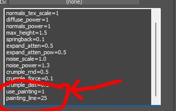

This ensures proper integration and behavior of the painting line within the
shader configuration.

```{important}
Ensure that static shader settings match their dynamic counterparts to avoid
inconsistencies.
```

#### Simulating Broken Glass

To add shattered glass:
1. Extract original glass models from the `.dag` file.
2. Use [*RayFire*](https://rayfirestudios.com/) for fracturing:
   - Set fracture parameters to produce radial breakage patterns.
   - Remove overly small fragments to optimize simulation performance.

     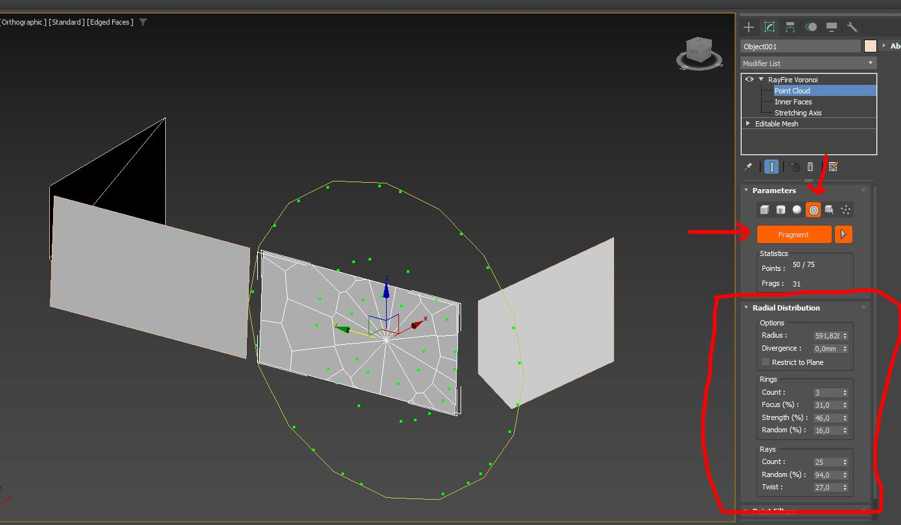

     ```{tip}
     Keep the number of glass fragments below 100 to prevent excessive physics
     calculations.
     ```

     

3. For each fragment:
   - Separate front-facing triangles.
   - Adjust pivots to the center for accurate collision generation.

     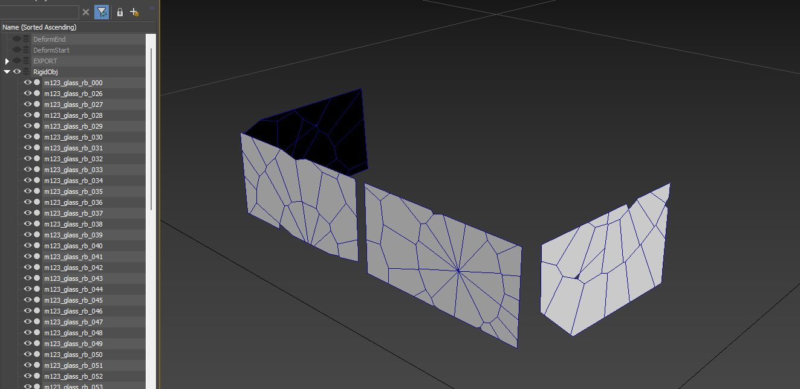

4. Apply a slight **Noise modifier** for realism, then assign a dynamic shader
   for glass fragments:

   

5. Change the `rendinst_pbr_glass` shader to `dynamic_pbr_glass`:

   

6. Assigned it to all available glass fragments, generate collisions with
  [*Dagor 2 Damages Setup
  Tool*](../../dagor-tools/addons/3ds-max/dagor2-3ds-max-tools/damages_setup_tool.md):

   

   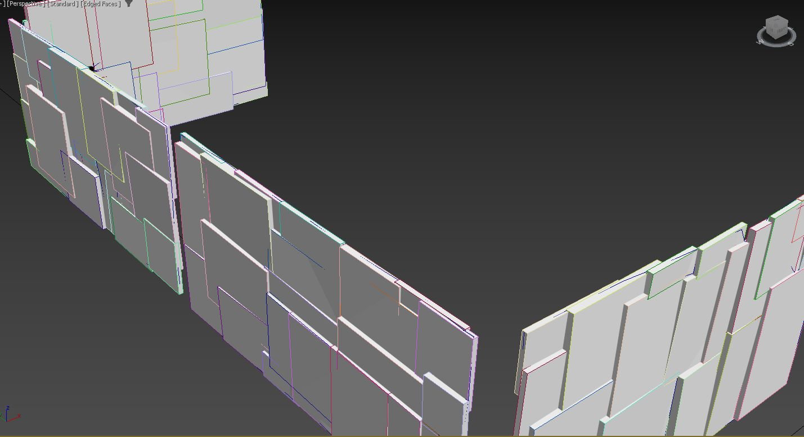

   As you can see, all bboxes have their own thickness.

#### Exporting the Final Model

After finalizing deformation and additional enhancements:
1. Save the model as `m123_truck_destr.lod00.dag`.

   

2. Rebuild and test resources in the game using the steps outlined in earlier
   sections.

### Final Testing

The completed scene should include deformation behavior and additional features
like broken glass. For adjustments, iterate on the *3ds Max* scene and test
within the game environment until the desired results are achieved.

Download the final *3ds Max* scene:
{download}`m123_truck_destr_deform_final.max <https://drive.google.com/file/d/1KF0F9we5zXaqrL1gOA8gTEMrJFBgvA-S/view?usp=drive_link>`

## Example: Vehicle Destruction with a Large Tank

To begin, import the model from the archive:
{download}`zis_6_bz.zip <https://drive.google.com/file/d/1BPfFpzwanbFOwIyYUUSRdj6uvCRjQlCF/view?usp=drive_link>`

The primary challenge here is deforming the tank separately. During crushing,
the tank will not only compress vertically but also bulge horizontally. The
truck's cab should also be separated into a distinct object. Before deformation,
the scene should look approximately as follows:


When assessing the vehicle's construction, note that elements like the fenders
are distinct from the cab, just like the doors, the tank, and the tank's guard
rails. The key is to consider the varying rigidity of these parts. Consequently,
deform these as separate objects. The vehicle's internal components should also
be split into segments based on the material's rigidity. The image below
illustrates a color-coded example of this segmentation:


Next, as before, apply **FDD modifiers** to deform each object individually.
After initial rough deformation, the scene will look something like this:


Deforming the tank is the most complex task, given its size. Here's an example
of a partially deformed tank:


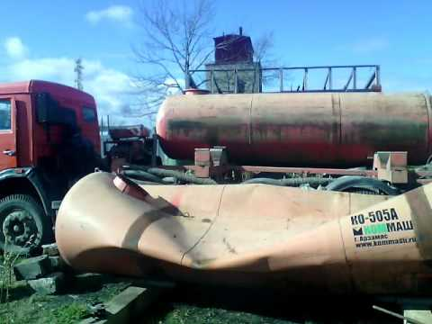

Following this initial deformation, fine-tune the shapes manually using **Soft
Selection**. The resulting deformed vehicle should preserve realistic creases
and folds. The tank necks are minimally deformed, while sharp edges exhibit
folds consistent with the model's level of detail. The tank expands horizontally
under pressure from above, creating natural-looking radial folds around the
necks. The detailed appearance of the tank after refinement is shown below:


### Physics Adjustments Post-Testing

- **(1) Wheels:** Slightly tilted to naturally detach from the vehicle body and
  roll away.
- **(2) Ejection Boxes:** Added to prevent wheels from clipping through the tank
  guard rails. These boxes push the wheels outward, creating more natural
  movement.
- **(3) Rear Wheel:** Designed to detach along with part of its assembly.
  Additional collision boxes are added to replicate a round wheel's behavior,
  improving realism.
- **(4) Flat Tire:** Includes a collision box to tilt the vehicle's frame when
  it falls. A single collision box is deliberately used here to amplify the
  impact.


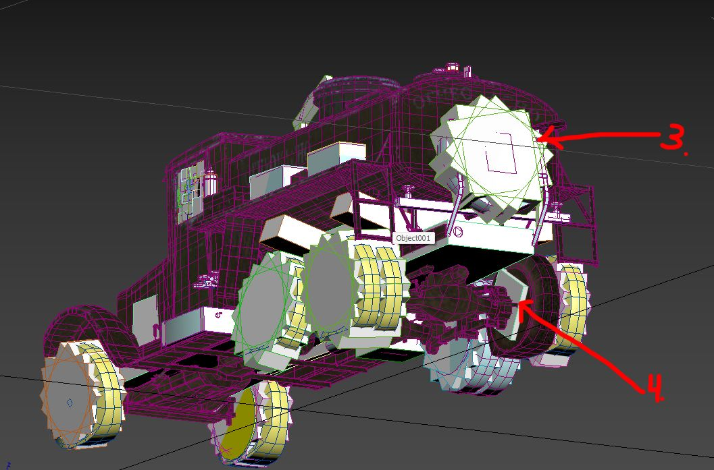

### Note on Quality vs. Time Constraints

Balancing time and quality is crucial. While the tank could feature more
advanced details like ruptures or cracks, such improvements require significant
time investment. The chosen approach aims for an optimal balance of detail and
efficiency.

The scene with the modifier stack and detailed setup:
{download}`zis_6_bz_deform_modificators.zip <https://drive.google.com/file/d/1j6MbBOFX1iSJWXcEx-BK_pI4YmjRcR4b/view?usp=drive_link>`

The final scene, fully prepared for export with refined collision settings and
other adjustments:
{download}`zis_6_bz_deform.max <https://drive.google.com/file/d/1cCYR7aUPHzdVG0HIimkURXwZ5OEJgtVt/view?usp=drive_link>`

## Example: Vehicle Destruction with Extensive Plastic Components

This example demonstrates the destruction of a vehicle model that incorporates
significant plastic components, such as bumpers and panels. Plastic behaves
differently than metal, often bending, springing back, or detaching entirely
under stress. Here's a step-by-step guide to prepare and simulate such
destruction.

Download the model:
{download}`arctic_tayga_patrul_551.zip <https://drive.google.com/file/d/1ZF4WMjcIq67CvH6Ozbg6S00jIOcvoQmI/view?usp=drive_link>`

### Initial Checks

1. **Ensure proper scale**:
   - Verify that the model has no negative scaling and that all scaling values
     are `1.0`.

     ```{warning}
     Ensuring the correct scale is critical for the pipeline. **If this step is
     skipped, everything may need to be redone from scratch later, so address it
     upfront**.
     ```

2. **Inspect model structure**:
   - This particular model is relatively new, so it doesn't have scaling issues.
     However, older models may require adjustments.

### Separation of Components

- Begin by separating **glass** and other **rigid objects** (e.g., detachable
  plastic parts like panels, bumpers).
- Objects such as the protective transparent visor often have intricate shapes.
  After generating collisions, manually adjust their position and size for
  accurate representation.

  The goal is to achieve a realistic breakup of rigid parts that can detach
  during collisions. Example result:

  

### Export and Initial Testing

1. Assign appropriate materials to the separated components.
2. Export the current setup into the game without adding deformation to the main
   body.
3. Evaluate the in-game appearance:
   - Rigid parts should separate cleanly during interactions.
   - Large gaps (e.g., from detached panels) should be filled or masked
     appropriately.

Example result after initial export:

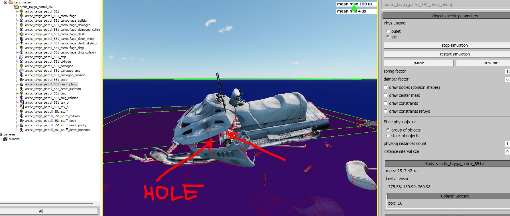

Intermediate stage of the scene with finished rigid objects and materials:
{download}`arctic_tayga_patrul_551_deform_Rigid_Body_done.max <https://drive.google.com/file/d/1tjUuMUdOwl_55sTmcu8DBxDuRgz5T7Np/view?usp=drive_link>`

### Refining the Model

#### Adding Internal Structure

Plastic panels often cover empty spaces. To mask these gaps:
1. Duplicate the **deformable panels** and adjust their placement.
2. Use these duplicates to create an **approximate internal frame**:
   - Assign a dark texture from the existing material library to simulate depth.
   - Ensure the base structure is visually coherent when panels detach.

     

- **Black Base (3):** Separate the base along with the driver and passenger
  seats as distinct entities.
- **Dashboard and Plastic Covering (2):** Extract these into an individual
  entity for separate handling.
- **Side Panels (1):** These are essentially the vehicle's fenders and should
  also be separated into distinct entities. They will detach from the main body
  during deformation, revealing the black base underneath.

As per standard practice, further separate parts that will deform independently
due to differences in metal or material rigidity. This ensures a realistic
deformation process tailored to the specific properties of each component.

```{warning}
1. Do **not** modify smoothing groups or normals during this stage. Adjustments
   to these attributes will change vertex indexing, leading to errors during
   deformation.
2. Keep the model as an **Editable Mesh** throughout. Avoid converting between
   `Edit Poly` and `Edit Mesh` to preserve vertex consistency.
```

### Final Scene for Export

Once the internal structure and rigid body setup are complete:
1. Fine-tune materials and shaders for plastic and metal parts.
2. Test the model in the game environment to verify the detachment and
   deformation behaviors.
3. Export the model as a finalized `.max` file:
   {download}`arctic_tayga_patrul_551_deform.max <https://drive.google.com/file/d/1uffRGTSmti4_BiA43CyfQMIeVdA6eE-t/view?usp=drive_link>`

## Example: Vehicle Destruction with Canvas and Fabric Components

In this section, we'll explore the process of preparing a vehicle with fabric
and canvas elements for dynamic deformation and destruction. The focus will be
on separating, refining, and deforming components such as wooden supports, metal
parts, and fabric material.

Download the base model:
{download}`renault_ahn.zip <https://drive.google.com/file/d/149VnKlwrBM3nAhLgmAynx8VC7U03Uy3e/view?usp=drive_link>`

### Initial Checks

1. **Inspect Transform Settings**:
   - Check for negative scaling or non-uniform scaling values (e.g., not equal
     to `1.0`).
   - Incorrect transforms can cause inverted normals and other issues after
     exporting to a dynamic model.

     **Example of incorrect scaling:**

     

2. **Correcting Transforms**:
   - Attach the vehicle body to a temporary box object.
   - Detach the box and reposition the **Pivot** to the original position,
     typically `[0, 0, 0]`.

   ```{important}
   Ensure the scaling values are normalized before proceeding. Fixing these
   issues after deformation and settings adjustments can be exceedingly
   difficult.
   ```

   **Example of correct transformation:**

   

### Preparing the Canvas and Wooden Supports

#### Wooden Components

1. **Separate Wooden Elements**:
   - Identify seatbacks, planks, and other wooden components.
   - Split them into smaller fragments using *RayFire*: use fracture settings
     that mimic natural wood breakage.

     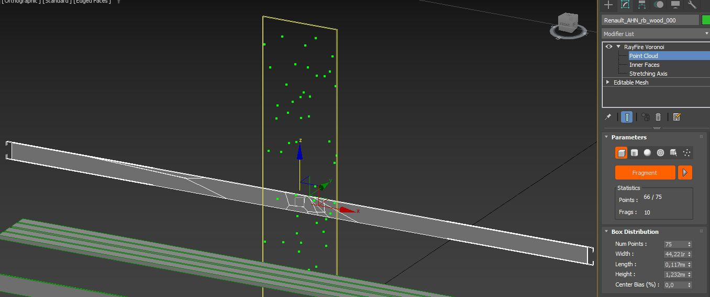

     

2. **Fracturing Details**:
   - Divide each plank into **2-3 pieces** (to meet the 100-object limit per
     `.dag` file).
   - Apply a **Noise modifier** to simulate splintered edges.

     

#### Metal Components

**Attach Non-Deforming Metal Parts**:

- Metal elements like seat mounts and corner brackets should remain rigid
  (highlighted in red in the image below).
- Merge these with the main body and assign them a metal material for proper
  deformation behavior.

  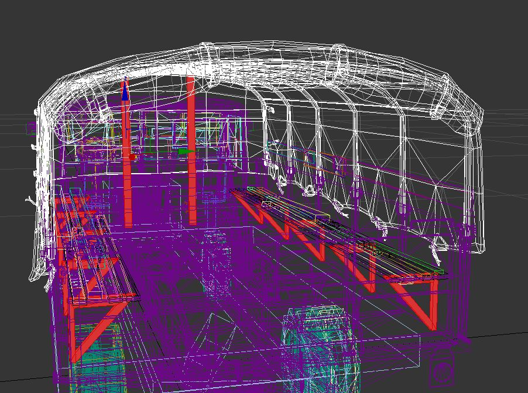

### Organizing the Deformable Objects

Divide the vehicle into logical deformation groups:

1. **Side Panels (1)**: These should behave like hinged doors, bending and
     opening during a collision.

2. **Rear Mudguards (5)**: These have different densities and require separate
   deformation behavior.

3. **Fuel Tank (2)**: Sturdier than the body frame; must deform separately.

4. **Wheel Discs (3)**: Should have independent deformation logic due to their
   circular shape.

5. **Front Fenders**: Their rounded design requires unique deformation
   parameters compared to the angular cabin structure.

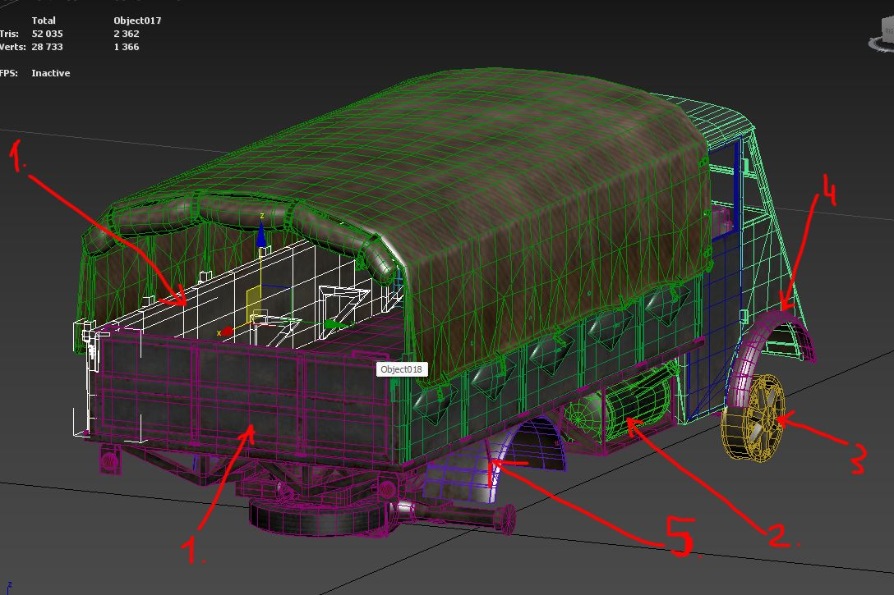

Intermediate preparation stage of the model:
{download}`renault_ahn_a_deform_ready_to_deform.max <https://drive.google.com/file/d/1b3vf07PodEakJM9y-08mHB9PR8sGfBG1/view?usp=drive_link>`

### Initial Deformation with FFD

**Apply Rough Deformations**:
- Use an **FFD modifier** to simulate large-scale bending and crushing.
- Test deformations at this stage to ensure logical breakage patterns.

Result after rough deformation:


The scene after rough deformation:
{download}`renault_ahn_a_deform_FFD_done.max <https://drive.google.com/file/d/1ZUDN1u_RM7dRe8cbJPUS09hbjvEfMuhQ/view?usp=drive_link>`

### Detailed Deformation

**Finalize Deformation Details**:
- Add finer details using **Noise modifiers** and **manual adjustments** to
  simulate realistic crushing and bending.
- Ensure no overlapping geometry or unnatural stretching.

Final detailed deformation result:


The scene after detailed deformation:
{download}`renault_ahn_a_deform_all_deformation_done.max <https://drive.google.com/file/d/1X8SRjeIw9qwAgNjdY6aiynB4i9gOV_MN/view?usp=drive_link>`

### Assigning Materials for the Canvas

To accurately simulate the canvas (tent), create a unique material with specific
deformation properties:

**Separate the Canvas Material**:
- Use a dark texture for initial testing.
- Modify deformation parameters for the canvas:
  - Disable blending of deformation textures.
  - Increase recovery behavior to simulate fabric's spring-back properties.

Example of material setup for canvas:


### Final Testing and Export

1. **In-Game Testing**:
   - Verify deformation and recovery behaviors in the game.
   - Adjust shader parameters based on observed results.

2. **Export the Final Model**:
   - After testing, export the complete setup for integration into the game.

Final scene:
{download}`renault_ahn_a_deform.max <https://drive.google.com/file/d/1xZs82yt_NV98bARCefE3f7JECJVyDf2M/view?usp=drive_link>`

By following these steps, you'll achieve a destructible vehicle model with
realistic behavior for both rigid and flexible components, including proper
handling of wooden and fabric elements.


